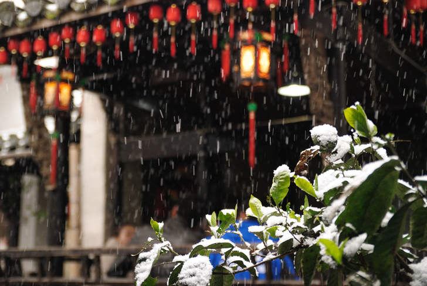
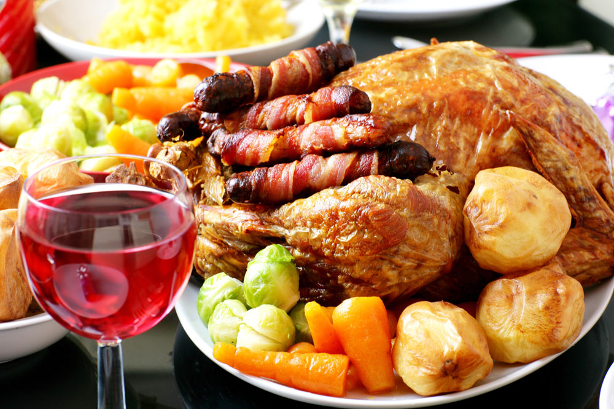

# ＜天璇＞食话不成

**一顿饭吃不饱又吃不好，好像好好的一篇文章，被硬生生逼成《思旧赋》，让人不禁投身虚无主义的怀抱。所以关于吃的描写，铭刻在心的，还有水浒好汉的大口喝酒，大块吃肉，大秤分金银。酒浑清白不限，肉是牛肉，才能大块，动辄大呼“切上几斤”，更不提花和尚的半只熟狗肉捣上蒜泥。私宰耕牛犯了法纪，狗肉为君子不齿，吃起来就越发快活，看的人也越发心痒难禁。**  

# 食话不成

## 文/madwind

 

还是喜欢帝都的。天特别高，街道宽且长，人走在天地间格外的自觉微如尘埃。特别是冬天，从雾霭中升起的朝阳，红如上古猛兽之眼，伶仃仃地悬在虚空里，那只兽已经孤独亘久了。脱光了叶片的树枝，纵横交错如枯水墨，鸦群未惊，只是“嘎嘎”两声。便是这种笼罩一切的苍渺无情，让人安心如仪。

2002年前后，住西三旗，每天下午五点半准时下班，坐810从新街口回去。那时西边房价才过三千吧。到站后在超市买两袋500ML装牛奶，超市出门往前走几步有个小门脸卖酱牛肉，再几步卖煎饼。一种厚而绵软多层，可拿手撕，另一种薄、黄脆而多油，那油格外地腻手，都洒满了芝麻，一张张坦荡荡晾在案上，胸腹朝天。便喊师傅用厚背刀切块扇形平面下来。

面饼卷酱牛肉，总是忍不住卷多了牛肉，一口咬下去，肉片从未拢严实处掉出来，又细细塞将回去。其余什么都不要。没有水果，没有青菜。牛奶便宜，拿来当水喝，二十多年的黑皮竟然喝白了不少，可惜回老家后又打回原型。总共花费不超过十元钱。脸上端端地被吃出两砣乡村红。

每个人都有他的浪漫与现实主义。我的现实主义看来是落实在食物上。写食的文章读了很多，最后还是与张爱玲的最有同感。香港陷落的时候，她们一帮女学生站在摊头吃油乎乎的萝卜饼，不远处就是穷人青紫的尸首。在伤员的呻吟声里用黄铜锅煮牛奶。不管怎么样，吃是最重要的，而且似乎是唯一能确切抓牢的东西，落肚心安。

据父母讲，我小时候吃东西是很文雅的，一小口一小口，慢慢吃自己的份，从不向别人碗里张望。他们很自豪教养有方，本着孩子都是自家好的原则，将我数次严重地吃伤食事件给遗忘了。我记得第一次是吃红烧肉，大概五岁时的大年夜，吃吐掉了，从此丁点肥肉不沾，直到千禧年后才慢慢开戒。第二次是香蕉，准确地说是芭蕉。那年有一天放学回家，看到了从越南战场回来的表哥，还看到了墙角堆成小山一样的芭蕉。每天早上中午上学前，就蹲在小山前捏摸几根熟软的，一路走一路吃着，终于吃到看见蕉状物体就掩面而走。第三次是天杀的方便面，方便面刚流行的时候，每天早上我妈给泡一碗面加两个鸡蛋，一个月后，方便面不堪其扰，爆发出了生化武器的味道。至今我都确信，发明这东西的人有反人类倾向。

离开家以后，即使一个人到饭店，也习惯咣咣咣地点上三菜一汤。吃撑了无论如何比吃不饱好。饭桌上菜不够吃，如果是别人买单，会有种下辈子也不要做朋友的愤怒。如果自己买单，不仅内疚，而且慢慢地会惨然起来。

一顿饭吃不饱又吃不好，好像好好的一篇文章，被硬生生逼成《思旧赋》，让人不禁投身虚无主义的怀抱。所以关于吃的描写，铭刻在心的，还有水浒好汉的大口喝酒，大块吃肉，大秤分金银。酒浑清白不限，肉是牛肉，才能大块，动辄大呼“切上几斤”，更不提花和尚的半只熟狗肉捣上蒜泥。私宰耕牛犯了法纪，狗肉为君子不齿，吃起来就越发快活，看的人也越发心痒难禁。

宋江那鸟人嘴上喊得好听，天生就是个土匪秧子，土！浔阳江头，贪爱张顺送的鲤鱼新鲜，吃得收不住嘴，一晚上茅房跑了二十来回。过几日病才好了，又为了“几盘肥羊，嫩鸡，酿鹅，精肉，尽使朱红盘碟”的“整齐肴馔，济楚器皿”，连反诗都敢题下了。可见造反分两种，一种吃不饱，一种吃得太饱。水浒好就好在里面的人都是吃饱了造反的，有蓬勃鲜旺气。招安以后全伙被招待吃上了御筳，五俎八簋，百味庶羞，不敢甩腮帮子吃喝了，一部书的气息便弱下来，人也整死绝了。吃与命运关系之大，不可不慎。

自助餐真是吃不到什么好味，但有机会还是要去，只为那任拿任取的富足感。前天去万达吃，斜对面有一对男女，女的拈着把小叉子，一直在优雅地，漫不经心地咬着片儿水果。男的盘子里只有几只虾。女的挺好看，男的有点肥头大耳，喁语的样子看着真是让人生气。不是为了吃而来吃自助餐的行为不就是耍流氓么！他们的台面是一幅静物画，我们的，活像被一千匹草泥马踩过，调味汁都被甩到沙发背上去了，蟹壳掉进饮料杯子里。某人的牙给硌松动了，捧着哀哀叫唤了三分钟后，又决然投入了战斗。

听说韩国人吃自助餐，会到卫生间吐出来，再回来吃。这一招我们试了试，很遗憾没做到，只是回家后，每人都服用了健胃消食片。

原文链接：[http://www.douban.com/note/230488903/](http://www.douban.com/note/230488903/)

 

（采编：宋晓慧；责编：何凌昊）

