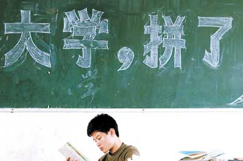
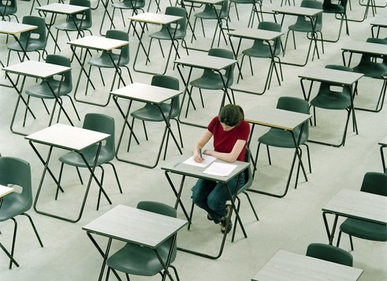

# ＜天璇＞高考，我不爱你，但是谢谢你

**无论这个社会是不是看个人实力，或者昏庸之极，或者更绝望的是脚踏实地生活的人总会怀才不遇，你还是你。所谓生命，到底是什么让我们即使知道不是明天就是后天或者几十年后死掉，还是要那么用心认真地活呢？那就是去经历，去让自己受伤害，去让自己勇敢爱所爱的人，去让自己好好欣赏这个美丽的地球，无论晴天雨天，所有的一切都是生命的奇迹。**  

# 高考，我不爱你，但是谢谢你

## 文/陈嘉倩（北斗撰稿人）

 

你正在高三的教室里，每天吃很多营养品，体重不断上升但脸色仍然是不健康的惨白。总会有做不完的练习卷，看不完的辅导书。有人去保送了，有人考艺校了，大多数人还是如同你一样，需要脚踏实地面对那如同生死鬼门关的高考。每天倒计时，教室后面黑板上那不断减少的数字让你透不过气来。学校请来了校友做演讲，你看着讲台上的人，闪闪发光的大学校徽，觉得离自己相距几亿光年。书包越来越重，每天一清早出门，天黑了才步履沉重地离开学校。无论怎么做考卷，无论怎么认真，总是得不到满意的分数。记住的东西太多，再去想却又什么都不记得。你没有参加过什么作文大赛奥数比赛机器人大赛，每天看似很苦在读书周末还要上各个补习班，仍然免不了夜深人静恨自己是一个平凡到有千千万万个自己在世界上那么苦苦活着的Loser。

有那么一刹那，问自己，这么辛辛苦苦拼命的，为了什么？

我不知道要告诉你，这些到底都有没有答案。人生，大多数事情你在做的事情都是没有答案的。比如，我到了欧洲留学第一年，注册有问题，自己一个人四处辗转，学生证弄丢了，被老师赶出考场，所有考试只有一次补考的机会，租房子差点被骗一万元，自己一个人一开始通马桶换灯泡做饭使用洗衣机，什么都不会也没有人帮助。正在面对这些令人无助事情的我，当时也会哭着鼻子问自己，这些挫折到底为了什么？

你觉得自己对读书，突然没有了兴趣，好不容易经历了那么多年的摧残，在一刹那对于人生有了新的感悟，在不早不晚，就在现在快要高考的时候，就这样没有了冲劲只剩下一股空虚。当父母家人都在期盼着你，当老人家每次塞给你一点零用钱说，好好读书别垮了身体。你又突然知道，不能离家出走不能放弃，这个时候，不是一个人在考试了。小小身体里，背负着那么多喘不过气的压力。可是，就是不知道未来到底是个什么样，会不会落榜会不会考进那日思夜想的第一志愿。

最不甘心的，还是那个问题：那些经历的苦，到底有没有意义？

那，生物界，为什么只有人类发明了工作？只有人类每天要朝九晚五上班，把自己从一个小监狱困在了另一个小监狱里面？为什么不能如同鹿一般在草原奔跑，为什么不能如同小鸟一般在天空飞翔？

我知道，你总是在沉闷教室里，突然转着笔，脑袋里再也听不见老师说什么，窗外天空很蓝，阳光照射进来，微风吹拂着教室的窗帘，外面的世界是那么自由。其实，我们有多幸运你知道吗？能有机会坐在教室里，能有机会去上大学，能有机会以后坐在办公室里。我不是思想品德或者心理健康的老师，告诉你，和农村孩子和身患绝症的同龄人比起来有多好。只是，告诉你，现在的这一切，一步步过来的你，都是OK的，你的未来就是因为有这么无穷的可能性而那么好玩，那么值得去期待。

你好奇问我，这世界上，会不会有除了高考其他的活法。对，是有的，他们的确过得很轻松，但是到了大学就很紧张。我们没有权利批判别人的国家度过青春方式，也没有资格去羡慕别人的教育体系。其实，我有一位在荷兰的大学老师曾深深感慨过，“以后孩子一定要送去中国接受小学中学教育”。也有在西班牙的时候，读到新闻说中国基础教育在世界屈指可数。现在的你，还困在一群同龄人中，觉得自己很平凡，可是当你走出集体眼观世界，却又会有另一种豁然开朗的感慨了。 说到底，人就是一路踩着挫折往上爬的。年轻的时候，所有积蓄的经历都是日后一笔可观的财富。

好，你又要和我说，谁谁看起来总是很轻易就成功了。谁谁因为拿着港澳同胞甚至外国的护照所以直接进去了你想要去的那所学校。谁谁有个有权有钱的爸爸。谁谁的家人亲戚就是学校的校长。当你和我不甘心地说着这些的时候，我只想问你，那和你有什么关系呢？

当你在打从心底为这些人的走捷径而愤怒的时候，为什么不去多背几个单词，多读一篇散文？你已经高三了，之前也早就看见过那些“不公平的现象”，你也能够想到，未来这样的人还是会有，社会那么大，只是会更多而已。再问你这句话，那又和你有什么半点关系吗？无论这个社会是不是看个人实力，或者昏庸之极，或者更绝望的是脚踏实地生活的人总会怀才不遇，你还是你。所谓生命，到底是什么让我们即使知道不是明天就是后天或者几十年后死掉，还是要那么用心认真地活呢？那就是去经历，去让自己受伤害，去让自己勇敢爱所爱的人，去让自己好好欣赏这个美丽的地球，无论晴天雨天，所有的一切都是生命的奇迹。

人的快乐，其实很简单，物质永远只是基础，去把你喜欢的事情认真做好，那就会带来无穷的快乐。做一个四肢健全的平凡人，其实是一件多么幸运的事情，正因为一切都很平凡，才那么有力量去追寻自己想要的明天，才那么坚定走自己的路，不依靠别人只是用自己的双手和脑袋。

去把眼前的事情做好，无论最后结果怎么样。聪明的你，又会和我说，这个社会很现实，它们只看成绩只看学校出生。你会和我说，没有好的学校就找不到好的工作。你会和我说，同班的人会因此看不起自己，如果没有进到重点。

对，我也听过这些话，我曾经的中学，大家那张本应是青春的脸上，都有这些字刻在愁苦的脸上。你如果只是看中这个光环的话，最后，就变成了那些光环下面的芸芸众生了。读书好没什么了不起的，最后去一所好的大学，一份还算好的工作，但是优秀的人总是太多了，不知不觉就埋没在人群里面。那些曾经叱咤一时的状元们，然后都默默无闻了。只能证明他们是考试的机器，错过了放肆犯错错过了早恋错过了人生最美好的年华，长期处于异常紧张的战争状态。还记得以前看《中国状元职场状况调查》，1977年到2006年的30年全国各省高考状元全军覆没，没有发现一个在从政、经商、做学问等方面的杰出人才，被人羡慕的“高考状元”，在社会的发展中，最终成了平庸者。

那，为什么这一刻，我还是告诉你，要去认真过高考前的这段日子，而不是就立刻去恋爱去浪迹天涯去在路边弹吉他呢？因为高考有它的价值，读书的方式，甚至背书的技巧，都是在无形中的收获。果然教育的本质就是把学习过的东西忘得一干二净，最后剩下来的就是教育的本质了。剩下来的东西就是自学的能力，也就是举一反三无师自通的能力。到以后，无论你在大学，在留学，还是在工作岗位，这仍然会是需要的技巧。这段经历，会让你对于人生有新的感悟，不就已经是一个大成功大收获了吗？

也不要到了未来，走向了国际大舞台的时候，痛恨自己英语当初没有好好去学；不要到了未来，做背包客四处旅行的时候，痛恨自己当初没有好好念历史和地理书；不要到了未来，需要和外国友人介绍中国文化的时候，痛恨自己语文没有好好学习。

去高考，不一定要高分更不需要成为状元，但是只要尽全力去参与，就已经是个人才，再加上能在这样的环境下仍然保持清醒的自我，将来到了社会闯荡，必将是不同凡响的人。也让自己，能够在想象力和现实找到了平衡点。在狭窄的生活里，仍然对这个美妙的世界继续保持着热爱与新鲜感。

当一切过去之后，你需要做的，只是真诚地感谢高考，无论是恨还是爱，都已经成为了你人生所经历的一道不可抹去的风景。在接下去的人生里，你更会体悟到，其实人生就是一点点一个个的大挫折小挫折，根本没有什么一路顺风。因为路，注定都是曲折的。

无论最后你成为了怎样的大人过着怎样的人生，你尽力了，就是成功。无论这个世界如何改变，放下了那些浮躁，谁也阻止不了你的快乐和努力。

 

（采编：何凌昊；责编：黄理罡）

 
