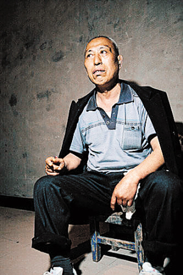
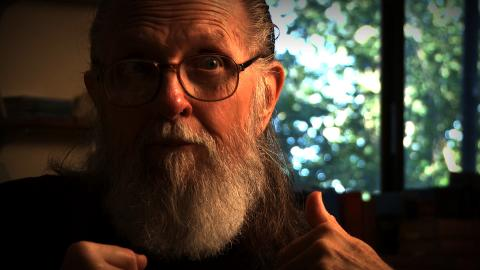
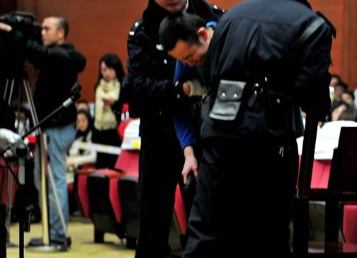
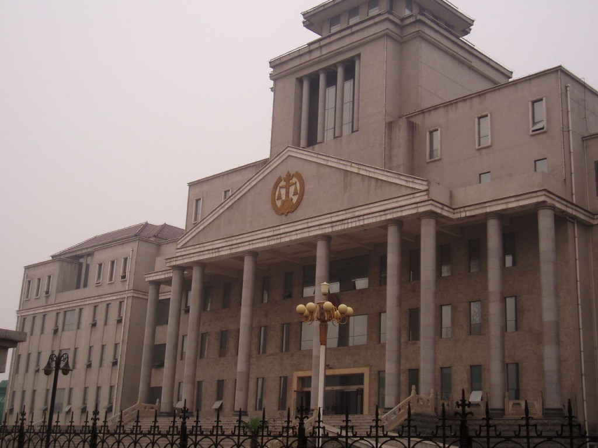

# ＜开阳＞“杀人”需偿命？缘何不留情

**我仍认为死刑虽然本身无所谓好坏、在于一个社会的文化定位，而把死刑揉进一个国家制度后，却给国家带来了巨大的伤害：死刑本身不具有所谓的“惩罚性”和“警示性”，却给了政府一个解决问题的万能方法——杀人，国家机器手握生杀大权却嗜杀成性，不思制度之改只求一时之维稳，终酿大祸。**  

# “杀人”需偿命？缘何不留情

# ——简谈“凯西杀女案”和“威廉汉姆纵火灭门案”和死刑的废立

## 文/ 尹桑（Bentley University）

 

截止2010年底，世界上还在执行死刑的国家只有20个了（其中2010年中国执行死刑案例有数千，除了伊朗尚有两百多以外，其他国家均少于一百），而今年刚刚审完的“凯西涉嫌杀女案”也表明民主世界的“死刑大国”美国也开始对于死刑越来越谨慎了，在很多人眼里这是个很明显的案件而在美国法院的审判下还是宣判凯西无罪，在很多人表示不解的同时我却回想起了以前法律课学的“威廉汉姆纵火灭门案”，感到十分欣慰。死刑到底要不要有？而为什么有些政府抱着死刑不肯放手？

#### 一，凯西杀女案

背景资料：佛罗里达州25岁单身母亲凯西-安东尼，涉嫌在2008年杀死自己的女儿科丽。此案从三年前开始被媒体一直追踪报道至今，连续开庭30余天、91个证人出场后，大部分的媒体评论员、司法专家、普通民众都认为从逻辑上看是凯西杀害了自己的女儿，网络上认为凯西“有罪”的达到了77%-87%。凯西被指责为一级谋杀也就是有蓄谋的故意杀人，而最后12名陪审员作出裁决凯西一级、二级、三级杀人罪全部“无罪”，“有罪”的仅仅是对警察说谎部分。而陪审团作出“有罪”“无罪”的裁决必须是全票通过，有一个人反对都不行。（来源于校内日志）

下面就来看看这次案件，起诉方的检察官是如何尝试去证明凯西犯了一级谋杀的呢？首先，科丽从一开始失踪直到后来被外婆发现，凯西都没有主动去报警，不符合普通人的常识，为什么你的女儿死了不去报警呢？然后是凯西本人的谎言，当外婆问起她孩子在哪里时，她说孩子被保姆带走了并且指向一个没人的房子，还有就是她的车里散发出“人肉腐烂”的恶臭味凯西说只是垃圾，据证人和实验室作出的测试证明这绝对不是垃圾，并且她事后多次指控父亲性侵犯科丽等来转移视线最后都被证实是谎言。除了开端和谎言外，还有一些间接的证据比如凯西依旧参加朋友的party并且表露出自己获得了新生，以及在她电脑里搜索过致人昏迷的“三氯甲烷”和科丽嘴上的封条也被发现和凯西家的封条同一种类等等。

那么辩护方是如何帮凯西进行辩护，最终使得陪审团作出“无罪”的裁决的呢？攻击检控方提出的证据、提出另一种可能性的情况以及对于没有直接证据和程序正义进行控诉。

攻击检控方的证据、提出另一种可能，这在《十二怒汉》和《一级恐惧》这两部电影里都有着重的描述。在《十二怒汉》里，十二名陪审员在一个炎热的屋子对一名年轻人涉嫌杀人作出裁决，证据看起来十分的充分，凶器、作案动机、时间都吻合，当绝大部分陪审员都决定判决死刑的时候，有一名陪审员表示了反对。他提出的观点就是，“看这个证据，是不是无懈可击呢？”“对于这个凶器，有没有另外一种可能而是另一个凶手？”，随着他的层层剖析、步步逼问，很多极其反对他的陪审员都渐渐开始反省，开始了长达十几个小时的辩论，最终发现这个小伙子很可能是无罪的人。根据无罪推论，这名无辜的小伙子被判无罪。（《十二怒汉》是美国五十年代探讨陪审员和法律正义的经典之作，值得一观。）同样，在这次凯西案当中，辩护律师也一次又一次的强调，所有的推理也都只是检控方的“推理”而已，推理不等同于证据而且完全有可能给出另一个版本的推理。

而且，辩护律师指出检控方无法提供直接证据来证明凯西杀了科丽，自始至终凯西没有认罪（后面威廉汉姆一案会提到认罪的事），而且又没有直接的人证或者DNA、血迹、指纹等直接物证来证实凯西杀了人，所以检控方的指控就少了很大一部分的分量。还有的就是程序正义问题，加拿大专家说凯西的电脑搜索过“三氯甲烷”84次之多，但是加拿大人并不受美国“伪证罪”的指控，并且由美国专家作出的调查是凯西只搜索过1次“三氯甲烷”，这点上辩护律师也略胜一筹。综上所述，凯西被陪审团一致通过判了“无罪”。

作为一直反对死刑的我，对于这次案件的结果是很欣慰的，在我的观念里就算是杀人犯也不应该执行死刑，更何况证据不足很难断定她是杀人犯。而我一些美国中国的朋友跟我聊起此事时表现出的观点都是“这个根据‘逻辑判断’很明显的能看出她是杀人犯啊？为什么不判她死刑？”，我往往会问他们“你从何推断出她‘明显’是杀了她女儿？有可能她就是一个爱好说谎的人对于别人压迫性的提问就会情不自禁的说谎呢？如果她就是不爱自己的女儿所以当女儿失踪时她觉得她女儿终究会被别人领养的呢？她搜索过一次三氯甲烷就说明她用了么那难道你没有搜索过伟哥？”他们会很不服气的告诉我“你的这些都是极端可能性的推论，现实生活里遇到这类事的话杀人犯肯定就是她八九不离十了，除了《名侦探柯南》，你在生活里能找到一个证据十分‘确凿’却冤枉好人的案件么？”

这时候，我就会给他们讲一讲威廉汉姆的故事，这个我认为影响了“凯西杀女案”判决过程的案件，也是我认为的美国第一大冤案——“威廉汉姆纵火灭门案”。

#### 二，威廉汉姆纵火灭门案

1991年12月23日，家住德克萨斯州23岁的托德威廉汉姆刚刚和父母打过电话，让他们圣诞夜过来一起过圣诞节，谁知道晚上他家突然起火，他只身逃出但是一个2岁、两个1岁的女儿全部葬身火海（他妻子不在家）。

当他和他妻子悲痛欲绝的时候，他被当地警方以纵火杀人的罪名指控了，并带回监狱进行拘留。原来根据地方警察和纵火案侦探的初步判断，这次失火案件很有可能是人为引起，而纵火的人最有可能就是唯一逃出失火现场的父亲——威廉汉姆。虽然他妻子和他保姆都说他十分爱自己的女儿，从不打骂她们，他根本不具有动机杀人，而对于威廉汉姆没有动机一事，检察官则认为他“心理变态”。

警方和控方确定了目标后，就开始了他们的取证过程。先是取威廉汉姆邻居的证言，在警方的引导下，邻居们的证言从一开始的模棱两可到后来变成“威廉汉姆‘看起来’并没有进去救孩子的意思，他有一两次冲进房子的冲动但是都半途而退。”“消防队员来的时候他并没有让他们进去救孩子的意思，他好像更关心自己的车。”“他身上有骷髅的纹身，很有可能是一个反社会的人。”

根据这些“推理性”的证词，警方和检察官更加相信是他杀了自己的三个女儿，而本地的纵火案侦探也做了几份报告，说明纵火的原因十分可疑，很有可能是人为纵火因为门有从里面反锁的迹象并且有助燃剂的痕迹。对于着一些指控威廉汉姆矢口否认，他说从不知道家里有什么煤油和助燃剂。但是这些间接的证据恰恰让所有人不再信任他，妻子和他离婚，父母也渐渐开始劝他坦白征求宽大处理，朋友、邻居的证词越来越具有倾向他杀了人，没人再去信任他。“铁证如山”，他们说道。

而他，一直不承认自己杀了自己的孩子。他一遍又一遍地说“为什么我要杀了自己的女儿？”，却没有人去听，也没有律师愿意代理他的案子。1992年8月（仅仅过了一年），陪审团通过一个小时就达成了共识：有罪，并判处死刑。法官给了他最后一个坦白的机会，“如果你坦白杀了你的孩子的话，法院将会给你终生监禁却不是死刑。”在这最后的“机会”面前，他的答案依旧是“我没有杀害自己的女儿，我也永远不会这样做。”

从1992到2003年，在这11年间他不停的上诉，却一次次被驳回，2003年底他的上诉被联邦最高法院驳回不再受理，死刑被定在次年的2月17日。似乎一个犯了“滔天大罪”的人就要这样消失了，却想不到事情出现了“转机”。

在这11年间，除了他父母每个月开长途车来看他一次以外，再也没有朋友来访或来信，只有一个他的笔友——吉尔伯特。这位女士一开始也是出于同情和他通信，可这11年间，她渐渐的发现了很多可疑点并开始坚信威廉汉姆没有杀害自己的女儿。她随即奔走四方，为他搜集证据试图证明他无罪，却受到了警方和侦探的嘲笑。功夫不负有心人，她最后找到了美国著名的火灾专家、剑桥大学的化学博士赫斯特，他退休后已经帮十余名“纵火犯”证明了清白，他发现那些所谓的“火灾侦探”的研究方法根本不科学，纯粹是经验主义的推断，威廉汉姆的整个报告漏洞百出，“空气动力学和模拟测试已经证明火灾现场可以产生复杂的液体流下的痕迹，而门槛附近的煤油是烧烤时用来点燃炭火的，烧烤架和煤油就摆放在门口所以容易破裂流到门槛下”。他把这份报告发给了威廉汉姆的死刑终审团队，却没人仔细去看，抱着最后的希望威廉汉姆向州长申请延时30天执行死刑来搜集证据。

2004年2月17日，原定死刑执行日，在最后的晚餐里他要求去享用一些自己喜欢的食物，被监狱拒绝。当他吃完了监狱给他准备的最后晚餐时，他得到了州长的答复“对于延迟30天执行死刑的申请，完全没有必要”，他失去了最后的生的希望。最后隔着玻璃窗他对他妈妈说“我想最后一次拥抱你们，可惜我不能够，别为我悲伤，妈妈。”

在执行死刑前的遗言里他说道“From God’s dust I came and to dust I will return, so the earth shall become my throne.从上天而来我是一粒尘土，又要回归到尘土中去，大地将是我的永远领土。”

执行死刑数月后，赫斯特的报告才得以被关注并且研究。随后发现那些本地“纵火案侦探”的判断方法不合理并且得出的推断也是有误的，2009年经过科研小组新的探究最终证实威廉汉姆本可以是“无辜”的、而这起火灾很可能是自然引起的，在2011年新拍的纪录片“威廉汉姆之案”（Willingham Case）中描述了这一冤案的详细始末。

#### 三，“杀人”需偿命？

先从这个冤案谈起吧，死刑的误判导致一个年轻无辜的生命丧失，当我读了30页把这个案件的始末读完，直到最后看到威廉汉姆的遗言，我的心里泛起一股绝望的忧伤，为威廉汉姆也为这个法制感到绝望和忧伤。因为断案的不仔细和不公正导致了一个丧女的父亲还要承受杀女的罪名，最终被自己的国家所杀害。

这种冤案在现实生活里普遍存在么？

我相信答案是肯定的。看看现在还执行死刑的国家吧，除了法制混乱不堪的中国外，还有伊朗、北韩、沙特阿拉伯、利比亚、叙利亚、索马里、越南等相对落后、不开明和不民主的第三世界国家，在这些国家里法律本身就很难做到权威，更不可能做到公正。中国以往就发生了很多冤假错案，其中无比荒谬的案件也是数不胜数，包括凶手被缉拿归案多年后竟然发现受害者原来没有死、抓入监牢的“嫌疑人”是被买通替罪坐牢却不知等待自己的是死亡。受害者没被杀害却判“凶手”死刑，这是什么道理？犯人不被明正典刑而骗人代死，这又是什么道理？这种断案不清、调查不明、审判不公就仓促结案实在是骇人听闻，却又司空见惯。如果死刑不存在的话，这些被误解的、替死的人则有足够的时间给自己平反昭雪，而死刑只是让这件案子尽快的淡出人们的视线，很多时候诬陷了好人而放跑了坏人。

在美国这种相对先进、民主和法制健全的国度，死刑的误判却依然时有发生，包括前几年一个华人在美国被判“谋杀”仅仅是因为他英文说的不好没有给自己做足够有效的辩解，而后此人没有冤死正是因为法院虽然认定他杀人但是没判他死刑、而是将他终生监禁，在随后的几年里他终于搜集证据使自己平反昭雪，这足可以说明在很多案件草草判死刑是不合理的，终生监禁能很大程度上的杜绝冤案的发生。而有人可能会质疑，这些我说的“如果”只是“小概率事件”、而那些冤假错案的替死鬼只是少部分倒霉蛋，大部分捉的杀人犯都是证据确凿、板上钉钉，没有死刑的话岂不是便宜了这些人？我认为 “宁可放过一千，也不错杀一个”这个原则十分适用于死刑，因为人的生命是无价的并且具有不可逆转性的，一个替死鬼、冤死鬼被判了死刑夺走了性命，事后查出了真相，他的生命能挽回么？就算1000个真杀人犯被判死刑得到他们“应有的惩罚”，也会因为1个人被冤案夺走性命而失去了死刑的“公正性”，因为哪怕是0.01%的概率乘以生命价值的无限大所造成的影响之巨还是无法估量。这也就是统计里说的第二类型错误——毁坏整体的不可挽回性错误。

时常出现的有预谋无预谋的冤案已经让这个“死刑体制”丢失了很大一部分的威信，然而我还想问，真的死刑犯就应该被处死么？我深觉不然。死刑之所以被人们采用是因为人们相信他具有‘惩罚性’ 和‘警示性’，换言之，他们相信执行死刑本身就是对杀人犯最恰当的处罚，并且在死刑存在的情况下每个人会受到警示而不去犯罪。然而在我的观点里，‘惩罚性’和‘警示性’皆不成立。

**A. ‘警示性’——死刑能否有效阻止犯罪的产生**

很多人认为，死刑的存在会防止凶案发生的原因是因为凶手在行凶时会考虑到行凶后会被明正典刑，这种对死刑的了解和畏惧会阻止他们杀人。当我社会学教授说到这一点时他很激动地连问5个really去质疑抱有这个观点的人们——这些人往往忽视了在杀人犯行凶时的冲动和疯狂。杀人者在蓄谋、准备以及行凶时，脑子是充满仇恨和激动，虽然能有条理的蓄谋并行凶，但是在杀人犯所面临的极端情况中，已经疯狂的杀人者是不会去思考杀人的后果的。在19世纪英国，政府依旧实行公开死刑制，在特定的城市特定的地点公开执行死刑（多为绞刑），希望以视觉的冲击来警示他的市民从而杜绝犯罪，谁知道在随后逮捕的杀人犯中有高达75%的人都观看过公开死刑，表明这个政策并没有奏效。

死刑不仅不会阻止凶案的发生，有时候还会促成更多更恶性的案件。那些已经犯下杀人罪行的人，在亡命天涯时一想到自己犯的案已经足够致自己于死地，走投无路之下反而会愈加疯狂变得不顾一切——他们一开始可能只是因为受人压迫而报仇或者被情人背叛而行凶，在逃亡的过程中他们却可能仅仅因为钱财、因为生气甚至一句不顺耳的话而杀人，因为即将面对死刑的他们将无所可失。各地的流窜犯、连环杀人案、奔走各地的杀人抢劫团伙很多都是因为死刑的无情和残酷而催生的仇恨和无奈。“反正都是一死，老子不如多杀几个，不枉来人间一趟。”这句话是我亲自从今日说法中听到的，十分震撼我心——正是因为死刑的残酷无情，让很多一时失足的人产生了恨而不是畏惧和尊重，暴力衍生为更暴力。另外，某些反社会者会将死刑看做自己获得的无上的荣耀（更多存在于欧美等国家），他们以杀人为乐、以被明正典刑为荣。因此我觉得死刑的存在，在某种程度上只会给社会增加更多“暴力”的元素，社会因为恶性事件而丧失的人将会更多，暴力永远解决不了由暴力产生的问题。

还有的就是数据了，就像荷兰解禁毒品以后因毒品产生的犯罪反而减少了一样，世界各国近几十年也渐渐废除了死刑，却并没有国家因为废除了死刑而导致犯罪率明显上升，因为“废除法典”而“全民暴乱”的情况并没有发生，反而在斯洛文尼亚等国家废除死刑后犯罪率出现了下降，难道不正说明了废除死刑是大势所趋么？

**B. ‘惩罚性’——死刑不是正确对待杀人犯的方式**

很多人强调，死刑是对杀人犯最恰当的处罚，因为他夺取了别人的性命所以自然要国家机器来夺取他的性命，所谓“杀人偿命”正是很多人抱有的观点。先不谈死刑用暴力解决暴力、仇恨代替仇恨本身的一厢情愿，难道现代契约性社会对死刑废立与否这个具有社会性的法律问题，可以用这句古代社会简单粗暴的规则一言以蔽之么？说惩罚，难道终生监禁不是一种十分有效的惩罚么？这种非暴力的惩罚，并没有像死刑一样尝试用暴力解决暴力、用仇恨代替仇恨，而是给了杀人犯一个改过自新再教育的机会，在监狱里他可以读书、可以工作也可以为社会上作出有益的贡献。不仅他的劳动可以为社会增加一定的财富，看到一个杀人犯发自内心的忏悔和改正，也会让更多的人们一心向善，让社会少一份暴力多一份理智和关怀。死刑只会给肉体带来极端的惩罚、给受害者和犯人以及他们的家人带来永恒的仇恨（有时候甚至是族群、种族等，从而衍生更多的仇恨），而并不会给人的灵魂带来任何有益的改变。惩罚肉体、创造仇恨而不净化灵魂，真的是我们这个社会想要的么？

其次，对于犯罪等社会问题，社会学的观点就是，“在这个社会上发生的事情，永远不是一个单独的个案，而是整个社会复杂问题的缩影。永远没有个人问题，永远都是社会问题。”杀人者之罪不全在于他，甚至大部分不在于他，而环境影响占首要，我相信永远没有个人的错误而是社会整体的错误。郑渊洁曾经说过“没有教不好的学生只有不会教的老师”，如果生活在一个充满暴力偏见而没有关爱的家庭里，一个孩子变得充满仇恨、怨念、自私和不会感激难道是他的错么？如果这个孩子因为极端的仇恨杀害了他的父母家人（此案曾在美国审理，最终被草草的以死刑结案了事），难道应该判他死刑而不是再教育从而补上他心灵中缺少爱的缺口？简单地处死这个“逆子”、把所有责任推向他而不是把这个责任转嫁给家庭、学校、社会、媒体以防止下次相同的惨剧再发生，真的是我们政府和社会应该有的所作所为么？“所有问题都不是个人问题，所有的问题都是社会问题，没有一个人天生疯狂、暴戾、残酷、狠毒，往往是他生活的环境造就了他这样的人。”，在犯罪已成事实的情况下，作为社会的一员，更应该思考的是这个社会如何改进、体制如何完善，让所有的人不会产生犯罪的冲动、不给人犯罪的理由，只有当每个人都没有动机去犯罪、没有条件去犯罪的时候，才是社会迎接安定祥和的那一天，而不是一味的惩罚那个由可恶环境可悲体制创造的可怜虫。将杀人之责揽于怀中，将杀人之人再教育，自我净化灵魂的同时也净化他人的心灵，这才是我们这个社会该做的，也是我们每一个社会人追求的目标。

#### 四，缘何不留情

既然说了这么多死刑的不好，而且更多国家都在废除死刑，仿佛废除死刑是迫在眉睫的大事，为什么有一些国家还在坚持使用、拒不废除呢？看下面这个案例：

美国中部某州的一个小城镇，有一个叫John的小男孩，有着普通名字的他出生于一个普通小康的家庭。他还有一个弟弟，这个外人看来本应该幸福开心的四口之家却有着不为人知的痛楚——他们的父亲经常虐待和性骚扰他们兄弟俩，而他们的母亲却置若罔闻，John从小一回家就关上门躲在角落瑟瑟发抖。而在他的那所公立高中里，他因为性格的内向经常被同年级甚至低年级的“坏孩子”欺负，生活里没有朋友更没人愿意倾听他。他曾经找过学校教务处、心理辅导室，他被告知同龄人之间的事情他们无能为力；他找过社区心理辅导室，因为害怕或者羞耻他并没有全盘托出家里的情况，而心理辅导人员以为他只是不开心便草草诊断最后喊他的父母来接他回家了事，甚至没有尝试去多问一句、多打听一点或者多安慰一会。成年后的某天，他从大学回到家里，又看到他的父亲在虐待他的弟弟，而母亲在一旁嘻嘻哈哈，怒从心起、顿生杀意，童年的压抑、校园的羞辱以及旁人的冷漠无情全部涌上心头，手举拖把打死了他的父母

。 

这件事的结果又是什么呢？小镇的宁静被打破，不了解也不愿意了解事情前后的邻居们“义愤填膺”，痛斥他的丧心病狂、声称小镇的安全不在。民意沸腾，随后便是政府出面，抓、审、判仿佛在一夜之间，故意杀人、恶劣影响让刚刚成年的John上了死刑的黑名单。判决过后，那些沸腾的民意渐渐平复，过了一段时间大家便忘了这件事。可是，谁又记得，那些虐待的往事、充满恃强凌弱的校园和不作为不问事的社会机构？后来John的大学朋友去了解了事件的始末，发现政府根本没有调查也没有意料到问题的根本所在，除了判John死刑之外再没有尝试过对家庭教育、学校责任或者社会机构做任何改进，此件事就不了了之。人民愤怒却忘了罪魁祸首是谁，政府“利用”死刑来抚慰民众却忽视改良社会的重要性，却不知在国家机器暴力的解决之道下，下一个John不会遥远。

不论是在美国还是中国，死刑都是政府用来解决民怨、规避制度改变的一个“好渠道”，仿佛“一杀”便可“了之”，“一杀杀出几年太平”。在这个案例中，当事人受家庭之恶、制度之祸和社会之灾，方才杀人，愤怒的人民和敷衍的政府却不思制度之改。因 民怨沸腾、然后政府不得不出面解决问题：然而解决制度问题难于上青天、杀个把“混蛋”却容易至极，政府便常用死刑来“解决”社会民怨问题，美国的杀婴案也是如此。中国此类问题更是屡见不鲜，“不杀不足以平民愤”却没人说“不改不进步不足以平民愤”，仿佛简单暴力是解决问题的唯一途径。“平顶山矿难”抓了几个负责人一杀了之，虽平了一时的民怨，但是千万矿工还在伸手不见五指的矿洞里冒死出煤，不见有任何改观。贪污腐败案判死刑也是层出不穷，判死刑时虽然万人叫好，但是就算死了陈良宇毙了赖昌星，中国官场就干净了么？不思制度之变、却用死刑来唬骗平民百姓的一声欢呼，殊不知一个制度模子里出来的人谁不是陈良宇谁不是赖昌星？后来经济案件取消死刑又引来骂声一片，人人皆以为是死刑与否是贪腐案的关键，我却道关键不在于此而仍旧在于根本制度——谁都知道前几年杀了那么多贪官，贪腐现状没有好转反而恶化了吧；再看走私罪，以前迷信死刑的威慑力而对走私罪设置死刑，并没有获取多大成效，而后渐渐发现限制走私在于海关的监督制度是否严格合理，随即渐渐杜绝了大宗走私，走私罪也不再被判死刑。一个支持死刑的好友（侍行志）曾和我探讨过死刑存在的意义，他认为死刑的存在对社会价值观、社会伦理观都有裨益，我不反对。但是我仍认为死刑虽然本身无所谓好坏、在于一个社会的文化定位，而把死刑揉进一个国家制度后，却给国家带来了巨大的伤害：死刑本身不具有所谓的“惩罚性”和“警示性”，却给了政府一个解决问题的万能方法——杀人，国家机器手握生杀大权却嗜杀成性，不思制度之改只求一时之维稳，终酿大祸。

 

（采编自投稿邮箱；责编：陈锴）

 
