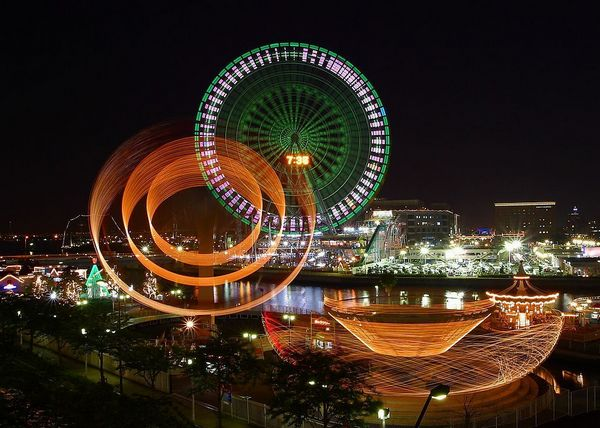

# ＜开阳＞上海人，身份梯度认同，与黑暗森林——《赛德克巴莱》观后

**作为习惯全球一体化的现代人，为什么被赛德克人那么原始的情感所打动？作为早已习惯优胜劣汰的达尔文主义的现代人，为什么认同一种落后的野蛮人生活方式对现代文明的拒绝？为什么习惯了协商共赢，用控制取代抗争的现代人，却被这么天真的自我毁灭式的反抗所感动？为什么早已能够接纳地球人、天人和攘夷志士拥挤在同一所城市的现代人，却能认可守卫祖灵不让外族入侵的愚忠？** 

# **上海人，身份梯度认同，与黑暗森林**

# **——《赛德克巴莱》观后**

## 文/吴燕凌（中国地质大学（北京））

  一． 

直到如今，还是经常被问:“作为一个上海人，为什么去北京念书。”这一个问题有两个预设：1，你是个上海人。2，上海人不喜欢去除上海以外的国内城市。

想过很多种十个字以内的回答方式。

1.分类讨论：“我不是典型的上海人。”可是，什么是典型的上海人呢，没谁规定“上海人”的鉴定条件吧，我干嘛就要自己先走到边缘位置去？遂否决。

2.反诘推论：“谁说上海人不愿出去？”可是，我只能代表自己，又不能代表其他上海人。还是否决。

最终的回答是“出去看看”这般打打太极，然后以“懂得的人自不会问”来对自己的无力回答作为解脱。

显然，在这一点上，我终究是和人们对“上海人”这个物种的主流预设不符了。

身份认同在此时产生裂缝。

 二． 

有一个朋友，生于大庆油田，全家老小都认为必然的人生轨迹是承继祖业。在油田人的眼里，给私企、外企干活的，都不算“有正经工作”的。即使是国企，还得打量下是什么性质。朋友从小到大都无法适应家庭环境，对三姑六婆的各种惺惺作态的关心反感至极。即使后来到了太平洋彼岸，仍然时有对华人社会的怨言。

这当然是个例，当个体的特性与环境的预设相违背时，身份认同就会产生割裂感。

妈妈在家中排行第六，是老幺，家中约莫有过些族谱。妈妈的兄弟，名字中都有个“志”字，姐妹的名字则都带个“爱”字。妈妈最小的姐姐，名唤“英”，从小要强，略有些年纪有些主张时，便去派出所把“爱”字改为了“志”。

英姨张扬的性格，不为长辈所喜。上山下乡的年代里，英姨与我妈姐妹俩中，有一个留沪名额，老师便留了乖巧的我妈。回沪后，英姨在医院工作，看上药剂房的男青年，主动追求，得手。随后撺掇姨夫去澳洲打工，自己与儿子留守八年后，赴异国团聚。

小时候，大家都只认为英姨很凶，不如我妈脾气温顺，可是如今，我对英姨未完的一生持高度赞赏态度。然而，这种赞赏并不是普遍的。

相对而言，女人更容易跳出体制独立行事，男人则承担着更多后顾之忧。家中若干有些社会地位的男性长辈，认可英姨的果敢，但不认可她的选择。他们的理由，我懒得重复了，用脚趾甲回放一下好了。比我小四个月，在某国企当小主管的表弟则直言，他一些朋友到了国外，无法适应，还是回国，他本人也满足自己两点一线之外有养鱼遛鸟的业余爱好的安稳“老头子”生活。他说，不愿意放弃已经拥有的东西，去国外从零开始。

我所想总结的是，“落叶归根”是一种先验的自发的情感。体制对文化会产生一些异化的影响，从而对一些个体产生排异反应，但大部分人不会因噎废食。认同和追求三权分立的人，同样可以在儒释道中找到立身准则。反对裹小脚的人也一样可能陶醉于传统戏曲的唱念做打。

理智和情感控制不同的行为，乡愁则掌管着意识形态之外的领域。

英姨的后半生，基本上致力于邀请各种亲戚朋友去澳洲旅行或定居的事业之中。刘瑜说，到了国外，才能深刻地感受到“有多想家”。圣三位一体之一的神导演安德烈·塔可夫斯基，即使因持不同证件而流亡意大利，也依然时刻被乡愁侵吞着全身心。他不愿走进异族的教堂，而只能手持烛光在废井中独自逡巡。

 三． 

幼时在家乡的晚报“夜光杯”一栏，读到过一句话：“所谓思乡，思的多半是家乡的小菜”，反复品读。以饮食是一种文化来讲，这其实是爱地域文化的表现。

我爱着各种小笼生煎，少年时立志吃遍上海滩的生煎。此时，我深刻地感受到自己确实是个“上海人”。

可是，我也爱大份东北拉皮、甜腻的锅包肉，爱全聚德北京烤鸭、海碗居的麻豆腐，爱山西的刀削面、陕西的泡馍、广州的肠粉、煲汤……这也说得过去，因为我是中国人。爱国就等于爱舌尖嘛。

再可是可是，我也爱麦记和肯记，爱东南亚的咖喱，爱韩式烧烤和日料，又怎么解？哦，我是地球人，我爱全世界啊~这样继续下去，就没有边际了。

于是想到的问题是，什么又是爱国呢？什么是“国”？

狭义的“国家”是一个政治生活共同体，有界限。古代外蒙古也属于中国，你说爱国，就也爱着外蒙古，如今就不用了，可以省下200万平方公里的感情。

广义的“国家”是指拥有共同的语言、文化、种族或者历史的社会群体，在这个定义中，一个国家没有具体的边界。也就是说，你可以爱全国22个省唯独不爱河南人，也不影响自称“爱国”。

这在逻辑上有些不好理解。如果说爱的对象没有边界，那么爱的到底是什么？

在我看来，爱是一种甘愿付出去维护对方的情感。这种情感，出于责任。而责任，又出于身份认知。比如，爱亲人、爱朋友，是因为所担任的社会角色，需要承担这个责任。《银魂》中的坂田银时，放弃为家国大义而战，而选择保护最身边的人。因为家国大义，事实上没有边界，而至亲好友，却是可以确定的对象。

一个人，首先是父母的儿女，是朋友的朋友，然后是某个圈子的一员，是民族的一份血液，继而是一个行政生活共同体中的一个个体，最后是一个人类。人对自我的身份认同，不是绝对的，但多半有这样一个由强而弱的梯度。有了自己“是”什么，才能说“爱”什么。

王怡在《做个中国人有什么意思》中写道——现在民族主义的名声不好听。因为和意识形态捆绑销售的时间太长，“爱国者”和爱国贼也不好辨识。但波兰思想家米奇尼克，讲自己怎样成为一个爱国者和民族主义者。对我很有启发。他说。1968年8月21日这天，包括波兰在内有5个共产党国家的军队入侵捷克斯洛伐克，摧毁“布拉格之春”。他就在那天，醍醐灌顶地成了一个波兰民族主义者。在1968年的波兰，什么人才配叫做波兰人？一个公共生活中的无权势者和失败者，他对民族国家的身份认同会从哪里来？米奇尼克给了一个迄今为止最打动我的理由，他说：“为波兰的罪过感到羞耻的人，就是波兰人。”

“米奇尼克给出了另一种情感的养成方向。不是分享荣耀，而是分担耻辱。”民族主义或集体主义，并不为我辈提倡，而所想表明的，是血缘和情感的纽带是天然的，为其承担责任，也是天然的。

如果要翻译成人话，也可以这样说：“即使我自己不停地腹诽着魔都的浮华、拜金、冷漠和小市民习气，却又心胸狭窄地不愿听别人的非议。18岁带着对家庭的怨气北上，如今却学着自己消化掉生存的压力，守在脚步日渐不稳的父母身边。”

从“身份梯度认同”的角度来看，也就可以理解钱理群口中的“利用体制达到自己的目的”的“精致的利己主义者”。

吴思说过，中国人公共意识差，是因为“官与民”，“朝廷与百姓”二元格局过于对立化，当国不为民，那么民也自然不愿意属国。所以，中国人有“抱团”，“拉帮结派”的社会行为习惯，“非我族类其心必异”，把“自己人”和“外人”分得很清楚。他们对认作兄弟的人掏心掏肺，对“圈外人”只作表面交往，对“先天下之忧而忧”则多半不以为然。

有时候，也会出现反梯度身份认同的情况。《左传》中记载了春秋时卫国大夫石碏设计除掉自己儿子石厚的故事，并流传为“大义灭亲”的成语。这便是个体对作为人臣的身份认同超过了对为人父的身份认同。另一个春秋名人管仲，在战场上后退的行为，则被鲍叔牙解读为对为人子的身份认同高过对为人臣的身份认同。

在2012年的我国第二次刑诉法修改中规定，一般案件中近亲属有拒绝作证的权利。这也就是否定了之前长期提倡的“大义灭亲”司法政策。

可见，由身边的至亲，到地球另一端的陌生人，身份认同基本呈递减的梯度状，时而会因外部因素有一些断裂，但不影响整体平均走势。

 四． 

所以也就可以理解《赛德克巴莱》对祖灵的守护，以及为什么用这样极端的方式。

作为习惯全球一体化的现代人，为什么被赛德克人那么原始的情感所打动？作为早已习惯优胜劣汰的达尔文主义的现代人，为什么认同一种落后的野蛮人生活方式对现代文明的拒绝？为什么习惯了协商共赢，用控制取代抗争的现代人，却被这么天真的自我毁灭式的反抗所感动？为什么早已能够接纳地球人、天人和攘夷志士拥挤在同一所城市的现代人，却能认可守卫祖灵不让外族入侵的愚忠？

任何一个地域，任何一种文化，都是有排异性的。

而某些城市因为地位特殊，所以混杂了多一些的黑点。但从“排外”这个现象本身来说，矛盾更多源于文化冲突。有些地域帖的最初，只是在讨论豆浆的甜咸。

我相信人们被《赛德克巴莱》感动的原因，不会是对抗日题材的共鸣，而是认同一个民族对守护祖灵的决心，是认同为坚守信仰而牺牲的抉择。

如果可以认同广州人对粤语的捍卫，那么理应也能认同上海人对沪语的捍卫。

好比如果一个人想固守乘146公交车环游卢湾区，在打浦桥搓麻，在雁荡路逛音像店，然后去复兴公园跳交谊舞的生活方式，并对会改变这种方式的外来入侵感到天然的排斥，我认为这本身是没什么可以指责的。只不过如果这个人学会接受改变，他自己会心情更舒服而已。

 五． 

说起来，上海文化本来就是杂交的孩子。所谓的海派，是糅合西方和东方风格的不同特色。作为开放的都市，受到外域文化冲击，是不可抗的。

好比北京文化，京片子的皇城根儿文化和北漂文化早已是各占半边了。人有自由迁徙权，也有保护本土文化的权利。迫于生存资源，与总体政策的导向，两种人还将共同生活很长时间，磨合过程中，有矛盾是难免的，在“指腹为婚”的谕旨下，能做的也就只有想办法好好相处了。白人社会经过多年的洗礼，也能够接受黑人奥巴马总统了。

文化的融合，是辛苦的，但并非不可行。两种文化，并不是非此即彼才能生存。

悲观的说法来自刘慈欣：“宇宙图景犹如一片黑暗森林，每一个文明都是准备好捕杀他人的猎手。”

黑暗森林的遵循的公理前提是：1、生存是文明的第一需要。2、文明不断增长和扩张，但宇宙中的物质总量保持不变。

其中，第二个公理在现实世界中已经不怎么成立了，很多区域的人口现在是负增长的，固然有环境制约有政策的因素，但以欧洲女性为例，其生育意愿也持续低迷。在可以自由选择如何生育的情况下，一些人生了3、4个，也有一些人选择不生。而当现在大多劳动密集型产业转向技术密集型或资本密集型产业，确实不需要那么多人口了。所以文明未必是不断增长和扩张的。

由于《赛德克巴莱》是根据史实改变，马赫坡社一族在雾社事件中几乎灭族，从战士到妇孺，都选择了自杀。所以黑暗森林的第一条公理其实也被推翻了。生存是不是文明的第一需要，每一个文明可以自己选择。

既然两条公理都推翻了，宇宙图景原非黑暗森林，那么文明就不需要再作一名闪躲的猎手。

同样的，地球人和天人，硬盘与土著也都无需如此对立。

生存资源的有限，并非真相，而是人为的驱使。

当我们看到一线城市地价和房价高企、环人民广场商圈基本难以打到出租车、城市像摊大饼一样外扩、陆家嘴密集建设写字楼、上海人口在生育率降低的情况下不断增长并突破2300万时，都并不能说明这个城市是在进步的，也没什么值得喜悦。因为同一时间，乡村的留守儿童问题已经很严重了。

经济观察报的侯思铭在《一个小城市的生与死》中说，城市在向外一步步扩张，同时又从内部以更快的速度逐渐被遗忘。

前不久，报社一些同事去了大别山做公益活动，其中一位回来后情绪颇有些激动地转述：“那边的小城镇根本就不穷，校长什么全是官僚风气非常严重。镇上的青壮年100%全外出打工，学校里的孩子全是留守儿童，要么单亲在外，要么双亲全在外，一年回来一次，根本没人关心。一个家庭如果靠种地，一年的收入是3000块钱。镇上的三四层小洋房全是青壮年打工回来盖的。”

古老的手艺逐渐消失，人们的生活方式趋同。“工人在播种之时，便预先接受了放弃，人类或许终将会成为完全生活在城市的物种，假如小城市会消亡，那么杀死它的必定不是城市化，更不是财富，而是它失去了自己应有的生机。”侯思铭这样写道。

大城市的资本密集，以小村镇的消亡为代价。

这根本是天平没摆稳。如果村庄是美丽的、自足的，自由迁徙权会成为城市人口的压力吗？

所以，重要的是如何打破黑暗森林。一旦黑暗森林被打破，血祭祖灵、地域主义、自由迁徙权都不再会是互相损害的必然理由。文明的扩张最后会得到一种制约力量。而像赛德克族人那样，葆有先祖赋予的生活方式，同样应该是一种权利。

 

（采编：何凌昊；责编：黄理罡）

 
