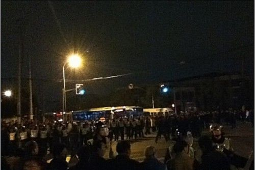
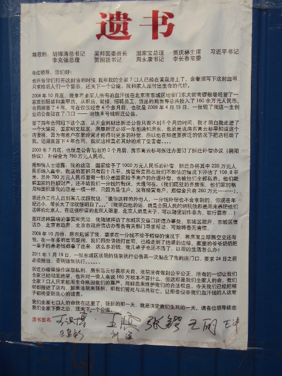
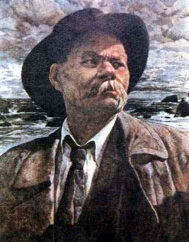
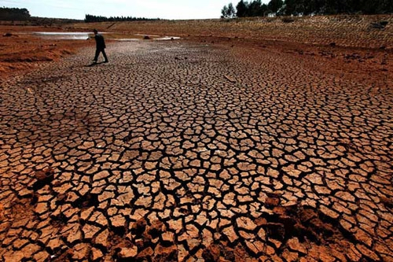

# ＜开阳＞不能承受的暴戾之风

**倘若这个面目的暴力革命真的从天而降，这样的革命除了暴力，还有什么，为了什么，还能带来什么。仿佛这些都不重要，只有无端的破坏重要。可不是所有的暴力对抗都叫革命，也不是所有的破坏都有建设性。更何况，没有方向和理念的暴力常常是寇盗式的掠夺，是奴才的造反，与革新无关，更与进步无关。**  

# 不能承受的暴戾之风

# ——由群体事件频发想到的

## 文/曹思哲（辽宁大学）

 

最近不断发生群体性事件受到社会的广泛关注，而入夏以来的几声政府门前的炸弹声，更是惊着了许多人的神经。这些零星出现的事件和现阶段的很多维权事件一样，大多由于当事人具体利益长期诉求无门，矛盾长期被遏制在高压状态下无法解决，而最终产生了爆点。

这一连串“矛盾激烈展现”的事件事实上已经表明，**当局的维稳方针乃至社会管理思路（最近提得很响）必须得到迅速扭转，尤其是地方官员的思路倘若再不改变，神马和谐神马稳定大局，就真的要成浮云了。**

因为相较于一二十年前，社会转型的各类矛盾一直在很大程度地“增量积累”，旧的没去，新的又来。而执政党为解决发展中的各种不平衡（城乡、区域、经济和社会、贫富差距等）所做的努力,显然很难使天平上乱添乱减的砝码达到他们所期望的“和谐”。一味把“维系在改革的口号下不断保持的经济高增长”作为执政合法性的主要来源似乎并不是长治久安的良策，因为一个大国的经济增长不可能总是“一万年太久，只争朝夕”的飞飙，如果将经济增长作为政权安全的“最后一道屏障”，这将是十分被动的选择。一旦经济出现不可控的停滞和危机，最先受威胁的就是三十年多来一次次地统一思想，而如今却亟待重新定义的“改革共识”，改革共识一旦严重动摇或者破灭，就很难岁月静好、现世安稳了。

总之一句话，**在稳定这个命题上，体制内外给各级执政者的空间其实已经变得很小。**

正是认识到这一点，元首才会不厌其烦地在每一次大会上都不忘记告诫同志们：我国现阶段正面临难得的历史机遇，也面临诸多“可以预见”和“难以预见”的风险和挑战。

面对这些风险和挑战，当局自然有当局的算盘，而且每天打得哐哐响，且时刻影响着每个个体的小算盘。但社会面对这个风险，不同的群体也会有不同的观点，会选择不同的应对方式。也许并不是所有群体都会像知识分子和思想界那样，把左派右派划得门儿清，问题和主义搞得错综复杂神乎其神。但不可否认，他们都会选择最有益于自己乃至最简单的方式去应对来自近身社会的压力。这些方式的迥异就是当前矛盾和诉求呈现不确定性的根源。

**但无论体制内外，总有这么一群人，他们或是被逼到绝路悬崖不得不，或是主观渴望并选择，或是已经去使用暴力解决他们眼中的问题。**

**“专制的模样就是最具有暴力却最不具有权力的组织形式。”和“什么样的暴力？”**

**群体性事件不断升级首先离不开应对者的专制性错误。**

最近的群体性事件呈现出的正是：在事件发起前漫长的矛盾存在期，各种利益诉求和矛盾解决统统没门儿，沟通渠道匮乏和维权道路被不断挤压，社会分层明显加快并板结固化，直接导致的群体暴力不断抬头。

而稍有风吹草动，从上层到基层就立刻集体保持“高度重视”，如临大敌。而所谓的“高度重视”又常常是不由分说的高压部署，警力出动，消息封锁，人员管控等强硬手段，但具体的矛盾和利益还是没有讲的地方。

**从头到尾，作为被诉求方和管控方的地方政府首先采取了“制度暴力”。这确是作为官员最直接最本能的考虑，但未必就是最能解决问题的考虑。**

其实不仅是官僚，很多政治理论家也认为暴力是权力的肌肉，似乎没有暴力，权力就无法展现影响。党的祖师爷马克思就断定“国家就是掌握在统治阶级手中的镇压机器”，说的没有办法再“反动”了。而马克思韦伯也认定“国家拥有社会一切合法暴力。”“国家是建立在合法暴力基础上的对人的统治”(合法暴力大概就是制度暴力的意思吧)。然而这种制度暴力在错误的实践中往往像不科学的“救火”：无论火情大小，迅速扑灭，却不去寻找火源。结果是野火烧不尽，春风吹又生，反衬出制度暴力本身的虚弱。这也正是汉娜阿伦特所坚信的“暴力本身只是工具，单纯建立在暴力之上的政治不是真正的政治，或者它表明的是政治的败坏或者无能”。

执政者往往不会轻易承认这种虚弱，相反，虚火常常更旺，直至矛盾更加激化反弹，虚火旺盛到令人蛋疼，终以悲剧收场。

比如，**一个小规模的示威就可以使地方政府出动装甲车和相当数量的武装力量进行维稳，偌大的体制却有如此狭促的稳定空间，就难免让人感觉很不靠谱。**

这些暴力群体性事件不断升级的过程，就是一个从正常维权走向暴力维权的过程。上述的制度暴力难辞其咎。

同样，事件的参与者也并不全是具体维护自身权利，甚至到后来维权只是暴力延伸的导火索而已。这也正是不可控的暴力事件的可怕之处。

这很可能是一个复杂的群体，一百个人未必有一致的起事理由，他们认为重要的东西也不一样。

也许小A想要说：我的就是我的，对我很重要。

小B想要说：你的是我给的，对我很重要。

小C想要说：你难受你受伤，对我很重要，

当然也有小D想要说：热闹血腥刺激，对我很重要。

但一切固有体制总会对一个声音感到不能承受，那就是：**没有你，对我很重要。**

我非常欣赏一位学长的说法：“一个人，究竟要怀着对旧世界旧制度旧官僚多么巨大的仇恨；统治者，究竟要做多少的罪孽，才能让一个人，宁可把自己炸的粉碎，只为了抓你垫背。”“人民共和国的公民权利是流了无数共产党人的鲜血才换来的，如果谁胆敢把它夺走，人民并不介意再流一些共产党人的鲜血。”

#### 潘多拉之盒打开以后

如果说群体性事件更多的是惊动了官老爷们粗壮神经的话，那么被强拆户选择恐怖手段去制造“从一个决绝走向另一个极端”的那声巨响，就不仅是对官员仕途的撼动而已，而是像为我们身处的社会打开了一个冠名为暴力的潘多拉盒。

**这个盒子不单是轰隆一声的炸弹，也不仅仅是割掉央视女记者鼻子的那把尖刀，它包含了一切具有绝对能量的暴力心理和行为。从这个盒子放出的暴力幽灵和危险基因到底多大程度地反映了这个社会的危险和暴力倾向，又会多大程度地刺激出更为暴烈的因子从而影响社会进步的步伐，是每个关心公共事务的普通人不能不想的问题。**

历史无数次警示我们，社会暴力的严重性尤其是传导性非常可怕。在当前公私利益纷繁交错的状况下，加之利益诉求渠道的严重缺乏，不被信任的司法和滞后的权力监督制衡，社会矛盾几乎不可避免地会在不断的公权暴力压制下强劲反弹，恐惧惊慌不信任的情绪一旦集聚，随时可能走向群体暴力，乃至走向不可控的未知的乱象中。**（这种乱象不是指对社会秩序乃至政权造成的混乱，是一种野蛮和不文明的社会参与，是理性和人心的崩塌）**

我非常相信这种传导会发展为原子裂变的链式的社会反应，这在我们整个民族历史以及共和国的历史上，并不鲜见，甚至呈现了某种怪圈。

这往往会在实质上降低人们对体制的信心和预期值，尤其是会加重广大中产阶级的担忧，尤以相信改良的知识分子为重。

假如真的走向那样的暴力和无意识抗争中，那么各方高举的旗帜本身就已经失去意义，无论思想的左派右派，他们扮演的角色都将只是溃坝的洪流中“俱下的泥沙”，决不会是定海神针，也不会再是砥柱中流，只是没有出息地随波逐流，或简单地成为暴力的帮凶。

**个人感觉，这样的趋势为大多数民众带来的，绝对是十足的悲剧，而绝非脑残们所认为的值得庆祝的时刻。**

**而假如知识阶层真的被泥沙俱下，那也是他们为自身缺位和自己的选择所付出的必然代价。**

中国知识界在历尽了数次浩劫后，似乎不再有勇气和实力结成单纯的联盟，而只能无奈地将体制本身当作一面镜子，照映出自己队伍本身的左中右。尤其是在二十二年前的被迫噤声和随后而来的市场经济大潮到来之时，八十年代所形成的基于共识的联盟已经分裂，各奔东西，各说各话，各找各妈。即便是几次规模以上的论战，也并未起到像之前的那些著名论战所达到的社会效应。

我很纳闷那些自称为自由主义的先生们和右派们，怎么丝毫没有在和新左派的较量中占据哪怕一点上风？ 只能转而投入到维权服务和大众传媒中去，这是不是算“走为上”？

即便是走为上，那如今在维权层面，为什么权利协商双方的中间地带不是扩大了，反而缩小了？甚至缩小到只剩下暴力这一条路可走，这个局面，只能怪政府专制，怪百姓不够理性素质不高吗？

#### 要意义的进步，不要意淫的进步

**更为可怕的是，在事件发生后，许多人如今已经一次又一次地表达了对这类暴力的讴歌、赞美和鼓吹，显示出了对所谓“革命先声”的一种变态的期待，其中甚至不乏所谓的知识精英。**

但仅是这般躲在角落里懦弱地找寻百年前的革命气味，借助他人的极端暴力和不幸遭遇来宣泄对体制的不满，恕我直言，这样的品性从内到外都彻底地透出卑鄙和无能。因为这更像是在一条深长的社会伤口上狂撒人性的盐碱，然后听着他人的惨叫而欣喜若狂。也像是一次对“进步”（比如民主革命）的猥琐意淫。

当然，任何人都不能否认剧变的可能性，无论大小，风险是一定存在的。但什么样的革命（剧变）是好的，需要有一个强有力而明确的声音，很可惜，此时不仅没有振聋发聩的建树，甚至连有意义的声音都很少。

**倘若这个面目的暴力革命真的从天而降，这样的革命除了暴力，还有什么，为了什么，还能带来什么。仿佛这些都不重要，只有无端的破坏重要。**可不是所有的暴力对抗都叫革命，也不是所有的破坏都有建设性。更何况，没有方向和理念的暴力常常是寇盗式的掠夺，是奴才的造反，与革新无关，更与进步无关。 

对旧体制的罪恶和弊病的解构，从来需要无数人用思想和理性以及强大的行动力去往“骆驼”身上一棵一棵地压放稻草，而绝非如今很多革命论者那般，和搬倒雷峰塔的那些愚民没有什么区别。

何况他们搬的砖又不能避邪，有时连他们自己都不喜欢，更不相信。仿佛只要能给他反对的人带来麻烦，只要能有热闹看，只要能获得权力，就可以不要自由不要民主，什么都可以先扔掉，但这一扔，往往就捡不起来了。

作为亚洲第一个共和国，我们这个国度绝对不缺乏“革命经验”和“革命教训”，极具理想主义色彩的革命记忆和革命理想统治了几代人，甚至成为了最高道德标准。**但这段历史不断表明，用仇恨的苦酒来缓解热望自由的干渴，用暴力的“健胃消食片”来填饱呼唤公平正义的肚子，得到的结果只能是无止尽的悲催。**

#### 尾声

整整一百年前，在改良与革命的龟兔赛跑中，革命率先撞线。那时，我们的先辈们对着腐朽体制一次次拉响炮闩，他们选择抛开身家性命去战斗去摸索去牺牲。**他们捆绑的是自己的血肉，解开的则是同胞的手足。**

一个世纪过去了，他们自然不愿意看到，自己的子孙依旧长着一张缺乏温度的古老面容，一张张脸依然被埋在浓厚的脂粉下。当然，他们更也不愿看到，比这张脸更可怕的是一颗没有信仰，暗藏暴力的中国心。

**历史总会非常相似，但绝非简单的重复，它自有它自己的逻辑，有它自己的道理。**

身处其中的人似乎也只能，好自为之。

（采编：麦静；责编：麦静）

 
