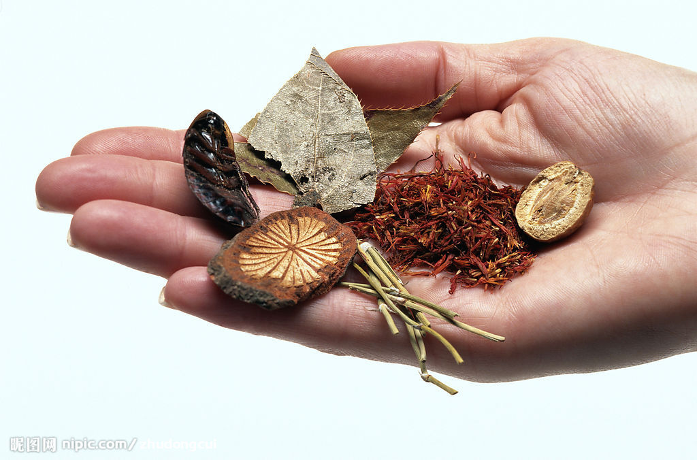
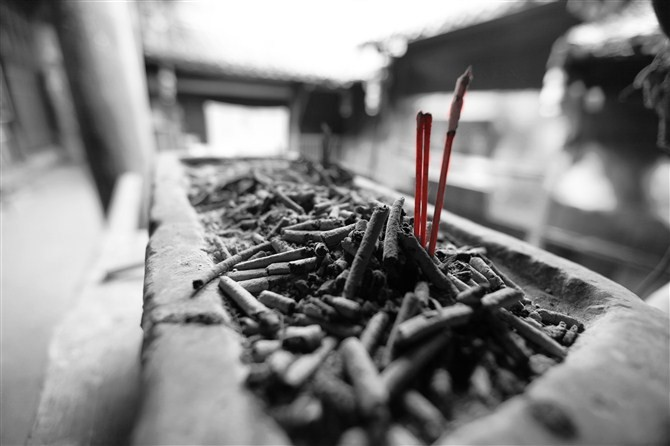

# ＜开阳＞中医为什么有用

**医学行为是人类社会产生那一天就与人类生活不可分割的一部分。经历了数千年延绵不断传承的中医药体系，就象一个巨大的原始森林，里面巨树参天、藤萝密布，虽然我们一时无法理解其间复杂的生态原理，但有理由相信其中蕴藏着无数祖先们与疾病生死斗争摸索出的宝贵经验，在漫长历史中积累下了大量足以令人叹为观止的医学智慧。**

****

# **中医为什么有用**

## 文/杨昉

** ** **1. ****也许只有不断的试错，我们才能更进一步接近真理——****波普尔** 为何《伤寒论》的这些方剂会具有如此神奇的疗效？为何这些两千多年前创立的方法会与现代医学的发现不谋而合？是因为古人掌握了一套高超的医学理论，还是有更加深刻的原因？就让我从下面这两个小故事开始慢慢说起吧。 我的一位亲人患了严重的腰椎间盘突出症，行走困难，几乎已经接近瘫痪。采用各种治疗手段都没有用，在省医院住院治疗也未取得明显效果。后来听村里人讲了个偏方，用陈仓米炖猪棒子骨，吃了一个多月，各种症状神奇消失了，两个月后就可以下地干活，至今两年多了，一直在从事体力劳动，也没有进行其他特殊治疗，但腰椎间盘突出症没有再发作。 还是他的故事，有一次手指上长了个奇怪的黑颜色疙瘩，长的样子跟鱼眼睛一摸一样，长了很长时间都没有消失。有一次他去菜市场卖菜，旁边卖菜的人看见他的疙瘩就说：“你这东西叫做‘鱼休子’，你每天拿活螃蟹壳在上面涂就可以治好”，于是他回家就到河里抓螃蟹照着做，结果每涂一次那疙瘩就小一点，涂了三四天疙瘩就消失得无影无踪。 俗话说：“偏方气死名医”，在我们的生活中，可以听到很多这类偏方治大病、怪病的故事。为什么这些偏方经常会产生神奇效验？ 当然，在讨论这个问题之前，一定会有中医反对者跳出来说：你这只是个别案例，没有经过“随机”“双盲”的检验，所以这种“偏方”根本不科学，疗效根本无法保证，用不科学的方法治疗疾病是愚昧的。如方舟子所说：“没有经过科学检验的经验未必可靠，可能只是以讹传讹。古人对前人的经验之谈是如此的轻信，有时候甚至到了荒诞的地步”。 我完全能够理解方舟子的逻辑：某个病人吃了某种药物，病就奇迹般的好了，这种个案并不能说明这药真的有效。因为影响疾病痊愈的因素太多，有的病本身就有自愈能力；有的是受到了强烈的心理暗示；有的是无意中吃了另一种对疾病有效的药物，只是他自己没有意识到。 

 因此对现代医学来说，缺乏大样本、随机、双盲研究的个案，并不能说明某种疗法是有效的——这个观点我也完全赞同。但是如果我们抛开个别案例、个别药方，而站在人类传统的生存方式，站在推动医学发展的原动力的宏观角度审视“民间偏方”的形成过程，就会发现很多长期流传的“民间偏方”是人类与疾病漫长斗争历史中有效经验的积累，其疗效超越现代医学是十分正常的事情。相反，如果一个民族经过成百上千年的摸索而没有找到过针对某些多发疾病的特效疗法，这倒是一件很奇怪的事情。 从医学发展的动力来看，“试错”是一切医学发展的基础。所谓“试错”就是瞎打误撞，瞎猫碰死耗子的办法，不断尝试不同的治疗手段直到将病治好为止。 即便对于现代医学，“试错”也是其发展的主要动力。 因为人体的规律过于复杂，与之相比现代医学对人体有限的认识显得微不足道，纯粹从医学理论上推导出的治疗方法并不比瞎打乱撞高明太多。现代医学中很少有哪种非常有效的疗法纯粹是通过理论推导得到的，相反很多重要的医学突破，大到具有里程碑意义的牛痘、青霉素，小到壮阳神药“伟哥”，都是医生们偶然间发现了一种无法理解的效应，然后再通过生理病理研究来解释其机制——“牛痘”是英国医生琴纳听说挤牛奶的女工接触过牛痘后不会生天花，这才研发出来；“青霉素”则是弗莱明无意中把细菌培养皿暴露于空气中才被发现。 “伟哥”的故事则更具传奇色彩：研发“伟哥”的最初目的是为了开发一种新的心血管药物。但是当药物进入到临床实验阶段时，令人啼笑皆非的结果出现了，“伟哥”改善心血管的作用并不理想，但奇怪的是前来退药的都是女性病人，参与试验的男性受试者因为这种药物能令性器官勃起更持久更坚挺而不愿退还药物。在发现伟哥的这种“副作用”后，辉瑞公司立刻转换了伟哥适应症的研究方向。伟哥在被正式批准上市的第一周，全美就开出了1.5万张处方，此后一直呈指数速度增长，到了第七周每天的处方量就达到了27万张，创造了有史以来药物销售的最新纪录，成为辉瑞公司最大的一棵摇钱树。 人们之所以忽视了“试错”在现代医学中的重要作用，一方面是因为现代医学的很多试错尝试并非在人体上完成，而是由动物取而代之，另一方面现代医学总是可以把它偶然间发现药物的药理解释得有条有理，于是让人误以为现代医学非常“科学”，能够像神枪手一样对疾病“指哪儿-打哪儿”。事实上它也不过四处乱放枪，打着靶子后再研究一套理论来说明为什么子弹可以打中靶子，只不过“打哪儿-指哪儿”的功夫远远超过传统医学。 但是从“试错”经验的角度看，现代医学根本无法望及传统医学之项背。因为自从人类社会诞生那一天起，医学行为就是人们生活中一个重要的组成部分，在漫长的疾病斗争史中，人类曾经经历过非常大范围的“试错”，并且这种试错的对象不是实验室的老鼠，而是直接在人体试验。 人们尝试过的奇奇怪怪的治疗方法，范围之大往往超乎想象，例如用晒干的死人舌头来止血疗疮，用发酵过的大便来退热，这些现代人想都不敢想的做法都真实的存在过——发酵的大便在中医中被称为“金汁”，是过去温病学派喜欢使用的一种退热药物；用晾干的人舌疗疮，这是我一个当过兵的长辈亲身经历的事情，他的战友在战斗后悄悄将死人的舌头割下保存起来以备自己受伤使用。 与传统的疗法相比，现代医学发展的历史太短，并且还受到诸多医学理论和医学伦理的约束，因此现代医学“试错”的范围，与历史上人类尝试过的千奇百怪的治疗方法相比不过是小巫见大巫。   **2.** 就拿螃蟹壳治“鱼休子”的例子来说吧，我们不妨对它产生、流传的历史做一个合理的推想： 历史上必然有无数人长过“鱼休子”，都拿它没办法。但有一天，一个叫张三的人去抓螃蟹，第二天他发现和自己朝夕相处的“鱼休子”突然变小了，他又试了几次，“鱼休子”竟奇迹般的消失了。他像发现新大陆一样，兴高采烈的向周围的亲戚朋友讲自己抓螃蟹治鱼休子的故事（我前面提到的那位亲戚，闲聊时经常都会说起用偏方治好腰椎间盘突出和“鱼休子”的经历，我已经反复听他们家的人讲过不下五遍）。 现身说法令周围的人印象深刻，很可能他的邻居到朋友家窜门，看见李四长个鱼休子，就告诉他我们村张三用螃蟹壳治好了。李四实验过后果然效果不同凡响，又在茶语饭后到处宣传。如此一传十，十传百，就形成了一种被广泛传播的治疗方法。 当然也存在这样的可能，张三的“鱼休子”并不是被螃蟹壳治好的，而是那天他正好吃了一种野菜，实际是野菜治好了鱼休子。但这事被他忘得一干二净，就误以为螃蟹壳发挥了作用。 因此，错误的治疗方法也有可能被他到处传播，但是当李四听到这个方法后再去拿螃蟹壳实验，就会发现毫无效果，也许李四不会完全否定这个偏方，但这个方法不会给他留下什么深刻印象，“螃蟹壳治鱼休子”也就因遗忘而被自然淘汰。 当然，上面是对“偏方”传播过程理想化的推猜测，到底这种传播机制能不能发挥检验“偏方”效用的作用？“营销学”中对于“口碑传播”的研究，或许有助于理解这个问题。 商品“口碑”的传播方式与“偏方”传播很相似，当消费者对某个商品使用满意时，就会向周围朋友推荐，这样一传十十传百，就为商品树立良好口碑。“营销学”中对口碑的传播过程有较为成熟的数学模型，也有很多具有说服力的实证研究。国内外对消费行为的多项调查表明，口碑的传播具有这样的特点： 口碑的好坏确实与商品质量好坏、顾客的满意度，以及商品的安全性、可靠性有较高的关联；更有趣的是坏的口碑比好的口碑传播得更快，也就是俗话说的“好事不出门，坏事传千里”，质量良好的商品并不见得会被人们广泛认同，但是如果频繁出现质量问题就很快众人皆知。 “口碑”传播的另一个特点是消费者对产品的“惊讶”程度与“口碑”传播的频率有非常显著的关联，也就是说如果商品能让消费者产生非常方便、有趣、愉快的感受，就能够很快被消费者认知，同样如果商品发生了令人印象深刻的质量事故，坏的口碑就会立即广泛传播。 如果把口碑传播的规律迁移到民间偏方的传播过程中来，就可以进行合理的推测： 偏方的“口碑”确与其疗效的好坏有关，并且如果某种方法效果不明显或者有显著毒副作用，那么对其负面口碑的传播很可能比正面口碑传播更加广泛。另一方面，由于“惊讶”对于口碑的传播有重要影响，所以那些立竿见影，治疗效果特别明显的治疗方法，比那些疗效难以观察的方法更容易在民间传播。 由此不难推论，民间偏方的传播机制能够自然淘汰有明显毒副作用或者效果不明显的治疗方法，并把疗效显著的方法保留下来。 但一定会有读者反驳：“吃香灰”治百病的方法也曾经在民间广泛流传，难道这种方法也是有效的吗？难道不是一种愚昧无知的做法吗？我的答案是：这种方法确实有它的道理。 

 对于临床治疗来说，“心理安慰”是帮助病人战胜疾病的一种极为重要的治疗手段。在古代社会，香灰是一种非常理想的心理安慰剂。与一般的安慰剂不同，病人的潜意识中会认为来自神庙、佛龛前的香灰受到过菩萨、神灵的庇护，带有神奇的力量，因此增强了战胜疾病的信心。 但是这种治疗方法与文化背景关系极大，如果把香灰拿到今日来效果就会大减，因为大多数人已经失去了对菩萨、神灵的信仰，而把“科学”奉为了神明。但对于科学的虔诚信徒来说，如果告诉他（她）某药物是美国高科技研发出来的新药、价格如何如何昂贵时，往往就能起到类似于香灰的心理暗示作用。 但可以肯定，并非所有的民间偏方都是通过“心理暗示”在发挥作用，必然有相当一部分是真正使某些生理机能发生改变而治愈了疾病。因此对于那些能够在民间长期、广泛流传的偏方，尽管没有经过严格的临床检验，但是从它的产生、传播机制来分析，我们就不应该像对待某种未经临床试验的人工合成的新药那样，对其疗效抱以同等苛刻的怀疑态度。   **3****．经过数百年或数千年的试误式学习，人类提炼出了大量有关使用生物来为其衣食及治病服务的信息——****盖尔曼《夸克与美洲豹》** 考察中医的历史，显然“民间偏方”或者说民间流传的医学经验，在中医药体系的形成过程中扮演了极重要的角色。 战国时期成书的《山海经》是现存最早记载药物功效的典籍，书中记载了一百多味动物、植物及矿物药物。但是书中对药物功效的记载很简单，其体例都是先说明药物生长的地方、叫什么名字、长什么样子，然后只列举一项这种药物能够治疗的疾病，比如：“萆荔……食之已心痛”，“文茎……可以已聋”，“ 沙棠……食之使人不溺”等等。 这种记载药物功效的方式，颇有些类似民间偏方口口相传的形式，口头传播的经验有几个特点：疾病的特征很明显，不需要专业知识就可以诊断，如《山海经》中的心痛、聋、溺（多尿）、瘿（大脖子病）等等，只要生活经验稍微丰富一点的人就可以掌握。另一特点是一味药对应一种病，如“螃蟹壳”治“鱼休子”，口头传播这个经验的人，通常只关心什么东西能治“鱼休子”，而不会关心“螃蟹壳”是否还可以治疗其他疾病。 另外，民间偏方在传播时，往往都是根据最明显的症状用药，很少区分疾病的类型。如“牙痛用花椒”，这个民间经验传播时不可能区分是牙龈痛、牙根痛还是龋齿痛，再如对于“杜仲治腰痛”，民间流传的经验不可能区别是腰椎的问题还是腰肌的问题。 从这些特征分析，《山海经》对药物的记载应当较为原始的保留了民间口传的医学经验。 《神农本草经》是中国现存的最早本草专著，成书时间不晚于东汉。虽说书中有很多内容必须是在医学行为专业化、职业化以后才可能出现，但我们仍然能在书中看到很多原始民间医学经验的痕迹。 例如《神农本草经》中出现的病名，绝大多数是临床特征明显，容易确诊的疾病，如齿痛、耳聋、目盲、咳逆、呕吐等等，并且在描述多数药物的主治功效时并不带有附加条件。 如咳嗽是一种发病原因极为复杂的疾病，后世医书对咳嗽类型都有很多划分方法，如现行中医教科书根据临床特征的不同，通常分为风寒、风热、痰热、阴虚等多种类型，不同类型咳嗽的用药特点都不一样。 虽说在《神农本草经》中也出现了咳嗽类型划分的雏形，出现了“风寒咳逆”“久咳”“邪气咳逆”几种情况，但全书记载的32味可以治疗咳嗽的药物，有28种都只说用于治疗“咳逆”而没有说明适用的类型。可见《神农本草经》成书时，对于疾病的分类、辨别还比较粗糙，保留着浓重的民间经验色彩。 《神农本草经》以后，各类本草书籍记载的药物的总数随时间呈几何级数增长的态势，从汉代到清代近两千年间，平均每四百年本草书籍记载的药物就要翻一番（见下表）,而新增加的药物首次出现在医书中时，对其功效的记载都十分简单，大多保留着非常浓厚的民间经验色彩，例如“延胡索”最早出现于《雷公炮炙论》一书，书中对其功效记载仅“治心痛欲死”五字；“金银花”首次在《新修本草》中出现时，书中对其主治功效的记载仅“主寒热身肿”五字；“穿心莲”首次在《岭南采药录》中出现时，只有“能解蛇毒，又理内伤咳嗽”的简单记载。 

 这说明古代本草书籍对药物功效的最初认识，大多来自流传于民间的较为粗糙的医学经验，而这些民间医学经验在很大程度上是先民们长期与疾病斗争过程中，经历了大范围的“试错”之后才发现的。 

朝代

时间

书名

记载药味数目

东汉

二世纪以前

神农本草

365

南北朝

五世纪

雷公炮制论

480

晋

六世纪

本草经集注

730

唐

七世纪

新修本草

844

宋

十一世纪

嘉佑本草

1082

明

十六世纪

本草纲目

1892

清

十八世纪

本草纲目拾遗

2608

下面一段文字来自于清代《验方新编》的序言，这是一部专门记载民间偏方验方的书籍，这段文字可以让我们更加直观的了解到古代民间医学经验的传播形式，以及这些经验如何被古代医家搜集整理并流传至今的过程。 _人不能无病，生病必须寻医服药。然而良医时而难逢，药物时有贵贱。富人固然无需忧虑，但贫者难免为之烦恼。而“__单方”__一门最为方便，只要选药精当，如果药物与疾病相符，就算没有医生也能药到病除。我幼年的时候，看见别人有良方，私藏而不肯公诸于世，心理暗自鄙视这种人。因此立下誓愿，不遗余力广求众方，看到古今典籍有所记载或者听到亲朋好友之间的传闻，都一一记录下来。久而久之，汇集的验方甚为丰富，各类疾病都有所涉及。于是删除掉那些效果不明显的，以及用药重复或者药物过于昂贵的。现在保存的，都力争做到有某病即有某方，有某方即有某药，并且很多药方都不需花费一文钱就可以效验如神，即便在穷乡僻壤，舟马难达之地，也都可以马上就找到药物，立刻见到功效。为了这一点救世的苦心，我废寝忘食的辑校整理，至今已经二十年了。_ __ __ **4. ****勤求古训，博采众方——****《伤寒杂病论·****序》** 之前的内容，我们展现了一种民间偏方的试错-筛选机制，通过大范围试错无疑可以发现某些常见疾病的有效疗法。但这种民间经验往往都很粗糙，对疾病的辨别、分类都极为模糊，而且都是零零星星在民间流传，难以成为一个系统的医学体系，难以将前人经验改良或组合而形成疗效更好的治疗方法。 然而当医疗行为职业化以后，就使得医学知识精细化、系统化成为可能，医生把各种医学经验组合在一起，不断形成新的诊疗方法，这就有可能使古代医学以更高的效率发现有效疗法，并有可能应对更加复杂的疾病。 我们不妨把医学的这种发展模式与生物进化模式进行一番比较，会发现二者的机制颇有些相似之处。 对于生物而言，基因的优劣决定着生物体在自然界生存机会的多少，在“优胜劣态”法则的选择下，携带优良基因的生物体更容易生存下来，并且具有更多生存、交配、繁殖机会，它们的优势基因可以遗传到它们的儿孙身上，于是一代代繁衍的结果就使得种群中具备优势基因的个体将越来越多，整个种群会逐渐得到优化。 另一方面，基因会随着生物的繁衍而不断的变异，生物的有性繁殖可以使不同个体上的几种优势基因组合在一起，出现令生物体生存能力更高的基因结构。新的优势结构一旦出现，它又将通过一代代的交配、繁衍逐渐扩散到整个种群，由此种群进一步得到优化。 中医的发展过程与生物的进化也颇有相似之处，掌握了某些治疗方法的巫师、医生或者江湖郎中，就像是一个个要面临“优胜劣汰”的生命个体，他们掌握的偏方、诊治方法、医疗经验就相当于生物的“基因”，综合运用这些“基因”为人治病是他们谋生的手段。 疗效的好坏是由病人来判断的，如果病人认为医生的治疗产生了明显的效果，就会向亲戚朋友推荐这位医生，于是疗效的好坏决定了医生口碑的好坏。疗效好的医生门前车水马龙，疗效不好的医生则门可罗雀。因此医生掌握的诊疗方法的效果就决定了医生在社会上的生存能力。 虽说治疗效果取决于病人的判断，而病人的自我判断往往具有很强的主观性，但依照前面介绍的口碑传播原理，当一个医生能够成功的在社会上生存下来，他的医术被广为传颂时，说明他掌握的某几种方法、或某几条经验确实有一定效果，正如某个物种能在自然界生存下来，必然意味着它具有某些能使它适应于环境的优势基因。 医生们为了提高自己在社会上的竞争能力，就要想办法改进和提高自己的医术，例如到民间去收集偏方、从古籍中去寻找前人的治疗经验、甚至于使用一些卑鄙的伎俩去偷学、打听别人决不外传的秘方。当他们掌握的方法对某些疾病治疗效果不佳，或者遇到疑难杂症束手无策时，他们也会在已有经验的基础上尝试新的治法，这就是一个试错过程。很可能大多数“试错”的医疗行为都会无果而终，但一旦找到有效的方法，医生们就会进行总结归纳，将其传给后人。 学习他人经验、并在此基础上进行创新的过程，这就相当于生物过程中基因的变异及优势基因的重新组合，这可以使以往的诊疗方法不断得到优化而产生更具优势的治疗方法。 接下来，那些口碑很好、生意兴隆的医生，就会吸引很多习医者来拜他为师，他撰写的医书会被人争相传看，甚至他很多秘而不传的绝技，也会有很多人削尖了脑袋来打听。于是一个疗效好的治疗方法，会获得更多传播的机会，这就相当于生物进化中，具有优势基因的个体能够获得更多交配、繁衍的机会。 从上面的讨论可以看到，传统的医学传承模式，与生物的进化模式有很多相似的特征，因此中医经历了数千年延绵不断的承传，出现了一套适应病种广泛、疗效良佳的医学经验体系，完全是情理中的事情。 当然，其间不否认某些医生是瞎猫碰上死耗子，偶然间治好了某个达官贵人而声名大噪，但是从自然选择的角度来看，“物竞天择，适者生存”的法则并不需要适用于每一个生命体，总会有一些生存能力很差但运气很好的个体的生存下来，但是具备它们劣势基因的子孙最终都无法逃避会被淘汰的命运，同样那些偶然起效的主观经验无法持久承传。 下面这个来自《经方实验录》的故事中，我们可以看到一个医生如何因为掌握了某种有效的治疗方法而声名远播，又如何因为医术的拙劣而很快被淘汰，从而对古代医学传播的模式有一个形象直观的了解： _浙江有一个人姓徐的人，住在鹦（月豆）湖边上，不事农也不读书，一开始依赖着父母，整日游手好闲，取了妻子儿女后生活就变得困难了。想着要养家，就学了几个医方，挂牌行医，期望能够得到一些小利。_ _别人都知道他的底细，谁敢以性命相托？冬天就穿着烂棉袄，夏天就穿着草衣葛衫。到处游荡，希望能找到病人让他治疗。别人见他都不理他，对待他象奴仆一样。他去别人家，就坐在人家里聊天不走，一直要等到混顿饭吃才肯离开。_ _一天，有一里多外一家姓朱的人家，偶然得了伤寒，八天后就死了。徐某人听说这事，赶忙赶来，到朱家时，尸体已近移到门外了。徐某人摸了摸死人的胸口，说：“__心口还热，可以治疗”__。朱家的人因为天气炎热，急着准备棺材丧服，抓紧时间安葬，并且知道他根本不精医术，就没人搭理他。徐某人自己拿过笔来，写了白虎汤的方子，让亡者的侄子快去抓药。亡者的弟弟说：“__你不是华佗，怎么可能挽回人的性命？你不是吕洞宾，怎么可能起死回生？你饿得难以度日，不如帮我的忙，还可以在我这里吃三天的饭，没必要去试你那些笨拙的伎俩了”__。_ _徐某人说：“__气虽然绝了，但胸口还热着，死马应该当作活马医。你给我一百钱，我去买药，如果能活过来，算是你家的福分，活不过来，这钱就算我借的”__。亡者的弟弟嫌他太烦，就把钱给他。_ _徐某人抓来药自煎自熬，用汤药灌到死者口中，竟然都倒了进去。一会儿，死者的手开始微微的动了，口中也有气了。徐某人说：活过来了！这时满堂的哀哭之声马上停止，急忙把人复回房中，调理几天之后就痊愈了。_ _朱家人的人都以为他是神医，实在不可貌相，酬谢了他十两银子。徐某人从此声名大振，请他看病的人不断。他得意洋洋的说：“__白虎汤能把死人医活，更何况医治没死的人？”__所以凡是来看病的人，都开给白虎汤。_ _不到两个月，医死了十多个人，被别人抓起来打了好几次，从此再不敢行医了。而那个被他治愈的朱姓人仍然活了二十年。_ _ _ __ **5.** 进化论的研究者常常将不同年代动植物的化石排列起来，向人们展示生命由简单到复杂、由低级到高级的进化历程。如果我们将历代医书对药物性能的记载排列起来，同样会清晰的看到中医对药物性能的认识经历了由粗糙到精细，由简单到复杂的演化过程。 前面介绍过，《山海经》对药性的记载极为简单，具有非常浓厚的口传民间经验的色彩。最早的本草专书《神农本草经》也同样存在这些特征，但《神农本草经》也出现了很多民间口传经验显然不可能具备的特点，这些特点必然是在医学行为职业化以后才会出现。 例如，每一味药物都记载了它的多种功效，如 “黄连”可以治疗目痛、腹泻、妇女阴部疼痛；桔梗主治胸胁痛如刀刺、腹满肠鸣、惊恐心悸等等，这种一药对应多种疾病的认识方式，必然是有专人收集整理了大量民间经验之后才形成的。 再如，书中出现了一些不可能依照生活经验做出直观诊断的病名，如“五脏积热”“六腑积聚”“周痹风湿”等等。另外，有部分直观的疾病已经被划分为了多种类型，如“疟疾”就被分为了“痎疟”“温疟”“劳疟”“鬼疟”等多种情况。 能够识别无法用生活经验直观诊断的疾病，并且将同一种疾病划分为多种类型，这体现出了对疾病认知由直观到抽象，由粗糙到细致的演进过程，而这种细致化的过程，也只有在医疗行为职业化以后才可能出现。 《神农本草经》以后，历代本草书籍都体现出了药物功效记载越来越详尽，涉及病种越来越丰富和抽象，对疾病类型的区分越来越细致的特征。某种药物第一次出现在本草书籍中时，对它药性的记载往往都非常简单，但是随着后世医家一次次对本草书籍修订整理，将越来越多的民间经验和医家用药经验进行总结归纳，使得对药物功效的认识越来越丰富细致。 从历代最有代表性的本草著作对药物记载的文字数量，就可以看到对药性认识逐渐丰富的过程。 以石膏为例，《神农本草经》对石膏的记载只有38字，唐代官修本草《新修本草》对石膏的记载有200余字，宋代最重要的本草著作《证类本草》对石膏的记载有1500余字，明代的《本草纲目》对石膏的论述则达到了3300余字。 另外值得一提的是，民国时期的著名中医张锡纯就因为擅长使用石膏而被人称为“张石膏”，在他的《医学衷中参西录》中，对临床上哪些情况下应该使用石膏，石膏如何与其他药物配伍，石膏使用的禁忌等等进行了非常详细的论述，还把中药与西药联合在一起发明了“石膏阿司匹林汤”，书中还列举了大量他自己亲历的医案以使医生获得使用石膏方法的直观体验。而与张锡纯同时代，被誉为北京四大名医之一的孔伯华，因为善于使用石膏而被人誉为“孔石膏”。 对石膏的认识从《神农本草经》中聊聊数语的记载，一直到两千多年后出现了象张锡纯、孔伯华这样精于使用石膏的专业医师，可见一代代医家在继承前人医学经验的基础上，在不断的实践探索中对石膏功效的认识越来越细致丰富。 不仅对单味药物的记载有这样的特点，考察历代医书中记载的病名数量，以及同一病名下，不同病证类型的数量，以及同一疾病治疗方法的数量，无不体现出由粗糙到细致、由简单到丰富的演化特征。 中医的发展过程，就仿佛是由低级的单细胞生物逐渐进化为器官分化完全的高等生物的过程，经过了历史上无数的试错，无数有效经验的积累，经过数千年的发展为我们留下了一个内容极为丰富的医学宝库。   **6. ****当我正在进行运算，一只小虫落在我的桌上时，我就会想，上帝多么伟大，而我们在科学上的妄自尊大是多么可怜，多么愚蠢啊！——****爱因斯坦** 在“科学”概念已经被神化的今天，人们都习惯于把流传于民间但无法被现代科学理解的做法，视为智识低下的人们在愚昧无知状态下不明真相的行为，否定了人类长期与自然环境适应过程中形成的生存智慧。 但是，就像通过自然选择，大自然可以创造出现代科技根本无法望其项背的精巧装置——生命，同样人类在长期实践中形成的习惯、传统，很可能蕴含着许多人类认知水平无法理解的生存智慧。 翻开南极或北极的探险历史，一个半世纪以前大量探险家曾经因为途中患上坏血病而死亡。这些探险家出发前通常要跟随生活在北极圈的爱斯基摩人生活一段时间以获得极地生存的经验。但是一项野蛮的生活习惯实在无法令他们忍受：爱斯基摩人获得猎物后要趁动物体温还没有下降，直接吃它们温暖的鲜肉。然而正是这个令文明世界的探险家们无法接受的习惯，使得爱斯基摩人获得大量的维生素C——在冰天雪地的极地，不可能摄入植物性食物，而经过储存加工的肉食，维生素C会被大量破坏，这就是导致无数探险家患上坏血病的罪魁祸首。 2004年席卷了印度尼西亚、泰国和巴布新几内亚等国家的印度洋海啸，造成数十万人死亡。但一项调查研究表明， 1930年袭击巴布新几内亚的海啸强度与2004年的海啸强度相当，死亡率却低很多，沿海人口的死亡率仅为0.1%到1%。这种低死亡率的关键在于，沿海地区的居民们将有关海啸的故事世代相传了下来，这种口头教育的传统可以追溯至500年前。故事的内容包括了如何辨识海啸来临的特点，比如海平面会突然下降，海滩上频频出现奇怪的鱼（海啸发生前，深海鱼类通常会被巨大的暗流卷上海滩）。故事中把这些异象解释为敌方部落施的巫术，然后告诉人们躲避这些灾难的方法。 但是，当现代人的思想被科学技术武装起来时，那些古老的传说、信仰，成为了“科学斗士”们嘲笑与批判的对象，人们完全失去了对传统智慧的尊敬、失去了对自然与生命的敬畏。人们用战天斗地的决心与大自然斗个你死我活，肆意砍伐森林、污染河流、过度开垦放牧……，当人类面临着前所未有的巨大生态灾难时，才领悟到那些古老传统中蕴含着高深的智慧。 同样，医学行为是人类社会产生那一天就与人类生活不可分割的一部分。经历了数千年延绵不断传承的中医药体系，就象一个巨大的原始森林，里面巨树参天、藤萝密布，虽然我们一时无法理解其间复杂的生态原理，但有理由相信其中蕴藏着无数祖先们与疾病生死斗争摸索出的宝贵经验，在漫长历史中积累下了大量足以令人叹为观止的医学智慧。 但是傲慢的现代人割裂了医学与人类发展历史的关系，当包裹着先科技外衣的西医大规模入侵到我们的生活中时，完全破坏了传统医学存在的生态环境，就像现代科技对大自然的入侵使得大量植物、动物濒临灭绝一样，在“科学”的旗帜下，千百年来流传于民间的医学智慧在西医的强势进攻中已经岌岌可危，更何况有一帮无知无畏、别有用心的“科学斗士”非要将其除之而后快。如同我们的某位科学斗士，早在半个世纪前就大声疾呼故宫妨碍交通，应将之拆除，数年前又声称发出人类无须敬畏自然的宣言，如今又向传统医学发起了猛烈的攻击。 我相信在不远的将来，当人们发现先进的医学科技远非想象中那样能够战胜一切疾病、赋予人类健康，各种经过精确检测的人工合成药物不是在维护健康而是毒害我们的身体，我们一定会像惋惜我们失去的河流、森林、草原那样，无限伤感的发出感慨：“曾经有一份智慧的医学摆在我们面前，我们没有去珍惜，当我们失去的时候才追悔莫急，尘世间最大的痛苦莫过于此”。  原文地址：[http://blog.renren.com/blog/263221103/739392341](http://blog.renren.com/blog/263221103/739392341) 

（采编：管思聪 编辑：管思聪）

