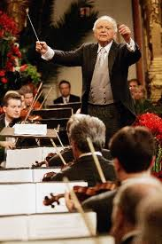
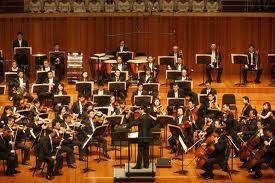

# ＜开阳＞乐章之间不能鼓掌（下）

**尽管如今复杂的仪式也是古典音乐吸引一些人的原因，但其负面效果足以抵消由此带来的好处。如果我的某个刚刚接触古典音乐的朋友询问我如何鼓掌，我能给的建议就是：你想什么时候鼓掌就什么时候鼓掌。**  

# **乐章之间不能鼓掌（下）**

## 文/翁子哲（中山大学）

**[乐章之间不能鼓掌（上）](/?p=17256)**

以上是关于“乐章间鼓掌”为何成为禁忌的一些猜测，大部分是Alex Rose的观点，小部分是我本人加上去的评论。从上面这五点可以看出，音乐本身形势与内容的发展（也即优秀作曲家对音乐表现能力的拓展），某些非常有影响力的作曲家和指挥家对音乐厅听众行为的改革，录音技术的发展以及古典音乐在社会总体中地位的变化构成了古典音乐礼仪的变化。

有没有其他原因呢？本人认为不同的古典音乐作品“耐听性”不同或许也是原因之一，在18、19世纪有一些作曲家如今已没多少人知晓，但在当年却是风靡一时的，比如萨列里、胡梅尔之类，他们的作品可能时代感更强或者他们本身天赋不足，所以他们的作品只能一时征服听众，而无法征服历史变迁。相反如今流传下来的伟大作品在首演时时常遭遇失败，但由于作品丰盛的内容和巧妙的构思却得以确保他们长盛不衰，征服不同时代的听众，即更为“耐听”。而这样内容丰盛构思巧妙的作品往往具有某种“内倾特质”，这种特质意味着听众受感触的程度更深，欣赏某些这样的作品时疯狂叫喊或者（过段的时候）鼓掌自然不是太合适，随着这种作品逐渐占据了音乐厅演出的主流，在音乐厅内听到某些乐章间鼓掌、大声叫喊或者丢番茄的机会自然越来越少。

18世纪到21世纪是人类历史上的另一个所谓“文化轴心时代”，古典音乐艺术身居其中自然也不能幸免。上面举这么多历史上乐章间鼓掌的例子以及分析它消失的原因无非是想说明古典音乐从来没有“乐章间不能鼓掌”这样的传统，它是一个现代的禁忌，它的出现也是有原因的，而且很大程度上是以一种马基雅维利式的方法被调整的，借用霍布斯鲍姆的说法：这样的“传统”是被“发明”出来的。现代的爱乐者不应该盲从这样的伪传统。

那么，讲了这么多废话，最重要的话题还是没有讨论。既然认为“乐章间不能鼓掌”的礼仪不合适，那乐章间要不要鼓掌呢？要怎么鼓掌？

我们先来听听一些指挥家的说法。

在网上搜索的时候发现一篇21世纪网的文章“乐章间，请勿鼓掌”（http://www.21cbh.com/HTML/2011-5-30/wNMDAwMDI0MTMwNw.html），里面振振有词地宣称艺术家对乐章间鼓掌非常反感。果真如此么？

不一定。皮埃尔-蒙特(Monteux)在1959年接受采访时说“我确实对许多国家的听众心怀抱怨，他们总是在一首交响曲或协奏曲的乐章之间不自然地抑制自己的鼓掌。我不知道这种习惯到底怎么来的，但它当然地不符合作曲家的本意”。埃里希-莱茵斯多夫(Leinsdorf)写道：“包裹在我们行为周围的是一种过时的风俗乃至矫揉造作，他们中的某些东西对于音乐中最愉快、最自然的享受是有害的。处于这些有害行为的列表的首位的，是那种不同意乐章间鼓掌的态度……它纯粹是毫无意义的！”

当然在现代音乐家中对此最为激进的莫过于阿图尔-鲁宾斯坦了，在1966年的一次采访中，鲁宾斯坦称“告诉人们在听到他们喜欢的东西时鼓掌是不文明”这种说法是“野蛮人的”(barbaric)。他将这种现象归结为美国人的自卑情结。有趣的是，就在这次采访见报一周后，当鲁宾斯坦在纽约演奏莫扎特钢协时，现场听众在第一乐章的开头给予了忠实的掌声，（或许是认为在此鼓掌不合适）鲁宾斯坦示意听众停止鼓掌。

对于那种认为乐章间鼓掌或者欢呼“打扰”了音乐家的说法，Rose甚至直言“我从未听说过哪个职业音乐家认为乐章间鼓掌破坏了他们的注意力”（当然也没这么绝对，可能有些音乐家不喜欢听众乐章间鼓掌，因为他们脑海里死记了“乐章间不能鼓掌”这个规矩，但不同乐曲确实需要不同考虑）。艾曼纽尔-艾克斯曾抱怨鼓掌的消失令他感到很不舒服。Rose还认为“作为一个听众，我不需要全然的静寂来帮助我理解音乐，对于音乐带来的冲击就更不用说了。恰恰相反，我发现这种沉闷呆板的肃静不仅是强迫的、令人不安的，甚至有时候就是反音乐的。想想三四千人在一起像举行某种佛教法会一般坐在卡内基音乐厅‘冥思’柴可夫斯基第一钢琴协奏曲，而不是一种令人振奋和热情的享受，这简直是疯狂的。”

古典音乐中某些作品确实容易造成所谓“错误的鼓掌”，比如前文中提到的柴可夫斯基第六交响曲“悲怆”，与此类似的还有贝多芬的第九小提琴奏鸣曲“克罗采”，柴科夫司机的洛可可变奏曲倒数第二个变奏等等，这些地方往往都是某一段或者华彩的，或者决定性的（引用上篇某个朋友的回复），或者辉煌的，或者“大吵大闹”（再次引用）的乐段的结束。Rose对于这种“错误鼓掌”的说法嗤之以鼻，称在这些“错误地方”鼓掌的人往往鼓掌对了地方。

为什么鼓掌对了地方？Rose认为，因为不仅作曲家如此处理作品就是有意让听众兴奋鼓掌起来的，而且在这些地方鼓掌往往是非常自然的（排除那些乐曲一停就鼓掌的条件反射以及我国“开会鼓掌”的传统），是听众热情的自然流露和自由表达，是听众跟随音乐内在的旨意的体现，相反在这地方不鼓掌才是一种自我抑制的做法。艾曼纽尔-艾克斯这位并不喜欢表现钢琴家曾在网上抱怨“我一直对这种现象感到困惑，一首协奏曲（像贝多芬或者勃拉姆斯那样的协奏曲）的第一乐章理应是兴奋地、充满热情的、华丽的，然而当这样的乐章结束时我听到的却是整理衣服的沙沙声和几声咳嗽，音乐那强大的力量本应给听众带来强烈的反应。”Rose接着表示“与其忍受那种明显毫无美感的、非音乐的咳嗽声、衣物整理声、低声讲话声——这些声音显然是因人们有意压迫他们的本能而发出的，我更愿意听到那些‘肤浅’的掌声”。

美国作曲家与评论家丹尼尔-梅森（Daniel Gregory Mason）在1931年的书《Tune In America》中调戏了当时斯托科夫斯基等人的反鼓掌实践，称禁止乐章间鼓掌的做法是一种“镇压的哲学”，他写道：

“这种带着一位复仇天神的镇压式的方法，它不仅剥夺了听众所有活跃的参与——这种参与本质上是有利于艺术本身的健康的，更剥夺了人们在注意力紧绷之后必要的精神上乃至肉体上的解脱。那种要求人们在一首长交响曲中呆坐着，没有任何对音乐的公开的回应的建议，比如斯托科夫斯基和其他一些指挥家现在开始要求的，等同于一种对艺术热情的阻止，这种做法对身体、神经和心智来说是极其劳累的。” 

另外一条反对乐章间鼓掌的理由是认为“一首曲子是一个整体”，从纯粹表述的角度来看，我认为这句话完全是废话。我也可以说我们今晚吃的这顿饭“是一个整体”，而里面的几盘菜和几杯酒是“整体的组成”部分，既然前提是“一顿饭”或者“一首曲子”，那声称它是一个“整体”不过是同义反复而已。我们也完全可以说“这道菜”或者“这个乐章”是一个独立的整体。事实上，一个乐章与另一个乐章在联系上的强与弱，某个乐章是否足以单独成为一个整体，在某种程度上是很主观的事情，听众完全可以根据自己的理解来决定是否鼓掌。当然这里不能忽视的一种情况就是上文提到的，当音乐发展到19世纪中后期时部分作品虽然仍然分出乐章，但由于从内容上看乐章之间确实构成了某种连续性，比如布鲁克纳、马勒、西贝柳斯的交响曲，在这种情况下，乐章间鼓掌确实不合适。

那么，难道应该鼓励人们在乐章间鼓掌么？答案还是否定的。我们这个时代的人容易走极端，当“乐章间不能鼓掌”这个神圣的戒律被打破，如果你鼓吹“大家一定要表现出全然的热情”或者干脆叫他们在乐章间鼓掌，我们可能将会看到越来越多不顾具体情况在乐章间胡乱鼓掌的现象。

这种现象在某些对“音乐会礼仪”要求比较少的场合已经出现了，比如Proms，某国外网友在Rose文章的评论栏抱怨说Proms里面那些听众简直就是在“刻意卖弄热情”。可以想见人们可能会把那种在流行音乐会或者足球比赛中表达兴奋的方式原样照搬进来，事实上这跟盲信乐章间不能鼓掌是一样的。在这个视觉媒介占据统治地位的世界，人们的想象力早已被视频和图像文化所造就的刻板印象所消灭了，提到“深沉”、“思考”和“高雅”的音乐，人们立即想到古典音乐，提到“放松”或“疯狂”，人们立即想到流行音乐，似乎在流行音乐中才能放松和疯狂，在古典音乐中才能高雅和思考。如果放任人们在音乐厅里欢庆，人们一定会想到那种新闻图片或电影教给他们的那种乱糟糟的庆祝场面。

另一条理由当然是，我们不应该认为所有作品在“表达情绪的方式”上需要统一对待，理论上，有些作品甚至在结束的时候完全不应鼓掌，比如宗教作品、上文提到的柴六末乐章等；有些作品也不适合在音乐结束后立即鼓掌或者喊什么bravo，等几秒钟后再鼓掌更加合适；而某些作品你在乐章间鼓掌则确实没问题。

在“乐章间是否应该鼓掌”乃至“如何合适地表达情绪”上，我们应该追求一种更加有弹性的规则，在理想的情况下，我们当然应该根据乐曲本身的形式和内容来决定是否鼓掌。但对我来说，翻译Rose的博文以及弄出这样一篇东西的目的绝对不是为了订立什么新的规矩，完全没有必要，因为新的规则一旦确立很快也会成为模仿和盲信的对象，最终变成教条。而阻碍人们感受古典音乐之美，破坏古典音乐影响力的一个重要因素正是因为欣赏古典音乐的教条太多了。由于不懂教条听音乐会被嘘而被迫离场甚至从此远离古典音乐的人想必不少了，尽管如今复杂的仪式也是古典音乐吸引一些人的原因，但其负面效果足以抵消由此带来的好处。如果我的某个刚刚接触古典音乐的朋友询问我如何鼓掌，我能给的建议就是：你想什么时候鼓掌就什么时候鼓掌。

奥巴马09年秋天曾在白宫举行过一场古典音乐晚会，音乐会开始前奥巴马做了个简短的演讲，我就干脆不翻译了，大家就着英文看效果更好：

“Now, if any of you in the audience are newcomers to classical music, and aren't sure when to applaud, don't be nervous. Apparently, President Kennedy had the same problem. He and Jackie held several classical music events here, and more than once he started applauding when he wasn't supposed to. So the social secretary worked out a system where she'd signal him through a crack in the door. Now, fortunately, I have Michelle to tell me when to applaud. The rest of you are on your own.”

**“The rest of you are on your own.” **

这就是我想说的。

 

（采编：应鹏华；责编：麦静）

 
