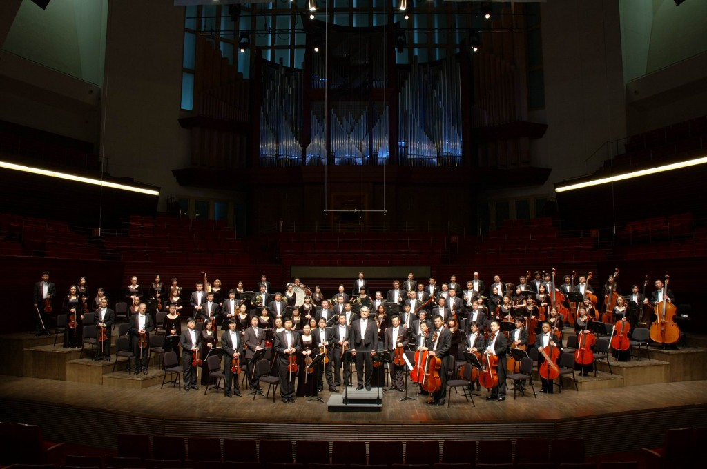
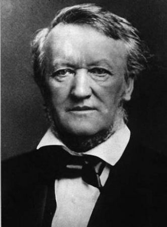
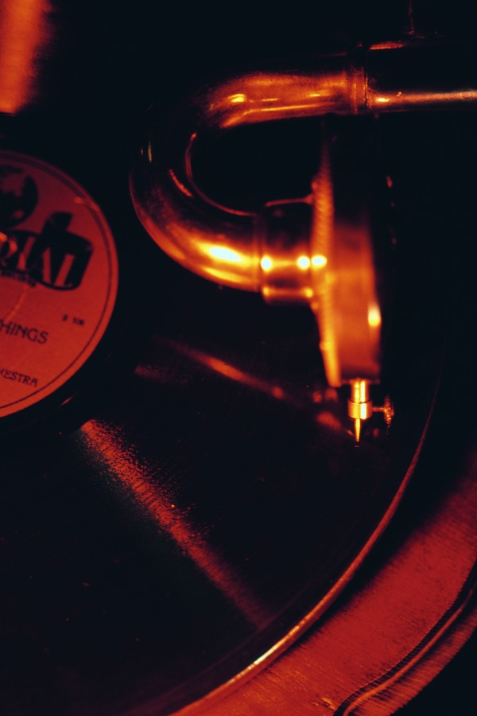
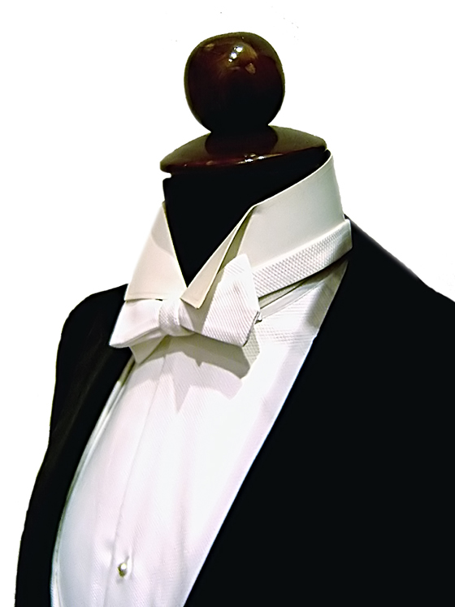

# ＜开阳＞乐章之间不能鼓掌？（上）

**了解传统的一个有效途径是“系谱学”的方式，即了解一个在如今看来已经不言自明或者毋庸置疑的道德是如何产生的。要了解道德在大众心理中的地位，它在伦理学学理上如何发展并不重要，重要的是它如何从一种偶然的行为变成一种伦理。探究的结果自然让我十分意外——所谓“乐章间不能鼓掌”铁律，与其说是一个“传统”，还不如说是一个现代的事物。** 

# 乐章之间不能鼓掌？（上）

## 文/翁子哲（中山大学）

 

作为一个普通的不能再普通的古典音乐爱好者，在国内听音乐会最大的担忧是混乱的音乐厅环境，这个担忧更甚于表现差强人意的乐团。乐团水平不高或许情有可原，混乱的场内秩序则难以忍受，而在其中，曾经最令我感到失望的莫过于乐章间鼓掌了。

“乐章间不能鼓掌”已经很成为聆听古典音乐的“基础知识”，许多即便是没听过几场古典音乐会的人也能告诉我乐章间不要鼓掌，而以示对“音乐会礼仪”的通晓。尽管本人从小学习乐器并且迷上古典音乐，但第一次听说乐章间不能鼓掌也要等到高中阶段了。自然，从那时起我就牢记此金规玉律于胸，从未在乐章间合并我的手掌，并且在看到其他人鼓掌的时候感觉十分不自在，盯着人家不放。

乐章间不能鼓掌已经成为无字的律法，音乐素养的象征，古典音乐摩西十诫之首。一个在音乐厅窃窃私语的听众，如果乐章间没有鼓掌，至多被视为“不守规矩”；但一个没有在音乐厅窃窃私语，却在乐章间鼓掌的听众，就会被视为“不懂规矩”了，如果说前者是放荡不羁，那么后者就是无知透顶。

但在最近几场音乐会后，我自己内心那种“自发的对乐章间鼓掌者的鄙视”严重到了让我自己都感到可疑的地步。在没有理解这个规则的情况下，我便把它背记下来了，这意味着我接受这一规则的时候未曾思考过它的必要性。于是最近我决心探究一下“乐章间不可鼓掌法则”是否如此神圣而不可侵犯。

了解传统的一个有效途径是“系谱学”的方式，即了解一个在如今看来已经不言自明或者毋庸置疑的道德是如何产生的。要了解道德在大众心理中的地位，它在伦理学学理上如何发展并不重要，重要的是它如何从一种偶然的行为变成一种伦理。探究的结果自然让我十分意外——所谓“乐章间不能鼓掌”铁律，与其说是一个“传统”，还不如说是一个现代的事物。

几乎可以确定的是，至少直到19世纪中期之前根本没有“乐章间不能鼓掌”这个说法，与此相反，在那个时候，乐章间鼓掌、大喊大叫、要求作曲家出来谢幕等等都是非常常见的事情。启蒙时代乐团（Orchestra of the Age of Enlightenment）的古乐长笛演奏专家乔治-布朗尼称在18世纪和19世纪，不仅乐章间鼓掌是家常便饭，乐章间还可能干其他事情——例如在海顿和贝多芬的一些作品的首演上，经常是先演奏曲子的前两个乐章，然后停下来演一些芭蕾舞或者唱几首歌，然后再接着把曲子完成，现场观众对此不仅十分淡定，而且习以为常，在绝对的沉默中听完作品是不可想象的。

事实上，18-19世纪的作曲家对于听众表露对作品的喜爱是非常欢迎的，对于现在看来非常“无素养”的乐章间鼓掌行为，音乐家是非常期待的。

最著名的例子莫过于莫扎特在“巴黎交响曲”首演后给他老爸写的信，在信里面，莫扎特写道：

 “在第一乐章快板中间有那么一段，我知道听众会很喜欢。……果然如此，听众们全都陷入了狂喜之中，掌声非常的热烈。这个我早就预想到了，在我创作这一段的时候，我就知道这一段效果会很好。在乐章结尾的时候我让这一段音乐再次出现，果不其然，听众再次大喊大叫起来，要求重复一遍（Da Capo）。行板乐章同样反映良好，但终乐章让人感觉尤佳。早前风传我的第三乐章会和第一乐章一样以一个齐奏开始，于是我把前八个小节处理成只有两把小提琴在演奏，然后再引入一个齐奏的强音。由于略显安静的开头，听众们互相提示保持安静——正如同我预料的一样——然后齐奏突然出现，掌声又一次响起。我真的高兴坏了，交响曲结束后我自己跑去了皇家花园，给自己买了一只冰淇淋，对着我的念珠祈祷，然后回家。”（罗伯特-施帕特林：“莫扎特的书信”——《莫扎特的生活》p160）  **[【莫扎特第31交响曲“巴黎”第一乐章】](http://www.tudou.com/programs/view/OQdAEUMUBAg/?fr=1)** **http://www.tudou.com/programs/view/OQdAEUMUBAg/?fr=1** 

从莫扎特的信中可以看出，鼓掌不仅仅出现在乐章与乐章中间，它甚至就出现在乐章中间，只要听众觉得这一段很精彩，他们就可以鼓掌，甚至大喊大叫，要求音乐家再来一遍，你能想象这样的场景发生在今天吗？

艾曼纽尔-艾克斯(Emanuel Ax)曾在自己的博客中写道：“毫无疑问，像贝多芬那样的作曲家在创作交响曲或者协奏曲时，他自己能够想见如果乐章能在一片华彩中结束，听众必定会立即站立起来并让作曲家（演奏者）知道他们已经被征服了。”

受到同样待遇的自然不止是莫扎特、海顿或者贝多芬。对于出色的作曲家，乐章间甚至乐章中的掌声是对他们优秀作品的肯定，“肖邦当年与乐队一起演奏他的变奏曲《把你的小手给我》时，听众在每一个变奏之间鼓掌。当晚年的李斯特坐在听众席里，听安东•鲁宾斯坦演奏莫扎特《a小调回旋曲》时，他会在乐曲中间大声叫好。彪罗曾经告诉他的学生，当他演奏贝多芬的《皇帝协奏曲》开头的华彩段时，通常就会获得满堂彩声。”（朱贤杰：“乐章间能否鼓掌”），在当时，乐章间甚至乐曲中鼓掌乃是“懂音乐”的表现（当然，只是对于某些曲子而言，这个下文再作分析），相反，鼓掌并没有出现在乐章中间时，往往意味者作品不成功。

勃拉姆斯曾回忆他第一钢琴协奏曲那失败的首演，因为乐章间未能听到掌声而感到非常失落，“第一乐章和第二乐章听众没有任何情感表示，乐曲结束时只有三个人鼓掌，而当他们鼓掌时周围人都在嘘他们。”有数不胜数的证据可以证明掌声会出现在华彩段之后、乐章中或乐章间，听众可以要求某个乐章“再来一遍”，他们甚至可以当场表露赞同或者不赞同某个作品。

奥西普-加甫里洛维奇在1920年曾举证说“在那些南欧国家，当听众听到自己喜欢的演奏时他们会喊出来，而当他们听到令他们不爽的演奏时，他们会当场嘘演奏者，甚至丢番茄。”

正如《纽约客》专栏作家Alex Rose所言，19世纪是一个在音乐礼仪不断变化的时代，“乐章间鼓掌”作为音乐会的传统习俗开始受到一系列挑战，下文会提到这个问题。但大体而言，乐章间鼓掌直到20世纪40年代都不是一个被“严禁”的情况，相反，它非常常见。

Alex Rose2010年在伦敦皇家爱乐协会的[一场演讲](http://www.guardian.co.uk/music/2010/mar/08/classical-music-applause-rule-obama)中提到，当勃拉姆斯第四交响曲在1897年维也纳演出的时候，“每个乐章的结尾都爆发出难以置信的掌声”，在埃尔加第一交响曲1908年的伦敦首演中，当第一乐章结束后，现场观众持续不断的欢呼使得作曲家不得不现身好几次。

布鲁诺-瓦尔特1938年一月在维也纳指挥了马勒第九交响曲，这次著名的演出两个月后，希特勒吞并奥地利，瓦尔特不得不远走美国。Rose指出，当时的现场录音师Fred Gaisberg提到，在那场演出中，现场观众在每一个乐章后都鼓掌了，当这场音乐会被灌录成唱片时，录音师把掌声给去掉了。

（关于瓦尔特的马九，喜欢马勒的童鞋都应该知道这个版本了，市面上容易找到的当然是EMI那个版本，关于Gaisberg讨论录音细节的内容，则可见于Dutton版CD的小册子里，碟？http://www.amazon.com/Walter-Conducts-Mahler-Gustav/dp/B00005B0HM/ref=sr_1_6?ie=UTF8&qid=1315891780&sr=8-6 ）

在另一篇文章中，Rose还提到在1954年斯皮瓦科夫斯基的巴托克第二小提琴协奏曲录音（蒙特指挥波士顿交响乐团）中，第一乐章结束时也可以听到热烈的掌声，而第二乐章结束时则没有。

综上可知，“乐章间不能鼓掌”并非什么古典音乐的传统，“乐章间可以鼓掌”似乎更像传统一些。既然在1938年的演出中乐章间鼓掌仍然被允许（而且是在马勒的作品里），那么“乐章间不能鼓掌”的禁令成为所谓音乐会的“普适礼仪”至多也不过是五六十年的事情。而这五六十年已经不再是古典音乐的繁华盛世了。

但不可否认的现实是，不仅在国内而且在国外，在像我这样的爱乐者出生的年代，“乐章间不能鼓掌”的禁令已经司空见惯了，大多数听众都接受了这样的“礼仪”。所以问题是，为什么会这样？为什么在短时间内，原本稀疏平常的乐章间鼓掌迅速消亡，乃至成为涉及所谓音乐素养的禁忌？

Alex Rose在他的演讲中提到了乐章间鼓掌成为禁令的几个主因，本人归纳如下：第一个是古典音乐本身的发展与变化，第二个是瓦格纳式音乐的出现，第三个是某些指挥家的实践，第四个是录音技术的发展及其对聆听习惯的影响，第五个则是古典音乐社会角色的变化。

#### 一、古典音乐的发展和变化

Alex Rose指出，乐章间鼓掌的变化在19世纪中期始露端倪，而最早的践行者则是贝多芬。在19世纪，作曲家开始对作品的形式和内涵进行更深入更广泛的开拓，延展了音乐的连续性和内在意蕴，力图描绘出一副不断变化的音乐图景，力图表达更为宽广的情感。随着更多个人情感在音乐中的注入，狂热、沉思等情绪开始不仅表露在旋律中而且表现在音乐的形式上，与18世纪主要的幕式的，娱乐消遣式作品不同，19世纪的作品开始呈现出更大的整体性、深沉性、自身完美性，听众开始被要求在音乐的演奏过程中保持肃静以确保音乐的美能在音乐中自我生发出来。

为了达到深刻的效果，贝多芬在第九交响曲的开始前要求绝对的肃静，此外，在第五交响曲和第六交响曲中贝多芬首次尝试了“不间断地演奏两个乐章”的做法。这个做法很快被其他作曲家所效仿，比如舒伯特（流浪者幻想曲），门德尔松（第三交响曲、小提琴协奏曲），舒曼（第一第四交响曲、钢琴协奏曲、大提琴协奏曲）等。在弗洛雷斯坦（舒曼幻想中的大卫同盟成员，出现在“狂欢节”和“大卫同盟舞曲中”）形象的掩饰下，舒曼嘲讽当时的听众说“你们应该像个石佛一样坐着”。

除了舒曼的嘲讽，在这个阶段，音乐家尚未公开地、直接地要求听众在乐章间不能鼓掌或保持肃静，相反，作曲家通过取消乐章间的停顿来实现音乐的整体性，这或许可以说明在那个时代乐章间鼓掌被视为某种整体性的完结，因而允许听众在乐章间就开始表露情绪。（对于所谓“音乐的整体性”这个说法，本人认为这相当bullshit，下文再分析。）

#### 二、瓦格纳

瓦格纳被认为在鼓掌禁令的发展史中扮演了至关重要的角色。瓦格纳以制造剧场效果而闻名，以至于将戏剧效果、舞台和场景凌驾于音乐之上，甚至凌驾在听众之上。尼采曾在《瓦格纳事件》中称瓦格纳是有史以来最伟大的戏子，“瓦格纳从来不是作为音乐家，从某种音乐家的良知出发考虑问题。他追求效果，除了效果别无所求”，称比才把观众当做聪明人，当做音乐家，而瓦格纳则是“最无礼的天才“，总是意图强迫观众。

瓦格纳在1882年基督教色彩浓厚的《帕西法尔》（尼采曾嘲讽“《帕西法尔》应作为神学的候补教材”并且这种教材“对于白痴来说必不可少”）的拜罗伊特首演中要求现在观众保持某种程度的静默。柯西玛在她的日记中提到，瓦格纳要求现场观众不要在第二幕结束后喊演员或者音乐家出来谢幕（Curtain Call），以免破坏音乐带来的感受，结果观众误以为他们连鼓掌都不行，因此当第二幕结束后全场一片肃静，弄得瓦格纳也很不自在，说“现在我就不明白了，听众到底喜不喜欢这作品呢？”于是瓦格纳再次现身说现在鼓掌是合适的，谁料此时观众不仅热烈鼓掌，curtain call也再次出现，以至于瓦格纳不得不解释说演员正在换衣服没办法出来。尴尬的局面延续到第二次演出，柯西玛写道：“第一幕结束后全场一片虔诚的静寂，这很好，但第二幕结束后鼓掌者再次被嘘，情况越发令人尴尬了”，两周以后瓦格纳偷偷溜进包厢里聆听Flower Maidens唱段，当唱段结束后，瓦格纳自己按耐不住大喊Bravo结果被嘘。Rose嘲讽式地认为“瓦格纳主义者把事情弄得比瓦格纳自己还要严肃了。”

#### 三、指挥家

Rose提到在19世纪与20世纪之交，音乐会演出方式的变革成为德国音乐界谈论的主题，提出了诸如“乐团要躲在幕布后面演奏”，“音乐会需要在受节制的灯光中演奏”，以及在每部作品结束前不能鼓掌之类的建议，而这些建议大部分都来源于当时拥有极大影响力的瓦格纳主义精神，比如神圣的剧场氛围、“拜罗伊特静默”以及将管弦乐团沉降到乐池里面等等做法。

著名指挥家阿本德罗特在1905年开始要求吕贝克的听众们不要在一部交响曲的乐章间鼓掌。阿本德罗特本人是一个十足的布鲁克纳的拥戴者，而布鲁克纳本人则是一个狂热的瓦格纳主义者。当时音乐会改革的另外两位鼓吹者保罗-马尔索普和保罗-埃勒尔同样要求“布鲁克纳化”。埃勒尔现在已经因攻击古斯塔夫-马勒而被认为是一个出名的反犹主义者，当时他设想要“建设一个交响音乐的圣殿”。

隐藏起来的乐团这样的建议自然由于过于离谱而没有被执行，但鼓掌禁令则慢慢地固定下来。Rose举证1910年的大不列颠百科全书曾印有如下文字“教堂里禁止鼓掌的虔诚的气氛已经散布到歌剧院和音乐厅中，主要是受瓦格纳在拜罗伊特的那种准宗教氛围的影响”。在1920年代，数位当时的首席指挥——托斯卡尼尼、克伦配勒、斯托科夫斯基和富特文格勒开始逐渐主张排斥乐章间鼓掌的行为，尽管这样的举措在当时受到了很大的抵制。1938年库赛维茨基因为听众在柴可夫斯基第六交响曲“悲怆”的第三乐章结束后鼓掌而做出“不要鼓掌”的手势，当时泰晤士报的首席评论员奥林-唐斯尖锐地指出这是“反音乐”“势利”的作为。

应该说在19世纪末20世纪初“乐章间是否应该鼓掌”曾是一个大众辩论的话题，尤其是在德奥，比如马勒甚至曾经雇佣侦探来对付那些胡乱鼓掌的听众（尽管如此他却并不反对听众在他自己创作的交响曲乐章间鼓掌，马勒第三交响曲的首演乐章间就有鼓掌，其中一位鼓掌者是马勒的好友作曲家理查-施特劳斯）。但在上面提到的诸位指挥家中，在鼓掌禁令中走的最远的当属斯托科夫斯基，据说他曾邀请百位妇女开会讨论鼓掌事宜，并就乐章间是否鼓掌举行投票，结果“同意鼓掌”以压倒性多数击败“禁止鼓掌”，还曾尝试诸如将音乐厅的灯光全部关掉，然后再指挥家的脚底下安装个巨大的探照灯，当演出开始后音乐厅的天花板就会出现他那双巨大的手（蛋疼）之类，花样之多让人目不暇接，具体可见Rose的博文http://www.therestisnoise.com/2005/02/applause_a_rest.html，本人就不详述了（再扯个蛋，四乐章的柴可夫斯基第六交响曲“悲怆”或许是所有古典音乐作品中最容易出现“错误鼓掌”的曲目，“错误的掌声”一般出现在第三乐章结束后，事实上本人认为在此鼓掌是完全合理的，能营造更加强烈的戏剧效果，相反，在气氛悲惨的第四乐章结束后鼓掌才是大煞风景，听众应在演出结束后沉默地离开。此处抓个现行，伯恩斯坦指挥柴六，注意看视频，第三乐章演出过程中伯恩斯坦的肢体语言给人感觉好像全曲要演完了，第三乐章结束后果然全场鼓掌，摄像机也转向观众了，伯恩斯坦等到掌声熄灭后才开始第四乐章，而且这段掌声没有被cut掉，这或许可以证明在这场演出中伯恩斯坦、听众、以及录像师出版商都认为这里的鼓掌是合适的。）

 **[【伯恩斯坦版柴六】](http://v.youku.com/v_show/id_XMjk4OTcyNzUy.html)** **http://v.youku.com/v_show/id_XMjk4OTcyNzUy.html** **[【附赠稀疏鼓掌版之马里斯－杨森斯】](http://v.youku.com/v_show/id_XODYyNDU0NTY=.html)** **http://v.youku.com/v_show/id_XODYyNDU0NTY=.html** **[【再附赠鼓掌被嘘版之特米尔卡诺夫版】](http://v.youku.com/v_show/id_XMjk5MDQ2MzAw.html)** **http://v.youku.com/v_show/id_XMjk5MDQ2MzAw.html** 

#### 四、录音技术

Alex Rose在他的演讲中还提到了录音技术的产生与发展与“乐章间鼓掌”的习俗逐渐消失乃至成为禁令的关系。

这倒不是说为了制作唱片，演出商可能会更倾向于“乐章间不要鼓掌”的做法，已避免使用剪切技术，以达到避免破坏音乐及节省成本的做法。这或许是录音技术造成乐章间鼓掌消逝的原因之一。但更重要的则是，录音技术的出现极大地改变了人们聆听音乐的习惯。

Rose认为录音技术的诞生和普及形成了一种新的聆听古典音乐的方式——在家听音乐。通过无线电或者留声机聆听音乐，人们在无意中已经逐渐适应了乐章间的一片沉寂，这或许能说明为何对于压制乐章间掌声的抵触会在20世纪30-40年代迅速消亡。

不仅如此，Rose说，他察觉到在20世纪的时代变迁中，古典音乐会已经不再那么具有一种集体性的精神了，其社会性也逐渐消失。也就是说，那种音乐厅内全体听众之间本可以感受到的“同时存在感”逐渐弱化，听众之间的互动，听众与作曲家、演奏家的互动也逐渐减少，取而代之的是，人们现在尽管仍然聚集在一起聆听音乐会，他们感受到的却是一种本质上更加孤独的、内化的体验。过去音乐会中听众被音乐之流不断冲击，乃至哭泣出声或手舞足蹈的历史一去不复返了，现在的听众看起来似乎只是被音乐之流轻轻掠过。

事实上我认为录音技术的出现和发展对音乐聆听方式的影响绝对不可小视。即便是在古典音乐领域，我们也不能忘记米歇尔-麦克卢汉那个著名的“媒介即信息”的论断。

在现场听音乐与听唱片自然具有巨大的差别，在19世纪末到20世纪早期，这种差别可不仅仅是当代人所认为的现场感那么简单。音乐厅和留声机本身就是两种截然不同的媒介，在截然不同的背景环境中被使用。在录音技术尚未诞生的年代，聆听古典音乐作品的基本上唯一的方式是在音乐厅（或者剧场等）聆听，在音乐厅聆听音乐是一种多人同时聆听的形式，对于普罗大众而言，这是当时他们唯一的聆听场合，他们关于古典音乐的一切经验都产生于此，他们对于音乐作品，以及音乐作品的感受方式的所有印象的背景可能都是一个略显吵闹的音乐厅；对作曲家而言，如上半篇文章中艾克斯所讲，也必然对自己的作品将在音乐厅被演出这种形式有所预想（比如莫扎特评论巴黎交响曲那封信），可以预想到作品需要在音乐厅直面听众的评判，可能将会受到欢呼，自己可能会被兴奋的听众要求出场现身，当然也可能遭遇嘘声或者番茄，因此作曲家极有可能刻意制作出足以让听众兴奋不已的音乐。

说这么多的意思当然是，聆听环境——即音乐厅，不仅在听众聆听音乐的经验（以及由此形成的记忆和其他成见）中扮演了至关重要的角色，聆听环境也间接地影响着音乐创作本身。音乐厅作为当时几乎唯一的媒介是具有某种能动作用的，它间接地影响到了古典音乐艺术在当时听众的世界观中的地位，在当时的听众心目中，或许音乐厅中的各种鼓掌、叫喊乃至骚动都是可以预想的，它们和音乐一起构成了不可分割的整体，群体欢愉的场面早已建立到听众的经验中，在这样的场面中欣赏音乐是理所当然的。

听无线电、留声机乃至CD则完全是另一种体验。随着录音技术的发展人们逐渐习惯了在家中独自聆听音乐，这意味着音乐厅中常见的背景——熟悉的群众、眼皮底下活生生的演奏家、等待着接受赞美的作曲家——统统消失，个体独自面对音乐。在这种仅有个体和音乐的环境中，一种内省式的体验方式逐渐建立起来，显然在这种环境中，音乐中那种深沉的情绪和隐秘的变化能够更容易的被体验出来（这或许也不是坏事），或者用一种略微有些激进的说法——被发现出来，这种被发现出来的体验有可能甚至超过了作曲家的预想。留声机时代古典音乐艺术已经走向了它的黄昏，大部分作曲家在这个时候已经不在人世，他们自然不可能预料到有一天人类会对着一个喇叭和音箱欣赏他们的作品。

这种聆听方式已不复当年聆听现场音乐会那种栩栩如生的感觉了。音乐厅欣赏中必不可少的组成要素如活生生的乐团之类被从聆听的场景中驱逐出去，取而代之的是一种“客观”的音乐，如果说音乐厅时代欣赏方式有点像如今的流行音乐会（我不是暗示古典音乐是19世纪的现代流行音乐，由于作品本身的缘故两者带来的体验仍相去甚远），那么自留声机时代后欣赏古典音乐的方式就有点像参观博物馆。我认为即便是同一首曲子，在音乐厅或在留声机中它可能呈现为两部不同的作品。

随着录音技术发展到黑胶唱片、录音带或者CD的时代，在家聆听或者独自聆听这种更为方便、更为廉价的当时逐渐取代了音乐厅的聆听方式，其结果正如Rose所言，古典音乐逐渐变成一种完全内向的音乐，变成一种用来“细细品味”的音乐，变成一种精美的雕刻作品，，音乐的内在世界进一步得到扩展而它那种富于表现的外观和引起众人欢腾的效果逐渐散去。

当人们习惯了这样的体验再回到音乐厅时，如何还能释放出应有的激情呢？如何还能接受吵闹的环境，如何能接受乐章间乃至乐章中可能爆发出来的掌声呢？18、19世纪那种音乐所生存的图景已经不复见于他们的脑海中了。

#### 五、古典音乐社会角色的变化

Rose在分析歌剧院文化与音乐厅文化在20世纪早期出现差异时指出，约莫在1900年，音乐厅这种欣赏方式逐渐背上了某种社会负担，他指出这种情况主要出现在美国。“尤其是在美利坚，上层阶级和中产阶级的成员拥抱交响音乐，将其视为在一个商业社会中对抗通俗文化的‘伪欧罗巴’式的堡垒”。他描绘道，当时歌剧受到的待遇大相径庭，被视为一种主要是轻浮的艺术（真是有趣，我们可以想想“歌剧”在当代人中的刻板印象），这种印象因为当时的著名男高音歌剧演员恩里科-卡鲁索在纽约中央公园大搞恶作剧并登上报纸头条而越加强烈。“管弦乐团逐渐成为上流社会的荣耀与尊严，以及上流社会的慷慨赠予的最大受益者……面对流行艺术的步步紧逼，音乐厅被重塑为一个避难所，一个远离乌合之众的山谷，鼓掌的消逝可能是这一系列变化的标志之一。”

那种听众自由表达情绪（比如合理情况下的乐章间鼓掌或欢呼）的氛围的消失可能是古典音乐艺术失去地位的原因之一。它的互动性大为减少了。随着上流社会文化对古典艺术话语权的占领，以及上面提到的新的聆听方式的出现，古典音乐逐渐发展成为一种类似于博物馆或者画展那样的艺术形式。作曲家那种源自于生命本能、命运流变和情感冲动的创造逐渐消隐，取而代之的是高高在上的指挥家和演奏家，正如《谁杀了古典音乐》的作者莱布雷希特所言，作曲家消失了，取而代之的是神圣不可侵犯的指挥家和演员，他们成为了古典音乐的核心人物，受膜拜的对象，在这样的氛围里，再在音乐会现场疯狂鼓掌、大喊大叫乃至攻击那些不称职的艺术家已经不合时宜了。

古典音乐的命运和人类其他古典艺术的命运是相似的。过去活生生的创造物，如今被隔着一层玻璃置放于博物馆和画廊中供人欣赏。正如曾经生活着的领袖被置于水晶宫内，他们过去如何栩栩如生般存在已经不重要了，生命体征消失了，他们死去的躯壳成为我们膜拜的对象。博物馆里评论家成为核心，音乐厅里演奏者成为瞩目的焦点，我想在音乐厅里大概也没多少人会想念一下作曲家了，我也不会。古典音乐逐渐成为一个专业技术，被众多专业术语所包围，不晓得运用专业术语的爱乐者被驱逐出古典音乐的话语圈，古典音乐的解释成为一种权威，继而变成一种权力，音乐会成为一种仪式，每一次演出都成为评论家和业余评论家展现其渊博知识的对象，音乐的美学特质本身无足轻重了。

当音乐逐渐失去感染人心的力量，逐渐拒斥入门者，它就越发变成一种要式行为，音乐美学已经难以支撑起它“高雅”的地位（它本来就不是为这样的地位而设计的），剩下的办法不过就是扶起那些本来有争议的，可能有害的礼仪，并让它们成为教条。

 （未完待续）  

（采编：应鹏华；责编：麦静）

 
