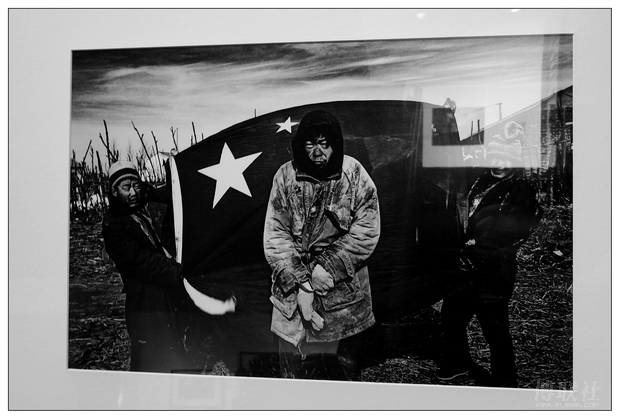

# ＜开阳＞乡村与政权博弈的双败

**在乡村和政权的博弈中，虽然两者都从自己的利益出发进行决策和行动，但两者都已失败：乡村失去原有的文化传统和权力结构保护，村民的生存被赋税、土豪和贪腐的榨取威胁；政府的每笔税收都伴随着它难以控制的经纪机构的扩大，政权内卷化出现，虽然政府的财政收入在增加，但经纪机构已经附着到整个体制上，使政权的合法性开始流失。乡村和政权的平衡被打破，双重失败导向混乱和革命。**

 

# 乡村与政权博弈的双败

# ——读《文化，权力与国家》

## 文/郑勉（中山大学）

 

#### 一 前言

杜赞奇的《文化、权力与国家》研究重心是“国家政权扩张对华北农村社会权力结构的影响”，时间跨度从二十世纪初的清末新政到二十世纪四五十年代。

杜赞奇主要使用南满铁道株式会社调查部所编《中国惯行调查报告》、南开大学经济研究所的社会调查材料，以及其他学者的研究成果，以个案研读的方式对华北六个村庄进行详尽的分析。他分析的特点并不在于描述和重现，而在于透过他的几个核心的理论去剖析资料中体现出的，政权与乡村博弈中的形势与趋势，以解读社会史的方法，为深化对此后中国社会发展的理解作铺垫。

可以说，这本书涉及到的主题是丰富而略显杂乱的，有政权的建设，水利组织、税收和摊款，乡村政治中的宗族、乡村宗教，与统治法统的关系，乡村精英，政权现代化等等主题。作者将这些主题纳入由几个核心概念组成的分析框架中，使它们相互联系，共同支持作者的分析。这些核心概念是：权力的文化网络、经纪统治模型、国家政权内卷化。

#### 二 核心概念

在这里对涉及到这几个核心概念的叙述做一个摘录和梳理。

**1. 权力的文化网络**

权力的各种因素（亦可称之为关系）存在于宗教、政治、经济、宗族甚至亲朋等社会生活的各个领域、关系之中。“权力的文化网络”包括不断相互交错影响作用的等级组织和非正式关联网。诸如市场、宗族、宗教和水利控制的等级组织以及诸如庇护人与被庇护者、亲戚朋友间的相互关联，构成了施展权力和权威的基础。“文化”一词是指扎根于这些组织中、为组织成员所认同的象征和规范（symbols and norms）。文化网络中出任乡村领袖，是出于提高社会地位、威望、荣耀并向大众负责的考虑，而并不是为追求物质利益。不仅地方政权，而且中央政府都严重依赖文化网络，从而在华北乡村中建立自己的权威。（本书P3）

文化网络是地方社会中获取权威和其他利益的源泉，也正是在文化网络之中，各种政治因素相互竞争，领导体系得以形成。文化网络由乡村社会中各种组织体系以及塑造权力运作的各种规范构成，它包括在宗族、市场等方面形成的等级组织或巢状组织类型，（庙会、水会、商会）。文化网络还包括非正式的人际关系网，如血缘关系、庇护者与被庇护人，传教者和信徒等关系。这些组织既可以是封闭的，也可以是开放的；既可以是单一目的的，也可以是功能复杂的。包容十分广泛。（本书P11）

杜赞奇使用文化网络分析了几个例子，包括婚姻圈、水利管理组织与祭祀仪式。这个概念吸纳了人类学的方法，真正地将权力的运作放进了具体的人际组织和网络中的分析，并且指明了在权力的运作中需要文化规范，并且中央政权的权威是通过这一网络与乡村结合起来的。比如作者写到：国家最重要的职能便体现在一系列的“合法化”程序上：掌握官衔与名誉的封赠，代表全民举行最高层次的祭礼仪式，将自己的文化霸权加之于通俗象征之上（如关帝）。对乡村大众来说，文化网络中的国家政权正是通过这些途径体现出来的。

文化网络强调的是对组织系统中权力赖以生存的文化及合法性的分析。它不只是角逐权力的场所，也不只是接近各种资本的工具，它还是正统和权威产生、表现及再生的发源地。（本书P24）

可见，通过权力的文化网络这个概念，已经可以把许多乡村社会的组织结构以及乡村活动的现象纳入一个统一的范畴中进行分析，这个范畴对于整体上把握那个时代的华北农村社会是很有力度的。

**2. 经纪统治模型**

清朝鼎盛时期控制下层社会的主要工具是治安用的保甲制和征赋用的里甲制。到了19世纪末期，它们已经名存实亡，清政府通过双重经纪来征收赋税并实现其主要的统治职能。“经纪”是交易中一方的代理人，他常常收取一定的佣金。国家经纪（State brokerage）为赢利型经纪（多为掠夺型经纪），另一种是保护型经纪，村社自愿组织起来负责征收赋税并完成国家指派的其他任务。清政府从明朝继承过来的田赋征收中两个弊端：其一是纳税人偷税漏税，其二是征税人贪污中饱。（本书P30）

清朝官僚机构对下层吏役缺乏控制能力，因为它无法控制这些吏役们的收入，但依旧要靠他们来维持税收。因此清朝官僚机构实际上允许吏役在收税规程中将浮动部分攫为己有。因此此类经纪为了自身利益开始想方设法扩大自己的收入，对农村经济进行掠夺。

与此同时，为了完成某些义务（否则要由吏役等赢利型经纪来完成），或有效地与国家政权及其代理人打交道，数个村庄自愿或由同家政权指令结成一集体组织，这些组织往往承担起经纪的角色，但其目的不是为了赢利，而是保护社区利益。（本书P35）

盈利性经纪并不能被容纳在正统的文化网络中，而保护型经纪则在内，然而保护型经济是这个网络中的易变因素，它代表着合法与非法之间的倾斜关系。

杜赞奇认为这个经纪模型真实地反映了乡村统治结构的本质，比通常认定的“乡绅模型”更为准确。

这个模型中对“盈利型”和“保护型”的区分，反映出了乡村利益和政权利益的冲突，这种冲突同时也体现在文化网络中对权威的认定和争夺上。这样，通过对权力的文化网络进行分析，就能够分辨出乡村和政权利益的所在。

**3. 国家政权内卷化**

中国国家权力的扩张有自身特点，即国家财政收入的增加与地方无政府状态是同时发生的，即国家对乡村社会的控制能力低于其对乡村社会的榨取能力。“内卷化”是指一种社会或文化模式在某一发展阶段达到一种确定的形式后，便停滞不前或无法转化为另一种高级模式的现象。国家政权内卷化是指国家机构不是靠提高旧有或新增（此处指人际或其他行政资源）机构的效益，而是靠复制或扩大旧有的国家与社会关系——如中国旧有的赢利型经纪体制——来扩大其行政职能。在国家力图加强对社会控制的过程中，不同利益集团的压力和冲突是造成内卷化的主要原因。（本书P51）

在市场规律和国家政权皆未能完全左右经济关系的乡村社会，农民及其家庭往往依赖地方强人，或者称保护人来实现契约来在交易中求得平等待遇并免遭贪官污吏的敲诈勒索。

随着国家政权的步步进逼，乡村领袖与国家政权建设的目标不再一致，而且差距越来越大。这种权威危机造成了政治真空，而惟一趁此机会钻入政治舞台的则是从前赢利型国家经纪一类的人。对大众来讲，宗教生活比行政职务、警察机制和新式学校（上学的大多是精英们的子女）更为迫切和重要，新生领导机构并不是全心全意为乡村谋划利益，反而带来麻烦和损失，不过，最使村民难以忍受的是各级政权机构的重重摊款，它们不断地向村庄榨取，却从未给乡村带回什么“现代化”的好处。（本书P181 ）

乡村中政权内卷化造成一种恶性循环：国家捐税的增加造成了赢利型经纪的增生，而赢利型经纪的增生则反过来要求更多的捐税。在这种环境下，传统村庄领袖不断地被赢利型经纪所代替，村民们称其为“土豪”、“无赖”或“恶霸”。进入民国以后，随着国家政权的内卷化，土豪乘机窃取各种公职，成为乡村政权的主流，他谋求公职主要是为了追逐私利，为达到目的，他不惜以牺牲他所领导的集体利益为代价。（本书P183）

如此，内卷化国家政权不仅倾向于在社会中再造过去的阶级关系，而且通过在政权与社会各部分、各阶层的上层分子之间建立一种互利关系框架从而使自身得到再生。由此不仅可以看出经纪体制的顽固，而且可以看出经纪层以此种方式调适自己与社会利益的特点，改变这一体制便会在社会的所有层面受到精英的阻碍。（本书P187）

国家政权内卷化这个观点是本书最重要的，前面的诸多分析到此进行了一个总结。国家政权的内卷化，虽然增加了政府的税收，却事实上减弱了政权对乡土社会的控制力。经纪结构以及其他相应结构的不断增生，传统乡村精英从乡村政权中退出，事实上使国家的税收负担在乡村一级被放大和恶化，农民受到进一步盘剥，利益被严重损害。内卷化使国家政权效益低下，难以达到扩张目的，同时也破坏了社会持续发展的基础，威胁到整个国家。

#### 三 乡村与政权的博弈

在传统的华北农村，国家政权的触角事实上难以深入到乡村社会的底部。虽然国家政权拥有各种权力和法统，建立了里甲制和保甲制，修编了鱼鳞册和黄册，对乡村宗教的法统进行解释，它依旧不能完全按照自己的意愿征收税赋以及控制社会。

因为乡村社会有自己的结构和利益，也以其庞大和复杂难以直接掌控。杜赞奇认为，村落组织是由拥有共同祖先的血缘集团和经济上相互协作的家庭集团组成。乡村中的宗族势力是乡村力量的一个代表，遍布乡村的宗教组织也是。即使国家政权一直试图将自己的文化霸权强加于乡村之上，华北农村中对“关帝”与政府不同的解释，从宗教信仰方面体现出乡村利益和国家的差别。

而以儒学为基础的文化网络，是正统权威的来源，乡村精英若想掌握乡村政权，需要通过他的德行来积累声望和信任，再经由对宗教事务的掌控，获得权力和地位以及上级政权的认可。

这种结构促使传统的乡村领袖必须遵照文化网络中习惯法的要求，为乡民谋取利益。例如充当乡民借贷和交易的中人、保人，主持兴修水利，为贫穷村民垫付摊款等等。因此乡村精英要充当村庄的保护人，利用他自己同外界的联系，建立起自己的村际威信以及自己的支持体系。这种感激和责任关系，成为他在其他组织中建立权威的资本。

应该承认，虽然乡村无法从根本上对国家政权进行反抗，它始终在为争取自身权益与政权进行着某种博弈。

乡村面对国家的税收、摊款，有共同的利益基础，同时以上的分析也指出，因为儒家文化网络的特点，乡村精英也倾向于成为乡村的保护人，以获得政权和村民都能认可的乡村领袖。除此以外，包括在丈量土地中向国家隐瞒实际土地数量以逃避税赋等行为，也体现着这种博弈。

而政权因为自己实际上难以完全控制乡村，为了保证自己的税收，也在与乡村进行着博弈。因此，盈利型和保护型的经纪也就出现，成为乡村和国家进行博弈的中介，在传统的社会中达到某种平衡。

然而如我在标题中写到，杜赞奇这本书最终的结论事实上揭露了这种模式最终的双败，而原因就是国家政权的内卷化。

清朝末年和民国初年为了应对内外威胁，政权不得不加大税收，而这增加的税收在当时的政权状况下难以通过正常的政权建设来实现，而事实上是通过扩张经纪统治来达到的。沉重的赋税和摊款压力，使得乡村社会不堪重负，原来的乡村精英已经无力成为乡村的保护人（比如说他们无力为贫困户垫付摊款，因为实际上数额巨大难以偿还）。保护型经纪的退出，盈利型经纪也就完全控制了乡村政权。然而，盈利型经纪并不在正统的权力文化网络内，进入乡村政权的土豪和恶霸并无乡村精英那种对乡村利益的保护，而是时刻使自己利益最大化。

在国家政权为了发展而增加税赋、摊款的过程中，盈利型经纪就变成了一个独立的、难以控制的利益层次。他们一方面竭力榨取乡村利益，不惜牺牲集体利益；另一方又极其贪腐，通过对政权官员的贿赂来维持自己的地位。

至此，我们已经能够清晰发现在乡村和政权的博弈中，虽然两者都从自己的利益出发进行决策和行动，但两者都已失败：乡村失去原有的文化传统和权力结构保护，村民的生存被赋税、土豪和贪腐的榨取威胁；政府的每笔税收都伴随着它难以控制的经纪机构的扩大，政权内卷化出现，虽然政府的财政收入在增加，但经纪机构已经附着到整个体制上，使政权的合法性开始流失。乡村和政权的平衡被打破，双重失败导向混乱和革命。

#### 四 结语

费孝通的《乡土中国》在总结中国乡村社会的种种特性后，并没有从更深层次分析这些特性产生的根据。而杜赞奇的这本书则非常好地通过文化网络揭示了乡村的结构以及它们与国家政权的关系。杜赞奇这种思路建立在具体的案例研究的基础上，并以其核心概念使得分析得以深化，更加接近材料可以展现出的本质。这种程度的研究，可能是中国经典的社会学研究不曾达到的，是值得努力学习和探索的。

在本书的结论中，杜赞奇指出，进入20世纪后，国家职能的急剧加重是经纪官僚持久存在的一个重要原因。国家政权内卷化导致的双重失败的根本原因是农业经济不能支撑这样的国家职能。

因此，也许建立深入到乡村的政权组织末端这种方式，并不能真正解决这个问题。虽然能够减轻盈利型经纪带来的问题，却也使本来就脆弱的乡村保护机制陷入瘫痪，使错误的国家政策造成极其严重的后果。根本的解决方式，应该在于经济发展后经济结构的改善，以及与此相关的合理化的官僚组织体系的建立。这样，为应对当代复杂环境而加重的国家职能，才能有个坚实的支撑基础。

不过，虽然历史的经验和教训始终启发着我们，不同层次和团体的利益斗争却是不变的，因此这种博弈究竟造成什么后果依旧难以预料。

 

#### 参考资料：

【1】杜赞奇，2003，《文化，权力与国家》，江苏人民出版社

【2】汪萍，2008，历史与文化视域下的中国乡村社会研究——杜赞奇《文化、权力与国家:1900-1942年的华北农村》社会学研究方法启示，《苏州大学学报》

【3】王爱平，2004，权力的文化网络:研究中国乡村社会的一个重要概念--读杜赞奇《文化、权力与国家》，《华侨大学学报》

（本文中引用到的对书籍内容的摘录，部分来自：[http://www.douban.com/review/2202531/](http://www.douban.com/review/2202531/)）

 

（采编自投稿邮箱；责编：麦静）

 
