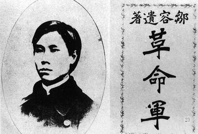
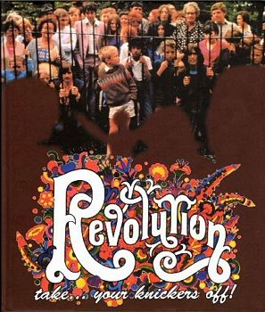
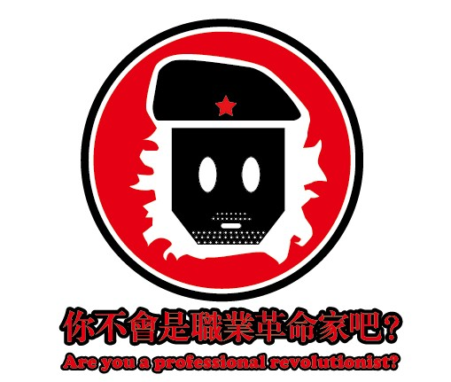

# ＜开阳＞从“汤武革命”到“告别革命”——“革命”义理的中国式诠释及其演变

**中国式现代革命观念的核心是斗争哲学和革命人生观，它以取消一切差别这种新道德为终极关怀。当然，事实上，正是“斗争哲学”的泛滥，暴露了中国式革命新道德和做无产阶级圣人的虚伪性，中国式现代革命观才会解体。然而，我们今天讲“告别革命”，很多人放弃对乌托邦理想社会的追求，这将导致终极关怀的失落和在现代化过程中曾建立起来的个人道德的沦丧。**  

# 从“汤武革命”到“告别革命”

# ——“革命”义理的中国式诠释及其演变

 

## 文/黄帅（山东师范大学）

二十世纪中国思想界最宏大的历史现象，莫过于革命话语兴起与泛滥。自1903年邹容《革命军》出版，“革命”一词如烈火燎原，其所覆盖的领域从知识精英脑海中的宏阔想象扩展为普劳大众的日常生存体验，成为中国现当代史上无可逃脱的时代宿命。

无疑，二十世纪的中国可以成为“革命”中国。有趣的是，纵然不只是现代中国才有了“革命”，但现代国人最先对“革命”作出了现代意义上的定义与理解。

邹容在《革命军》中一开头就给出了革命的定义：“扫除数千年种种之专制政体，脱去数千年种种之奴隶性质，诛绝五百万有奇之满洲种，洗尽二百六十年残惨虐酷之大耻辱，使中国大陆成干凈土，黄帝子孙皆华盛顿，则有起死回生，还魂返魄，出十八层地狱，升三十三天堂，郁郁勃勃，莽莽苍苍，至尊极高，独一无二，伟大绝伦之一目的，曰革命。巍巍哉，革命也。皇皇哉，革命也。”在这最早的定义里，“革命”带有排满的民族意识，同时也继承了传统意义上“革命”的天道进步和彻底变革。

然而，中国古代也有对“革命”义理的独特理解，其特征即在将“天命”归于“天道”之中，将社会发展和历史演进归于“天”与“人”是否能和谐相处，而帝王统治者则为承接“天”与“人”关系的关键点，“天人合一”与“汤武革命”可谓是一对相辅相成的思维源泉，它们相互作用共同促进社会的稳定与进步。

从词源学上讲，“革命”由“革”和“命”两个汉字组成。依据许慎在《说文》中的解释，古文“革”字上为“廿”，下为“十”，其含意是“三十年为一世而道更”，即“革”是指某种周期性更替，正所谓“三十年河东，三十年河西”。“命”字从形象上讲，是用“口”在下令，即意味着某种被给予的秩序。

所以，以中西观点对比来看，“革”即change，而“命”或可对应英文中的order。二字意义相加，“革命”表示某种秩序或天命的周期性变化，其意义相当接近于西方revolution原意，即天体周期性运动或事物周而复始变更。在传统中国的概念里，“革命”大抵不过是“汤武革命”，《周易》中有说“天地革而四时成。汤武革命，顺乎天而应乎人”。而自董仲舒将“天人合一”观念引入皇权统治理论，“革命”成为周期性王朝更替、改朝换代的代名词，这也成为历代反抗现行政府体制的理论来源之一。从历史演变来看，当义士张角在风云变幻的东汉末年喊出“苍天已死，黄天当立，岁在甲子，天下大吉”的起义口号，激发出苦难百姓对皇权合法性的怀疑与抗争。这一举动对后世农民起义影响深远，从黄巾起义到黄巢起义，从李自成起义到太平天国运动，其理论来源都出于对“汤武革命”理念的继承诠释与发扬改造。显然，中国传统文化中“革命”的意义，是由改朝换代所塑造的。

不过，话又说回来，自从西风东渐，大量西方技术、制度、文化理念涌入国内，将古老而沉闷的中国迅速扯进近代化的轨道中。在我看来，在这一现代化的转变中，最大的转变莫过于国人思维方式的转变。因为革命共和也好，改良宪政也好，无政府主义也好，不过是各种可寻可备的思潮与制度模式而已，它们能否存在并改造中国，能否成为社会发展的主流方向，根基全在于国人是否具有了现代化的思维方式。而在这思维方式中，最重要也是最基本地则是时间观念的现代化。记得李欧梵先生在论及新文学的现代性时，提到梁启超引入西方的“线性时间观”为国人思维现代化开辟道路，窃以为此观点极妙。毕竟，西历中不断演进的线性观念有激励社会不断进步的作用，西方观念里的“层级性”观念极强，如体现在文学作品里，《浮士德》中主人公在“天行健，君子以自强不息”（不过这句话是诗人冯至在理解此作品时概括的），无限追求人生的进步与超越；而在中国传统时间观和历史观中，“循环论”却是主流，正所谓“天下大事，分久必合，合久必分”“三十年河东，三十年河西”，老百姓没有什么特别强烈的终极追求（中国大同理想的绝对遥远性和现实生活的苦难往往构成了鲜明对比，人民对当下生存的稳定与舒适更感兴趣，而西方近代社会的进步理念却可以在不断的启蒙与开悟中得到实践与实现）。所以，当西方的时间观与传统中国“天人合一”和“顺天承意”观点碰撞时，则会产生中国式的“易代”时间观，而这体现在社会实践上，就成了中国式的革命观念。

回到一百年前，“革命”的意义却是与具体的“排满革命”相连接的。“排满革命”作为“易姓革命”的创造性转化最早出现在激进知识分子的文字中，后与中国式的民族主义共同消长，成为中国近代民族主义的接生婆。就在这个过程中，带有传统色彩的“易代” 逐步向具有现代化色彩的“革命---共和”模式转化，非常巧妙地完成了“汤武革命”观念的现代化和西方revolution 式的中国化转变。

历史的演进总是“树欲静而风不止”的，在时代变幻莫测的激荡风云中，马克思主义和共产主义思想逐渐成为中国社会的上扬力量。当“中国式革命”和马克思主义结合后，便构成了建国前后五十余年的历史想象和现实理论来源。一方面，共产主义理想推动了“革命”理念中的进化论思想的传播，使国人获得了对未来世界的想象而可寻的路径和使之成为现实的方法。但在另一方面，中国社会非常不健全的现状和强烈的革命激情和共产主义梦想之间才产生了巨大的裂痕，而大量忽视了这一问题的知识分子和劳苦大众遭遇了现实中的惨淡与痛感，从“大跃进”到“文革”，再到“八九事件”，每一次的激情狂想与理想主义都成了社会现实对“革命”的反讽，成了中国漫长改革和复兴道路上的“敏感史”与“痛史”，甚至让一代人为之背负上沉重的精神十字架。

为何中国共产主义梦想与“革命叙事”的“恋情”如此一波三折？为何中国现代化进程充满了艰难险阻，甚至要喊出“摸着石头过河”的非理性口号？这不是个简单的问题，但有一点需要注意的是，马列主义吸收黑格尔辩证法并将其运用到社会发展，提出历史唯物论，阶级斗争成为推动历史进步的基本力量。这时革命观念中进步含义不仅和激烈改变及斗争等含义合而为一，而且它同革命观念中用暴力夺取政权之意义相联，从而导致暴力革命化和合法化。列宁甚至说过“革命在于被压迫阶级运用革命的暴力”之类的话，即将革命等同于暴力，暴力居然史无前例地用革命的名义正当化了。

而到了二十世纪末，随着共产主义革命的衰落和对极权主义带来灾难的普遍认识，与彻底变革相联系的激进主义革命观念也开始受到批评，“告别革命”似乎成为二十世纪末普遍潮流。但不可忽视的是。“革命”意义不激进在于社会制度的变革和技术方式的演进，其根本内核在于文化思想观念的进步。我们或许在表面上用渐进式改革替代激进式革命，确然，“稳定压倒一切”和“和谐”是当前社会的官方思想，但是，我们不能忽视由革命时代的国人普遍的道德理想主义的沦丧。也就是说，在波澜壮阔的改革大潮中，我们不能将昔日的道德观念和理想追求抛弃（但这也是市场经济与近代化的必然阶段），不能在“告别革命”的同时也与传统中国的伦理法则和共产主义梦想曾经带给国人的道德理想主义彻底绝缘。对于“革命”，还是要“取其精华，去其糟粕”。

换言之，中国式现代革命观念的核心是斗争哲学和革命人生观，它以取消一切差别这种新道德为终极关怀。当然，事实上，正是“斗争哲学”的泛滥，暴露了中国式革命新道德和做无产阶级圣人的虚伪性，中国式现代革命观才会解体。然而，我们今天讲“告别革命”，很多人放弃对乌托邦理想社会的追求，这将导致终极关怀的失落和在现代化过程中曾建立起来的个人道德的沦丧。

在今天，大家都能感受到，中国经济高速增长是与全社会面临道德危机和不可遏制的腐败联系在一起的。中国人可以而且应当在社会制度变革层面告别激进革命，但是否可能在道义上特别是道德境界层面告别革命呢？再者，在漫长的改良过程中，在“革命话语”的必然消褪下，是否会有极端民族主义之类的非理想思潮成为社会主流思想呢？确然，这些都是很难预料的。而俯察整个中国和世界现代化历程，社会的理性公正与平和正义才是社会演进的理想目标。而愤青式的“革命冲动”或可会导致西西里式全民性犬儒恶质化，丧失改造可能，任何政治社会运动必将淹没同化于暴力的西门庆主义。

人人都拥有一种宽容、怀疑、理性的批判精神，一种不卑不亢而独立自强的大国现代公民品质，难道这不才是理想社会的美好元素吗？

 

（采编自投稿邮箱；责编：麦静）

 
