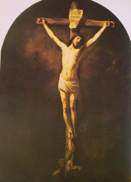

# ＜开阳＞从中国佛道文化看中国近代落后的必然性以及基督教文化的天然民主性

**早期道家宣扬长生，结果使得皇帝追求长生术。早期中国佛家讲究出家修行，结果出现梁武帝几次出家而不顾国家事务的荒唐局面。后来佛道更是沦为贵族阶层的一种利禄工具，贪官可以用供养和尚来消除罪业，杀戮如麻的将军可以逃遁到佛教里以消除罪恶，这使得统治者和贵族能找到很好的借口替自身的罪恶辩护。而禅宗的方便之门，也给贵族和知识分子以逃避世俗事务的借口，使得整个国家不务实际，而以追崇浮华为风尚。**

# **从中国佛道文化看中国近代落后的必然性**

# **以及基督教文化的天然民主性**

# ** **

## **文/ 刘江峰 (北斗撰稿人)**

  **缘起：**** ** 我现在供职的公司是一家禅修会所，每天接触的都是佛教与禅宗的东西，下班之后我读的书却是《阿拉伯通史》，而我真正喜欢的是基督教，当然是新教。不过好在我还没有精神分裂，还能在三大宗教中游刃有余，这也给了我一个非常好的机会，对三大宗教做最直观的比较。 最近公司组织一次禅修活动，也算是内训。刚开始，经理说大家对佛教一无所知，要求内训讲点佛教的基本知识。我也乐的做了一个佛教小常识的课件。昨天，董事长过来，要看下课件。看完之后，她说：太正式了，太正规了，感觉像考试前背考点。然后不管我要解释，滔滔不绝地讲下去，其实她并没有很深入了解我要讲什么。然后她说她从来不喜欢读这种正规的东西，喜欢有趣味、有意思的讲，比如穿插一些小故事。董事长老公是个非常有钱的人，董事长也跑来跑去听讲座，还拜了一个西藏密宗的还俗活佛为师，还讲风水，也听过南怀瑾的讲座。然而说，说到底，她还是一个浅薄而且非常嚣张的暴发户。譬如我讲到内训时要求大家不用世俗的职务称呼对方，用师兄师姐称呼就行，公司的禅修导师也认为应该这样，但是这位董事长想都不想就否决了，我真的不知道她是否知道佛教中众生平等的教义，而且我这样做将来对公司有多大好处。我想真正的是，她根本不想平等，她学习佛法也是有钱后的消遣而已。 这件事情给我的刺激是：为什么佛教非常容易受到有钱人或者上层阶级的欢迎？为什么有钱人或者上层阶级不愿意真正地区了解佛教教义或者践行佛教的教规呢？我的这个董事长恐怕是习惯了嚣张的生活，说话自以为是的程度已经达到咄咄逼人了，而一些参加的培训课程似乎只是助长了她的这种嚣张而已。  **探求：**** **

** **

也许这个问题必须回到佛教的创始人释迦牟尼那里。释迦牟尼是古印度的一个王子，他最后抛弃王国和妻子出家修行。我曾经看到有人用阈值这个概念来分析释迦牟尼和贾宝玉这种富贵出身的人为什么对女色、金钱这么看的风轻云淡。文章中说，这是一个很简单的道理，释迦牟尼和贾宝玉从小都生活在财富与女人当中，对于物质和性来说，他们都是随手可以取得的，非常容易得到满足。而根据马斯洛的需求层次理论，一个人只有满足一个较低的需求后才能转入更高层次的需求，而随心所欲获得物质财富和性满足是人肉体需求的最高层次，当肉体达到最高的需求后，人会对肉体需要表现出一种厌倦和空乏感。所以，很简单的道理，释迦牟尼和贾宝玉出家并非真正的看破红尘，而是肉体空前满足后的疲乏感促使他们转入更深层次的探求。 这个分析其实让人看到佛教创始人的一个身份：贵族、王子。这也就是说，佛教本身是一种贵族宗教。事实上在现实中，人们也会看到这个问题：佛教僧侣不从事生产，怎么养活自己？我想，释迦牟尼的时代很简单，因为一开始释迦牟尼和他的出家弟子或者在家居士（譬如维摩诘居士）都是富有的人或者地位很高的人，所以他们有供养他们的人，不必担心生存的问题。正因为如此，佛教中认为世人供养出家修行的人是种功德。不过，后来的佛教徒没有这种好运气，有些落魄的出家人就不得不用变相行乞的方式来生存下去。佛教传入中国后，和上层人物走的很近，无论是东汉汉明帝（中国第一个皇帝中信仰佛教的）还是梁武帝，都是上层人物在供养寺庙。也就是说，佛教在中国的传播是由上层向下层传播的。 但是佛教在隋唐时代碰到一个问题，就是佛教寺庙不缴税，还接受贵族布施，这使得佛教势力非常大，引起统治者的限制与镇压。这个时候中国佛教就兴起一种下层向上层变革的运动，这就是禅宗。禅宗实际创始人六祖慧能是个底层人物，他使得佛教徒开始正视自己的生存问题。传说六祖流亡在外期间，和一群猎人行动，不能得到正常的素食供养，于是采集野菜在猎人煮过的肉汤里煮一下，就直接吃，这不仅变通了佛教的戒律，而且还开启了佛教中方便的法门。这个自食其力的传统到百丈怀海禅师时就成为“丛林规则”，也就是佛教徒和佛教寺庙自食其力的法则，这使得以前接受贵族和皇家布施的华严、唯识宗都衰落，只有自食其力的净土和禅宗生存下来。 但是佛教的骨子里是贵族式的，禅宗也很快成为贵族的一种生活方式，甚至影响到中国知识分子的思维方式，朱熹、王阳明对于儒家的革新无一不是在佛教禅宗的影响下发生的。然而禅宗的教义贵族化也使得禅宗开始变味。譬如，禅宗讲究不立文字、直达心意，这本身是针对底层人不认字、不懂得读佛经而言，但是对于有深厚文化素养的贵族和知识分子而言，这却成为不好好读经、禅修就成佛的一条捷径。又譬如，六祖在肉汤中煮野菜这本是无奈情况下的变通，却成为贵族打破戒律，追求世俗生活的一种借口。 事实上，禅宗的这一影响在中国历史上是曾经有过的，这就是老庄在魏晋南北朝时代的影响。老庄思想中有一种傲慢，就是一种智商发达或者智慧超群人的傲慢。譬如，庄子视世俗的事务为庸俗，以高妙的生活境界为一种追求。也许作为一个智商超群或者经历苦难而通达的人来说，这种解脱是必要的，也是一种精神的无上境界。但是，老庄文化在某种程度上是一种精英文化，它鄙视世俗和平庸，但不正视世俗和平庸正是世间的常态。一旦它成为贵族文化的一部分，它就会成为专制与独裁的帮凶，因为贵族为了维持这种文化或者这种生活，必须严酷地压榨底层民众，以在物质上达到随心所欲，在精神上超脱众人。这就是我们在《世说新语》中看到那些随心洒脱的贵族那在自在，确实很令人羡慕，但是他们背后是当时水深火热中被压迫的民众和腐败无能且专制的政权。举个例子来说，王羲之可以写出那么漂亮的字，但是王右军的真实身份是军队的后勤主管，什么都不管，后来他的儿子承袭这个职位，连军队有多少马都不知道，以致后来农民军打进来后王家子孙全部被杀，王羲之只是运气好点而已。又譬如，以诗人著称的谢灵运其实也是被养的肥胖的没落贵族，宋朝代晋朝后，谢灵运因为祖产被剥夺又想造反，却很容易被抓到杀死。 可见，中国的佛道文化其实是一种贵族式的文化，他们融合在一起基本在宋代，宋代也达到了中国古代文化的最高点。但是宋代却是中国历史上最弱小的政权，甚至以道士自居的皇帝宋徽宗（也是不世出的书画艺术家）都被一个兴起不到十年左右的王朝给抓起来。经济文化达到一个顶点，却时常以屈辱来面对弱小的游牧民族，这个问题的症结就在文化的弱点中。佛道文化影响下的中国文化，即便儒家文化也被然后一种贵族式的傲慢，这种傲慢就是对于世俗和平庸的不正视甚至敌视。具体来说，即便儒家文化培养出的人才，在成为行政官员后，对于民众往往视为“愚众”，对民众轻视甚至敌视，并由此对于民众所需要的基本生活、生产达到根本不重视，对民众出身的士兵、武将也充满文人式的敌视，从而使得整个国家出现一种上层和底层的断层文化。这种国家阶层分裂只是文化上的，政治经济上并不能完全分裂，所以在国家运气好、没有受到重大挑战的时候，国家经济突飞猛进，但是国家遭到挫折和挑战的时候，上层精英往往没有应对的经验和能力，而底层的应对往往是原始、野蛮式的，所以曾经的高度文明不得不回到原点，国家也灭亡后重新开始下一个朝代。 甚至，佛道文化还是造成中国传统精英堕落的一个直接原因。中国国家建构是建立在儒家和法家思想上的。这两种思想不论有多大差异，但是都是建立在秩序与法度上。虽然因为社会局限性，儒家和法家的思想中不能做到人人平等，但是它们都一致地提出对权力的限制和权力行使者的必须要求，譬如儒家要求皇帝服从天道，法家提出的不世袭、法律治国的准则。这是因为儒家和法家都意识到人的两面性，以及人性的参差不齐。佛道文化却在某种程度上消解了儒法在政治学上的这种建构。早期道家宣扬长生，结果使得皇帝追求长生术。早期中国佛家讲究出家修行，结果出现梁武帝几次出家而不顾国家事务的荒唐局面。后来佛道更是沦为贵族阶层的一种利禄工具，贪官可以用供养和尚来消除罪业，杀戮如麻的将军可以逃遁到佛教里以消除罪恶，这使得统治者和贵族能找到很好的借口替自身的罪恶辩护。而禅宗的方便之门，也给贵族和知识分子以逃避世俗事务的借口，使得整个国家不务实际，而以追崇浮华为风尚。 正是在这种佛道文化影响下，近代中国碰到了以务实为本的基督教文化。  **正道：**** **

基督教文化的根本在于耶稣，而耶稣在世界所有宗教创始人中是出身最为低下的一位：他只是贫穷的巴基斯坦地区的一位木匠。虽然从血统上讲（排除神性），耶稣是大卫、所罗门的后人。甚至玛利亚的未婚先孕，用今天科学观点或者社会学观点来看，基督的出生也许有点不明不白。这一切都说明耶稣是一个出身底层的教主。释迦牟尼已经讲过，伊斯兰教的创始人穆罕默德虽然也经历过困苦的童年，但是他的祖父本身是麦加当地氏族的族长，父辈中许多是当地富翁，而且后来穆罕默德与富有的寡妇结婚，也使得他的生活质量比较好。唯有耶稣来自穷苦之人，代表穷苦之人。 耶稣的言行中对两种人是深恶痛绝的。一种是富人，耶稣说：“骆驼穿过针眼，比有钱的人进神的国还容易呢！”，这也许来自基督出身环境。但是对另外一种人的厌恶，确立了耶稣如何是穷苦人的代言人。这就是法利赛人。法利赛人本来是耶稣之前犹太人反抗外族的先驱，但是他们的子孙却背弃祖先，成为罗马统治以色列的帮凶，以舞弄文辞，压榨自己族民为荣。耶稣曾经是这样说他们的："你们这假冒为善的文士和法利赛人有祸了！因为你们好像粉饰的坟墓，外面好看，里面却装满了死人的骨头和一切的污秽。你们也是如此，在人前，外面显出公义来，里面却装满了假善和不法的事。"事实上这说明耶稣多么讨厌上层贵族的装腔作势。 耶稣对这两种人的厌恶实际上使得基督教成为一种完全革命的、发自底层的宗教。而且，耶稣没有像所有其他的宗教创始人一样，在传教的过程中调和与旧宗教、旧阶级的矛盾，以自己的死亡彻底同旧势力决裂。佛教最终成为东亚上层贵族的宗教，犹太教也固守自己律法不肯改革，穆罕默德最后也不得不同阿拉伯半岛的原始宗教和部落文化做妥协（这是今日伊斯兰原教旨的根源）。唯有耶稣，决绝的姿态成为一种永恒的底层民众的代言人。 耶稣带给基督教的这种革命特质，具有天然的民主特性。在基督教刚兴起的时候，古希腊罗马的民主实际已经名存实亡，对皇帝的崇拜已经达到登峰造极的地步。基督教的传入使得弱势的底层民众和周边民族第一次以一种底层姿态建立起自己的社会机构和互助组织，最终迫使罗马皇帝承认基督教，最后周边民族又攻陷罗马帝国，开始了现代欧洲的进程。但是这不是基督教革命和民主特质的第一次对历史发生根本性影响。当罗马天主教以上帝之名、行魔鬼之事，耶稣对于富人和法利赛人的论断再一次发酵，最终酿成新教的诞生以及欧洲的民主革命。最终，革命和民主种子飘扬过海，达到美洲。 这种革命和民主的特质也带给欧洲文化以务实主义。这种务实主义就是以底层民众的观念来评价世俗与平庸，对于底层民众的文化表现出尊重（譬如莎士比亚的戏剧），对于商业、军人尊重，而从底层的世俗与平庸出发，去探寻神性和灵性，从而形成没有雅俗之分的欧洲文明。所以，葡萄牙的王子不惜做航海家，英国的海盗也可以获得上将称号。从而使欧洲文明成为一种自下而上的政治经济模式。   **对决：**  在欧洲再一次发生基督教革命后（即新教革命），欧洲来到中国面前。中国这个时候是一个奇特的国家。整体来看是非常强大的，国库充足，军队强大。但是，上层统治者除了在收租税这件事情上接触底层民众，他们有独立的系统，在这个系统中选拔官员、社会交游，这个系统有自己完善的道德围墙，这使得这个强大的国家，官员深入了解古代的经典，却分不清五谷杂粮，看不起走贩商卒。甚至如果他们之中的成员去了解这些的话，会被“清流”看做不务正业、道德有问题的人。这些帝国官吏中比较好的还有一定的道德诉求，但是更多的官吏其实是没有一点道德底线的，是吸附在整个国家上的蛆虫。更进一步讲，这个国家还有一种自以为是的文化傲慢，对于自己之外的文明不尊重，甚至连了解一下的兴趣都没有。 根据中国古代军事学家孙子的话说：知己知彼，百战不殆。不愿意了解别人的中国必定失败，于是进入漫长的沉沦、自省、奋起的过程。  **流毒：**** **  然而，佛道文化的毒素是深入中国文化骨髓的。一个知识分子可以用佛道的不争强为自己不努力、不奋进而狡辩，一个富翁也可以修修佛道，为自己的恶毒的心灵取得平衡。当然，佛道文化还造就了中国知识分子中的“法利赛人”，这种人秉持着自以为是的道德观念，用似是而非的东西想要指导一个民族、一个国家走向何方，却往往不管底层民众需要什么。 这也是我的董事长如此浅薄和嚣张的原因，因为中国文化中的佛道文化是奴才文化，只能给权势者和上层人贴金，却无视底层人真正的精神需求，或深居穷山远水以自高，或混居闹市阿谀以求财物，或伴协强权以助威，或造伪书立谬论以麻痹世人。 

（采编：管思聪；责编：管思聪）
