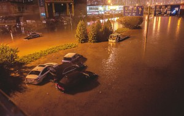

# ＜开阳＞从北京大雨看民众自治的前景

**社会组织是一种有效的润滑剂，避免了政府和民众直接对话而可能出现的对抗与冲突，按照科塞的“社会安全阀”理论，社会组织无疑是一个有效的“社会安全阀”，将人们的不同需求有组织地集合，反映给政府，也使得质疑、对话更加平和，最大程度地避免了极端行为的出现。** 

# 从北京大雨看民众自治的前景

## 文/刘晓川（中国人民大学）

 

昨天，我的家乡北京经历了61年来最大的暴雨。很不巧，我去参加同学聚会，弄得妈妈提心吊胆了一晚上。结果今天被她唠叨了整整一天：“以后再遇到这种事你就该住学校……”

这一天，我也一直盯着人人、微博的言论，有公知的，也有普通网民的。和很多热点事件一样，这次网络上也形成了针锋相对的“论战”之势——抛开大家已经讨论得热火朝天的问题不说，我只想从“民众自治”的角度谈谈我从这场大雨中得到的体会。

分析问题的这个角度，我是从这两方面想到的——很多民众自发开上私家车，组成车队参与救援；这两天正在写有关“官民共治”“政社合作”的课题，恰好这两件事联系在一起了。

这个问题，我个人认为，可有如下的分析角度：

**一、今后“民众自治”的发展方向如何？**

我们看到，新京报等主流媒体在其官方微博上发表相关提示，提示那些去机场救援的私家车主应该注意哪些问题。从这里，我们可以得到的启示是——即使是民众自发的救援行动，也需要有组织地指挥、调度，即使这个组织是临时的、因为某一个紧急任务而建立的。这再次印证了这样一个定律——“纵然组织存在这样多的问题，但我们每个人都无法离开组织的束缚。组织是人类在当前有限理性条件下不得已而为之的选择”。

因此，今后“民众自治”的发展方向很明确——通过推动基层（草根）社会组织的发展推动“民众自治”。比如，何不以这次的大雨救助为契机，成立一个“救助协会”性质的组织呢？

而结成组织的最直接目的只有一个——促进救助和相关事宜的专业化、提高救助的效率。设想一下，假设昨天的救助行动缺乏有效的组织，单个的私家车主缺乏足够的信息，而根据自己的“想当然”参与救助，情况会是如何呢？——估计是更多的私家车被困途中、造成了更大的救援压力。

我在写课题的时候曾说：社会组织是一种有效的润滑剂，避免了政府和民众直接对话而可能出现的对抗与冲突，按照科塞的“社会安全阀”理论，社会组织无疑是一个有效的“社会安全阀”，将人们的不同需求有组织地集合，反映给政府，也使得质疑、对话更加平和，最大程度得避免了极端行为的出现。回顾近年来我国各地出现的“热点事件”，很多极端的维权方式都是因为缺少有组织得表达需求，以至于出现单枪匹马、自我维权的现象，甚而造出“新闻事件”发泄自己的不满、引起公众和更高层级政府的注意。比如，开胸验肺、唐福珍自焚、杨佳袭警等事件。

因此，既满足了民众的参与需求，又避免了“过于碎片化”而导致的“无政府主义”现象，大力发展社会组织无疑是一个很好的解决之道。

 **二、如何看待“民众自治”同“政府管理”的关系？**

我们首先需要明确这样一个理念：二者绝非相互替代的关系，而是“相互补充”“各得其所”的关系。

作为三个最基本的治理主体：政府、市场、社会组织，我曾经做过总结——建国初到改革前，我们过于强调政府的作用，忽视了市场、社会的作用；而改革初期到本世纪初，我们又过于强调市场的作用；十六大以来，政府逐渐意识到了“提供公共服务”是自己的基本职责，那么，展望今后的社会管理，我们的方向在哪呢？很简单——从一元模式（政府或市场）、二元治理模式（政府+市场）到三元治理模式（政府+市场+社会）。这意味着，这三个主体应在互动、对话中达到一种“平衡”，而非彼此质疑、不信任、甚至试图互相取代。

以昨天的暴雨为例，决不能因为民众自发组织其救援队，政府就可以袖手旁观。而在昨晚，政府发布预警信息、组织武警和消防人员抢险，这就是政府职责的体现。联想到美国2005年的“卡特里娜飓风”，发生后，由于三种机制发生作用的时间先后、强度各有不同，导致此次飓风的救助使得布什政府的信任度在一年之内急剧下降。当时有这样一个现象——无家可归、等待救助的全是当地中下层人员，这显然是“市场”机制主要发生了作用。而小布什政府想进行救援，按照他在《抉择时刻》里的表述，他想派救援部队到路易斯安那州，但被路易斯安那州州长无情地拒绝——州长认为小布什的做法侵犯了路易斯安那州的自治权。当然，这涉及到美国联邦制如何完善的问题，本文不过多讨论。但有一点可以肯定的是——“政府”力量在此次台风的救助中无论从时间还是从力度上都有所不足。

那么我国政府在自然灾害中的救援有哪些需要完善的呢？笔者认为，专业化是最直接的答案。比如，假定排水设施承载力维持现状的前提下，莲花桥每次一下大暴雨就成海，那就应该采取封路措施，不让行人、车辆通过，如果提早封路的话，估计就不会出现车主被困水中窒息而亡的惨剧了。

因此，我们如果承认了“共治”的模型，就知道应该如何看待社会组织在发展过程中出现的种种问题——比如，“郭美美事件”之后，慈善组织该如何发展呢？

有的人提出这样的解决之道——既然慈善组织存在这么多漏洞，以后救灾款直接由民政部门管理、划拨，就能避免此类问题。这种方法还是没有脱离过去的“一元模式”“二元治理模式”的束缚。笔者认为，真正的解决之道是——通过促进社会组织的竞争提高其透明度和业务水平。

比如，假定有几十上百家慈善组织可供我作为捐款的对象，那么这些组织就会自觉提高自己的管理水平，以招致更多的信任、吸收更多的捐款、最大程度提高自己的知名度。而如果除了红十字会没别的地方可以捐款的话，红十字会自然没有动力改善自己的管理水平。

此外，政府对社会组织的责任也少不了“监管”二字——像台湾的“公法人”组织，就要定期向立法会、审计署等组织汇报、接受其质询。

其实，无论是毛寿龙老师推崇的“多中心治理”模式，还是张康之老师自己构建的“权治、法治、德治”的平衡，其本质都在于——社会各治理主体相互制约、彼此平衡，通过力量的平衡推动治理的长治久安。

 **三、如何看待在民众自治中的“利他主义”**

这里的“利他主义”，如果换一个表述，应该叫“我为人人，人人为我”，也即“同床异梦”（相异于政府管理的“同床同梦”、市场机制的“异床异梦”——来自于张璋老师在“公共行政学说史”课上的比喻）。这种“利他主义”在本质上是一种“利己主义”。

如果按照康德的理论，利他主义有两种——纯粹的利他主义、以利己主义为目的的利他主义（我不是学哲学的，加之康德的理论很博大精深，我只能通俗地予以转述）。纯粹的利他主义，就类似于“做好事不留名”“白求恩”等；而以利己主义为目的的利他主义，则是这样一种情境——为何很多外国人这么爱让别人“搭顺风车”？他们的逻辑是——这次我帮助了别人，下回我的车抛锚了肯定也会有别人帮助我。也好像我们坐公交车劝别人给老人让座时常说的那句话“谁都有老的时候”。这两种利他主义有何不同呢？最根本就在于，对人的假定不同，也即社会形态不同所产生的人的动机不同。纯粹的利他主义，比较适合柏拉图笔下的“理想国”，即每个人的道德水平极高；而现代社会的基本假定则是——人是理性的、是追求利益最大化的，由此产生了现代经济学、代议制民主等制度。两种利他主义，如果从比例上看，必然是以利己主义为目的的占主要、虽然我们每个人或多或少也都有“纯粹性”的成分——就好像斯密的“两大著作”《道德情操论》和《国富论》同等重要一样。像“感动中国”人物、“全国道德模范”他们的纯粹性就比我们多很多，但不能说我们在帮助别人的时候就一点没有纯粹性。但小悦悦事件暴露的问题则是——利己主义的“趋利避害性”战胜了以利己主义为目的的利他主义和纯粹性的利他主义。

因此，我真希望能以昨天大雨的“救援队”为契机，在我们的社会上形成一种“我为人人、人人为我”的互帮互助的良好风气——就好像，A同学帮B同学辅导英语、B同学帮A同学辅导数学一样……

但要形成这样一个社会，显然离不开下一个问题——如何建构中国社会的“信任机制”。

 **四、如何重建当前中国社会的“信任机制”**

这个问题已经引起了越来越多人的关注——最近“微信”频频爆出的“摇一摇骗局”，一直就很热的“职业乞讨团伙”，还有我们很多人设身处地感受到的——做调研越来越难，很多人在填问卷、接受访谈的时候总是不诚实、不说实话……

而上个月初的中美公共管理论坛上，蓝志勇老师的20分钟主题发言也是“如何重建中国社会的信任机制”。

在我看来，当前中国社会的信任机制有着以下几个特点：

一是未摆脱传统社会信任机制的一些特点，即“差序格局”。要是再细分的话，先后关系依次是血缘、地缘、业缘……血缘关系，很多温州企业都是家族企业、而在这些企业家看来“家族企业是最符合当前环境的公司运营模式”；地缘关系，我们那么热衷于参加“老乡会”的活动就是体现；业缘关系，从高层到基层都有体现——高层有团派、太子党、石油帮，日常生活中我们也常常根据所学专业、文理分科确定与人的亲疏程度。

二是陌生人社会不可避免了到来了，中国社会有一些“陌生人社会”的“信任关系”，而这种关系通常是不稳固的——比如，昨晚下大雨，微博上那么多人关心住在地下室的人们，开自己的私家车去机场接送陌生人，甚至为陌生人提供暂时落脚的地方，这些都是中国陌生人社会存在“信任关系”的一面；但与此同时，很多地方老年人摔倒没人去扶、现代住宅邻里之间的“老死不相往来”又体现了中国社会“低信任关系”的一面。我下午也在思考——为什么下大雨的时候，那么多人免费为陌生人提供救助，而日常生活中甚至熟人之间还经常尔虞我诈、勾心斗角？这种矛盾的现象因何产生呢？

经过徐南南同学的提示，“利益”二字的分量很重，或者说是“纯粹性”和“利益”二字孰轻孰重的问题——老人摔倒，我不想当彭宇、让自己的利益受损失，所以我不去搀扶；下大雨接送陌生人，除了一些油钱，我不会产生什么利益损失，“助人为乐”也是我应该为社会尽的一份责任，因此“纯粹性”战胜了“利益”的盘算，感人的画面产生了；我们俩关系再好，但涨工资、晋升的机会只有一个，非此即彼，面对生存的压力，我不得不展现“人性”中丑恶的一面……

其实，我们每个人都无时无刻不在进行着这样的算计——人就是这样一个复杂的动物、一个矛盾的统一体，而政府的责任就在于——促进社会中“善”的水平的提高，“共同的善”也是“公正”的真谛。但回顾上海“钓鱼执法”、“彭宇案”等争议声音大的案件判决，每出一次“新闻事件”，陌生人社会的“信任程度”就降低一点，这实在需要我们深刻反思。

而激发人类潜在的“恶”，也是众多学者所批判的科层制的弊端。比如，帕金森定律中的一个重要结论——上级政府不会安排一个下级，而会安排2个以上的下级，并鼓励他们相互竞争，以保证自身权力的稳固，下级也会采取类似的做法……所以，科层制所产生的“机构臃肿”“防卫型的官僚人格”也就不足为怪了——“文革”中鼓励全民“互相揭发”也是这个道理。

因此，大力发展社会组织也是当前提升中国社会信任关系的一个重要途径——人们只有有效地组织起来，才能够更好地彼此了解、彼此合作、以致彼此信任。

 **五、我如何看待网上的“论战”**

网上很多人对政府在排水设施建设、救助速度等方面产生了质疑，另一些人又在反击——你们怎么偏偏只看到不好的一面而忽略好的一面、感人的一面？

这不禁让我想起这样一件事——去年8月份，毛寿龙老师邀请了普京的前经济顾问来人大讲座。这个顾问一上来就说——同样半杯水，本国人只看到“还差半杯”，而外国人通常看到“已经盛满半杯了”，比如，俄罗斯和中国都有着极其庞大的国有石油公司，我看俄罗斯的石油公司问题多得不得了、但我看中石油中石化却觉得俄罗斯真得好好学学这两家公司，估计中国人的看法是相反吧……的确，中石油中石化在国内已经被经济学家和公众批判得体无完肤了。

“吃着碗里的、看着锅里的”虽然是个贬义句子，但却是我们每个人内在缺陷的真实写照——我们每个人或多或少都有这种心理。比如，为人父母的，明明自己孩子已经很优秀了，但还天天说“别人家的孩子如何如何”；明明自己的成长环境已经很优越了，但还天天抱怨“我不如XXX过得好”；明明自己的政府已经很高效透明了，却偏偏觉得别的国家的政府更值得学习（比如，在很多内地人看来，马英九正面形象大于负面形象，但在台湾本地，马英九却天天被人在FACEBOOK主页上质疑，甚至一位台湾教授去年来人大做讲座的时候还说了他一堆缺点……）；再比如，我今年去西班牙，和格拉纳达那个导游聊了很长时间，他跟我说“西班牙政府机构臃肿，西班牙社会已经被政客绑架，各自治区其实就是政客们为了自己利益设想出来的一种制度，但是各自治区根本没有这么大的差别；相反，中国这些年发展得倒不错……”；包括我前面的分析，不也是好坏并存吗——成功的经验、失败的教训都值得我们关注啊。

说到这，我忽然想到我导师3年前上课时跟我们说的一句肺腑之言，那个学期她给我们上“公共部门人力资源管理”课程，有一次课讲“绩效管理”，她最后说：“咱们这么大力度地引入绩效管理，从企业到政府，就是一个目的——通过绩效考评发现问题、进而改进问题。老师跟你们说一句肺腑之言，以后你们无论是继续读书还是工作，老师、领导说你说得越多，其实是越信任你、觉得你是个可塑之才，如果领导觉得你朽木不可雕也了，直接把你打入冷宫、对你不闻不问，那样好吗？”

是啊，这么多人批判政府，不就为了政府明天能变得更好吗！比起那些天天为政府唱赞歌，转而“用脚投票”移民别的国家的人，哪种对社会的进步更加有用呢？因此，我们的政府真得放开胸怀、放低身段、虚心听取民众的批评意见、改进自身工作……

但另一方面，我们在探讨问题时也要秉承这样一个基本理念——对事不对人，你可以不同意一个人的观点、但你不能通过人身攻 击的方法来佐证你的反驳意见。在探讨问题时，我们应当从基本事实出发，本着理性、客观的原则深入思考，不能浅尝辄止、被假象所迷惑。

对“民众自治”，我们喜欢用这两种方式予以反驳：一是党的“全能主义”背景下，是不可能自治的；二是当前中国民众的素质不适合自治。这两种看法各有其合理性，尤其是第二种——分析人人、微博上“论战”的内容我们就可以看到，当前民众的确需要更加理性地参与公共事务。但是，正如蔡定剑在《民主是一种现代生活》一书中所指出的那样，只有民众开始并尝试自治了，他们的素质才能切实得到提高。并且，近年来民政部、广东省的许多做法已经在提示我们——将来的趋势必将是逐步放权的，虽然这种趋势可能会有些缓慢。所以，正如中国人民大学已故的原副校长谢韬所说“中国的民主是‘等’和‘促’的结合”——我们一方面要对中国的前途满怀信心，另一方面我们也要从点滴小事做起，一步一个脚印地积累中国民主的“社会资本”。

扩展阅读：罗伯特.达尔《多头政体》《民主及其批评者》《多元民主的困境》，张静《法团主义：及其与多元主义的主要分歧》

注：原文地址：[http://blog.renren.com/blog/233495177/862367244](http://beeplin.blog.163.com/blog/static/172544160201261211291488/)

 

（采编：董一儒；责编：马特）

 
