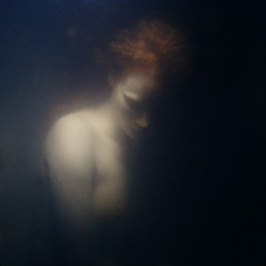
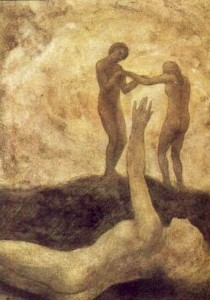

# ＜开阳＞传统的神性和人性主题

**在一个逼仄的环境中，每一步轻轻的挪动和伸展都是僭越，每一记主动的僭越都是自由；而在一个开阔地，自由就是主动的节制，因为无从僭越。节制不仅是停留于柏拉图口中的美德，这里它成了个体的自由实践，到这里，主动的节制如何成为可能或者说从节制追溯下去我们能得到什么成了关键。**

### 

### 

# 传统的神性和人性主题

### 

## 文/刘成龙（苏州科技大学）

（一）方法论的提出

“任何一种发问都是一种寻求……这种认识的寻求可以成为一种‘探索’，亦即对问题所问的东西加以分析规定的‘探索’。发问作为‘对……’的发问而具有问之所问[Gefragtes]。一切‘对……’的发问都以某种方式是‘就……’的发问。发问不仅包含有问题之所问，而且也包含有被问及的东西[Befragtes]。在探索性的问题亦即在理论问题中，问题之所问应该得到规定而成为概念。”——海德格尔《存在与时间》

研究一个问题要从理解问题开始，这点我们可以借鉴海德格尔，海氏在提出存在（意义）问题之前，首先考察了一般问题的结构，认为首先要“简短地讨论一下任何问题都一般地包含着的东西”。“神性”和“人性”就是本文中被问及的东西[Befragtes]，对它们的发问就是问题的第二个层次——问之所问[Gefragtes]（第三个层次是问之何所以问[Erfragtes]，属构建存在畿域的问题层次，本文只涉及事质领域，故不予讨论）。

1.人性

“……形成本来的人性的东西究竟是什么呢？”费尔巴哈这般设问。“就是理性、意志、心。”又这般回答。他还为这三点找出了对应的现实目的：“人之所以生存，就是为了认识，为了爱，为了愿望。”它们的具体实践方式就是：“我们为认识而认识，我们为爱而爱，为愿望而愿望——愿望得到自由。”——康德把人的心理机能也分为三种：认识、情感和欲求，在这里费尔巴哈和康德“不谋而合” ——存在者的性质就这样被展示无遗，用海氏的话说就不再是一般存在者，而是此在（Da-sein）。比如三部传统小说《巴黎圣母院》、《红字》以及《荆棘鸟》最突出的人性描写莫过于人性三内核中“爱”这个主题，当然本文中的爱主要体现为男女之爱，这又必然掺杂了性的因素，是一种含性之爱，性又作为一种在“爱中”之性，所以接下来的叙述将围绕此展开。

2.神性

涂尔干在《宗教生活的基本形式》将宗教的本质归因为对世界进行的神圣事物和世俗事物的二分——费尔巴哈也有“属神者”和“非属神者”的说法——通过赋予“禁忌性”和“权威性”遴选出神圣事物，同时神圣事物也是人们爱和理想的寄托。在他看来，宗教有两个基本的构成要素，最根本的就是“神圣性”，他说：“宗教是一种既与众不同、又不可冒犯的神圣事物有关的信仰与仪轨所组成的统一体系。”

呼应着克赛诺芬尼的人神同形说，费尔巴哈大胆喊出：“上帝之意识，就是人之自我意识；上帝之认识，就是人之自我认识……人认为上帝的，其实就是他自己的精神、灵魂，而人的精神、灵魂、心，其实就是他的上帝：上帝是人之公开的内心，是人之坦白的自我；宗教是人的隐秘的宝藏的庄严揭幕，是人最内在的思想的自白，是对自己的爱情秘密的公开供认。” “——突破了个体的、现实的、属肉体的人的局限，被对象化为一个另外的、不同于它的、独自的本质，并作为这样的本质而受到仰望和敬拜。因而，属神的本质之一切规定，都是属人的本质之规定。”

在民俗学和人类学的研究当中，“神圣性”或“神性”是一个更为现代的语气，它的由来乃是以“灵性”概念为先导的，类似于弗雷泽提出的“巫术时代”领先于“宗教时代”，“灵性”和“神性”分别给这两个时代贴上了醒目的标签。 “灵性”在这里又有两层意义：一、更贴近灵魂的解释，“蒙昧人的万物有灵观是以关于灵魂的学说为基础的……从这方面，可以把万物有灵观看作是自然宗教的直接产物。”二、非人格的超自然力量，约翰·H·金在《超自然者：它的起源、性质和进化》中首先提出神灵和鬼神的概念对原始人来说过于深奥，一个早于万物有灵观的阶段浮出水面。“马纳”（Mana）作为原始人体验到的臆想的“非人格力量”的代表被正名。从第一层含义看，“灵性”作为灵魂的一种普遍化形式，与“人性”产生了更多的瓜葛。拟人化是其必不可少的表现，正如泰勒所说：“对原始人的部落来说，太阳和星星，树木和河流，云和风，都变成了具有人身的灵体，它们好像人或其他动物一样地生活，并且像动物一样借助四肢或像人一样借助人造的工具，来完成它在世界上预定的职能。”

从宗教到科学的发育是历史趋势。弗雷泽：“作为解释自然现象的宗教，已经被科学取代了”；孔德三段论：神学阶段，形而上学阶段，实证阶段。当科学日趋旺盛，对人类自身的了解愈是深入，人的欲望和品性就能最大限度地释放和解脱，“人性”作为时代的主题也日益彰显。卢梭曾道：“我觉得人类各种知识中，最有用而不完备的，就是关于人的知识。”而今终可如愿。

从带有“人性”气息的“灵气”到“神性”，又从“神性”到彻底的“人性”，与其说是一场循环往复，不枉把它看做是牢不可破的“人性”发展之链。可见“神性”的背后其实就是“人性”的力量，《巴》《红》《荆棘》中袒露的所谓神性不啻为一种扭曲的“神性”，也即一种扭曲的“人性”。这场较量是扭曲的“神性”和彻底的“人性”或明或暗的角力。而这种扭曲是否是宗教的必然走向（纵向发展）？是否是其内在要求（横向结构）？我们只有在对基督教历史详尽的勘探和对异教全面的比较中才能得其大体轮廓，这里笔者不揣简陋，认为小说中极度的扭曲只是个别特例，是小说作者的艺术发挥，不可将其视为普遍情形，事实只能是轻微地扭曲，这也是任何意识形态/文化霸权（安东尼奥·葛兰西语）不可避免的后果。当然这不过是抛砖引玉之想，篇幅所限，更多的论证就不一一赘述了。

（二）被误解的禁欲

独身制如今被很多不谙历史的人看作是“人类心智的谬误”，这大概可以归功启蒙书籍，但倘若躬身翻阅一下记载，大致分辨一下史海中遍布的蛛丝马迹，就不会如此轻易地接受这得之全不费功夫的荒唐解释。神职人员的独身制“不是证明修道院的创立者是白痴，而只是证明了经济条件有时比自然规律更强大。”修道院的创立并不如在其辉煌时期显示的那样是个文化艺术的集散地，宗教信仰的中心。它更大程度上是作为一个经济组织出现的，而且还是个共产主义形式的劳动-经济组织。爱德华·傅克斯在《欧洲风化史》中解释：“修道院产生于私有财产和继承权都很完备的时代……因为血缘关系历来强于一切人为的结构，而修道院内的共同生活无疑是这样的人为结构……修道院只好弃绝婚姻。僧侣和修女只能以社团为家，不得再有别的家庭。” 为了巩固教会至上而下的统治（原因如前所述），格列高利七世在十一世纪颁布了禁婚敕令，然而能控制自己的僧侣只能是部分人，而且只是弃绝婚姻，但绝不意味着弃绝性，性的需要往往可以通过非光明正大且各自又心知肚明的形式满足，如法国教会的热尔松所说：“僧侣在满足性欲的时候，是否违背了绝色的誓愿？不，绝色的誓愿只是表示弃绝婚姻。所以，僧侣即使做出极不道德的行为，只要没有结婚，就不能算违背绝色的誓愿”。

之后随着教会财富的增长，敛财的本能和性的本能相互扶持，创制了令人瞠目结舌的各式丑闻，教会也逐步沦为欧洲机体上腐臭的脓疮。名目繁多的为各种罪名设立的赎金条例密密麻麻，巨细无遗，这其中就有为亵渎的性行为（包括强奸，乱伦等）专门定制的。僧侣们的姘妇也是广为存在的，到了14世纪，一些僧侣开始起来争取结婚的权利，当此计不成，就干脆将姘妇合理化——“如果神父有姘妇，那对本教区的教徒当然是个很大的罪恶的诱惑，但如果他去侵犯女教徒的贞操，那对教徒是更大的罪恶的诱惑。”此种风俗肆意流传、发展，妓女，贵族，甚至忏悔室的女教徒（为了保护忏悔的女教徒，1322年在牛津宗教会议上，禁止“在黑魆魆的地方听女性忏悔。”类似的禁令还有很多），都被教士/修女们列入了性对象的名单。彼特拉克在《公开信》中痛骂：“抢劫、暴力、通奸，是淫乱的教皇的家常便饭：丈夫们被流放，省得他们啰嗦；他们的妻子被强奸，一旦有了身孕便还给他们，生了孩子之后再夺过来以满足基督在世代表的淫欲。”

以上大致描绘出了中世纪教会的虚伪无耻，不过也不能以偏概全，坚守贞洁的神职人员也是广泛存在的，圣人们就从此中出，还有很多摇摆不定，心神不宁的修士们，尤其是未经情事的年轻修士，他们的内心世界有如暴风骤雨，拉扯着脆弱娇嫩的“人性”幼苗，他们的故事更曲折，更戏剧，更能显露人的本性，更能表达作者奋力反抗束缚人的传统的姿态，也成为了作家们乐此不疲的创作对象。

（三）人性解脱与审美

1.福柯的启发

福柯不满组织性和集中性的权利解释，为了说明丰富个体类型的形成，受到希伯来文本的启发，提出了“牧师权力”的概念，以牧领权（pastor-ship）来喻意上帝（上帝的人间代表）和人民，牧师权力在认知方面表现为“牧人对每只羊有彻底的了解，包括对它的灵魂有完全的知识”。虽然牧师权力只是福柯构造出的一个理论概念，但我们仍可窥一斑，其现实意义表明了牧师如果要深入了解自己的教徒，就必然和他们有大量的接触和交流，在这之中，牧师们难免对妩媚动人的芳龄女子暗自倾心。

2.人性解脱与审美

①审美——“人性的奠基之物”

鉴于普遍存在的争论，康德总结出了这样一对二律背反：

正题：鉴赏判断并不是建立在概念之上，如果不是这样的话，它就可以被以证明的方式来进行争论；

反题：鉴赏判断是建立在概念之上的，如果不是这样的话，要求他人的赞同就是不可能的。

康德采取了“在纯粹理论理性的二律背反的消解中所遵循的一条类似的道路”，宣称鉴赏判断（审美判断）既是基于一个概念（纯粹理性概念）之上，又否认这个概念的知性，拒绝了任何知性证明，“因为这个规定的根据也许就在这样一个东西的概念之中，这东西就是人性的奠基之物（Substrat der Menschheit），它是超越于经验感性的。”人性的奠基之物即是康德追索的终点，我们无论如何再也不能前进哪怕一小步了。

②审美——手段-目的

福柯列举了三种权力（牧师权力）将人变为主体的模式：一、知识模式；二、分离实践模式，即《规训与惩罚》和《疯癫与文明》中所探究的；三、“人使自身变为主体的方式，比如，我选择了性的领域——人如何学会承认自己是‘性’的主体”。前两种是他律模式，后一种却是主动模式，个人的主动选择是积极向上的，其动力必将是源源不断永不枯竭的。面对束缚人类应该这样抗争：“或许今日之目标不是去发现我们之所是，而是去拒绝我们之所是。我们必须去想象、去构造我们可能之所是，从而根除掉那种政治性的双重束缚，即现代权力结构同时性的个体化和总体化。”

古希腊和罗马的实践性的行为道德引起了福柯的注意，在那个时代没有严格的法律以及规则体系用权力手段处处限定个人的行为，个体的自我实践都是建立在自我要求——自我对完善本身德行的要求之上。基督教伦理学则反其道而行，设立庞杂的道德律法体系（不强调其法律形式）和臃肿的审判权力机构，违禁就意味着惩罚，将弃绝的都深深掩埋，包括男女之爱和性。

古希腊和罗马时期主张“伦理-诗（etho-poetic）”的作用，道德被纯化为诗和生存艺术，人性在审美的广阔大地上诗意地栖居。人们通过自我塑造的技术——自我技术来觉醒。福柯将注意点放在了性（即“快感的运用（the use of pleasure）”）上，其时的法律并不监管性，而是将性寄托于伦理学的领域，没有压制，就更没有僭越。在一个逼仄的环境中，每一步轻轻的挪动和伸展都是僭越，每一记主动的僭越都是自由；而在一个开阔地，自由就是主动的节制，因为无从僭越。节制不仅是停留于柏拉图口中的美德，这里它成了个体的自由实践，到这里，主动的节制如何成为可能或者说从节制追溯下去我们能得到什么成了关键。福柯谈到自我技术也是“一种态度和追求，这种态度和追求使他的行为个性化并铸造了这种行为。而且，这种行为表现出的合理和审慎的结构可能赋予他一种特殊的辉光。” “所以他们为了存在的美和荣光有意地接受了这些任务，这是一种选择，既是美学选择，又是政治选择。”审美在这里被极度突出了，作为伦理学的目的论，也是人性的目的，同时又作为恢复人性的生存美学手段。

康德由审美追溯到人性，而福柯从人性中视审美为目的，且在美学史上他们也各有其他思想者或先或后的呼应，如费尔巴哈的“人才是‘美或艺术的核心’”，谢林的“艺术把完完全全的人如人所是的那样带到那里”，不论我们面对这一张一弛以谁为师，两位大家对人性-审美的洞察就足让我们击节赞叹。如果我们要寻人性，则可由审美入手，如果要解放人性，那就让审美作为目的吧。这两条进路各有所长，不可偏废。在这方面，费尔巴哈给我们做出了一个榜样，他既谈人的核心作用，又不忘艺术对人性情感的表现，这种表现是目的和手段合一的，而在宗教那里，情感却被贬为感受上帝的工具，不失为一种沉沦。从费尔巴哈的态度中，我们也可以读到宗教和审美的巨大差异，神性和人性的矛盾所在。

### 

### 

（采编：黄理罡 责编：黄理罡）
