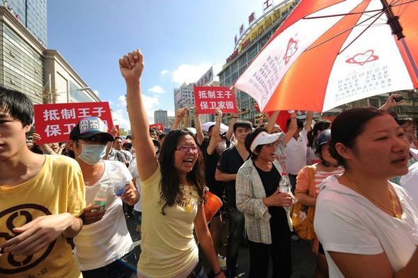
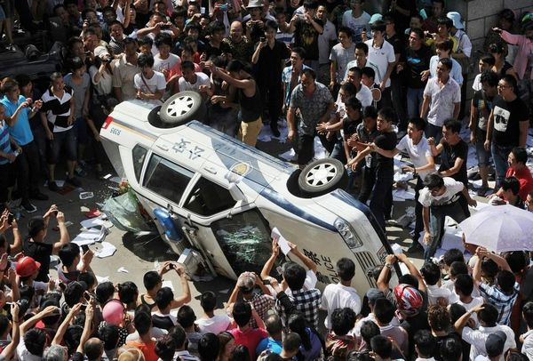

# ＜开阳＞信息透明是抗争制度化关键

**无法绕开的现实是，在可预见的未来，中国的抗争行动还将继续增加。执政者需要了解的是，绝大多数抗争是基于具体的可见的利益诉求，是一个地区的民众对于地方政府特定支持的下降，而国人对于制度的普遍支持，依然维持在一个比较高的水平。正是在这样一种差序政府信任的格局下，抗争性政治的制度化才既有紧迫性又有可行性。制度化后的抗争既不会挑战到根本制度，又可以有效化解矛盾冲突，也为中央观察地方提供了一枚透镜。**  

# 信息透明是抗争制度化关键

## 文/赵蒙旸（香港中文大学）

 

反觇这几年的群体性事件，媒体和意见领袖在事后总结的时候，在抗争的一方上，一般会突出公民社会的发展，民主意识的萌芽，在政府一方，则会强调公信力的下降，刚性维稳体制的弊端。这是绝大多数事件的共性，也能够反映网络舆论的正常走向。但这些静态的结构分析面临三个主要的缺陷：首先，它没法描述具体的抗争过程的多元和差异；其次，它没法解释，在同样的结构条件下，为何有些抗争形成了官民互动的良性协商过程，有些则落入了暴力镇压与流血冲突的渊薮；最后，对公民社会等大词的使用造成了一种普遍的浪漫化倾向，浪漫化一个地区的民众，浪漫化年轻人的勇敢，浪漫化整个抗争过程，问题意识被抒情文字所取代。

理解当前中国的抗争性政治，应该秉承多元的视角，既要静态剖析，又要动态勾勒，既要立足本土，又要目观国际，既要有普世的情怀，也不能丢弃社会科学的方法论。

#### 公民社会视角的得失

当我们谈论公民社会时，我们在谈论什么？有观点认为，非政府组织是推动公民社会的重要角色，有的观点则指出，公民社会是历史演化出的一种结果，是无法靠一群人的努力“建立”起来的，也有研究者通过构建指标体系寻求量化公民社会的办法。不管怎样，公民社会的强弱确实对一个社会抗争的程度和模式有着深层的形塑作用。

针对剧变后的东欧社会，政治学者达伦多夫曾提出著名的民主化“三种时钟”理论：在变革发生之后，政治家和律师的时钟是最快的，他们几乎能在一夜之间起草新的宪法；经济学家的时钟其次，他们需要更多时间将计划经济转向市场的轨道；而公民社会时钟是最慢的，如同磁场一样缓慢地调节着深层的文化传统。著名社会运动学者，政治过程模型的提出者道格·麦克亚当也试图在自己的理论中植入一种文化的取向，他将民众的认知解放（Cognitive Liberation）看作社运兴起的关键：面对扩大了的政治机遇，依靠内生的组织和网络，行动者还需要的是寻求改变的意愿，以及把握这种机遇的能力。不仅是个案研究，更大范围内的总体调查也证明了文化的作用：从亨廷顿到英格尔哈特等一系列转型学者的研究显示，在对权威的崇拜、传统价值观、自我表达价值观等多个方面，国别差异非常明显，且与社会的经济水平和发展道路密切相关。

然而需要指出的是，公民社会也好，民主文化也好，是否可以成为解释目前中国社会抗争模式差异的主框架，是值得商榷的。针对中国近些年的抗争为何屡屡陷入暴力维稳的怪圈，一些学者会从公民社会发达与否来解释，比如有观点就认为沿海城市的公民社会较为发达，抗议处理更容易走向理性协商。笔者认为，这种解释避重就轻，忽视了一些更深层次的问题。

首先，公民社会的概念不管在国际还是国内都存在分歧，是个很难量化的对象。对其进行量化的尝试也有，最著名的是莱斯利·萨拉蒙的全球公民社会指数，它涵盖非营利部门的规模、可持续性、影响力三个一级指标，在此基础上引申出十四个二级指标。但遗憾的是，萨拉蒙进行的只是国别分析，且暂未将中国纳入其中。其次，就整体的文化价值观而言，地区间的总体差距正在缩小。互联网的赋权作用保证了至少在信息的获取上，经济不发达地区也有相当一部分人能够接收到和经济发达地区一样的资讯。最后，正如上文所言，公民社会是个静态的概念，不适用于动态的过程分析。事实上大量的实证研究已经证实，浅层的社会网络和策略使用比深层的公民文化更具有决定行动成败的意义。文化的视角当然不能抛弃，但这是一个宏观和长期的变化，套用在微观和短期的分析上不太合适。

所以，动态视野下的抗议政治学有更强的解释力，它甚至可以被看做一个单独的变项，揭示出静态条件下无法显现的问题：包括复杂系统中各个要素间内在的关系，突发事件导致的各种可能等。这也是事件方法分析优于结构制度分析的地方。

#### 抗议社会学在中国

笔者认为，如果将抗争过程理解为一种动态的博弈，则更能以差异而非共性的视角来理解当前中国的社会抗争。

这里首先要提到一个“抗议招募”（Protest Recruitment）的概念，按照西方抗议社会学的视角，公民仅仅认同一个行动的理念是不够的，他们还需要被组织者所招募，才可能构成一个完整的社会运动。而公民是否选择加入某个特定的行动，取决于其门槛（Threshold）。门槛的概念最初由经济社会学家格兰诺维特于1978年提出，他在论文中对其的定义是：一个人会看到多少人或多大比例的人采取一个决定时，才会采取相同决定；这一点是此人净效益超过净成本的门槛。

门槛概念提出三十多年，在多个学科领域中得到了运用，这其中就包括传播研究。去年末，《自然》杂志下的科学报告网站公布了牛津互联网中心和萨拉戈萨大学的合作成果，研究人员对2011年5月西班牙抗议的数据挖掘显示，成功的网络抗议招募过程大致包括三个阶段，首先需要的是广播站式的人物，在单向关注网络中，这些人物通常有大量的关注者，而很少关注别人，表现为很高的节点中心度。这些人物发布的消息随后被门槛较低的”招募者“所转发和评论，造成了招募爆炸（Recruitment Bursts）的效果。第三步是最关键的阶段，低门槛的用户招募到了大量中间门槛的个体，拥有人数优势的”散布者“将消息从小集团带向大社区，完成抗议的大面积传播。

然而，虽然传播规律是互通的，中国的大多数事件无法享受到如此畅通的传播渠道，具体的传播路径也容易发生畸变。以上月发生在四川什邡的抗争事件为例，我们看到，一场典型的邻避运动，在得不到事前有效动员的情况下，演化成了当地政府的强力维稳，其与上段所提到的西班牙抗议的最大不同，就在于传播路径。西班牙抗议由于经过了充分动员，在政府选举前就越过了传播的引爆点，达到了关注的最高峰，从而给了执政者很大压力，逼迫其做出让步。什邡的抗争在事前的传播非常不充分，甚至可以说是滞后的：钼铜项目开工典礼后的三天时间里，什邡人向微博名人发出的求救没有获得回应，所有的讨论都局限在本地范围内。确切地说，直到流血抗争的图片被参与者传上了微博，传播的引爆点才在线上出现，整个网络的招募爆炸才得以实现。一言以蔽之，西班牙人是先动员后抗争，什邡人则是先抗争后动员。

事前动员的弱势，取决于很多原因。从地理上来看，什邡地处内陆省份，又是县级市，没有大量居住于其中的知识分子和媒体人，内生组织强度较低，缺乏北上广等地密集而丰厚的博弈资本。其次，由于官方的事先阻挠和各个击破，民众间基于共同责任与风险的内部信任网络（Trust Network）难以搭建。第三，外部支持网络稀疏，缺乏来自其他地区的声援。

抗议政治学中有个经典概念叫政治机遇结构（Political Opportunity Structure），根据其提出者彼得·艾辛格的界定，就是在相异的政治环境下，行动者实现利益的可能性存在差异。在中国语境下，如果行动者的政治机遇结构欠缺，他们的抗争途径将大大萎缩，行动主体一腔愤懑，却有心无力。一方面，为了在有限的资源条件下扩张议价（Bargaining）空间，行动者不得不放弃对安全等因素的考量，将对峙引向冲突，将冲突引致暴力。另一方面，由于行动者资源的匮乏，官方往往高估自己的控制能力，低估镇压的成本，也更倾向于无原则地对一切挡道之人采用极端手段。绝望的行动者加上愚蠢的当政者，共同将事件推向暴力的深渊。震撼的流血场面，确实也带来了极佳的情感动员效果：残酷现实加上集体记忆，将国人愤怒的泥沙全都淘洗到了情绪的表层。

由此可见，当前抗争滑向暴力的趋势，更多是博弈双方力量悬殊的结果。我们甚至可以大胆假设，在尚有行动空间的前提之下，官民之间的力量越悬殊，传播的滞后效应越明显，暴力出现的可能性也就越大。

当然，也无须对此趋势过于绝望。艾辛格的“政治机遇结构”基于他对美国都市族裔抗议的考察，他在研究中同时发现了后来称之为“抗议的悖论”的现象：在极度不开放和极度开放两个极端上，都不容易出现社会运动。如果政治环境达到理论上的完全开放，民众没有必要通过抗争手段来争取权利，而如果环境绝对压抑，抗议则根本没有萌芽的可能。上世纪90年代以来中国社会抗争数量的增加，行动模式的多元，解决方式的迥异，恰恰说明了在中国的不同地区，政治机会结构虽然呈现出一种梯级分布，但总的来说一直处于“在路上”的前进状态。因此，我们也可以总结出目前地域抗争频发的深层动力：政治机遇结构处在从绝对封闭走向绝对开放的进程中，这种基于中间的游离态是中国抗争性政治的基本土壤。

#### 走出滑向暴力的恶性下旋

目前需要警惕的是，民众的抗争行为和官方的回应策略，在相互演化影响的过程中，不是学会如何进行对话，而是复制如何使用暴力，最终走进一个恶性下旋。

在研究西方的社会运动时，学者们都会强调“制度化”的重要性，即民主国家通过完善法律法规，开放公共空间，重构了民间社会与国家间的关系，将随机的，特定的抗议方式转化为有序的，固定的模式。社运从一颗威胁国家的手榴弹，变成了抒发不满的安全阀。某种意义上说，制度化后的抗争演化为一种心照不宣的表演：行动方如何选定路线，如何呼喊口号，如何提出诉求，管理方如何控制人数，如何出示警告，如何平息骚乱，都有一套事先确定的规范动作。随着抗议次数的增加，双方对彼此也掌握得更为清楚，信息上的盲点越来越少，一切都在行动主体的预料之中。

由于转型社会利益主体的丛生性和多元化，中国社会已不可能浇灭所有激发抗争的因子，留下的道路，只有一方面开放传统政治空间，将不满吸纳进传统的解决模式，一方面寻求将抗争政治常规化、制度化。而信息透明不仅可以扩展传统的政治管道，也是抗议制度化的第一步。信息的自由流动带来的不只是民众信息拥有量的提升，更重要的是为共识的达成创造条件。人类有着天然的交流欲望，当信息阻滞时，民众就会自发地创造以谣言和小道消息为代表的信息黑市，并逐渐形成信息获取的路径依赖，如果多数民众都将“不真诚”当做政府的头号标签，对话的平台已经被拆毁了。

遗憾的是，遇到传播失控的情况，上层的第一反应总是会诉诸审查，去干扰甚至切断传播链条。事实上，正是信息的封闭会在抗争群体中制造绝望的情绪，逼迫他们采取极端手段来实现诉求，从而使得本来非政治的维权运动和邻避运动走向激进化。不少经验调查也证实了这个假说：在对穆巴拉克主政期间埃及抗议的研究中，耶鲁大学研究生哈桑普尔通过建模计算发现，干扰网络和通讯设施不仅没有平息抗议，反而使得抗争程度和社会不安大大加剧了。相反，没有审查和干扰的完全连接状态则在某种程度上有利于局势的稳定。

如果说信息透明是消弭暴力的一贴良方，社会网络则是抗争传播的关键。麦克亚当认为社会运动传播的类型、速度和程度都依赖于内生网络的强度和广度。由于地域间在政治地位、经济发展、政策导向等方面的不平衡，内生网络间的差异不可能完全消除，内生组织的建立和孵化肯定有快有慢。但是这不妨碍各地根据实际情况进行组织倡导。长期来说，要获得有利的动员结构，还需要通过社区营造、媒体赋权、公民教育等方式，降低公众主观参与的门槛，这个门槛不仅是一个范围内所有成员的平均数，更多要看这个群体中的门槛分布：拥有不同门槛的个体的数量对比。在传播的策略上，则必须关注先抗争后动员的滞后传播现象，通过寻找传播中的关键节点等办法，尽力提前传播的引爆点。事实上，一个充分的事前动员，非但不是鼓励对抗，反而对博弈双方都有好处。地方政府与民众间的力量差距越小，就越有可能建立相互间的威慑平衡，越有可能诉诸谈判桌而非催泪弹，越有可能找到危机解决的良性机制。

无法绕开的现实是，在可预见的未来，中国的抗争行动还将继续增加。执政者需要了解的是，绝大多数抗争是基于具体的可见的利益诉求，是一个地区的民众对于地方政府特定支持的下降，而国人对于制度的普遍支持，依然维持在一个比较高的水平。正是在这样一种差序政府信任的格局下，抗争性政治的制度化才既有紧迫性又有可行性。制度化后的抗争既不会挑战到根本制度，又可以有效化解矛盾冲突，也为中央观察地方提供了一枚透镜。在此共识下，讨论制度化的前景绝不是空中楼阁：信息透明、社会网络、传播策略，构成了抗议制度化的三个支点，是未来抗争性政治需要关注的核心问题。

 

（采编：楼杭丹，责编：楼杭丹）

 
