# ＜开阳＞关于闽粤桂琼四省人民的中国公民身份的理性探究

**其实，无论是福佬人，还是广府人，客家人，闽粤桂琼三大族群哪个没有这么一个永远的中原梦呢？我们保留了不同时期的中原古韵，坚持宁卖祖宗田，不忘祖宗言。我们保留了最完整的中华传统文化。**** ******

**我们都是无比爱国的。我们世世代代都在渴望着在中原能过来一个真正属于华人的国度的到来。但是为什么，我们想要等到为什么我们等来的，却是一次又一次的迁界禁海呢？为什么我们一直这么爱国，为中国做了如此多的牺牲和贡献，却还是跟二等公民一样呢？******

 

# 关于闽粤桂琼四省人民的中国公民身份的理性探究

## 文/闷骚男一号（清华大学）

 

#### 一、前言

现在大家说到中国的经济发达地区，喜欢说到“南方沿海地区”是吧。然后到底南方沿海地区是什么样子的呢？

笔者把中国大陆51个沿海的地级市和省管县的海南岛按照2010年的人均国民生产总值排序，然后把人均GDP大于等于4400美元的城市和海岸线涂成红色，把低于4400美元的城市和海岸线涂成绿色。于是得到这么一幅图：

[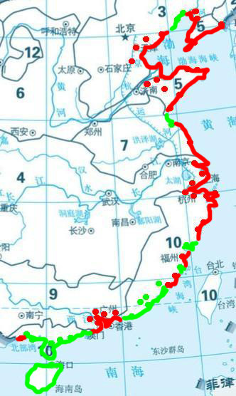](f7c2b3a6-9d6e-4034-9711-c994b73011a0.png)

可以发现，北方一片飘红，仅有连云港和锦州、葫芦岛两小块人均GDP稍低于4400美元。往南到了福建便已经是贫穷地区和富裕地区交错。等到广东、广西和海南的沿海地区便是一片惨绿，遍地都是萧条，除了珠三角一小块和防城港之外都是欠发达地区。而且注意到当年的经济特区和沿海开放城市中人均GDP最低的四个：湛江、北海、海南、汕头。注意到他们都是广东或者曾经是广东的。

闽粤（包括广西和海南）到底发生了什么事情？为什么闽粤这种人杰地灵的地方经济会如此落后？到底这几十年来闽粤发生了什么事情？我们将一一进行探究。

#### 二、经济

首先我们要探究一下那些惨绿的沿海地区为什么是惨绿嘛~~~

**2.1 改革开放前，海峡西岸**

所以一开始我们来看看最北边的贫穷的闽东北的宁德。咦，看这是什么？

[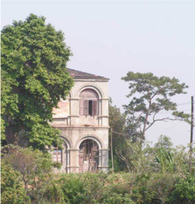](1175f956-8ac3-4482-830a-e3bad9f5628e.png)

这是宁德的三都澳福海关遗址啊。当年福建三个海关管辖了三大通商口岸：厦门（厦海关）、福州（闽海关）、三都澳（福海关）。结果现在厦门和福州经济发达，为何在宁德变成这样子了呢？

[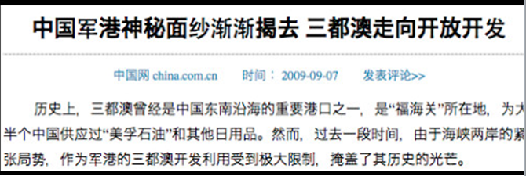](7f5926dc-dae8-4e97-b757-7534e83743f0.png)

原来的三都澳，跟福州厦门青岛大连一样，都是中国的对外通商口岸。而现在因为宁德港口条件比较好，又离台湾比较近，三都澳港被海军用作对台战斗的军事基地，于是宁德到现在还是非常贫困的地区啊~~~

其实当时宁德也不是特例。看当年汕头的情况：

[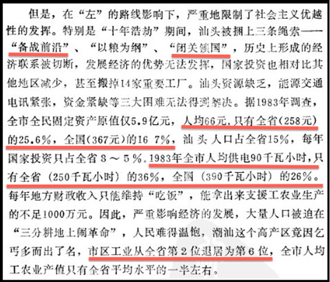](cb6cd1a3-3d7e-42de-9af0-700436773697.png)

原来在改革开放前，并不是简单的“国民经济受破坏”。而是南方的接近港台的南方沿海地区，尤其是海峡西岸被认为是前线，然后直接被牺牲了。

**2.2. 九十年代初，海南**

然后我们来看看海南经济特区~~~到底海南发生了什么？我们可以看看最近出版的《朱镕基讲话实录》中朱镕基总理在92年的讲话：

[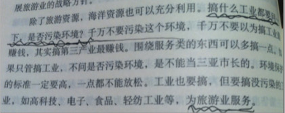](a557d978-c88f-4a11-9fdd-373166e52ac1.png)

朱镕基总理专门叫海南发展什么工业都要请示——不能跟其他的沿海发达省份一样大力发展工业。然后我们看到海南的人均GDP占全国的百分比：

[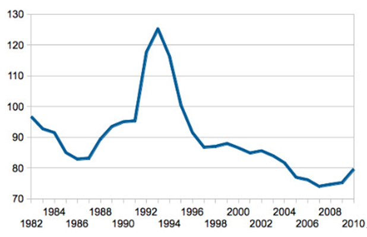](5b955d1b-934e-47c3-8c27-7ed2900bb144.png)

一开始海南跟广大南方地区一样都是低于全国平均水平的。后来在80年代末上升迅速。等到94的时候，在中国经济高速发展的背景下，海南无论是GDP还是人均GDP都极速下降。之后十年相对平均水平稳步后退，现在是彻彻底底的贫困地区了，只有全国的70%多。

然后我们来看看94年海南发发生了什么。这是来自中宣部和中国新闻出版总署的《强国之路——几年改革开放重点书系》中的《中国经济特区史论》：

原来，这就是朱镕基所说的遏制海南经济过热的手段啊——把承诺的政策都收回来。海南的经济崩溃被宣传为朱镕基遏制过热的一个重要政绩！注意到海南的银行顺便在当时就破产了。

然后我们看看98年,海南经济已经崩溃的时候朱总理怎么说海南的：

[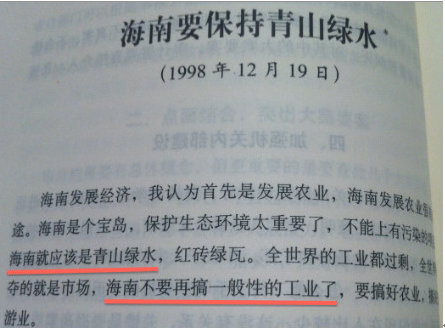](06eb6b9b-2354-48ef-ba06-2960d2abded9.png)

当时海南经济已经低于全国平均值了。在总理的英明指示后，海南经济继续一路走低~~~然后还注意到里面叫海南多发展农业。我们来看现在海南的农业：

[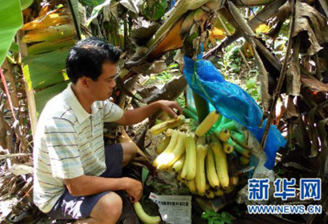](c7dd3c4d-2297-445c-94e5-fc3309992f4c.png)

原来海南的农民香蕉卖不出去只能烂掉。可是同时我们看到：

[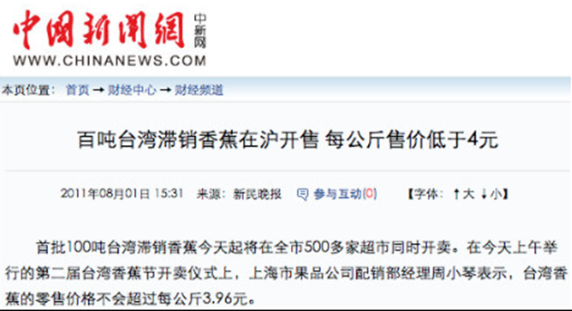](c227f3ac-c8e2-4b69-830f-952b42083387.png)

非常好。原来中国台湾省农民东西卖不出去中国政府要用国家力量去帮助他们，中国海南省农民东西卖不出去中国政府不仅不帮助，还进台湾香蕉来冲击市场，让农民更加卖不出去香蕉。其实海南的条件可是一点也不比台湾差哟。都是中国的宝岛，两个岛上人民也都是以闽粤移民为主，为什么命运差别这么大呢？

**2.3. 90年代，广东**

好，看完了福建和海南，我们来看看广东。93年末也就是是海南死掉的前一年，敬爱的朱总理见了广东和海南的领导，为促进广东发展而进行了一个改革：

[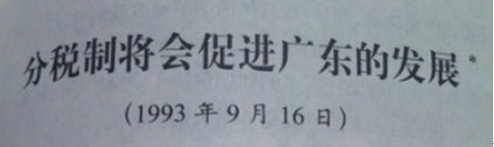](52fcb12a-9ea5-4817-8672-25afb2c20cfc.png)

朱镕基在其中讲到：

[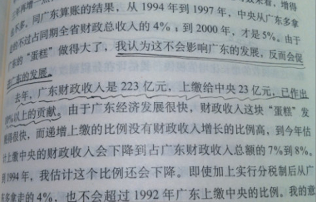](f4624d87-b010-434b-b765-3a51946accfb.png)

非常好。拍胸脯保证《实录》“说真话”的朱总理，在那番言论9天后又发表了一次讲话：

[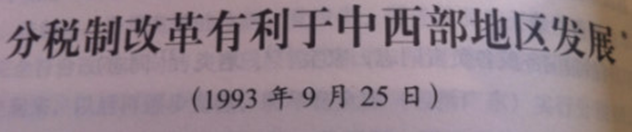](433bd5ea-5f45-4618-95c7-f30883a935f0.png)

然后里面说到：

[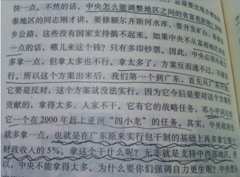](1d0c810d-621f-442f-a77e-f1cc9db2ad5a.png)

朱镕基刚刚说过，在广东拿的钱不会变多。过了9天，朱镕基就变成说要拿包括广东的东部沿海地区的钱来支持中西部。

笔者和朱镕基一样，都是清华大学非经济管理专业出来的非专业人士。所以笔者就不明白到底这个改革是有利于包括广东在内的东部沿海地区发展呢，还是有利于中西部发展呢？我们来看看数据吧。我们在东部地区的华南、华东和华北选择广东、浙江和北京三个省份；在西部地区的西北和西南我们分别选择甘肃和广西。下图是1996年和2010这些省份的GDP占全国比例对比93年的比值：

[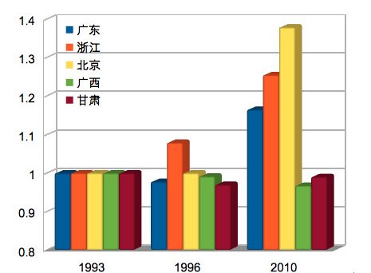](627213bf-5654-40b8-bea2-a469ab468eed.png)

除了94年直接经济崩溃的海南，分税制改革短期富了谁穷了谁，长期又富了谁穷了谁？一目了然。

**2.4 九十年代末，粤西**

看完了福建、海南和广东，我们来看看广西的北海和北海旁边的广东湛江。

这是湛江和北海的人均国民生产总值和中国全国水平的比值：

[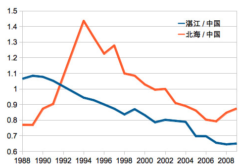](9fa15a79-df7b-4977-85a8-ccfad7d70c7c.png)

原来邓爷爷说的“北有青岛，南有湛江”的湛江，从原来高于全国平均水平的发达地区，自1989这个神奇的年份开始一路走低到现在只有全国水平的60%多呀。至于北海，我们可以看到94年和98年两个坎下降明显哟。至于94年的下降跟广东和海南是同步的，那么98年，北海市的GDP直接下降了8%还要多，这是因为什么呢？试看一份1998年的《汕头日报》

[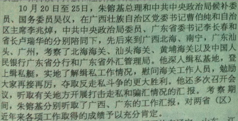](137cb33a-8a81-4303-9370-6ace93c9246b.png)

原来朱总理参加了北海、汕头、广州六日游啊。因为分税制改革之后，关税变成了国家税，于是朱总理就来南方旅游了。于是北海的经济就变成了上面所说的这样子。

其实98年除了北海和汕头，我们看到之后的湛江走私案和厦门远华案，也是一系列的活动。朱镕基为了他的国家利益把海岸线变成了新的长城。这是他在六日游倒数第二天在广州的讲话：

[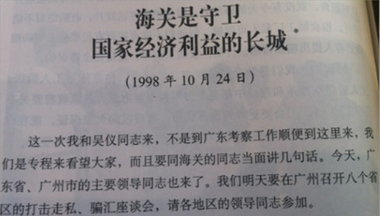](ecf07fa3-65f2-4f73-8317-dc80b537d42a.png)

打击走私之后，那些小偷小摸的勾当停止了，那么北海港啊、湛江港啊汕头港啊国家统计进去的港口吞吐量应该大幅度上升呀。但是我们看一下1993年和2009年苏州、湛江、汕头和北海的港口货物吞吐量分别占这四个港口总和的比重：

[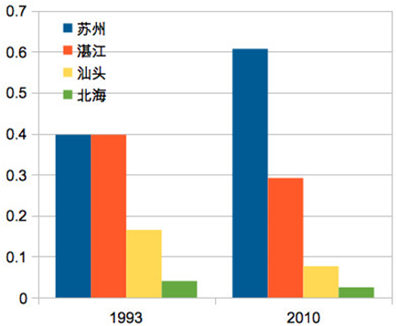](de63124e-df9b-4f53-90b4-ca9d262d4e0a.png)

原来这就是朱镕基在南方沿海铸造的长城啊~~~

**2.4. 21世纪初，潮汕**

非常好，看完了广西和粤西我们来看看粤东地区曾经是中国第三大港口，商业之盛居全国第七的都市，四大经济特区之一的汕头。首先我们来看看2000年朱总理讲了什么：

[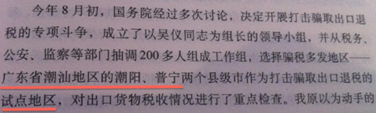](6922a812-41a7-4052-a9be-cbe88d79736e.png)

原来南方沿海的海关变成了长城之后，接下来就是要整顿国家的退税呀~~~而且是“试点”潮汕呀。我们具体一点，看看国家给地方工业企业退税是怎么回事：

[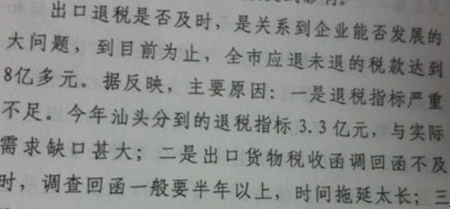](ac03c194-7156-47eb-8b02-4cd1d52d7803.png)

原来国家一方面法律规定了退税的比例，然后竟然每年分配给每个省每个市的退税总额都是确定的，而且还经常不够呢。如果不够了，国家就欠着退税不还了呢。所以骗退税什么的应该不会增加国家的支出呀？也许是因为这些人让一些正经的商人拿不到退税配额，扰乱了汕头的经济秩序，所以这属于国家损失。那么打击后汕头应该经济会更加健康发展啊？我们来看看汕头城镇居民收入和全国水平的差值：

[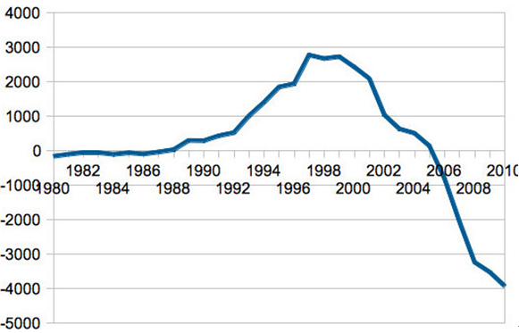](f026d3af-3a31-4b3e-8de2-073e6719bb1d.png)

注意数据显示汕头改革初期因汕头作为前线而被落后。还有98年汕头海关变成长城后，汕头人收入相对全国水平便开始下降。然后我们发现，在打击骗退税之后汕头2001年GDP负增长2%，并不是预料中的经济秩序整顿导致经济快速增长。而且跟全国对比汕头经济一降就是10年。这为什么呢？

[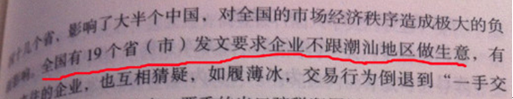](cb6ccd7e-f8db-4ebb-8014-9a90d17f425e.png)

如果说是国与国之间的话，这种经济封锁是仅次于宣战的高级别的敌对行动之一了吧。然后那19个中华人民共和国的省怎么可以下令封锁潮汕地区呢？而且我们还注意到，类似于94年海南的银行破产了，01年汕头的银行也非常合作地破产了。

接下来我们看看98年朱总理对广东的香港和江浙的上海发表了一番什么言论：

[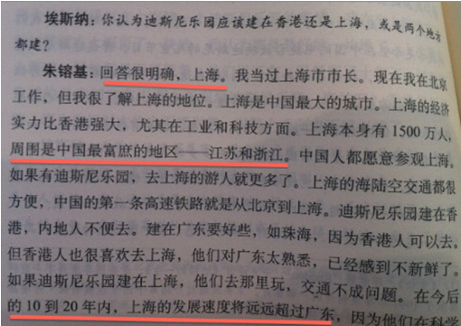](2ef2742a-1933-4a57-af4f-5af5183c4cca.png)

中国总理朱镕基见到美国企业迪士尼的老板，要求迪士尼不要在中国香港投资建造迪士尼乐园，而要在中国上海投资建造迪士尼乐园。而且他底气十足地炫耀上海的经济腹地的广阔和富庶，说上海比广东前景更加光明。为何他这么自信呢？原来他心里已经有一个完整而且稳步实施的计划了呀：

93年末朱镕基会了会海南领导，94年海南GDP负增长；98朱镕基去了北海，98年北海GDP负增长；00年末朱镕基试点潮汕，01年汕头GDP负增长。于是便出现了文章开始显示的南方的那一片惨绿。朱镕基自信的说“上海周围是中国最富庶的地区——江苏和浙江”，自然是因为他知道香港周围（将会）是中国最贫穷的地方——潮汕、湛江、北海和海南。

#### 三、文化

看完了经济数据，我们再来看文化。

**3.1. 语言**

首先，一个地方的文化，最重要的就是一个地方的语言吧。于是我们看到:

[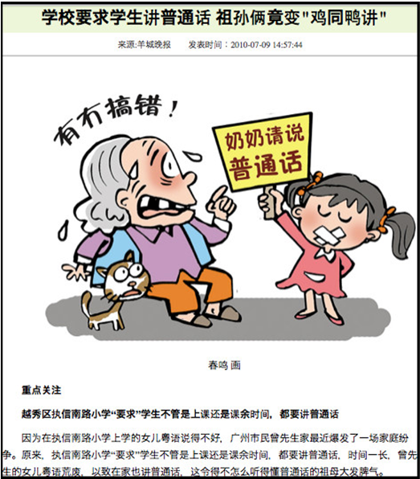](94293529-6f67-4774-bc3a-2212aa4f0580.png)

原来通过国家控制的教育机构和人才选拔体系，来慢慢侵蚀粤语消灭粤语等语言啊~~

**3.2. 历史文化遗迹**

语言之后，就是历史文化遗迹了是吧。于是我们看到：

[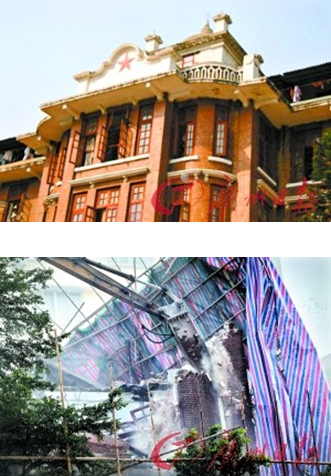](71bd4edc-e3c9-43c3-ab2a-b961b46dba60.png)

这么漂亮的民国时期留下來的古建筑就这么被破坏了。专家说法是它不是文物保护单位。于是我们来看看全国重点文物保护单位的名录。我们看到北京有98处，广东只有66处~~~原来北京的文物是文物。广东的文物就可以这么拆掉啊。

**3.3. 关于广东文化的官方宣传**

然后我们看看毁灭广东本土文化的同时，官方宣传说了什么。首先我们来看看神文《含泪劝告请愿灾民》的作者余秋雨先生对笔者的学长饶宗颐先生的高度赞扬：

[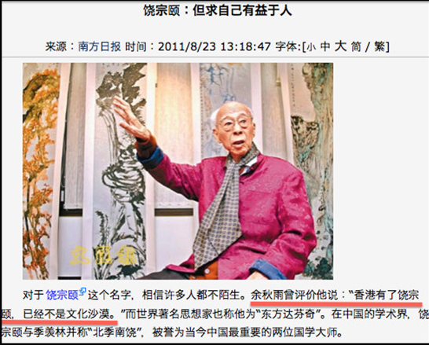](1dbeaf43-9241-475b-ab31-12a23b57344f.png)

看到没有，原来香港有了饶宗颐才不是文化沙漠啊。在御用大师余秋雨的对南方、对香港的概念中，香港就一直是蛮夷之地啊——宋明的广锅啊，刺桐港什么的都超钢了，现在的有钱人比如李嘉诚什么的是暴发户；科学家国学家比如高锟啊、丘成桐啊、饶宗颐啊这些是华人跟香港是没关系的；然后香港文学和流行文化因为不是英语就是粤语，反正都是鸟语——所以不管是广东还是香港，总之南方都是文化沙漠的嗯。

然后说说饮食文化：我们知道这个人是SARS的第一个报告的病例：

也就是2002年12月就有病例了，然后我们又看到：

新闻办授权发布的时候已经过了好几个月了啊~~~可是这时候我们注意到后来，大家在说为什么会有SARS的时候，社会上的舆论不知道为什么就变成这样子了：

粤菜和潮菜无疑是世界上最精致、最好吃的料理，香港是世界上最好吃的都市。而且也只有在比如法国和广东这种经济和文化都长期高度发达的地方才能发展出来如此高水平的饮食文化。然后广东人的饮食习惯却突然就变成了广东人野蛮的例证——而且竟然还能吃出SARS。不仅还能吃出SARS，还能吃出SARS大流行。真的是太伟大了。

如果你还不相信这种文化上的毁灭+污名化是跟经济上的打压同步的话，我们可以看看旁证。前面不是提到过潮汕的经济被搞垮嘛，在那个时候我们看到对应的宣传：

我觉得我把“汕头”换成全国其它任意一个城市然后贴到任何一个论坛上面去都会被认为是地域帖被删除的吧~~~但是它现在就是妙语录了哟。

当然我整天举汕头作为例子也不好，我们来看看上海。我们注意到当年牛逼哄哄，咄咄逼人，要香港迪士尼搬过去的大上海最近换了一个书记。于是今时今日上海市的经济就这样：

于是最近崔永元又上来了。这是崔永元讽刺上海人拜金媚外：

如果你还觉得广东文化的污名跟前面列举到的经济打压没有关系的话，那我也没有办法了。

#### 四、教育

我们一直被教育说教育是民族的未来嘛。而我们知道教育部直属的拿着国家财政的清华北大什么的都在北京对吧。就我们来看看广东的未来吧，这是北京大学名额分配情况：

清华类似，上清华北大的难度都是广东最高。广东是给国家上税最多的省，也是(上税-国家投资)最多的省。北京大学的经费很多是广东拿的吧，因此理应给广东最多的名额，至少比江苏山东多是吧。退一万步说，我们要公平，广东是人口最多的省，也应该给广东最多的名额吧，至少比河南安徽多是吧。可是现在广东的名额比北京、山东、河南、江苏等所有省份都要少是吧。

如果觉得清华北大总的招生名额分配还不够刺激的话，我们来看看清华的国防生。咦？广东呢？原来清华不在广东招国防生啊~~~

如果这时候你还可以说，因为广东（我们忽略非珠三角地区）是经济发达地区不屑于去国防生的话，我们来看看国防科技大学的招生名额分配情况。国防科大前几年可是计算机学科全国第一哟。

这是2011年每个省的考生数除以国防科大分配给每个省的名额得到的数据。除只有1.8万考生的西藏，广东的名额是最少的也是最受歧视的，竞争程度足足比第二名高出了一倍还多。如果说北大的话，广东竞争激烈程度只是比江苏山东高一倍多，现在则是高出三倍！！！这张统计表只是竞争最激烈的12个省。至于东北啊，北京天津啊，湖南啊，进国防科大比山东还要容易。

看来不只是不能让太多广东人进清华北大掌握知识，不能让广东有太多“未来”。而且在这个不知道是党指挥枪或者枪指挥党，但是很明确的是党和枪一起指挥国家的国家，是千万不能让太多广东人进国防科大、去领导军队的是吧。

#### 五、高科技产业

现在产业结构升级啊，高新科技产业什么的很重要的是吧。我们看到北京和广东都在建设高科技产业。

北京嘛，自然重点建设的有IT产业是吧。毕竟这里有歧视广东考生的清华北大提供技术支持的优势。比如搜狐啊新浪啊网易啊，微软亚洲研究院啊谷歌总部啊，通通都在北京对吧。

广东自然也有，记得上面讲到的朱总理说的“试点打击”的潮汕地区的潮阳市吧。现在他们有了海关长城，又退不了税，工商业都搞不了了，于是他们也搞高科技：

嗯，潮阳贵屿镇的电子垃圾回收产业。美国人都知道他们了。很多美国的左派把这个当作美国人残害发展中国家的论据。实际上，是亲爱的朱总理来了之后，他们才只能收电子垃圾里面的重金属维生的。

而你知道广东真正全国领先的高科技产业是什么吗？答对了！就是核能发电。首先我们注意到我们核电站都是从广东、浙江和福建这些东南沿海地区开始建造的。而且我们广东有一个非常有名的中央企业“中国广东核电集团公司”！下面是该公司的项目，红色，蓝色和褐色的点分别是运营中，建造中和规划中的核电站：

广东密密麻麻的就不说了。注意到上面提到的宁德三都澳，从原来的大商港，变成了正在建设中的核电基地。

这我就觉得奇怪了~~~如果我是规划者，我觉得核电站可以从广东移动到京津唐地区去，然后减少山西、内蒙古、辽宁的烧煤量。然后广东多进口一些来自澳大利亚和中东的能源。这样子，首先广东本身就是离澳洲啊中东最近的地方（航运距离），进口成本在全国最低。然后山西省少挖点煤，可以减少矿难死人数，积点德。还可以保护中国的能源储备，以备战时使用。而且核电站在京津唐地区，还可以为那些两院院士们省省在北京和广东之间飞来飞去的机票钱。北方用核电，跟火电比几乎无污染，还可以让北京重见蓝天。那3000亿奥运经费可以剩下不少了。要知道港珠澳大桥预算才700多亿，奥运3000亿经费可以在珠江口建几个立交桥把港珠澳大桥变成港深莞广中珠澳大桥，或者在台湾海峡建几个立交桥变成汕厦榕-台北台南大桥了是吧~~~

这就奇怪了为什么领导人们那么没有成本意识呢？还是核电站这种东西就应该建在南方沿海地区。离北京越远越好呢？

#### 六、结语

我还记得小时候，在老厝里面，阿公阿嬷摇着扇子，跟我讲故事：很久很久以前，我们的祖先为了躲避战乱，不愿意被胡人的铁蹄所蹂躏，于是便离开了世代居住的中原，沿着海岸线慢慢南迁，最终来到了潮汕平原这片沃土上定居。我们还有一些亲戚，他们为了更大的自由，便漂洋过海，去南洋追求更好的生活去了。

其实，无论是福佬人，还是广府人，客家人，闽粤桂琼三大族群哪个没有这么一个永远的中原梦呢？我们保留了不同时期的中原古韵，坚持宁卖祖宗田，不忘祖宗言。我们保留了最完整的中华传统文化。直到49年很多华侨还一直坚持保留着中国国籍。我的家庭，好多代人都在暹罗工作生活，可是还是坚持回唐山，回来结婚生子。在49年，我们家也选择留在中国定居。闽粤的移民，到了台湾，到了南洋，到了美洲，无不坚持传统的中华文化，把中华文化传播到全世界去。他们聪明能干而又勤劳刻苦的性格，竖立了一个真正受到全世界尊敬的中国形象。民国时期，中国几乎全部的外汇都是来自闽粤华侨寄回国的侨汇。而现在，广东上交的税金是全国最多的，四川地震，广东省财政出了最多钱支援震后重建。

我们都是无比爱国的。我们世世代代都在渴望着在中原能过来一个真正属于华人的国度的到来。但是为什么，我们想要等到为什么我们等来的，却是一次又一次的迁界禁海呢？为什么我们一直这么爱国，为中国做了如此多的牺牲和贡献，却还是跟二等公民一样呢？

我们真的能等到一个真正考虑到我们，考虑到南方人民的幸福的明君来拯救我们吗？

 

（采编自投稿邮箱；责编：麦静）

 
