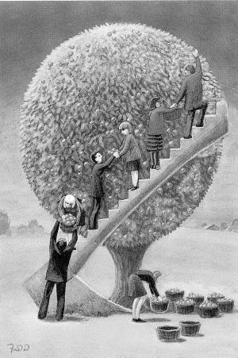
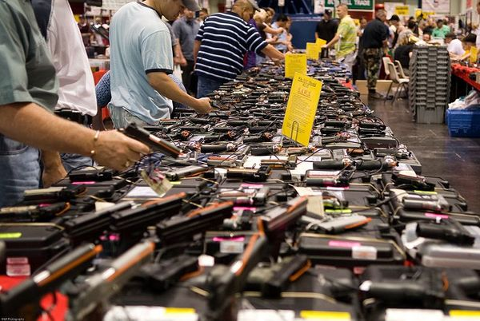

# ＜开阳＞凯恩斯主义的问题与出路（上）

**凯恩斯主义真的可以帮助经济克服危机吗？是否市场失灵就必然意味着政府的干预？是否政府的干预就必然意味着危机的消除和社会福利的增加？笔者以为未必，凯恩斯主义，不过一个陷阱。**  

# 凯恩斯主义的问题与出路（上）

## 文/徐定之（中南财经政法大学）

 

自从1936年凯恩斯出版《就业、利息和货币通论》，提出凯恩斯主义，并且在上世纪三十年代的经济大萧条中大规模应用，凯恩斯主义就俨然成为对抗自由主义的另一大学派，深刻的影响了世界的经济。凯恩斯认为企业和个人具有“动物精神”，他们的乐观和悲观情绪交替轮换，造成经济从景气到萧条的循环。所以，政府就应该审时度势，带有前瞻性地运用宏观经济政策，进行反向操作，保证经济的平稳运行，即“相机抉择”。

但凯恩斯主义真的可以帮助经济克服危机吗？是否市场失灵就必然意味着政府的干预？是否政府的干预就必然意味着危机的消除和社会福利的增加？

笔者以为未必，凯恩斯主义，不过一个陷阱。

 

**一、区别看待的政府和私人部门**

凯恩斯主义有意美化政府性质，丑化企业和个人。企业和个人具有非理性的“动物精神”，为什么政府就充满了人类理性？市场可能失灵，为什么政府就永不失灵？市场上交易有成本，为什么政府政策成本为零？市场上存在信息不对称，为什么政府却拥有充分信息？企业和个人是贪婪的，只追求私立，为什么政府会是仁慈高尚的，以社会福利为己任？最关键的一点，同样是人，为什么在企业中会有如此缺陷，一进入政府机关，就突然英明神武秉公无私料事如神，就能力挽被市场糟蹋的经济于狂澜，保一方国泰民安？

上面对政府性质的设定在现实中显然是不成立的。

政府的“动物精神”丝毫不亚于私人部门。在社会主义国家，有躁动而不切实际的“大跃进”，在资本主义国家，同样也存在美联储1930年雪上加霜的货币紧缩，日本央行1980年代一手制造的资本泡沫以及08年中国出台的四万亿救市计划。诚然，私人部门内部不存在紧密的约束和监督，它最大的目标是盈利，只要在法律允许范围内，资本会跑到任何一个有盈利的角落。而政府作为拥有公权力的机构，受到各方的监督和制约。然而，姑且不论对权力监督薄弱的某些国家，就是在民主制发达的西方，因为社会的高度分工化以及经济形势的高速变化，公众无法对有司进行有效监督。公众与政府的委托——代理关系一旦形成，代理人就可以获得相当宽泛的代理权。当政府进行某些超越代理权的操作，事发后，不管公众是否追认，客观恶劣影响已然造成。此时，能挽救此局面的又只有政府。于是又只能委托政府去救火，虽然当初这火就是他放的。谁叫一个国家就只有一个消防员。

政府也不可能为公无私。政府是由理性人构成的，这群人在市场中追求私利，为什么到了政府机构就不会追求私利？就算完善的法治限制了他们“造租”、“寻租”的能力，他们仍然可以努力增加政府这个独立单位的福利。比如，在正统凯恩斯主义那里，政府应该在经济萧条时减税和增加开支，出现财政赤字和负债；在经济繁荣期增税和削减开支，出现财政盈余。这是一个看上去很完美的理论，但在实际操作中却极难实现。为什么？因为一旦政府和民众尝了增加开支的甜头，你想戒掉就很困难了。增加开支，政府一方面可以获得更多的资金支配权，另一方面也可以获得选民的选票，经济政治利益双收。选民也可以得到额外福利和补贴，高兴的很。你让政府缩减开支？选民答应吗？你的政治前途答应吗？作风强硬如撒切尔夫人，任内减少开支，最后仍然抵不住民粹的压力，被迫下台。虽然事后证明她的经济政策挽救了英国的经济。

**二、无法回避的时滞难题**

政府对经济的所有干预都具有时滞。从政策的生效，到发生，必然有一段作用期。所以，“相机抉择”的经济干预应该是超前的。然而，变化莫测的经济形式如何可以预测得到？在纯粹的物理世界，人类目前能做到的最好的预测是天气，但还是被人诟病不已，并且准确的天气预测也只有三天左右。而在由兼具理性和非理想的人类构成的经济世界中，预测又如何准确？确实，通过对主要要素的分析，我们可以预测经济的大致走向。可这是非常粗糙的定性分析。如果要进行经济干预，就比如要设计到精密的定量分析。而作用经济世界的因素如此之多，随便哪里的一只蝴蝶动动翅膀都能乱了整盘局，你又怎么建立有效的回归函数进行预测和分析？一只蝴蝶也许在经济预测者眼里只是一个小变量，无碍大局。但人类对经济世界的认识远未全面，并且有些非理性冲动也是无法预测的。如果这只小蝴蝶最后煽动了整个盘面，之前的预测又该情何以堪？

更糟糕的是，一旦基于错误或有偏差的干预而进行经济干预，政府的力量作为一个额外施加的变量，很可能会使经济变动更大。就货币政策而言，弗里德曼通过对美国1869到1958年的货币供应量和GDP的分析，发现货币供应的波动领先经济的波动，货币政策引发了而不是“烫平”了经济周期。在图中，我们可以清楚的看到，货币供应量的波动领先了经济的波动。[1]

而从财政政策层面上，无论是税收还是投资的变动，如果政府的预测与现实经济情况，相反，那么出台的财政措施也就不是“相机抉择”，而是雪上加霜火上浇油了。

**三、名不副实的乘数效应**

所谓乘数效应，即自发总需求增加所引起的国民收入增加的倍数。通俗的说，就是政府花100元，这100元流入了社会，而获得这100元的民间也会相应花掉一笔钱，如此50元。那此时社会经济总量就增加了150元。

然而，私人部门是否愿意花钱？即，那流入民间的100块究竟会有多少被花出？

李生祥、丛树海通过建立宏观经济模型，分别测算了我国的理论财政政策乘数和实际财政政策乘数。经测算，两种乘数均不大，尤其是实际作用乘数的值明显偏低。测算结果如下[2]：

其实原因很好理解。如果私人部门愿意花钱，就不需要财政刺激。而财政之所以出手，就是因为民间投资和消费意愿不足。政府在经济萧条期修建铁路，因为在萧条期，民间预期惨淡，这笔流入民间的修路费的储蓄率就会很高。其次，在萧条期，就算修了路，又会促使多少人乘坐，从而拉动消费？再次，在当今技术越发先进的时代，投资高度自动化和机械化的工业和基础产业究竟可以带动多少就业？最后，政府出的这笔钱不是从民间征集的税款就是向后代征集的债务，最终还是要还的。但在经济萧条期，经济形势惨淡，政府为了挽救经济不免病急乱投医。这时出台的政府投资项目能否有盈利？其效率几何？都是值得追问的。

 

参考文献：

[1] CEIC.根据Milton Friedman & Anna J. Schwartz 文章中的Chart 5制作，见”Money and Business Cycles”, The review of Economics and Statistics, Vol 45,No.1,Part2, Supplement, Feb 1963,pp.32-64.

[2]李生祥，丛树海.中国财政政策理论乘数和实际乘数效应研究[J].财经研究.2004(1).

 

（采编自投稿邮箱；责编：麦静）

 
