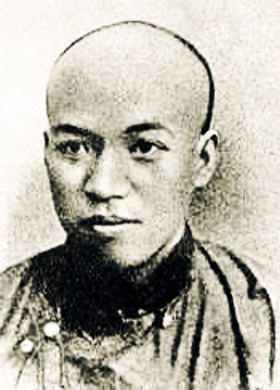

# ＜开阳＞十字路口上的艰难选择

**梁启超纵然辗转学界与政界，对于建造一个强大的现代中国的理想与实际都有体会，也都有建树，但恐怕他在落笔为文之际，甚至是终其一生，都不知道如何能使现实向着他理想的方向发展。大概虽宏愿在胸，现实中无从着手推行，纸面上便也无从下笔描画。纸上谈兵，竟也一难如是！**

# 十字路口上的艰难选择

# ——梁启超学术思想之我见

## 文/黄帅（山东师范大学）

 

献身甘作万矢的，著论求为百世师；誓起民权移旧俗，更揅哲理谱新知。

——梁启超《自励诗》

梁启超是近代中国知识分子群体中最完满的典型代表。无论是疾呼变法图强、宣传西方文明，还是提倡君主立宪，他的兴奋点始终与时代的兴奋点保持一致，其内心的矛盾和政治主张的“多变”，完整地反映了近代中国知识分子的思想历程。梁启超的许多真知灼见，恰似一条横亘在民族文化转型关口的江水——水浪翻腾，江流奔涌，这种饱含着对传统的洞悉、变衍、更化与对思想、文化、社会的崭新构想，既颠覆了传统意义上的朴学考察，又开辟了对中华民族新历史的宏大形象。在一个“千年未有之大变局”的学术环境与社会思潮的裹挟之下，与同时代人的学人不同——梁启超常常站在思想潮流的风头浪尖上昂，却又时常对传统进行回顾与思考。

俯仰之间，春秋流过，作为20世纪“第一代知识分子的代表人物”（许纪霖语），梁启超的“变”，恰是对“求为百世师”之“不变”的恒心。从晚清到民国，在一个有着章太炎、严复、王国维、康有为、蔡元培等大师的学人团体中，梁启超思想的意义，不只是对近代学术转型起到了过渡作用，其“开天下之勇先”的开拓精神，却使他的价值定位突兀而又卓越。而于今百年之后，在当代文化荒原上远望其悠远超拔的思想，或许更能体味梁任公那矛盾而又统一的观点，才能更好地理解他理想主义而又坚忍务实的思想吧。

一、 价值论的纠结：“新”与“旧”的冲突与调合

“法者，天下之公器也；变者，天下之公理也。”统而论之，梁任公的一生都纠结于新旧学说、新旧思想、新旧社会的矛盾之间，这种对心灵的张烈的焦虑，恐怕被当时之人所无法感知，亦为我们后人常常忽略竟或忘却。

对于梁任公的“新学”，则要回到对《新民说》的仔细研读中去。《新民说》可以说是中国启蒙思想的处女地，是充满原始气象的混沌之作。所谓“新”，一方面指“淬历其所本有而新之”；另一方面是“择其所本无而新之”。惟其混沌，气象和格局之大，后来者无人可比。有趣的是，这部集中展现梁任公思想的《新民说》内竟充满了矛盾的冲突与对传统的焦虑，这些则在其思想中表现为各种思想的紧张：破坏主义与保守主义，权利与义务、功利与义理、知识与德性、民权与国权、君子与公民、共和主义与自由主义、法律共同体与道德共同体……现代中国各种各样对立的思潮，都可以从梁启超那里寻找到最初的源头，五四的思想家们在接受了梁启超的思想启蒙之后，各自循着其思想中的一条路径，走向偏锋，最终发生不可调和之分化。此间忽然想起海外近代史学家黄克武先生曾将梁启超的矛盾思想称作“调适思想”，便更觉思目渐开。与具有突变性的转化型思想不同，调适思想则认为，新与旧之间没有截然区别的鸿沟，历史的发展是各种思想和历史合力的产物，是在传统脉络中渐进的、局部的改革。正是由于梁任公的“调适”与“调和”，避免了对传统的革命性地颠覆与破坏，更利于对未来文化重建之和谐渐进。任公于此处的良苦用心，竟被很多人误解为“多变”的心理和“犹豫”的人格，历史演进的荒谬与虚妄，着实令人扼腕可叹！

二、 方法论的抉择：新小说与旧社会的矛盾与统一

“六经不能教，当以小说教之；正史不能入，当以小说入之；语录不能渝，当以小说渝之；律例不能治，当以小说治之。”梁任公将改造国民思想的理想寄托在对新小说的创造与推广上，可谓“气魄宏大，当无人可与之举”。 在古典文学的范畴中，“小说”一词最早见于《庄子·外物》：“饰小说以干县令，其于大达亦远矣。”可见，小说本是“琐屑之言”“浅识小道”，而我们的国学大师却要竭力写好新小说，其间道理何在？新小说真的有对那个千疮百孔的旧社会有“妙手回春”的巨大功效吗？

“欲新一国之民，不可不先新一国之小说。故欲新道德，必新小说；欲新宗教，必新小说；欲新政治，必新小说；欲新风俗，必新小说；欲新学艺，必新小说；乃至欲新人心，欲新人格，必新小说。何以故？小说有不可思议之力支配人道故。”在《论小说与群治之关系》中，于小说与群治的相辅相成的意义，任公讲述得相当清楚，在此我若是重述先生的观点，不免同于牙牙学语。但对于其间思想脉络，我倒想“狗尾续貂”般地作出自己的理解与阐述。

“管中窥豹，可见一斑”，不妨选取任公《新中国未来记》的小说情节，于此暂作一时浅析。作为一部社会预言小说，《新中国未来记》的情节不过一个开头而已。开场是1962年，“我国维新五十年大祝典”，“万国太平会议新成”，而孔子旁支裔孙、教育会长孔弘道觉民先生在上海博览会上演讲“我们最喜欢听的”“中国近六十年史”。于是以六十年后的视角，“追述”想象中的前代事，亦即作者理想中的当代事。“未来”附体于“历史”，其中寄托，可谓深矣。于是乃有一黄克强毅伯先生创立立宪党，历经十年，终于立宪成功；再经五十年，则中国已雄飞于世界。一切的肇端，在于黄克强与同乡好友李去病留学欧陆，数载归来，一夕联床夜谈，将“革命与改良”的道理，辩驳尽兴。这“彼此往复到四十四次”的驳论，以白话讲说当时动荡人心的学理，确如书中“平等阁主人”批语所言，“文章能事，至是而极”。而于 “太初有言”之后，究竟开篇孔弘道先生盛世的时代如何到来，却付阙如。单从文学意义考察，小说南面有“质胜文则史”之嫌。

作为新小说的尝试，最终，梁任公也未能描绘出中国的这条腾飞之路。理想固然不受现实的拘牵，但怀有理想的人却始终离开不了现实的地面。梁启超纵然辗转学界与政界，对于建造一个强大的现代中国的理想与实际都有体会，也都有建树，但恐怕他在落笔为文之际，甚至是终其一生，都不知道如何能使现实向着他理想的方向发展。大概虽宏愿在胸，现实中无从着手推行，纸面上便也无从下笔描画。纸上谈兵，竟也一难如是！于是这部本意在于引导激励国民的学者小说，便从航海手册变为蓬莱画图，悬置美好的未来于前，却没有给出通达之路。

戊戌之后，面对惨淡的现实，任公的社会理想逐渐走向没落。这种充满反讽意味的结局，恐怕不是当年唱出“吾欲我同胞兮御风以翔，吾欲我同胞兮破浪以飏”之豪言壮词的任公足以情之可堪！

三、心灵的焦虑：历史理性与人本情感的纠葛与张裂

20世纪在近代中国，天国的梦想被打破，东西方两种独立的文明在其各自发展的结果上显示了令人不得不接受的优劣，于是历史和价值在许多中国人心灵中被分裂。正是由于看到其他国度的价值，梁任公才在理智上疏远了本国的文化传统。然而，由于受历史制约，在感情上仍然与本国传统相联系。

人生的历程可以有多重方向，但历史的抉择却始终充满了沉重的代价。面对20世纪初汹涌澎湃的时代潮流，梁任公在感情上，定然不能接受西方文化之东渐而造成的事实。和很多同时代的学人相似，他会常常回到传统特别是儒学上去，在冷峻的现实面前仍然梦想它是有生命力的，或者自己欺骗自己地认为它不会衰亡，于是自觉不自觉地去重新解释自己的文化，力图掩盖两种文化在价值上的歧异。

于此同时，在理智上，他的思想方法论又往往是西方化的。他在与传统决裂时的理智思考，则是以西方文化为参照系对本国文化的剖析批判，竟也往往言之成理，振聋发聩。在这样的时候，面对将死或已死的文化，他选择了猛然将自己的理智远离即将故去的心灵天堂，以避免引起内心里的混杂着澄澈与珍惜的对立痛苦。然而即便在这同时，梁任公的生活、行为又并不能摆脱传统的影响或规范。 此间矛盾对敏感心灵造成的极度焦虑，岂能是我等后人可以感同身受？纵然后世有“理解之同情”，除了写出一篇篇追忆先哲和评析其思想的文章，又能做些什么呢？在中华文化与学术的长河之舟上苦苦寻觅，面对前世茫茫的记忆，我们又能做些什么呢？“斯人已逝未敢忘”，或许，对前人的敬仰与研读，并将前人学养与思想于今世继承、创新下去——“薪火相传”“光表四方”就是我们现在该做却没有做好的事情吧！

写至于此，窗外正星夜流苏，幽风沉香。遥想整整一百一十一年前那个同样的夜，梁任公面对浩渺无边的太平洋写下这昭示着未来整个世纪风云变迁的宏大想象。追思前人，引为今感，同表于情，同润于思，是为结语：

“海云极目何茫茫，涛声彻耳逾激昂。鼍腥龙血玄以黄，天黑水黑长夜长。满船沈睡我徬徨，浊酒一斗神飞扬！渔阳三叠魂憯伤，欲语不语怀故乡。纬度东指天尽处，一线微红出扶桑。酒罢诗罢，但见寥天一鸟鸣朝阳。”

（采编自投稿邮箱；责编：麦静）

 
