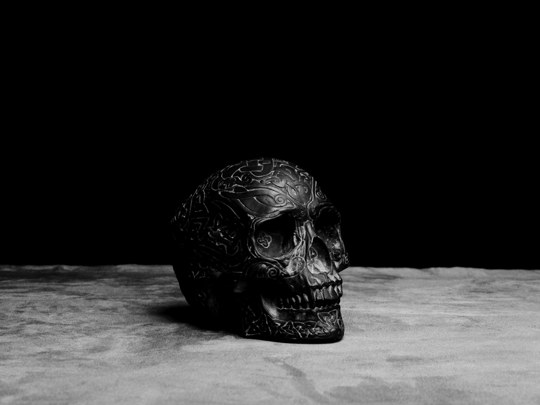
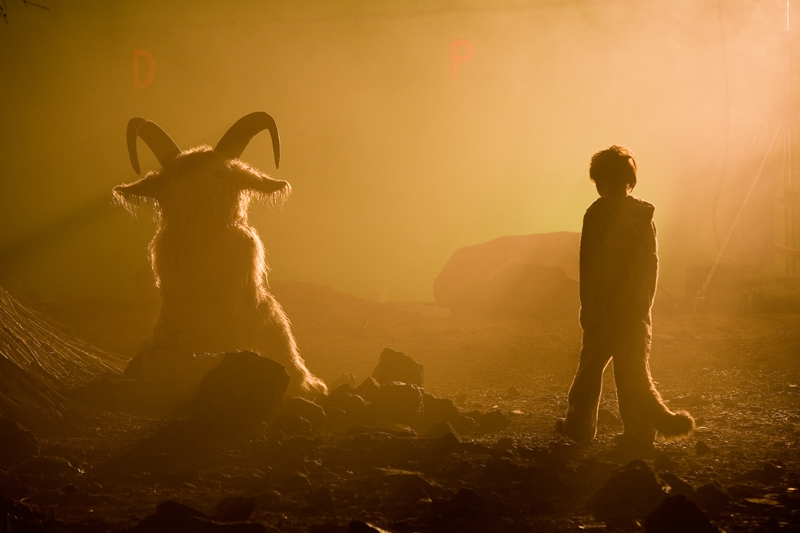

# ＜开阳＞半神半兽的时代

**当理性的尊神自上帝回归到大地之后，人类越来越陶醉在自己制造的圣光之中。当神圣感自浩淼的天空跌落在尘埃之中时，人类发现自己并没成为令万物臣服的圣严之神，却因此而患上了世纪末恐慌。人类发现成为创世的上帝之后的，人类正在丧失精神的厚度，意义成为漂浮在事物之上可有可无的泡沫。神圣的价值简化为苍白的利益之争，利益正成为人类新的救世主。** ****

#  半神半兽的时代

## 文/ 艾礼虎（扬州大学）

 当第一束古老的阳光照射在远古人类初醒的眼睑之时，光明便在人类的脑海中深深地扎根；当人类第一次直起腰时，单调的二维空间转变为丰富多彩的三维空间，自然才真实地成为人类的风景和栖居地；当远古人类发出第一声惊天地泣鬼神的“我”之时，云遮雾罩的世界显露出自己的本色；当深林中第一次响起坎坎伐檀之声,苍翠的绿色便转化为阳光般的温暖；当伏羲执木为犁之时，肥沃的大地拥有了新的生命；当有巢氏构木为巢之时，人类的夜晚便摇曳着彩色的梦；当嫘祖织蚕为衣之时，野蛮便自血性中缓慢衰减；当庖牺氏结绳以渔之时，缓缓流淌的溪水融进人类的生命之中；当人类开始飞土逐宍之时，慌乱和喜悦在大地齐飞；当人类在坚硬的岩石上刻下关于丰收关于生命的喜悦之时，过去不再是虚幻的记忆，呈现为物质状态的历史，人类的精神第一次获得了深度。世界正缓慢地走进人的大脑之中，人类逐渐地区分出了个体和万物，主体意识缓慢地从远古的混沌中艰难地萌发生长。曾经禁锢着人类的自然开始转变为征伐的对象，人类自此脱离了处于襁褓的婴儿时期。人类开始挣脱了自然之母的怀抱，同时也开始失去自然之母的温暖怀抱。在悠悠的历史长河中，仅剩下几个诗人在喧嚣的尘世中潸然泪下地怀念着温馨的童贞。  随着时代的发展，人类的脚步踏上了地球之巅。人类站在地球之巅豪迈地俯视着世界，世界成为人类的棋盘，欲望在这里上演一幕幕争斗不休的悲喜剧。随着踏遍地球上的高山大川的脚步，神秘在人类身后飞扬的沙尘中化为历史之尘埃，仅当作闲暇之余的谈笑之资。作为惩治人类贪欲的达摩克利斯之剑的地狱，已在钻探机的探头下演化成令人可鄙甚至可憎的无稽之谈。人类将其归结为迷信扫进历史垃圾堆之时，精神抖擞地宣告精神新大陆的诞生。  关于伦理，人们只谈论解放，可解放之途到底通向何方，人们语焉不详。伦理和道德成为温情的杀手被置于历史的审判台，接受所谓正义和新价值观的审判。古老的伦理和道德成为自由女神打倒的对象。人类站在推翻封建专制神权的废墟之上，兴奋地谈论着关于幸福的定义，向往着美好的远方。在撕下虚伪的面纱之时，挣脱所谓的束缚之时，人以为自己回归到儒家的古德之中。人发现在绵延数千年的精神支柱倒塌之时，人类陷入了亘古未有的恐慌之中。当把束缚的阿喀琉斯之脚踵砍掉之后，人类陷入了前所未有的茫然之中。人挣脱王权和神权沉重的束缚之时，以近乎赤裸裸的姿态面对着社会，面对着世界。可是人类发现自己已经陷入了物质的丰腴泥淖之中，美德被高蛋白的成功扫进了历史的垃圾堆。或许自由那面漂亮的旗帜后面隐藏的是贪婪的嘴脸。成功是这个时代的尊神，头戴桂冠，身披五彩衣，腾云驾雾在每个人的生活之中。在成功这个黄金祭坛上，供奉着一些激情洋溢的演讲家们，他们取代哲学家和思想家成为时代的旗手。在洋溢的激情下掩盖的是灵魂的苍白，我们大量地借助着各种各样的兴奋剂来发现生活的意义。真诚就此转化为一个遥远的传说，在世风日下的岁月里，在现实的烟尘雾霭中成为历史的背影供后人凭吊或者嘲讽。   当人类看惯春花秋叶，看惯闲云弄月，看惯潮涨潮落，看惯滚滚红尘，终于把头抬向那片神秘的令人畏惧的浩瀚宇宙。那里曾经有着美丽的神话，那里曾经有着令人眩晕的力量，那里曾经居住着光明之神，那里曾经是人类的桃花源。人类开始认真而仔细地打量着上帝的居所。自哥白尼点燃了照耀那片夜空的熊熊篝火之后，牛顿坚定而又无奈地撕下了那神秘面纱的一角，真相便从那一角缓缓地流向人间。爱因斯坦用他的相对论庄严宣告这个宏观的宇宙秘密不再。神圣便在各种先进的仪器面前现形为虚无。上帝萎顿为苍白的雕像，成为美学史上的标本，供教授们来探讨美学的演变。“打倒上帝”成为时代的先驱者驱动历史之轮的强大动力。上帝在历史中尴尬地扮演着落日英雄的角色，人类站在轰然倒地的上帝之躯上欢呼着解放和自由。人类自豪地架着哈勃望远镜讲述上帝创世的规则，人类自此进入了后上帝时代。人类正在历史的舞台上尽情地扮演着上帝的角色。 

 人类的眼睛关注的不再是周边万物的变迁和这变迁带给人类的感悟。人类做着成为生命之主的梦。人类借助着各种仪器观察着生命最原始的生物学组织结构，解剖着生命的化学成分，分析着情感的物质结构，分解着浩淼宇宙的形成之因。人类拿着放大镜放大着生活的意义所在。人类凭借先进的光学仪器测量出着每一次呼吸的重量，试图复原出生命的图纸。人类拿着各式先进的设备行走在大地之上唱着“上帝的灵歌”。当理性的尊神自上帝回归到大地之后，人类越来越陶醉在自己制造的圣光之中。当神圣感自浩淼的天空跌落在尘埃之中时，人类发现自己并没成为令万物臣服的圣严之神，却因此而患上了世纪末恐慌。人类发现成为创世的上帝之后的，人类正在丧失精神的厚度，意义成为漂浮在事物之上可有可无的泡沫。神圣的价值简化为苍白的利益之争，利益正成为人类新的救世主。  当我们越来越自信的时候，我们正在发现我们也越来越脆弱。当我们在寒风未起的时候就将寒冷拒之门外，寒冷正自灵魂的深处浸透我们的肌肤。我们的后院正充满危机，被我们视为盘中餐的食物正在成为新的威胁，夺走了成千上万的生命。吊诡的是本是活人之物却成为杀人之物，不能不说是对于人的嘲笑。人类在远方这个塞壬的诱惑下，前赴后继筋疲力尽地追逐着自以为是的神秘和真理之影。当孤独的行走成为世纪最美的风景之时，孤独边伴随着脚步响遍天涯海角。人们发现其实寂寞和广度长度是呈现出正比关系。人类的脚步越来越响之时，人类的脚步必然越来越空。  当游子们拿起手机拨出家乡的电话时，心里涌动的再也不是浓郁的牵挂，而是随便的问候。当思乡之情在空中随着电波快速传播之时，那曾经让人梦魂萦绕的故乡已经成为一个朦胧的回忆，退缩进唐诗宋词的缝隙中。故乡已经不能使人泪流满面，故乡在辉煌的远方面前现形为苍老和贫穷。故乡，那个曾经满溢着思念之情散发着浓郁诗情的故乡；那个曾经承载着人类最深沉的牵挂的诺亚方舟；那个曾经满载着游子之魂的故乡；而如今已经沦陷在远方丰裕的物质之海中。人们沉溺于由光纤传送的快乐和悲伤之中，日渐发现自己的泪腺已经退化。当笑声自屏幕前响起之时，孤独和寂寞随之而来。当金属的质感转化为时尚的美感之时，审美从生活的大本营中撤出，走上流水线。于是审美被利益劫持或者合谋，在市场上跳着步履蹒跚的舞蹈，向金钱献媚。 

 当我们以胜利者的姿态拎着公文包走进那个曾经浸润着唐诗宋词的青山绿水之时，发现青山已不在，绿水亦难寻。当清脆的鸟叫成为音乐之时，第二自然已经成功地取代第一自然成为我们的生存环境。后代也许只能通过影像资料来释读曾经滋养过希腊史诗、印度舞剧和唐诗宋词的碧水蓝天。当自然成为影像资料时，我们从中收获到的也许是面对着苍白的荧屏时枯涩的一笑。当文化像风景名胜一样被列入世界文化遗产之时，文化也就演变为遗产供世人变卖为各种财富，成为造富的新生力量，为经济学长长的术语名单上再增添一个新的定义。  当革命日渐普及为柴米油盐之时，当革命演变为近乎于嬉戏的游行时，当革命成为流行歌曲传遍天下时，革命必然褪去最初的神圣，复原出生活的平淡和乏味。当时尚的选秀被吹捧为革命之时，地下的英灵必长歌当哭。当革命仅演变为话语权的争夺时，语言便掣起造反的或者是共谋的大旗。革命在时尚的大潮中终会演变为头戴皇冠的小丑。当往日的英雄走上荧屏构建历史合法性之时，英雄最终成为一个枯燥的符号失去了日常的感性。当我们津津乐道历史大道时，其实历史的真相已经在所谓的规律和真理的车辙之下呻吟。当我们对着各种拆解和反讽开怀大笑之时，智慧之神自我们身边飘然而去。  当快餐日渐成为新的阅读方式之际，当经典成为压缩饼干填充着貌似勤学者胃口时，我们发现生活日渐走向由一个空洞和虚无所包裹起来的厚重的甲壳之中，这个宇宙正在简化为原子和分子。我们的思维日渐曲折，日渐深邃，我们的情感却日渐淡漠，日渐麻木。当我们设计出来的电脑能够每秒上亿次地运算，我们发现我们已经不能算出一只蚂蚁在寒冷早晨死亡的重量。当我们的医学切开脑颅解剖神经时，我们脑海里最后一丝神圣也被冰冷的手术刀杀死。当我们的统计学已经科学到每秒钟估计出新生的幼儿数量，然而我们很难在对新的生命抱着敬畏和喜悦之情。当死亡这个把守生命最后一道关隘被医学鉴定为代谢功能的消失之后，生命就成了堆积在历史之河中的废墟，仅供科学家的考证。在意义简化为数字的年代，生命必将萎缩为木乃伊。  当夕阳敲响最后一声丧钟时，我站在2010年的深处哀悼那逝去的九零年代，哀悼那半神半兽的时代。   

（采编自投稿邮箱 责编：陈锴）
