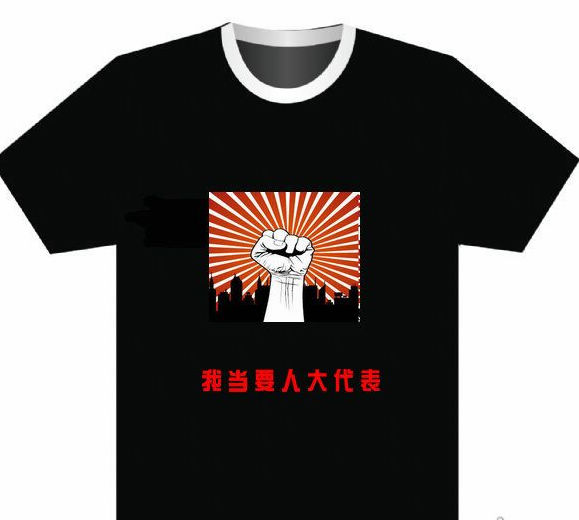
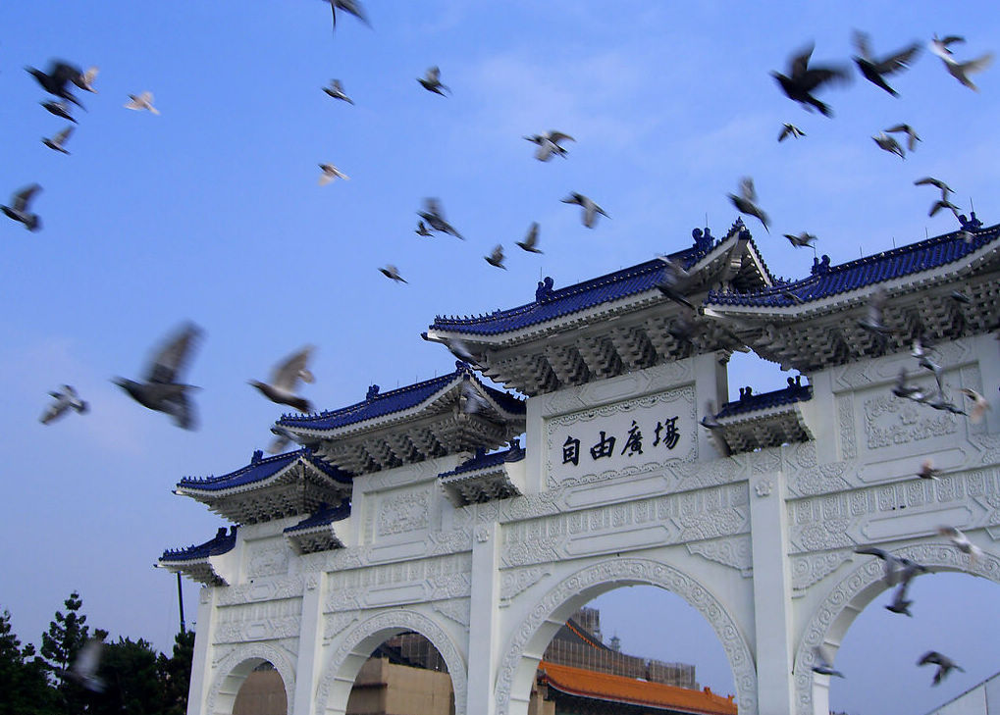

# ＜开阳＞变革的先行者——独立参选人

**所以，独立参选人存在的意义，是用自己的以卵击石，用自己被骚扰、被打击、被刁难来昭告世人，这是怎样一个说谎的制度。他们将用惨淡的事实，逼迫所有人——无论是在江湖之间还是在庙堂之上——作出选择：是由上到下的和平改革，还是又一场揭竿而起？** 

#  变革的先行者——独立参选人

## **文/黄陀 (Yale University) **

 

变革的前夕，总是如同日出前的天空一般，仅带着朦胧的微光，血色的黎明似乎就在眼前浮动飘摇。然而在海边等待着观看日出的人，永远无法预料，究竟何时，天边的那一缕红光将骤然跃出海平线，霎时间照亮视野中的一切。这微光便是日出的信使，叫人沉下心来，翘首期盼。

几年前读到姚立法先生独立参选的事迹，便对这位螳臂挡车的勇士心存敬意。然而独立参选人注定是悲壮的。宪法第九十七条写道，“省、直辖市、设区的市的人民代表大会代表由下一级的人民代表大会选举；县、不设区的市、市辖区、乡、民族乡、镇的人民代表大会代表由选民直接选举。”今天如果能有一两位分散在国内某些角落的人在毫无影响力的区县胜出，便已是不敢奢求的胜利；然而不要说全国有一两位，哪怕全国每个地方都有几十位独立参选人在区县获胜，他们手中的权力仍然近乎为零，因为一层又一层间接选举的石墙让他们的影响在区县就被稀释、甚至到不了省市。 

即便如此，某些人还是慌了。先前有官方急忙表态：“独立候选人没有法律依据！”呵。 在一个法律不能给民众当挡箭牌的国家，法律怎么又突然变成了官方自导自演的选举的护身符。更何况， 独立参选人不是指选举程序上的独立参选人。美国国会里的独立参选议员也是经过法定程序推荐、投票，而我们的独立参选人已经一再声明亦将遵守法定程序。 换言之，所谓独立参选，乃是于党派独立，是精神之独立，更是人格之独立。

不过某些人所怕的，正是人民具有自己的精神和人格，只是不好意思明说，唯有把法律的破布扯来遮羞罢了。执政者让思想淳朴的草民把希望寄托于自己的德政身上以期证明民主的无力，却因此给自己加上不能承受之重，于是每每遇到天灾人祸，总要费力洗脱干系，靠自己的一群追随者叫嚷：“不要什么事情都怪政府！”是的，原本有些事情，政府确实可以摆脱干系。可是利益集团为了维护自己的特权，剥夺了公民用宪政来化解矛盾的机会，而试图以“我国是没有阶级矛盾的社会主义国家，所以不需要司法独立、两党制、多党制、两院制来调和”这种掩耳盗铃之辞予以搪塞。于是他们害怕区区几个独立参选者，到了要动用中央喉舌予以诋毁、用各种卑劣的手段打击阻挡的地步。

压迫者心中充满着恐惧，害怕他们的神主一句“星星之火，可以燎原”会一语成谶成为自己的墓志铭。然而这星星之火，在被宪法第九十七条抽走了所有氧气的玻璃罩子里，大抵是会熄灭的——他们的存在，不是为了自己去燎原，而是为了告诉世人这缺氧罩子的存在。

所以，独立参选人存在的意义，是用自己的以卵击石，用自己被骚扰、被打击、被刁难来昭告世人，这是怎样一个说谎的制度。他们将用惨淡的事实，逼迫所有人——无论是在江湖之间还是在庙堂之上——作出选择：是由上到下的和平改革，还是又一场揭竿而起？

我们原本以为，中国的权贵们虽然和所有人一样，生性贪婪自私，但总有一天也会意识到，开明的政治对自己亦是有利的。当西方各国陆续于了十八世纪与十九世纪经历跌跌撞撞的探索之后，进入了成熟的民主社会， 你何时见过美国新英格兰的名门望族因一次选举带来的政权更迭而被踩在脚下？在这种社会中，你又何时见过被选下台的政客因选举失利而身败名裂、陷于万劫不复之深渊？你更何时见过人民把一党的执政者选下台后，将其枭首示众？恰恰相反，选票在给执政者头上悬下利剑的同时，也给了人民怨气发泄的渠道，所以那些拥有财富和权力的人，反而更安全了。斗争中一时的失势不再意味着被关进秦城监狱或是死亡，而是得以体面的下台、甚至得以东山再起。于此同时，草民的诉求能被倾听，草民的权益得以声张。这不就是所谓的各退一步，海阔天空么？

可是利益集团像是非要把赃款独吞的抢匪一般，甚至不愿给草民留下些许面包屑。其结果是利益集团自己也无法永远持续从草民身上榨取利润。我们不禁要问，为什么？为什么利益集团明知专制长远于己无益，还要每日编造谎言维护专制、甚至绑架了原本无辜的事务官僚们？唯一的答案只能是，他们的眼中没有国家的未来，甚至没有自己的长远利益——而官员对财产公示的顽强抵抗，以及把妻子儿女早早安置在国外、为自己安排好退路的“裸官”们的广泛存在，则讽刺地说明，这种只顾眼前的行为，反而是当前体制下最理智的举动。如果能捞多少捞多少、无论什么事情发生都可以随时开溜走人移民海外，则民不聊生、国将不国，又与他何干？所以他们尽一切力量维持着这个体系，这个体系里没有人可以有效地质问他们掠夺；所以他们害怕一切风吹草动，哪怕几个毫无希望上位的独立参选人也要让他们如临大敌。

然而事情原本不必这样的。独立参选人原本是可以成为有政治实权的力量，从而由弱到强、逐步推进体制的进步——这恰恰符合各种真诚或是虚伪的“渐进民主论”的一致共识。可是宪法九十七条把这条路堵死了。准确地说，是中华人民共和国建国初期立宪方针的根本转变把这条路堵死了。

一九四五年，抗战胜利，国共两党及民主人士组成的政协出台《中华民国宪法草案》，史称“政协宪草”，实行内阁制、限制总统权力、立法委员和国民大会由人民直选。一九四八年国府行宪，蒋中正代表国府颁布《中华民国宪法》，几乎完全来自于政协宪草，肯定了国共政协的共识。最关键的是，无论是政协宪草还是民国宪法，均规定人民直选立法机关和国家最高权力机关、肯定地方自治（见《中华民国宪法》第二十六条、第六十四条及第十一章第二节），从而为国府迁台后的民主化之路提供了空间。在此制度之下，独立人士竞选地方民意代表、地方首长乃至全国性公职成为可能，从而为国民党外力量集结、壮大提供了一丝缝隙。一九八七年蒋经国宣布解严，而在此之前党外运动早已蔚然成风。一九五零年代台湾便有吴三连等独立人士担任国大、台北市长、台湾省议员。一九七七年许信良脱离国民党参选桃园县长（相当于当今中国大陆较小的地级市市长），国民党警告许信良无效，又无法让他“被失踪”，于是只有在选举中作票舞弊，然而即便如此，许信良居然仍旧得到了二十二万票、击败了国民党的候选人欧宪瑜，当选桃园县长。到一九八五年，党外后援会提名十一名台北市议员候选人，悉数当选。而到解严前夕的一九八六年，新成立的民进党参加立法委员及国大代表选举，便已经获得百分之二十的选票；于是到了解严后的一九八九年，民进党便顺理成章地赢得了数个县的县长席位，直到一九九四年赢得台北市长选举、二○○○年赢得总统大选。

在当今大陆官方媒体的宣传下，很多人只看见偶尔发生的中华民国台湾立法院的打架场景被大肆渲染，却看不到朝野各党议员同心协力为了审议国民福利案挑灯夜战，更看不到一个保障了地方自治、人民直选民意代表的宪法下，海峡一群同样是被专制残害了几十年的人民是怎样渐进地、相对和平地争取到了民主自由而避免了巨大的社会动荡。 

海峡这边的人们就没有那么幸运了。一九四九年，当毛泽东即将取得胜利的时候，政协会议再次出台了一部宪法性的文件《共同纲领》，其中仍然规定了从中央到地方各级民意代表（人大代表）的直接选举（第十二条，“各级人民代表大会由人民用普选方法产生之”），也保障了私营经济的合法地位（第二十六条，“中华人民共和国经济建设的根本方针，是以公私兼顾、劳资两利”；第三十条，“凡有利于国计民生的私营经济事业，人民政府应鼓励其经营的积极性，并扶助其发展”）。四年之后，一九五三年“过渡时期总路线”便提出了消灭私营经济的目标（“党在过渡时期的总路线和总任务，是要在十年到十五年或者更多一些时间内，基本上完成国家工业化和对农业、手工业、资本主义工商业的社会主义改造。”）。到了一九五四年中华人民共和国第一部宪法出台，不但取消了私营经济的终极合法地位（第十条 “国家对资本主义工商业采取利用、限制和改造的政策。⋯⋯鼓励和指导它们转变为各种不同形式的国家资本主义经济，逐步以全民所有制代替资本家所有制。”），更把人大代表改为间接选举（第五十六条，“省、直辖市、县、设区的市的人民代表大会代表由下一级的人民代表大会选举”），打垮了政治和经济上的民主自由这两根现代宪法的顶梁柱。毫不夸张底说，一九五四年《宪法》中，政协《共同纲领》的底线荡然无存；这与《中华民国宪法》遵守政协共识、承袭政协宪草的守信作风，可谓天壤之别。五四年宪法奠定了坚固的专制基础，从此以后，人民能够直接选出的人被局限于的区县人大代表，手中的选票即便能发挥作用，也仍然在权力天平上轻如鹅毛。——更何况，在重重骚扰与非难之下，人民手中的选票，就是废纸。

这就注定了今天的独立参选人是悲壮的。这个制度就是为了阻挡他们的脚步、扼杀他们的努力而设计。这个制度和它的维护者们为了最后的掠夺而对独立参选人的打压与污蔑、对民众无所不用其极的维稳，正在一点一点地灭绝着和平变革的希望、大笔大笔地透支着国家和民族的未来。我们只能奢望，独立参选人的存在，要么是对民众的一通唤醒，要么是对统治者的一记棒喝。

中华民国一〇〇年十月廿二日美国 康州 纽黑文

 

（采编：尹桑；责编：尹桑）

 
