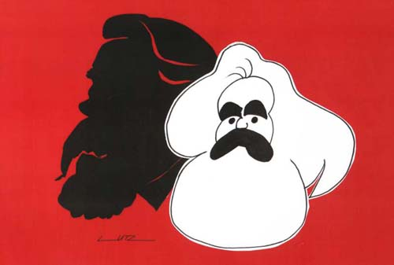
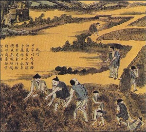
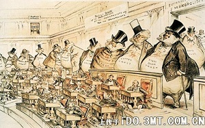

# ＜开阳＞古代产生长久专制政府的逻辑

**民主制的产生，常常被认为是资本主义的萌芽，比如黄仁宇就认为这样的威尼斯是资本主义。可是不论是斯密还是马克思，都强调的是生产方式，不论他们是把这种生产方式冠之以“分工”还是“资本主义大生产”。只有这种生产方式摧毁了过去的生产方式，才是资本主义。显然不论是威尼斯还是荷兰，都没有产生这样的生产方式。那是因为当时的城邦根本没有什么劳动分工，而行会却十分盛行，它们在保护垄断、维护技术标准方面倒是能力突出。**  

# 古代产生长久专制政府的逻辑

##  文/邓辉（安徽大学）

**一、停滞的两条路**

马克思与凯恩斯都是一流的思想家，他们的思想也是同时代一流的思想；但是当一种思想被冠之于“主义”二字后，大概也就表明有关这种思想的研究有些停滞不前，而陷入意识形态的窠臼了。同样的道理，“芝加哥学派”的形成，也说明相关思想的裹足不前。鲜明的例子就是弗里德曼和贝克尔在各自有关价格理论（微观经济学）的书中，拒绝把博弈论写入其中，所以他们写的教科书并没有成为各大学研究生阶段普遍采用的教材。

马克思是一个有野心，也有水平的经济史学者；他研究经济史时，有一种“究天人之际，通古今之变”的心态。后人，到了上个世纪的90年代，例如诺斯也承认，马克思研究经济史发展的大方向的方法，直到当时也是最有解释力的理论范式。前段时间，李睿给我介绍了当代经济学大神——阿塞莫格鲁的那本《政治发展的经济分析:专制和民主的经济起源》。在鄙人看来，阿塞莫格鲁的研究还是在马克思研究的道路上，因为他把社会对立的双方列为“贵族”与“民众”，这和马克思的阶级立场惊人的相似。在我眼中，他只不过是用数理化与博弈论的方法，把马克思的思想规范化数理化罢了。

可惜马克思的思想有太多的局限性，所以阿塞莫格鲁的研究也有很大的局限性。首先阿塞莫格鲁的研究范式根本无法解释中国2000多年的发展停滞；也无法解释台湾民主化进展的如此顺利而无革命之压力；同时专制的对立面应该是共和，他的研究没有遵守亚里士多德以来民主政治、寡头（贵族）政治、独裁政治对比研究的范式。

我想，即便一种理论解释了专制和民主是因为统治阶级和民众的斗争，可是统治阶级内部，为什么会同意“独裁”呢？也就是即便在统治阶级的内部，也存在统治与被统治的关系，他们内部为什么不采用民主制呢？同时，我在自己的“[歧视”](http://blog.renren.com/blog/242943260/797305781?frommyblog)一文中已经讲过，大家遵守一种非正式制度安排，那么肯定是尊重此种非正式制度安排对大家都有好处；所以为什么古代大家都有“忠心”这种道德观呢，它是如何给大家带来好处的呢？

大概两年前，当我百度“曼瑟尔·奥尔森”时，令我很失望，百度百科里居然没有相关词条。奥尔森66岁便去世了，他在临死之前没有获得诺贝尔经济学奖，我想这不仅仅是奥尔森的损失，更是大众的损失。如果这位伟大的经济学家，在去世前，获得了诺贝尔经济学奖；那么由于舆论光环的作用，他的理论也许会被大众更加的熟知。

虽然他的研究范式，已经成为任何一个研究政治经济学的人，必须考虑的一个范式；在阿塞莫格鲁的书中，也应用了奥尔森的理论。可惜的是，我想多数人，包括阿塞莫格鲁都没有真正理解奥尔森的理论，就如同张五常声称多数人没有懂得科斯定律一样。过早过世与过低的荣誉，使得奥尔森的研究范式停滞不前了。所以当前段时间，某同学问我，和奥尔森理论近似的书还有哪些时，我不知道该介绍哪些书，只能把阿塞莫格鲁的那本书介绍给他。

研究经济史的范式，一条路因为其本身的局限性而停滞，另一条路因为创始人的过早离世而停滞。所以我想用奥尔森的理论范式，解释马克思给出的制度演化的路径，也许是个不错的框架。

**二、美好名目下的主义与政策**

在凯恩斯的眼里，马克思是三流的经济学家；的确，马克思的微观经济学和产权（契约）经济学都不怎么样。微观经济学、现代的任何经济学，都有一个基本共识——“交易会使得双方处境变好”，这条共识在马克思眼里是不成立的：这是力薄儒(Liberals)常犯的幼稚错误。而马克思的另一条思想缺陷——产权经济学不佳，则是因为新产权经济学是兴起于上个世纪60年代。

在现代文明产生以前，虽然存在某些希腊城邦、威尼斯与尼德兰城邦为代表的以转口贸易与手工业生产为主的城邦体国家。它们拥有与其国土面积、人口不相称的国力，并且拥有早熟的民主。虽然这种民主并不是现代的普选民主，可是普选民主也只是19、20世纪的产物而已，而且这种民主的稳定性值得研究。在此处，先不讨论古代的城邦制，因为它们和“古代大国”有着很大的区别，下文再表城邦制。

本文中的古代大国，是指那些人口与国土面积远超一个城市控制的国家。农业经济是大国的主要产业，农业人口是大国的主要产业人口。在自己的[“英国史”](http://blog.renren.com/blog/242943260/793828573?frommyblog)一文中，我指出分析国家应该采用集团的理论，

也就是研究不同收入来源的群体对国家的影响。在古代大国中，农业人口是人口中的大多数，所以研究古代政治体制，应该分析一下古代的农业人口对政治的影响。

很不幸的是大多数国家，不论是古中国、古罗马还是近代的法国（路易十四左右），由于国家过于大，农业人口太多，所以从事农业的人口在平时根本没有集体行为影响政府政策的激励。可是不论是古中国、古罗马、还是近代的法国，君主不都是很重视农业与农民的利益么？

中国古代从商鞅就开始鼓吹“重农抑末”的重农思想，法国的魁奈等人也鼓吹农业才是经济的根本；中国古代从北魏颁布均田令（公元485年）开始实行均田制，古罗马格拉古兄弟也在古罗马推行类似于均田制的政策。格拉古兄弟（公元前150年左右）把公地，那些理论上无主，实际上被贵族使用的土地，划为国有，然后再分配给农民与奴隶。

先说句题外话，我大学唯一的遗憾估计就是没有上过安大客座教授马俊亚的课；马俊亚是南京大学的老师，希望看了我此文的南大同学们，去听听马老师的课。对如何审视重农抑末（商）思想，马俊亚在研究[淮北经济](http://rrurl.cn/80VpoQ)时，提出了洞见：

从中国传统中央政府的本质来说，很难断定是某一特定的阶层或阶级利益的代表，但毫无疑问，拥有巨大经济势力的利益集团则可以运用自身的优势，造成国家基本政策的偏向，以获取更大的利益。农民在任何社会都不可能有这样的能力，而商人集团却很容易做到。

中国封建意识形态，多强调重本抑商。但在实际生活中，商人出现亏损时，最高统治者常常要“优商”、“恤商”；与之相比，只要不发生重大灾难，造成农、灶等流离失所，饿殍遍野，最高统治者很少在农家收成下降时优恤农灶。

显然根据奥尔森集体行为的逻辑的思维，可以简单的推出商人远比农民、甚至地主更有能力影响国家政策。因为商人比农民更少，干预经济的收益比人口多数的农民多。根据简单的微观经济学逻辑，对现有的商业竞争设置门槛，不过是限制竞争使得现有的厂商拥有更高的超额垄断利润罢了。所以重农抑末（商）这种思想的本质，并不会导致商人的处境变糟，而是会使得现有的商人处境更好。马俊亚教授查阅史实，找到了这样的社会舆论底层——“士农工商”，所谓的“末”：

国家政权的支持下，盐商拥有许多行政权力。江淮、两浙盐商，一向有管理上场、下河等伙计的职责。运商还拥有包括使用武力在内的对一般私贩和私盐进行查禁的特权。1746年，场商获得了更大的权力，他们可以直接逮捕灶丁。另外，税收、救济、户口登记和保甲事务均归场商管理。南京国民政府建立以后，盐商“竟俨然如专制时代之帝王，于其权力所支配下之岸区，可以自设巡兵，检查行人，任意加捐，剥夺民财，限制民食，垄断市场”。

哇，重农抑末（商）这种思想的实施结果是一坨屎，都可以自设巡兵的商人还算社会底层么？那么均田制的实质又是如何呢？

张五常在其《佃农理论》中已经已经讲的很明白：由于地主不愿意付佃农工资，以使得自己监督农民生产的成本过大；佃农也不愿意交固定租金，而独自承受粮食减产的危害，所以地主和佃农选择分成合约；而分成合约会使得佃农对加大劳动，以使得田地边际产出增加，的积极性并不高；所以为了防止随佃农劳动产量的增加，其劳动积极性的下降，地主愿意把土地分为很小的小块租给佃农。

既然把土地分为小块交给佃农，一方面会减少自己的监督成本，一方面会提高单位面积土地的边际产量，统治者何乐而不为呢？在秦晖研究民国时期的关中农业时，发现关中地区基本没有地主，土地的分配很平均，剥削农民的主要不是地主，而是恶霸。奇怪的是，这些恶霸也不会把土地收为己有，这些恶霸虽然统治者上万亩的土地，自己名下的土地也就是几十亩而已。懂了一点儿产权（契约）经济学，你还会觉得均田法是单纯的为百姓着想而重农吗？

所以所谓重农抑末（商）的政策，不过是设立垄断门槛保护现有商业，与实行全国分成佃农经济罢了。

**三、重农主义的“全球化”**

如果把资本主义的发展看成市场化的扩展过程，那么我不同意把荷兰（尼德兰）列为第一个资本主义起源的国家。原因有二：一是因为城邦制其本质就是反资本主义的；二是因为在荷兰的独立战争后，当时的荷兰还没有产生限制军队集团行为的其他集团，其表现就是奥兰治家族拥有世袭的军队权和外交权，而当弗里德里克.亨利杀死共和国商人的谈判领袖后，商人们没有什么像样的抵抗，这和20多年后的英国完全不同。

为什么说城邦的本质就是反资本主义的呢？因为城邦制国家的成员，一城之内很容易产生集体行为，这些行为既会限制政府防止独裁，比如原始的民主；但也会很容易产生限制行业竞争的行为。古代的城邦制国家，基本都是以从事转口贸易为主业，其他的手工业发展很缓慢。威尼斯有1000的城邦制历史，它提供了多少手工业技术进步方面的贡献？

民主制的产生，常常被认为是资本主义的萌芽，比如黄仁宇就认为这样的威尼斯是资本主义。可是不论是斯密还是马克思，都强调的是生产方式，不论他们是把这种生产方式冠之以“分工”还是“资本主义大生产”。只有这种生产方式摧毁了过去的生产方式，才是资本主义。显然不论是威尼斯还是荷兰，都没有产生这样的生产方式。那是因为当时的城邦根本没有什么劳动分工，而行会却十分盛行，它们在保护垄断、维护技术标准方面倒是能力突出。

城邦制或者小国容易产生限制政府的商人群体，这个不只是西方国家才有的特殊，中国也有。在《管子·轻重甲》中说“中一国而二君二王也”，一个国家为什么会有二君二王呢？在《管子》的同一篇中还有一句“故万乘之国必有万金之贾，千乘之国必有千金之贾者，利有所并也”，这千乘之国有千金贾者说明了什么？是国家的富有吗？

非也。齐国规定战士“得一首者则赐赎锱金”，这里的锱金是指八两黄金。所谓“半斤八两”，所以一斤是16两。而又为什么说是“一首”呢？因为秦国的奖赏是以“甲首”计算。也就是说，拥有1000两黄金的商人可以雇佣（赎）2000名战士。可是一个千乘之国的国君有多少的军力呢？千乘之国的国家治三军，车五百乘，也就是有军队1500人而已。所以所谓“故万乘之国必有万金之贾，千乘之国必有千金之贾者，利有所并也”和“中一国而二君二王也”也就是一个意思。不过这里的二主，一位是国君，一位是商人。

中国的这种城邦制鼓励竞争吗？周朝就规定“做淫声、异服、奇技、奇器以疑众，杀”，甚至规定“管执禁以讥，禁异服”，“地官、司稽”则要“掌巡市，而察其所犯禁者与其不物者而搏（缚）之”。这和西欧那些走村下乡砸竞争者机器的行会条规相比，有过之而无不及。

在侯家驹的《中国经济史》中，他提出中国从商朝末期到两周开始，也依次经历了欧洲的封建社会、重商主义时期、重农主义时期，并到重农主义时期戛然而止了。在我看来，这是符合历史的，不过有一点需要指出，那就是如上文所说，罗马帝国很早就进入了重农主义时期——分田地，比中国的北魏颁布分田令早了600年吧。

也就是说这种步入重农阶段，不只是中国特色，而且我觉得这可能是真正的历史大脉络。当年法国兴盛重农抑末（商）思想时，整个欧洲都差点跌入深渊，“法国以外的当时欧洲若干国家的统治者，如俄罗斯的叶卡捷琳娜二世，瑞典的古斯塔夫三世，托斯卡纳的利奥波德二世，西班牙的查理三世，奥地利的约瑟夫二世，那不勒斯的斐迪南一世等也对他们的学说和主张发生一定的兴趣。”表现出来的结果就是法国等欧洲国家的专制性，比英国强了许多。

就连世界的大救星——大英帝国也差点陷入重农主义的深渊。根据平克斯考证，光荣革命的牺牲品——詹姆斯，是“太阳王”路易十四的信徒。这家伙就是重农主义的信徒，认为土地是财富的来源，比较支持地主。詹姆斯本来计划实施建立常备军队、大事扩充舰队的计划；并不顾反对，强力改造英国的中央和地方政府，包括其宗教、大学和司法体制乃至议会，使它们直接听命于国王。

同时平克斯也提出威廉登基后代表新兴工商阶层的辉格党逐渐得势，其结果就是以商人为中坚的英伦银行之设立，土地税法案之通过，国家土地银行之议被否决，非洲贸易公司被废止，东印度贸易公司修订章程、被迫自负盈亏等连串重大经济政策的剧烈改变。所以不存在所谓“凭借贵族阶层共识”的革命。我先把此点放在这里，称为“问题一”；它和我的旧闻似有冲突，下篇文章再叙加以解释。

**四、长久的专制与诺斯之谜**

不论是重农主义还是重商主义，其实都是反对现有的商业竞争。不同之处在于前者强调对农业与现有工商业的规范，设立准入门槛以限制进入者；而后者则是通过贸易补贴政策，补贴现在没有比较优势的出口企业。产生这两种政策的原因和结果也有所不同。

对于重商主义来说，由于收益者其长期获得国家的补贴，所以促进这类政策的一般是大型出口企业（商人）或者国有垄断企业（商人）。中国古代最出名的此类获益人，就是赵国的商人吕不韦了。重商主义由于强调货币的净流入，所以国内必然会产生通货膨胀。这对国民来说是坏事，当然除了获得补贴的人。通货膨胀是引起全民激变的“大杀器”，所以所有的国家政府对此都避之不及。

这时我们就要提一提诺斯之谜了。诺斯之谜是指：政府如何权衡寻租、设租行为与经济发展之间的关系。因为前两者会导致后者的增长变缓，而后者却能使前两者增加，但是政府人员处税收外的额外收入必须通过前两者获取。

显然根据诺斯之谜，从长远看，政府不应该鼓励重商主义，因为通货膨胀肯定会引起民变。同时对帝国的广大底层官员来说，一方面通货膨胀会使得自己的收入减少，另一方面重商主义并不能使得自己收取的租金增加。所以底层官员肯定不会支持重商主义。而重农主义则是对工商业的准入设计门槛进行设租，这样任何的底层官员都可以通过重农主义带来的收租获得收益。

于是重农主义这颗毒瘤就是这样达到长期均衡的：现有的商人因为重农主义而获得高额垄断利润；公务员阶层从上到下都通过设租获得收益（上层通过盐铁税）；而农民根本没有集体行为的动力。于是长久的专制就产生了。在这种均衡下，根本不会产生什么资本主义，所以中国2000年的专制就产生了。既然是均衡，2000年来中国却又不知道发生过多少次农民起义，产生这些农民起义的原因是什么呢？

原因就是在于马尔萨斯困境。重农主义会使得技术的增长长期停滞，所以在专制社会里的中国，科技水平长期停滞，唯有当乱世时，人口的被迫流动、打破原有的城市商业垄断，技术才有些进步。可是这种进步太少太少了。同时，人口的增长却是指数级的，所以每过一段固定的时期，中国就会爆发农民战争。

我们知道当年共产党搞革命是用土地激励无地农民，可是根据秦晖的研究，在关中根本不存在大土地所有者的土地兼并。至于恶霸的产生的原因，也很可能是因为民国的动乱，于是产生了类似于地方政府的地方武装。那么这些无地农民产生的原因，就只能从人口增长找了。所以爆发农民战争的原因，不是在于政府的腐败——设租、寻租太多，而是在于原有的人口根本无法养活现有的百姓。于是每经过一次农民起义，不知多少人被残杀后，经济又回到原来的均衡。典型的例子就是中国的人口从汉代的6000万，经过黄巾起义后，变成三国时期的600万，再比如太平天国的3000万大屠杀。

欧洲国家也有相同的问题。只是由于两个原因，使得欧洲出现人口大规模递减的原因和中国有所不同。一方面是因为西欧长时间是封建制，所以底层百姓和上层的国王没有多少直接冲突，农民起义多是反对自己的领主；另一方面，欧洲长期以神权为中心，于是教堂在城市的中心，而尸体常常会被安葬在教堂周围。结果就是欧洲人夏天必须去乡下避暑，如果在城市呆着，那么很可能被尸体产生的疾病夺取生命。我们的牛顿爵士也就是因此被苹果砸到的。

当人的饮食量过小使得身体变差，那么人抵抗疾病的身体素质就会变差。当欧洲的人口超过了土地资源的承受力，那么整个欧洲都会出现人群整体的身体素质下降。于是就会出现“查士丁尼大瘟疫”、黑死病等瘟疫的肆虐。

如果不是英国，那么世界很可能步入重农主义的深渊而一直停滞。商人们互相限制竞争的囚徒困境，公务员集团的食利性，加上农民间无法产生日常维护自身利益的集体行为：世界的黑暗要因此持续多久？

**五、结语**

对于各种“主义”，我们不能简单的按照其名字进行分类；而应该通过经济学的手段，分析它造成的实际结果。这篇文章按照奥尔森的理论，讨论了长久专制的逻辑和古代大国的诺斯之谜，说明不论是“重商主义”还是“重农主义”其实都是在“重”商。在古代大国长期存在对农民的剥削和对商业垄断的维护。要指出的是在这本文里，我把商人当作一个群体，那是因为在近代的分工出现以前，一个小城市的市场太小，根本没有多少分工产生下的产业竞争，所以把商人分为铁匠、屠夫、理发师等等种类，没有多少意义。

可是现代大国又是如何走出这种均衡，现代的大国公务员集团又是如何权衡诺斯之谜的呢？我把这个问题称为“问题二”。加上上文提到的“问题一”，我讲在下一篇文章讨论“专制统治集团内部产生独裁的原因（问题三）”与“忠君思想的好处（问题四）”，总共4个问题。

 

（采编：尹桑；责编：黄理罡）

 
