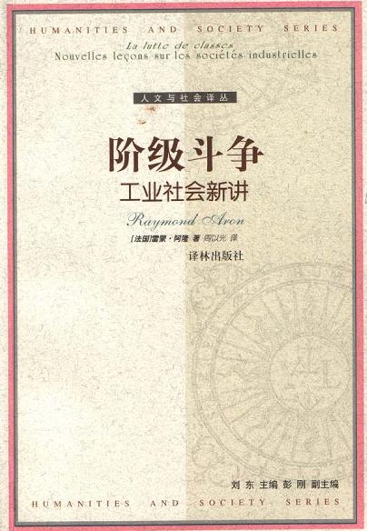

# ＜开阳＞回归清醒对话的界限——评雷蒙·阿隆 《阶级斗争》（上）

**阿隆指出，工业社会对苦行主义不感兴趣，它们在本质上是享乐主义的，对财富的欲望，也许还有对权势和荣耀的欲望激励着它们。人们不承认刻苦所固有的长处，因此公民们为了更公平地分配集体财富而争论。在这样的社会中，试图通过一次革命，改变法律上的所有制形式，来结束企业内在的紧张关系是不现实的。即使生产资料全部归于国家所有，工业社会中不同社会集团的竞争仍是合理与必然的，工业社会有其自身的发展逻辑，没有理由认为以前竞争的焦点问题在一次革命后就会销声匿迹。** 

# 回归清醒对话的界限

# ——评雷蒙·阿隆 《阶级斗争》（上）

## 文/郑勉（中山大学）

 

#### 一 前言

雷蒙·阿隆(Raymond Aron，1905—1983)，1905年3月14日出生于巴黎一个中层犹太裔家庭。1924年到1928年间，阿隆在著名的巴黎高等师范学院（Ecole Normale Superieure）攻读哲学。1930年，阿隆来到德国，在科隆大学教书和学习，1931-1933年间进入柏林大学学习，同时在法语系从事教学。在德国期间，阿隆潜心研究德国哲学和社会学，阅读了马克斯·韦伯、斯梅尔、曼海姆、胡塞尔和舒茨等人的大量著作，对马克思的《资本论》也进行了详细的研究(1)。韦伯的知识立场影响着阿隆的一生：一个学者首要的职责，是讲明事实，传授知识，而不是编织和灌输信仰。因此他为自己提出的两项任务是：“尽可能诚实地理解我的时代，时刻不忘我的知识的局限性。”(2)

《阶级斗争——工业社会新讲》这本书来自于阿隆1956年至1957年在巴黎大学教授的课程，这本书的内容承上启下，分析阶级斗争承接在他对工业社会的分析之后，而下一阶段的内容则是分析政治制度，也就是另一本书《民主与极权》的内容。

整本书构成了一门课程的完整内容，既有对工业社会和阶级的概念辨析，也有对具体阶级研究的实例和数据分析，而后进入到社会流动，对西方各类社会领导的展望，以及对苏联制度的评价。

虽然课程内容停留在上个世纪五六十年代，至今看来仍旧充满了深刻的洞察和值得一再咀嚼的观念。更重要的是，站在历史这端回望充满复杂可能性的当时形势，雷蒙·阿隆对未来的判断得到验证，在风起云涌的意识形态对立时代，阿隆保持着谨慎与清醒，以其深厚的学养与可贵的独立精神推动着对话与反思的深化。

#### 二 工业社会

“工业社会”这个概念是阿蒙分析阶级斗争与制度差异的社会背景。在一个工业社会里，人数日益增多的劳动力被工厂和服务部门雇佣，现代社会对劳动生产率非常关注，因为只有单位劳动力的产量提高了，才能为工业社会的存在提供基础。技术的不断进步是惟一的途径，实际上表达了人们要制造越来越廉价的产品的愿望。

面对二十世纪的工业社会，可以看到两种发展经验，也就是两种模式：西方世界的即美国和西欧的经验，以及人们不加区分地成为社会主义、共产主义或苏联模式制度的经验。由此，中心问题就变成，“在这一种或那一种制度下，生产力的发展在什么程度上会诱发越来越激烈的阶级斗争？”(3)P3

如果承认这两种模式同属于工业社会的发展道路，一些问题比如资本积累现象或“剥削”现象就是两类工业社会所共有的。因为为了扩大生产，就不得不日益扩大资本投入量，增加机器设备。

阿隆指出，工业社会对苦行主义不感兴趣，它们在本质上是享乐主义的，对财富的欲望，也许还有对权势和荣耀的欲望激励着它们。人们不承认刻苦所固有的长处，因此公民们为了更公平地分配集体财富而争论。在这样的社会中，试图通过一次革命，改变法律上的所有制形式，来结束企业内在的紧张关系是不现实的。即使生产资料全部归于国家所有，工业社会中不同社会集团的竞争仍是合理与必然的，工业社会有其自身的发展逻辑，没有理由认为以前竞争的焦点问题在一次革命后就会销声匿迹。(3)P13

#### 三 马克思主义的“阶级”的辨析

在阿隆看来，作为马克思主义的核心的阶级概念充满了感情色彩，并且模棱两可，很难对这个问题澄清到毫无偏见的程度。在书中，他试图对这个概念进行词汇的理论分析，并且解释这个概念背后所具有的政治含义。接下来的章节则用来呈现经验性研究的结果。

在《共产党宣言》的对一切社会历史进行概括的著名段落中，阶级这个词适用于任何社会中按等级划分的社会集团，阶级的对立差不多等同于压迫者和被压迫者的对立；在《资本论》第三卷的最后一章中，对资本主义三个社会阶级下定义是根据他们收入的来源（工资、利润、地租），实际就是，社会阶级诞生于生产资料和生产人员之间的关系，本质现象是生产者与生产资料的分离；在《路易·波拿巴的雾月十八日》的描述里，社会阶级的出现，不仅应该有数量众多的一群人以近乎相同的方式工作和生活，他们之间还应该有永久的关系，他们既具有共同性又与其他集团相对立，从而构成一个集体。(3)P16-17

按照马克思的思路，社会阶级只有当它具有自我意识时才能真正存在，但倘若不承认阶级斗争就不可能有阶级意识。一个阶级只有当它发现它要对其他阶级进行斗争的时候，它才具有自我意识。

事实上，马克思本人在不同的书中进行的具体的阶级划分是不同的，例如，有些时候将资产阶级与小资产阶级区分，有些时候则继续区分金融资产阶级、工业资产阶级、商业资产阶级和小资产阶级。另外，按照马克思的著作，也不能严格讲清是农民共同构成了一个阶级，还是更加恰当地说贫农与中农是对立的(3)P18。像这样的问题，在具体的政治实践中都因其模棱两可导向不同的路线、政策与结果。

阿隆继续讲到，列宁、布哈林等马克思主义者把某个集团在生产过程中所处的地位或所起的作用作为确定社会阶级的标准。也就是，“阶级是个大集团，由其在生产制度中的地位确定其特征，特别是它与生产资料的关系确定了这种地位本身。”(3)P18

阿隆认为，这样的阶级概念至少包含两种含义。一种从法律-社会的角度来定义：雇佣劳动者不拥有生产资料，并领取工资，在这个限定范围内，他们在生产过程中担当着一个确定的角色；另一种则是技术含义：不管产业工人的财产地位如何，他们担当着一个确定的角色，即他们是体力劳动者，在机器上从事劳动。法律-社会含义同生产资料所有制相连，技术含义同生产的组织相连。这样的双重含义可能导致这样的结果：生产资料变成国家所有可以改变工人同生产资料的法律关系，但改变不了工人同劳动的集体组织在技术上的关系。如果只因无产阶级为生产资料所有者服务而被定义为无产阶级，那么消灭生产资料私有制只可以从此定义上消灭无产阶级。从事繁重体力劳动的产业工人的无产阶级作为工业社会的现象并不会消除。(3)P19

不过对于马克思的阶级斗争的历史哲学来说，阶级定义的细节就成为次要的了。重要的是，懂得阶级的对抗性、斗争的必然性，以及组织这场斗争。为了达到目的，必须创建一个政党，它将成为斗争中的无产阶级的代言人。由此，人们就从对阶级的社会学分析过渡到一种革命斗争的政治理论。马克思主义者的名言是“无产阶级要么是革命的，否则就是不革命的”。对于马克思主义对无产阶级的解释而言，无产阶级意识到自身的存在时，它就是倾向于革命的，如果它不革命，没有意识到要进行斗争，它就没有意识到自身的存在。(3)P23

马克思主义认为，国家是统治阶级借以行使权力的工具，无产阶级是唯一可能推翻资产阶级成为统治阶级的阶级。在苏联制度下，这样的统治得以实现。但是在阿隆看来，不排除少数人以无产阶级的名义或者以其代表行使权力的情况，但不可能说无产阶级本身在行使权力。几百万的工人仍旧在工厂里面劳动，行使权力的是少数政治家，他们的位置离工人的工厂很远。

“通过一次革命，除了那些将变成政委的人，产业工人仍是工人，依赖于他们的制度对他们只有好处并不是明摆的事实”。 因此，如果消除了把大量工人和少数掌权者神话般地混为一谈的说法，人们就回到了历史现实中，才能够思索不同制度的利弊和功过。(3)P25  参考资料 (1) 天睿网，雷蒙·阿隆介绍 http://www.tianroo.com/a/special/people/2010/0523/aaron.html (2) 天睿网，冯克利，阿隆与意识形态的终结 http://www.tianroo.com/a/reading/2010/0516/1116.html (3) 雷蒙·阿隆著，周以光译，《阶级斗争——工业社会新讲》 ，译林出版社，2003 注：（1）与（2）的网页已被关停 

（未完待续）

 

（采编自投稿邮箱；责编：麦静）

 
