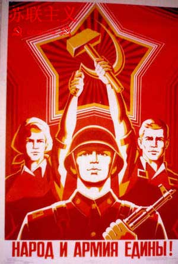
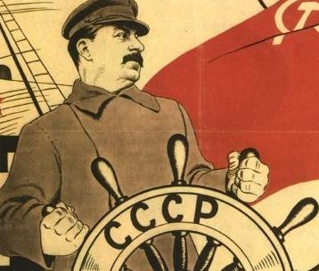

# ＜开阳＞回归清醒对话的界限——评雷蒙·阿隆 《阶级斗争》（下）

**在整本书中，阿隆所提出观点一般而言都非常审慎，这也是他对自己提出的希望。当时的世界是两大阵营对立的世界，面对着这样的冲突，他的视角也始终在两个世界中切换，寻找它们共同的基础、价值的一致性，继而分析不同制度产生的阶级背景、结果，与根本分歧之所在。应该说，正因为他的分析完整、清醒，才使他免于了被表面的宣传和数字迷惑，得以对现象的逻辑进行检验与考证。在当时，文学和哲学的观念主导着时代的心灵，而读哲学出身的雷蒙·阿隆，却将阅读与思索的重心放在经济学、社会学和政治学上，用初步的经验研究和实证方法，结合他对历史与哲学的思索，打破了人们浪漫化的幻想与虚无化的偏见。**  

# 回归清醒对话的界限

# ——评雷蒙·阿隆 《阶级斗争》（下）

## 文/郑勉（中山大学）

 

#### 四 苏联的制度、政权与领导

雷蒙·阿隆的这本《阶级斗争》一直把比较（欧美）资本主义制度与（苏东）社会主义、共产主义制度当作线索，在辨析完阶级概念并且呈现了阶级的几个定义与经验研究后，阿隆开始用很大的篇幅描述他所理解的苏联的特点。

无论是哪种类型的社会，国民收入的分配都是造成竞争的原因，在社会的不同集团之间，有不同程度的利害冲突与矛盾。阿隆归纳，资本主义社会的冲突是复杂的，因为国家财政不可捉摸，各集团不知道通过什么方法达到它们的目的，因为变化并不是任何人有意所为，而遭遇不幸的人又不得不找到承担责任者。

与此对比，在苏联，国家有意识地为最重要的决定承担责任，是它决定国民收入中用于投资的部分和消费的部分，是它大致确定集体财富怎样在各集团中分配。左右所有人和每个人生活的决定由国家做出，这样的体制很难接受个人对集体意志（或所谓的集体意志）提出异议。关于农民和工人的收入分配问题，在公众对此展开讨论的做法直至那时都没有被接受过。人们不能指责计划经济的重大方针，因此人们只就具体问题展开讨论。(1)P89

这里也显示出资本主义社会与共产主义社会特点的一个差异，在法国，人们不仅对雷诺公司或雪铁龙公司的管理，而且对私有制的原则展开争论；在苏联的情况是，人们不允许对根本原则提出异议，因为原则是确定社会属于社会主义性质的官方思想体系不可分割的一部分。(1)P90

阿隆指出，在一个苏联式社会里，各集团为争取尽可能高的收入而进行斗争是正式被禁止的。集体农庄庄员和产业工人都无权结社和请愿。更不必说把为最大限度提高收入而展开的竞争同为改变社会制度而进行的斗争混同起来，这种阶级斗争从理论上不可能出现于苏联。

不过，一个实际问题却显现出来：现实的制度在什么程度上是符合于马克思主义的思想体系的？

为了进一步分析，阿隆把这个问题分成三个小问题：

一，群众在什么程度上把统治他们的人视为他们的代表？

二，各集团在什么程度上甘愿同意计划部门在集体财富分配上武断做出的决定？

三，在什么情况下存在经济请愿和对制度质疑之间的混同？

但是，要明确地解答这些问题是非常困难的，在苏联，人们不能调查，询问苏联工人是不是认为自己就是制度的主人，因为提出这个问题就属于异端。不过通过考察波兰和匈牙利城市抗议的一些情况，可以发现，在苏东制度下，当人们从经济不满过渡到政治请愿的时候，就指责不平等现象或领导的特权，而不针对制度本身的原则。此外，农民的请愿则主要针对集体劳动组织或集体所有制普遍化的威胁，因为农民从本能上是反对集体化的。整体上说，苏联的经济制度并没有消除经济请愿和对社会组织结构提出异议的混同，但苏联的政治制度则排斥这种混同。(1)P95

阿隆讲到，人们有理由把苏联制度看做在某些方面等同于或者优于资本主义制度，有好几条理由可以将工业社会的两种发展模式进行对比。苏联在工业领域消灭了生产资料私有制，集体所有制消灭了引起冲突的精神因素，并且对计划经济十分有利，当国家变成生产资料的绝对主人时，它就有能力确定优先发展什么。一个集体化的社会允许领导者制定总体计划、确定发展速度，更迅速地发展被视为对集体的强盛必不可少的产业部门。苏联式制度的另一个重大优点是社会税务制度具有透明度，大家都明白制度运作的情况、分配和目的。(1)P98

但是，苏联制度一个显著的特点是，苏联政权不满意合乎情理的论证，不接受对两种制度的利弊在理性的基础上进行辩论。通情达理地、诚心诚意地比较每种制度的成本和利润，这样的讨论、分析方法和论证方法对于苏联理论家来说是不可接受的。这是为什么呢？

阿隆分析到，这是因为一个对于苏联式制度本身具有决定性意义的问题，他们早有答复。苏联式制度赋予自己某种万能的使命，它期望成为人类的最终制度或至少是通往最终制度的不可避免和不可缺少的阶段。如果试图把它当作许多工业社会制度的一种，与其他制度相提并论，显然就是对斯大林思想体系的一个基本论断的驳斥，这个论断认为苏联式制度是通向最终制度的唯一道路，（苏联式）社会主义是未来的现实。(1)P99

继而，阿隆指出，苏联式共产主义制度与欧美式资本主义制度之间有一种重大的论战，永远是思想观点的冲突。分歧的根本在于苏联希望自己的制度具有普遍价值，并且是未来的现实，而西方至多同意它是多种可能存在的制度中的一种。讨论不同制度各自的优点，从莫斯科的角度看已经是怀疑主义和相对主义的态度了。但是从巴黎的角度看，企图把一种制度定为普遍有效的制度和通向人类未来的惟一道路，这是荒唐的狂热崇拜。对话可能长久持续下去，但缓和的条件是对话者接受大家处于同一水平上，并放弃他们追求的绝对特权。(1)P100

接下来，阿隆继续深入分析工业社会政权的领导层，他总结了阶级斗争、经验社会学和精英统治三种从阶级到政权的理论，认为在工业社会主要有四种类型的领导在发挥作用：

一，拥有精神权力的教士（或传统宗教的代表）和作为世俗思想代言人的知识分子或科学家。

二，政治领导，包括官员和军队或警察的领导。

三，集体劳动的管理者，可能是生产资料的所有者，也可能是“经理”阶层。

四，群众领袖，他们主要表达和引导社会内部工人要求，往往同时还祈求政权，甚至拥有精神权力。

他认为在一个民主社会，统治的领导权呈现出分离的特点：

一，精神权力的多元性。同一集体的成员对最高真理的看法有分歧，不抱有某种共同的价值等级观，甚至对生命的深刻含义理解不一。

二，彻底的平民权力，掌权者对执政的暂时性表示接受。在民主制下的统治者明白，他们的地位全靠选举，他们事先就心甘情愿地同意，如果下次投票结局对他们不利，就放弃他们的职位。

三，以请愿为目的的非特权者的永久组织。独立于生产资料所有者和国家之外的工会是民主工业社会最具特征的社会现象。这些非特权者组织的存在也许是对工业时代民主社会最适当的定义。(1)P108-109

而苏联政权的情况则可比照以上的参考标准加以分析。阿隆认为，在苏联，群众领袖得到了权力，他们是国家的体现。与民主国家的政治领袖不同，苏联统治者不接受自己是“有偏向的”，他们代表全体国民，因此也不会允许代表另一些国民的代表有可能在以后的选举中取代他们。革命者一旦掌握政权，则要求消灭社会阶级，实现这样的统一，以消灭政党多元化开始。当选的领导和官员不存在区分，企业在革命中失去自主性，劳动由国家任命的官员来管理，所有不再存在社会和国家的分离。

在苏联革命中取得胜利的工业社会的群众领袖，在得到权力的同时，还想成为最高真理的表达者、政治领导、集体劳动管理者，他们不可能不想身兼三职，因为他们认为他们的学说高于传统宗教，表述了科学真理，因为他们认为无产阶级自身是借助他们在进行统治。

二十世纪的苏联权力革命似乎试图重建统一性：“最高真理的统一性、变成惟一政党的社会阶级的统一性、国家和社会的统一性。”

阿隆概括到，如果这个分析恰如其分地话，两种工业社会的根本对立来自于在一种社会中有不同类型的领导，而在另一种社会中人们试图使领导统一化。(1)P110-111

阿隆不仅对苏联模式进行了理论上的类型分析与思想观念的对比，他也引用了苏联社会学家的研究，从经验上讨论了苏联的计划经济模式和内部阶级结构。在苏联，重工业通过计划经济以及固定投资比例获得快速发展，但这样的发展是以农业和人民生活水平的牺牲为代价的。苏联社会仍旧是一个不平等的阶级社会。在他的预见中，在一个全体人民的文化水平不断提高的社会里，是否还能保持经济、政治和思想上的僵化是一个疑问。假定苏联模式在未来的发展必须改变，要改变的原因不是经济发展遇到了困难，恰恰相反，是经济和生活得到了持续的改善。(1)P217

#### 五 结语

在本篇评论中，我重点整合与梳理了雷蒙·阿隆对工业社会、阶级概念和苏联的描述、分析。在上世纪六十年代的阿隆，对不同工业社会制度的评价不可不谓深刻与精辟。在整本书中，阿隆所提出观点一般而言都非常审慎，这也是他对自己提出的希望。当时的世界是两大阵营对立的世界，面对着这样的冲突，他的视角也始终在两个世界中切换，寻找它们共同的基础、价值的一致性，继而分析不同制度产生的阶级背景、结果，与根本分歧之所在。应该说，正因为他的分析完整、清醒，才使他免于了被表面的宣传和数字迷惑，得以对现象的逻辑进行检验与考证。在当时，文学和哲学的观念主导着时代的心灵，而读哲学出身的雷蒙·阿隆，却将阅读与思索的重心放在经济学、社会学和政治学上，用初步的经验研究和实证方法，结合他对历史与哲学的思索，打破了人们浪漫化的幻想与虚无化的偏见。

阿隆在本书的最后一章，非常现实地指出，即使在非常顺利的情况下，认为工业社会是平等的社会也是错误的。当前的集体财富不允许在某一个社会中，严格平等的分配所给予特权者的生活水准是他们可接受的。工业集体中的劳动组织是有等级的，职业在资格上有差别，很难设想职位等级不意味着收入等级。此外，市场体制和私有资本体制中，资本拥有者也不可避免地积累利润。而与此对比，在一个全盘计划的体制中，虽然可能想象一种平等的分配制度，但是也有不可能达到的条件：一是计划者自己必须有苦行的意愿；二是他们必须认为，即使工作性质有差异，收入均等也是可能的，并且与之相容。这事实上遇到经济与社会的阻力。(1)P234

阿隆认为恰当的考虑方法是既区分各个经济发展阶段，又区分各种工业化模式。考虑每个阶段提出的问题、出现的矛盾，以及有助于解决问题和矛盾的经济方法或统治方式。比如在原始积累阶段，强有力的权威对于促使人民充分节俭和快速投资确实是必要的，以适应工业化初期的需要。但随着经济发展，专制制度的可能性随着经济增长而缩小，而不是增加。不过以经济和社会关系为出发点，对工业社会所作的描述留给政治方面多种选择的可能(1)P241。在这里，阿隆没有给出进一步深入的讨论，他考虑的经济发展的因素比较少，而且对于政治经济互动的模式也没有给出基本类型的区分，试图从社会-经济角度去论证具体的权力制度在当时的情况下是不大可能的。因此他对着许多的可能保持开放态度。

有许多可能的模式值得分析和探讨，它们处于竞争之中，也各有优劣，并且长期前景难以预测。

但是，正如阿隆对两类社会模式根本分歧的分析所预示的那样，阿隆坦白地说，在当选者和辩证学家（黑格尔式，马克思式）之间，他选择站在当选者一边。原因就在本书最后一段经典的话：

“所有工业社会都不是清一色的，假设有朝一日差异会消失，只可能发生在今后某一个阶段，那时的集体财富允许达到一种经济平等继而是社会均等。在此之前，交流、协调、竞争或冲突是这个社会中人类的真理。而为了使存在差异的社会接受集团之间、选民之间和当选者之间、政府之间的对话，任何集团都不应声称掌握最高真理，至少任何集团都应不拥有足够的权力以武力强制他人服从被它视为最高的真理。如果谁都不再追求真理，对话就将中止。当一个人或一个集团能使所有人不得不遵循其对真理的特定表述时，对话也将被中止。”(1)P244

“我想雷蒙·阿隆给我们的告诫是始终认清现实的可能，不仅在我们觉得自己无知时对真理保持谦虚，当我们觉得自己掌握了真理时，更要如此。让观念回归清醒对话的界限，观念的力量才能够在继续对话中造福我们。

参考资料 (1) 雷蒙·阿隆著，周以光译，《阶级斗争——工业社会新讲》 ，译林出版社，2003 

（全文完）

 

（采编自投稿邮箱；责编：麦静）

 
