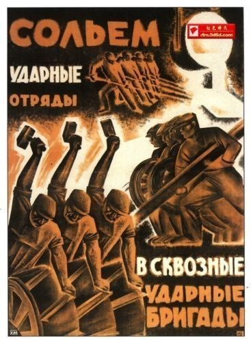

# ＜开阳＞国家的本质

**我们所有人——甚至包括牢房中的囚犯——都是这个国家的一部分；国家的权力来自所有国民的共同授予；国家从来就不是阶级统治的工具，它并不具备阶级性，问题的根源在于国家的权力不受制约，被执政者不正当使用、被“异化”，被用于为某一部分人服务；因此，权力制衡机制和监督机制就是任何一个现代国家理当具备的。**  

# 国家的本质

## 文 / 王斐弘（北京电影学院）

#### 一

什么是国家？国家所代表的是同一片区域上的所有人组成的整体，国家意志即为所有人所共同的意志，国家形象即是所有人组成的那个整体的形象。国家认同即为所有人对这一形象的自我认同。

伴随着国家而来的，便是强制权力，那种强制性地要求国民服从的力量。

国家的权力究竟有多大呢？在必要的情况下，国家可以强制性地要求任何一个公民为了国家利益牺牲自己的一切，但不包括公民的生命。一个公民可以为了国家，自愿牺牲自己的生命，（比如长津湖牺牲的美国老兵），但国家没有权利命令公民为了国家牺牲自己的生命。当然，集权国家，独裁政体除外。这就是国家权力的极大值，因为我们每一个人的一切，都是国家的组成部分，但生命是自己的，只要没有触犯法律，没有人有权利剥夺之。

国家的权力又来自哪里呢？国家的权力是国家意志的体现，是所有国民共同授予的。正因为这种权力代表了所有国民的整体意志，才使得他具有了无可抗拒的力量，才确保了它的合法性和正当性。

国家从所有国民那里接受了权力，同时也意味着它承担了责任，这种责任分为两个方面：对内，国家必须管理公共事务，确保社会秩序和和推进民众福祉，保证民主法治，言论自由；对外，国家应当调动国家资源来确保国家的独立性和完整性。

虽然国家权力来自于所有国民，但在现实中却不可能做到由全体国民来共同行使它，我们必定只能组建一个常设机构，把国家权力交给这个机构的负责人——执政者——来行使。这个国家权力的行使机构就是政府。由此就带来一个关键性问题——如何确保政府不滥用国家权力？如何确保执政者不把它用于谋求私利？

因此，当我们明白了国家的本质和国家权力的来源之后，我们所需要做的，就是针对政府设定良好的权力制衡机制和监督机制，来确保国家权力始终被用于维护国民利益。就目前来说，在这一方面最为良好的制度创设就是三权分立、代议制民主和言论自由相结合的民主共和政体。

国家的权力一旦不受牵制和监督，就必定偏离它的本意，被执政者用于谋求私利，此时，在我们看来，就觉得似乎国家表现出了强烈的阶级性。其实国家的本质并没有改变，国家始终是由我们所有人共同组成的那个整体，国家始终是属于我们所有人的，国家的权力也始终来自我们所有人。问题的关键在于，我们没能够有效地监督国家权力的行使，国家的权力被执政者不正当使用、被“异化”，被用于为某一部分人的利益服务。

英国思想史学家阿克顿勋爵乃言道:“权力导致腐败,绝对权力导致绝对腐败。”

#### 二

以上对于国家权力的讲述是今天的人们站在理性思维的角度的理解，但是对于古代的人们来说，问题却远非如此简单。须知国家的建立是一个极为庞杂的、时间跨度极长的整体性事件，没有任何单个人能够经历国家建立的全部历程，也没有任何单个人能够体验到它的所有方面。

今人可以依靠逻辑来分析国家是如何建立的、国家的权力来自哪里、国家理当承担那些职责。但古人在认识这个世界时，凭借的却是对现实经验的总结。国家建立这件事，恰恰超出于人们的经验范围之外。当他们面对国家这个既成的庞然大物时，没有足够的经验来正确地认识到国家的本质何在，也同样无法正确地解释国家权力的来源和国家职责所在。

因此，在面对国家的权力之时，古人必须回答四个问题：一、国家的权力来自哪里；二、我们应当建立怎样的机构来行使国家权力；三、国家的权力应当被用来干什么；四、如何确保国家的权力不致被滥用。这四个问题是一脉相承的，构成一个整体。

国家的诞生一定伴随着权力，并且在任何一个社会中，国家的权力是天然合法而且正当的，也由此使得这种权力对于社会有着无可估量的控制力和说服力。因此，在以上四个问题中，对于第一个问题的回答就是最为关键的，决定了对后边三个问题的回答。

在18世纪启蒙运动以前，几乎所有的文明当中（古希腊-罗马文明除外），人们都援引超自然意志来解释国家权力的来源，声称国家的权力来自于上天、神明、祖宗、上帝、历史或者真主等等，国家的代表或者化身——君主，就是国家权力的接受者，然后建立起对君主负责的官僚体系，来行使国家权力，履行国家职责。

因为国家权力是君主从某个超自然意志那里得来的，所以君主在行使权力之时就只需对这个超自然意志负责，他无需对国民负责。君主对国家权力的支配在理论上是受制约的，但在事实上是自由的、不受过多现实牵制的。因此，在古代，由于人们没能正确认识到国家的本质和国家权力的真正来源，他们也就无从有效地监督国家权力的行使，他们的政权形态只能是君主专制政体。在这种情况下，国家权力就必然被执政者所滥用，用于谋求私利，用于维护本阶层的利益。如此一来，国家权力的不正当使用就让国家表现出强烈的阶级属性，似乎国家的本质就是阶级统治的工具。

其实，国家从它诞生的那一刻起，它的本质就从来没有变过，它的权力也始终来自于全体国民的授予，只是因为缺乏对执政者的有效制约，才使得国家的权力被“异化”为阶级统治的工具。执政者在行使权力时之所以拥有无与伦比的合法性和控制力，正在于它行使的权力是国家的权力，他是在代表国家行使这种权力。如果执政者所行使的仅仅是统治阶级赋予的权力，而不是国家的权力，他仅仅是在代表统治阶级行使这种权力，而不是在代表国家行使这种权利，那他立马就得垮台。

任何执政者，不管他的统治机构有多么强大，如果他不再代表国家行使权力，如果他的权力不再来自于国家的授予，那他只能是一个暴徒，苏共，萨达姆，卡扎菲，塔利班皆是如此。因此，对于国家的有效控制是执政者权力的根源，也是确保他的权利的合法性和正当性的关键所在。

#### 三

事实上，苏联布尔什维克从极端的阶级斗争角度把国家看做阶级统治的工具极大地妨碍了我们建立有效的权力制衡机制和监督机制，这是一种应当被抛弃的思维方式。

苏联布尔什维克正是利用这一点来为斯大林的专制统治辩护的：共产主义国家苏联是无产阶级专政的工具，它的权力来自于全体无产阶级，而斯大林领导下的布尔什维克党则历史性（或者说先验性)地代表了全体无产阶级，所以斯大林及布尔什维克党理所当然地代表了苏联，也理所当然地不应受任何限制地行使国家的权力。苏联独裁制度由此建立。

在俄罗斯史上，曾经有机会让俄罗斯变成一个理性，正常的国家。二月革命，自由派精英建立了理性的现代政府，无奈被推翻。自作孽，不可活，带来的苦果只能由推翻它的俄罗斯民众用几十年来偿还。

在苏联，问题的关键并不在于国家的本质从沙皇专制独裁的工具变成了斯大林统治的工具（他们官方会说，是无产阶级统治的工具）——其实苏联始终是由所有苏联人组成的，它始终是属于所有苏联人的，苏联的国家权力也始终来自于所有苏联人的授予。问题的关键只在于国家的权力被谁所掌握，国家的权力被用于维护谁的利益。斯大林及苏共高层所关心的并不是国家的本质，他们所关心的仅仅是权力，那种不受任何限制的权力。“国家是阶级统治的工具”仅仅是为斯大林攫取国家权力辩护的理论工具，而非现实真相。

当今中国，不是苏联那样的独裁国家。但也并不存在真正有效的权力制衡机制和监督机制，因此，国家权力的滥用就是不可避免的，但这不能防止我们认定中国的本质。中国是所有中国人所结成的一个整体，它是属于我们所有中国人的，并不仅仅由这个国家中的哪一个阶层所单独拥有。当外敌入侵时，每一个中国人都有责任生死以捍卫之。我们捍卫的是“我们”的国家，而并非这个社会中某一部分人的国家。

有人说中国人不爱国，那是很多的跑路党收了迷惑。问题的关键在于国家的权力不受制约和监督，被一部分执行者所“异化”，被用于谋取私利，而这种异化被无限制的放大，让大家看到，这个国家无药可救，不如跑路。这不是国家的问题，只是一部分执政者的问题。

而问题产生的根源，是强烈强调所谓国家具备阶级性其实是有碍于我们建立真正有效的权力制衡机制和监督机制的，是一种应当被抛弃的思维方式。

#### 四

本文的讲述略显啰嗦混乱，因此，在最后，我把我的观点再次总结如下：

国家所展示的是所有国民结成的那个整体，它是属于所有国民的，它并不归属于国家内部的哪一个阶层单独拥有；某一个阶层可能对这个国家有影响力，但不能因此说，某一阶层就天生为这个国家的统治者。进而以此阶级斗争，压迫其他阶层。

我们所有人——甚至包括牢房中的囚犯——都是这个国家的一部分；国家的权力来自所有国民的共同授予；国家从来就不是阶级统治的工具，它并不具备阶级性，问题的根源在于国家的权力不受制约，被执政者不正当使用、被“异化”，被用于为某一部分人服务；因此，权力制衡机制和监督机制就是任何一个现代国家理当具备的。

#### 五

特意提醒的一点是，在马克思那里，国家被当成工具其实反应了马克思理论的一个相当严重但又相当隐蔽的问题，这个问题就是：马克思的理论乃是“唯”物的，以物质为第一性，以生产力为社会前进的根本推动力，但我们必须知道，物质是“死”的，而人是“活”的，生产力必须靠人来推动并且服务于人的需要，而驱动人行为的，并非“物”，而是人的自由意志。即“心”。

因此，马克思的这种态度并不绝对正确。虽然马克思的本意是为了反抗资本主义生产方式对人的“异化”，但马克思理论这种“唯物”的立场却在无形中极大地贬低了人的价值和地位，简单一点概括就是，在马克思的理论中：一、人被当成了物质的附庸；二、人被当成了生产力的奴仆（或者代表）。

在人类社会中，如果一味强调物质和生产力是最重要的、最根本的，那么，人的生命又应当放在什么位置？须知离开了人，人类社会的一切都将无从发生。

人的价值本应是最为高贵的，天地之间，也唯有人才是能动的、“自主”的、“自由”的。但在马克思这里，人的生命却被“工具化”、“机器化”。在经典理论中，他反对资本对人的异化，却造成了生产对人的异化。

人被工具化折射到其它领域的结果就是，国家被当成了“工具”——阶级斗争的工具。

因为国家乃是我们无数人的生命共同结成的一个整体，它具有人的属性，它是我们每一个人的生命的外延，它内部汹涌澎湃着的是生命的活力，它本身即是一个有机的生命体。而现在，国家被当成了工具恰好对应着人被“工具化”。

国家和人的工具化反映在历史上的恶果就是，在斯大林那里，人的生命不再具备伦理价值上的高贵地位，也不再具备空间时间上的唯一性，人的生命仅仅被当成服务于某一个崇高理想的“工具”、“机器”。因此，人的生命既可以被成批地生产出来，也可以被成批地消灭掉。苏联由此成为20世纪史上的第一朵奇葩。

 

（采编：管思聪；责编：管思聪）

 
