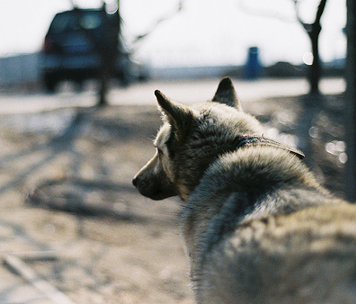
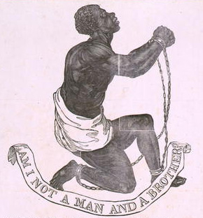

# ＜开阳＞奴隶制不罪恶，吃肉很罪恶 ——论道德是个什么东西

**被浩浩荡荡的现代性资本社会洗了脑以后，我们便俨然不能想象当年的人类是能够容忍拥有奴隶这种行为的。Doesn't it just SOUND nasty? 就如同被现代卫生标准洗了脑之后，我们便俨然不能想象一百年前的人类是如何能忍受一年洗一次澡的。** ** 但事实上，脏的界限——无论是身体上的脏还是精神上的脏——都是被时代塑造出来的。**  

# 奴隶制不罪恶，吃肉很罪恶

# ——论道德是个什么东西

## 文/王胜寒（Brown University）

 

一百年之后：紧急情况，十万火急！！！在倡导人权神圣性的今天，就在此时此刻，有一个在埃塞俄比亚的老黑要被饿死了！！！凡是有点道德心的人，请现在自觉通过输送系统给他散发食物，否则他可是要死的啊！！真的会死！！做为社会中拥有无上人权的一员，你怎能无动于衷！！！你的不作为会挑战人类道德底线！！！

五百年之后：紧急情况，十万火急！！！在倡导生命神圣性的今天，就在此时此刻，肉食这种毫无兽道的现象居然还存在于地球某些原始角落，这是对地球的藐视、对良知的践踏！有人类学家指出，我们需要尊重原始人类的习性和文化，但我们动物保护组织认为这种对生命伦理挑战底线的行为坚决不能容忍——我们最大的尊重就是让这些原始人学会吃仿肉产品，让他们尽早放弃滥杀无辜！我们的不作为会挑战人类道德底线！！！ 一百五十年前：紧急情况，十万火急！！！在倡导自由神圣性的今天，就在此时此刻，奴隶制这种道德沦丧的体制在我国南部仍然被实行着！！我们需要尽快发展一场运动，坚决撇清和奴隶主阶级的关系，和英国的先进势力为伍，誓当文明人！文明！！！文明啊！！！！！！！！！我们的不作为会挑战人类道德底线！！！

我今天就以百步笑五十步。

人类的道德底线究竟是如康德所声称的“独立而不改周行而不殆”地存在于心中宇宙之中，还是像马克思所认为的只是一个依附于经济基础之上的“上层建筑”？而我们对道德的理解需要遵循西方的二元对立模式——若不是柏拉图的精神理想国，就是亚里士多德的物质实体——需要非此即彼吗？

一度受尼采和福柯的影响很深，认为道德是权力和阶级的产物。而现在觉得事情远远没有这么简单。 前阵子读了一篇叫做《Capitalism and the Origins of the Humanitarian Sensibility》①的文章。文中探讨了资本主义崛起和人类道德感不断生成演变之间的关系。非常、非常有说服性。 在反驳了把废奴运动的动机归结于资产阶级的自我利益保护的学说之后，作者提出，市场经济的发展对社会结构和文化结构有了革命性的转变，加之技术的成熟、资源的丰富，这一切促成了一种新的道德感——对，不是新的道德，是新的道德感。 对，道德不是一种神圣不可侵犯的形而上原则。

道德是一种感觉。

Morality is a sensibility.

有时我们有这个感觉。这感觉，让你一听见“奴隶”二字，你就不舒服。这感觉，让你在即便无人察觉的情况下偷东西，也面红耳赤。

有时我们没有这个感觉。因为没有这个感觉，几百年前的人不会觉得奴隶是一个问题。因为没有这个感觉，几千年的人可以自相残杀，把跺手跺脚看成刑罚中天经地义的操作程序。因为没有这个感觉，活在当下的人玩游戏的人不会觉得他需要对自己的未来负责。因为没有这个感觉，我不会因为愧疚感责任感而现在买张飞机票冲到埃塞俄比亚去帮助那些马上要饿死的人。相反，我坐在电脑面前，写下了我对道德的理解和感觉。

这种感觉，让美国人觉得吃狗罪大恶极。这种无感，让中国人可以把家狗和肉狗分开。

和菜头，一位食狗者，曾经做过精彩的阐述：

“我曾经说过食狗者们至今还在传诵的名言：狗是人类的好朋友，因为它们的味道很棒。我并不是要忏悔什么，谁能责备一个神志健全的中国人呢？做中国人的好处就在这里，我可以一边吃着狗，一边和一条狗聊天。我永远也不会费神去建立一种无效连接，把眼前这条狗和锅里的那些联系起来，好让自己不自在。要区分它们很简单，小乖是具体的，有名字的一条狗，我和他很熟悉；而在汤锅里沸腾的那些，我叫不出它们的名字来，我们不熟，它们被煮熟，它们是肉。读史书的时候我就明白这一点，比如说赵括将军，假若他是被“醢之”，我感觉很惊悚，很震撼，想着吹牛逼的代价也太严重了。而说到他的士兵，赵降卒四十万，历史上被“坑之”，我没什么感觉。那四十万人在一个坑里沸腾着，我叫不出他们的名字来，我们不熟，他们变成化肥，上面有疯长的树，他们是肥料。”

#### 1、道德感的界限

既然是一种感觉，就有近有远。在界限之内，我们感觉强烈，比如家狗。在界限之外，我们感觉漠然，比如肉狗。

有时这条界限着实是很奇怪。David Brion Davis在他的书《1770～1823年革命时代的奴隶制问题》中提到疑问，为什么当时美国的中产阶级对南方奴隶制掀起反对旗杆，却对被剥削得同样严重——甚至更严重的‘工资奴隶’工人们的生存状态视而不见？”

你们可曾相信，当年美国南方很多农场主对他们的奴隶并非那么残忍，有些甚至让奴隶的孩子和自己的孩子一起玩耍读书？那些奴隶还有自己的小圈子，每天有自己的业余时间？

人类可以去反奴隶制，但对程度同样严重的其他剥削形式可以容忍。没有适当的名分，做什么都脏——在红色专制的系统下的自愿过劳死让我们愤怒、被我们认为是洗脑。而有了适当的名分，做什么都可以不脏——在自由民主的旗帜下的自愿过劳死只让我们惋惜，尽管这本质上也是一种洗脑。

人类的脑子就是被一遍遍来洗的，有时被人洗，有时被体制洗，更多时候被时代洗。

被浩浩荡荡的现代性资本社会洗了脑以后，我们便俨然不能想象当年的人类是能够容忍拥有奴隶这种行为的。Doesn't it just SOUND nasty? 就如同被现代卫生标准洗了脑之后，我们便俨然不能想象一百年前的人类是如何能忍受一年洗一次澡的。

但事实上，脏的界限——无论是身体上的脏还是精神上的脏——都是被时代塑造出来的。

#### 2、道德界限的形成

回到那篇“Capitalism and the Origins of the Humanitarian Sensibility"的文章。之前提到市场经济的发展对社会结构和文化结构有了革命性的转变。这种转变最重要的影响之一就是让人们有了新的时间观。

由于资本市场中合同的普遍使用，人们需要承诺在未来会发生的事情。由于资本市场的网越来越大越来越紧密、交通工具越来越发达，世界在人们眼中越来越小，便也变得更相关。人们开始更加可以用“未来”事态来理解事物（直到今天，大多价格更多是一种期待值）；加之科技的发展，人们更从此获得了一种可以掌握自己未来命运的感觉以及对他人命运的责任感。

借用维特根斯坦和著名社会学家Elias Norbert的著名概念，这是一种全新的“生活形式”，即一组全新的非常平凡然而不得不接受的基本事实和生活境遇。

对于后期维特根斯坦而言，拥有同样的生活形式是决定我们的语言可以被进入、可以被真正理解的先决条件。维特根斯坦说，“即使一头狮子会说话，我们也不懂得它。”因为我们的生活形式和狮子的不同，就算狮子具有用复杂代码和声线表达自己的能力，我们不会懂。请问，如果你都不懂一年不洗澡的感觉，你又如何能懂镶着一身黄毛的感觉？

如同语言，社会规范也是个是否可以被进入、可以被真正理解的问题。很多很多年前，把自己吃一半的面包喂到坐在旁边的陌生人的嘴里是一种贵族的礼仪。而今天的我们不会真正理解、感受到这个行为的高贵性。如果我们在现代做同样的事情，我们根本hold不住，我们内心深处觉得它可笑、尴尬、令人羞耻——因为我们进入不了中世纪贵族的生活形式。

如同语言和社会规范，道德感也是个是否可以被进入、可以被真正理解的问题。如果在一个原始部落里仍然有食人的传统，我们不能说他们的行为不道德，我们只能说我们进入不了他们的道德，我们“不懂”他们的道德。（这个年代流行政治正确，好，我在这里已经给出了你们最牛逼的政治正确哈哈）

我们觉得现在时代已经进步到快接近普爱的道德界限了吗？嘿嘿，现在没有，以后也不会有。Standup comedian大师乔治卡林曾经发出过振聋发聩的质问：“ 为什么对人就是堕胎，对鸡就是煎蛋了？ ” 直到有一天我们可以对鸡蛋如同我们对女人怀孕的肚子一样进行着爱怜的抚摸，我们再来谈普爱。

“普爱”在很大程度上是一个乌托邦，因为人不是神，只能在时间中存在。只要在时间中存在，人类便无法突破自身理解能力和感受能力的狭隘。

所以，孔子说的“推己及人”是有深刻含义的。让我们对陌生人和对亲人在绝对意义上一视同仁，就如同让我们把人胎和鸡蛋一视同仁一样，不但违反人性，而且违反宇宙规律。

不要说人与鸡之间，人与人之间相关的可能性已经是一个很悲观的命题了。我最喜欢的一篇《色戒》影评对此有很精彩的一段描述：

“警察封锁了街道，通缉参与行动的学生，王佳芝的车被拦下了，很多市民一同被拦住，一个老太太用上海话嘟囔，还要回家做饭呢。老太太意料不到这事件关乎的死亡，即使知道，也不如她那顿晚饭来的重要。一个无关的肉体无法聆听到另一个肉体的兴奋和哭泣，我想说的，和冷漠无关，和麻木无关，但是我为这“人”的困境颤抖，那就是，人注定成为碎片，并且是永远既无法和他人结合也无法和自己结合的碎片。”

一个无关的肉体无法聆听到另一个肉体的兴奋和哭泣。这才是真正的道德困境吧。

#### 3、But Still, 道德的无限可能性

但做为通灵性的人类，我们并非完全是时代的玩偶。我们的道德感是真实的——从某个层面甚至是自主的。道德感的形成并非是全物质的。

身为自然的一部分，我们不仅有被塑造出来的社会属性，更有自然属性。道德感一方面从社会中构成、但另一方面更从“万物有情”的自然中获取。做为自然造物，所以我们有“类万物之情”的能力。这便是“问世间情为何物”的精髓之一。情是世间一生一息的相关相连。

一块玉戴久了，和人也是会通情的。

于是，在道德的界限问题上，即便在同一个时代，通情的人注定要走得远一些。

前两天看到一个新闻：BBC的Nature's Miracle Babies节目讲到Kenya的非洲象孤儿中心的小象，大都出生不久就见证了父母被人类猎杀无依无靠，如果没有志愿者的帮助，将自生自灭于荒芜的非洲大地。哪怕在救助中心，很多小象仍死于抑郁。他们像孩子一样需要爱，每天晚上都需要吃过糖果后，在人的爱抚中才能入睡。

曾经有人对我说，对做人道主义工作有激情的人我可以理解，但对环保有激情的人我就理解不能够了。您，现在理解了吗？道德界限和道德感不同而已。

就像第一批要废奴制度的发起人，当这种新的道德感要付出水面的时候，他们感受到了时代的火苗，他们感受到了这种连结。因为看到了这种连结，他们的情怀便不同。

如果你愿意为了父母不顾性命，他们也会愿意为了正在受罪的奴隶不顾性命。

这便是世界的美丽。“原罪”和“原德”彼此相依，就如同“优胜劣汰”和“万物共生”同时存在一样。我们既可以超脱时代，又被时代所束缚。

道德既是物质的，又是精神的。这种矛盾重重的阴阳交化才是道德的本质。

道德的这种矛盾，不是狗屁西方相对主义，这种矛盾是核心。

  编辑注：①可至以下网址下载 [http://www.hhh.umn.edu/humanitarianisms/readings/Haskell-Capitalism%20and%20the%20Origins%20of%20the%20Humanitarian%20Sensibility.pdf](http://www.hhh.umn.edu/humanitarianisms/readings/Haskell-Capitalism%20and%20the%20Origins%20of%20the%20Humanitarian%20Sensibility.pdf) 原文链接：[http://blog.renren.com/blog/240147823/769026490](http://blog.renren.com/blog/240147823/769026490)  

（采编：管思聪 责编：管思聪）

 
