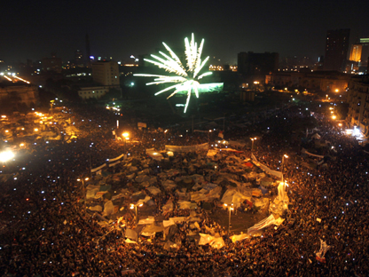
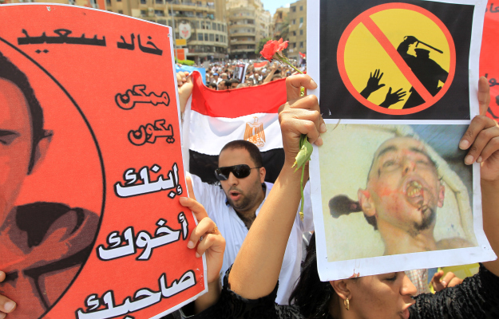
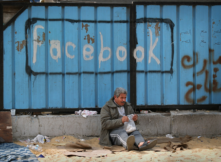
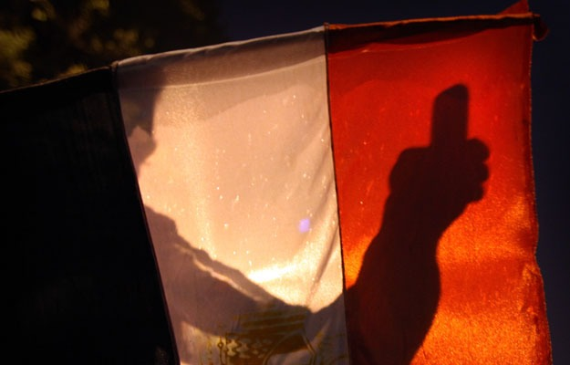

# ＜开阳＞对中东革命的一些技术分析

**非暴力绝不是软弱和拖沓的。塞尔维亚的反对派领袖之一波波维奇说，"推翻一个政权，甘地用了30年，我们用了10年，突尼斯人用了一个半月，而埃及人只用了19天。这是民主闪电战。"非暴力也是更为和平的。"8500万人生活在埃及，不到1000人死于这场革命，他们大多数都是被警察杀害的，这表现了我们埃及人民有多么文明。"Google的主管戈尼姆说。"现在，噩梦已经结束。现在，是放飞梦想的时候了。"**  

# 对中东革命的一些技术分析

## 文/黄霄（山东大学）

  

中东革命之后，中国是现存最大且最醒目的非民主政治实体。埃及革命（埃及人口约9000万）后，以被自由屋（Freedom House）列为“没有自由”的国家的人口计算，每十名受政治压制的人中就有六人目前生活在中国。了解中东革命，学习他们的技术，能够充实我们的非暴力工具箱。

首先要明确一些**对非暴力行动的基本看法：非暴力不是消极不服从，而是积极主动地出击。**如西德尼.塔罗所总结的，集体行动根据斗争手法的不同，可分为暴力型、常规型和破坏型。暴力型最容易发起，但通常仅局限于没有多少资源的小群体；常规性最易为人们所理解，为高层所接受，但缺少鼓动性；破坏型常能冲击常规，震动旁观者。其手法是大多数创新的来源，也是运动力量的来源，但它不稳定，并容易向其他两者转变。非暴力常常是介于合法与非法之间的创造性破坏力量。与消极不服从比起来，非暴力运动更像是一场没有武器的战争。**非暴力绝不是软弱和拖沓的。**塞尔维亚的反对派领袖之一波波维奇说，"推翻一个政权，甘地用了30年，我们用了10年，突尼斯人用了一个半月，而埃及人只用了19天。这是民主闪电战。"**非暴力也是更为和平的。**"8500万人生活在埃及，不到1000人死于这场革命，他们大多数都是被警察杀害的，这表现了我们埃及人民有多么文明。"的主管戈尼姆说。"现在，噩梦已经结束。现在，是放飞梦想的时候了。"

**不打无准备之仗。**匆匆忙忙召集起来的运动一旦被镇压，常常使反对派过早暴露，元气大伤。民众的积极性也被挫败，而在集权国家中，民众的信心是最珍贵的资源，一旦被挫败，真正解放的时日将继续往后推延。埃及革命前的一些准备见文章[《路透社 革命内幕：2011年的解放广场》](http://xiaozu.renren.com/xiaozu/249833/335453879)。而相反的，利比亚走向暴力起义的部分原因是缺少组织者和相应的准备，当然这也与利比亚人民普遍缺少国家认同而更多族群、地域认同，同时卡扎菲使用外国人组成的军队来镇压群众有关。而如果没有北约和美国的军事援助，起义的力量很可能坚持不下去。埃及反对派通过社交网络与突尼斯和塞尔维亚的成功者交流实用技术，并将部分内容整理成一部十几页的小册子用于广泛散发，如分散而不是集中前往广场；吸嗅洋葱、醋、柠檬汁以减轻催泪瓦斯的反应，携带可以滴进眼睛的苏打水或牛奶；戴上自行车头盔，用硬纸板和塑料瓶做成临时的盔甲穿在外头下面，以挡住防暴警察的子弹；用一截油桶盖保护自己的胳膊；用带来的喷漆涂满警察汽车的风挡，并堵塞汽车的排气管，卡住汽车的轮子，让它们成为废物；受伤的人退后，其他人立即顶替他们，以不断地轮换。等等。

**主力是之前意想不到的人群**，如青年人，还有人数众多有与警察打交道经验的足球球迷，等等；而非已经官僚化的合法反对派、激进穆斯林团体等。一位资深反对派领袖说，“我们尝试了30年的事，年轻人用6天就做成了。”

**中东革命的理论资源**：杰出的美国非暴力研究者Gene Sharp，引爆了塞尔维亚革命的学生组织，以及革命之后其主要成员建立的旨在向全世界传播非暴力斗争经验的组织。见文章[《埃及从推翻米洛舍维奇的学生身上学到了什么？》](http://xiaozu.renren.com/xiaozu/249833/335429509)

**社交媒体与网络营销**。社交媒体是一个平台，正如宗教革命时期的小册子，伊朗革命和⑥④时期的磁带，美国民权运动时期的电视一样，任何时兴的通讯手段都会被当时社会运动所大量运用，21世纪网络技术与社交媒体的应用更是将信息的流动速度、程度提高到了新的水平。突尼斯曾短暂屏蔽过（16天），但在反对派的压力下重开了。在埃及革命中，社交媒体扮演了更重要的位置。埃及facebook使用者的数量超过了其他所有阿拉伯国家。埃及革命的酝酿和爆发，也是在一个青年，哈立德·萨伊德，因为被警方怀疑掌握有警方腐败的证据，被从网吧里拖出来殴打致死之后，facebook上出现的一个拥有数十万关注者的账户“我们都是哈立德·萨伊德”成为了交换受压迫情感和资讯的中枢。此主页也常常发布经过精心准备的活动的通知，活动因其简便性和可操作性而使普通民众容易参与。穆巴拉克也曾关闭互联网和手机网络，但这几天人们并没有停止行动，而是采用了其他的替代方式。如虽然埃及的互联网和移动电话服务被切断，固定电话业务仍然正常，于是网络上的一个团队Telecomix在谷歌上搜索埃及传真机号码的特征字符串，找到了大量的传真号码，将信息发送到这些号码。另外，这些积极分子为人们提供拨号调制解调器和业余无线电电台（或火腿电台）的使用指南。还有直接在广场上用手举牌子告知大家下次活动的时间地点的传统方式。有新闻说美国将研制“手提箱式网络基站”，这将提高在集权国家的运动中切断网络之后运动的生存能力。不过，这些只能解决通讯问题，网络只能动员，动员之后如何组织呢？最关键的还是在于组织问题。数字行动主义是当下的热门话题，关于社交媒体在社会运动中的作用问题仍旧众说纷纭，统治者和反对派在网络战场上的争夺也在延续。我将在其他的帖子里继续讨论这个问题。

**中国的山寨手机**。令人意想不到的是，中国大量出口的便宜山寨手机也在中东革命中起到了重要的作用。其中一些是能够上网的智能手机，它们大多加入了抗议的网络中。每一部能够拍照的手机都是潜在的警察暴行的见证。另外，抗议者常常使用蓝牙来相互传递信息，在网络和手机通讯被切断后尤其如此。

**斗争中的宗教因素**。在突尼斯和埃及的抗议中，最引人注目的地方在于它们的非意识形态化抗议这一特征。抗议者们只有很简单和现实的要求，主要集中在：结束独裁统治以及伴随独裁统治而生的腐败，提高基本权利和物质生活标准。埃及的解放广场很少有口号是与宗教有关的。突尼斯的伊斯兰主义与埃及的穆斯林兄弟会，都是作为传统的反对派而存在，并被政府看做极具威胁性的极端力量而长期遭受打压，因此存在激进化的倾向。但在中东革命中并不非常积极，如穆斯林兄弟会在解放广场的示威开始第五天才大规模地参加运动。

**不能忽视军队在埃及革命中模糊不清的地位**。虽然在那19天中军队拒绝予以大规模镇压，但不排除是因为穆巴拉克意图传位给其银行家儿子而妨碍军队的利益而暗中支持反对派的动机。过渡政府中反对派人士，埃及的国家权力仍然掌握在抗议者走上街头前的那些人手中。目前因为改革滞后，军队态度不明，已经有一部分年轻人重新上街。

 —————————————— 

**怎样和平地改变集权政府**

来自Canvas的五点意见

1.做好准备工作：分析各种你想拉拢的支柱（支柱指的是对非暴力变革十分关键的机构和组织）

2.给你的斗争整理出一个清晰的愿景和战略——而且不要听外来的意见

3.在运动之内打造统一局面——目标的统一，人员的统一和组织内部的统一。

4.维持非暴力原则——一次暴力事件就可以毁掉你的斗争的可信度

5.保持攻势，选择那些你可以获得胜利的战斗。自己要懂得在何时，以何种方式宣布胜利。

 

（采编：佛冉 责编：黄理罡）

 
