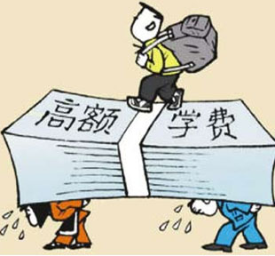
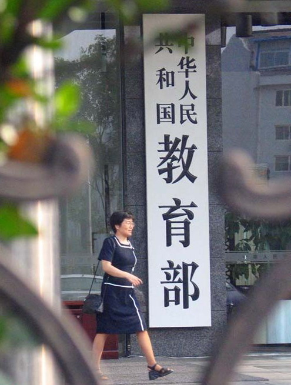

# ＜开阳＞平权或是利益

**其实，河南山东的悲剧并不在于考生数，而在于大学数——湖北的考生人数、质量决不低于河南山东，但仅武汉一地就有7所部属院校，这才是湖北的幸运所在：全湖北目前的高等教育（中学后教育含高职高专）在校生人数已经超过百万，位列全国第一。从湖北对照全国，其实不难看出，在各地区真正稀缺的不是分数，而是大学数，以及其背后的校园面积、教室座位、寝室床位等等代表高等教育容量的指标。因此，山东河南差的录取率并不在省外，而是省内奇缺的高等教育容量。**  

#  平权或是利益

# ——浅析美国公立大学系统的反平权问题

## 梁哲浩（华中科技大学）

 

中国的高考及其招生制度就像过去“运动”时期的黑五类一样，每年暑假前后都会被挂出来照例拷打一番；其罪状主要有两点：一、入学机会不均等，是为地域歧视；二、高额学费压力，是为社会歧视。久而久之，这貌似成了一种周年式的话题。南方周末上期《穷孩子没有春天？——寒门子弟为何离一线高校越来越远》与《让出身不再决定命运——美国教育平权运动40年》两篇文章，似乎在以一种“对比性”的舆论环境告诉整个社会，国外大学中并不存在这等问题——或者至少是“公平优先、兼顾效率”。不可否认，国人梦想中的“平权”曾经确实在美国存在过，但如今这种“权”是否还“平”仿佛也随着美国国内一部部法律的颁布而变得存在疑问了。

#### 步履维艰的美国公立高等教育

所谓“棍棒打不垮经济规律”；研究一个国家的高等教育制度不妨从教育财政构成看起。以美国为例，2004-2005学年公立研究型高校的平均经费来源结构中，来自于净学费的收入达到近25%，而来自于州政府的拨款收入占31%，来自于政府的合同收入占26%，其它收入包括联邦拨款、私人捐赠、投资收入等占17%。其中，精英型的研究型公立大学，由于研究性合同收入多，捐赠基金数额巨大，每年的投资收益很可观，有附属医院的大学来自医院的收入更是巨大，因此相比之下来自州政府拨款的比例更小——根据法律规定，虽然提供的经费不多，但州政府仍然是这类公立大学的老板；从选举的逻辑出发，州长和州议员总有意愿利用手中控制的公立大学取悦本州选民。问题在于，自上世纪90年代以来，美国各州财政开始吃紧；而一方面经济衰退导致更多人不愿进入就业市场转而谋求升学、另一方面各州为了刺激经济纷纷出台减税减学费的政策。这种“既想马儿跑又想马儿不吃草”的赤字策略显然不可能永远不用买单；于是，部分州也闹出了一些“拖欠教师工资”、“大学手持议会预算讨不来政府拨款”等等丑闻，比较极端的案例发生在弗吉尼亚大学：其2004年上报州议会的预算，州政府的实际拨付比例仅为8%。

#### **学费与地域歧视**

由于经费短缺的势头难以遏制，各州议会和政府只能授予所属公立大学提高学费的权力作为财政吃紧的补偿，尤其是公立研究型大学涨幅最高。从1995－1996学年至2006－2007学年，公立研究性大学的州内学生学费从平均3952美元上涨到6197美元，涨幅57％；公立硕士和学士高校的本州学生学费从平均3218美元上涨到4730美元，涨幅47％；公立社区学院的本州学生学费从2960美元上涨到4125美元，涨幅40％。

这里看上去似乎并没有什么问题，与“平权”也扯不上关系，但其实：一方面如果各州继续执行“税收与学费双减”的政策，公立大学很快就会关门大吉；因此，如前所述，各州的普遍应对措施是：大幅削减教育经费，差额部分让学校上涨学费自己补足。

另一方面，“本州居民利益=票箱=政治利益”，无论州政府、州议会任谁都不敢拂逆；特别是出于避险的理由，经济状况同高等教育需求往往是负相关的，前面也提到过：不景气的时候居民的教育需求反而会上升。于是，各州又纷纷在学费杠杆上动脑筋，优先保证州内教育需求。其实，州内学生平均学费上涨57%，扣除通胀因素、再加上减税提高了实际居民可支配收入，这一涨幅已经可以满足教育经费缺口。可这时州外学生面临着怎样的收费标准呢？

对州外学生实行的是所谓“按照实际教学成本收取”的方式，但大部分州以此为据建立了州内外学生学费的指数对应关系：最低的如北卡罗莱纳州规定，“州外学费不得低于州内的125%”，最高的乔治亚州为400%，其他州基本在250%至300%之间。

3倍，再考虑基数部分上涨57%，也就意味着州外学生可能面临着实际高出原来5倍的学费，谁能相信这种收费制度中真的没有地域歧视的因素？

#### **录取中的利益均沾**

在《让出身不再决定命运——美国教育平权运动40年》一文中似乎有些轻描淡写的“1978年加州大学董事会诉巴基案”是震动美国朝野的历史大案，联邦法官以5比4的票数通过了一份罕见的双重判决（Double Decision）：判决的第一部分认为加州大学按照联邦政府推行的教育平权“肯定性政策”（Affirmative Action）所确定的录取制度违法；第二部分承认加州大学有权实行一些使学生来源和校园学术环境多元化的特殊政策，在录取新生时可以把种族作为一个因素来考虑、但不能作为惟一因素。实际上，这一判决回避了“教育平权运动”被指矫枉过正导致“逆向歧视”（Reverse Discrimination）的质疑。因此，与其说这是一份可供参考的判决，不如说是圆滑的政治平衡手段。

但问题是不可能一直回避的。自90年代后期以来，美国已经对其保护少数族裔为目的运行了二十多年的教育平权法案做了巨大调整。作为替代品，“百分比计划”在三个大州(德克萨斯州、佛罗里达州和加里福尼亚州)得以施行。这一计划的背景是1996年第五巡回法院的判决，其中指出：管理者或财政资助者不得再将种族或族裔作为高校录取中一个考虑因素。由于法院判决的管辖范围包括德州、密西西比州及加州，这些州内的公立大学从此不再能实施向少数族裔倾斜的“平权”政策。

 具体而言，德州、佛州、加州的“百分比计划”分别为： **1.德州“前10%计划”**

1997年德州通过了《德州计划》(众议院第588号文)。文件中提出了“前10%计划”，保证德州所有在其所读的公立或私立高中班级排名前10%的学生能够自动收到州内公立大学的录取通知，各高校可以要求测试写作、提供推荐信、进行面试和入学体检、提交学费及正式的高中成绩单。在“前10%计划”框架下，以往录取中学生必须具备的全美大学入学考试成绩，仅仅成了判断学生的学术辅导需要、入学后跟踪评价的依据。

**2.佛州“一个佛罗里达计划”**

佛罗里达州州长杰布·布什（美国前总统小布什的弟弟）在考察、评估了德州的实际情况后，在公开反对终止“平权法案”的同时，1999年主动提出并实施了“一个佛罗里达计划”。既取消以往在政府就业、州内承包和高校录取等方面采取的有关种族或性别倾斜的做法，也在获得奖学金、开展活动及设立大学入学前学习准备培训班方面仍给予一定优惠(行政令99-281)；相应地，该计划保证州内公立大学录取高中班级前20%且完成必修课的毕业生，而不管他们的SAT或ACT分数，并由州政府增加2000万美元的预算资金进行资助。佛州为此设立了一个委员会，每三年对通过该计划录取的少数族裔学生进行一次评估；还规定在对大学校长进行考核时，要体现多样化的评价目标。

2000年后，佛罗里达州立大学系统还实行了由杰布·布什提议的“有才能的20" (Talented 20)政策，即保证录取就读于公立高中、并在其班级内排名前20%且完成必修课的学生。实际上，“有才能的20”政策是保证公立高中毕业生获得佛州州立大学系统录取通知的另一种方式，如果高中生在19门必修专业课中平均水平是B，或他们的GPA比B低，将把高中GPA和入学考试分数按一定比例结合，由董事会来确认该学生是否能讲入州立大学学习的资格。但问题在于，出于平衡州内各郡县利益，这些“排名前20%”的学生是按校内而非州内比例划分的，所以一大批准备不足的学生也得以进入大学。

 **3.加州“前4%计划”**

20世纪60年代以来，加州逐步形成了由加州大学系统、加州州立大学系统及加州社区学院系统组成的加州公立高等教育体系。其中，加州大学(UC)现有10个分校、属于研究型大学，设有本科生、研究生和专业教育项目；有24个校区、属于教学型大学的加州州立大学(CSU)，主要进行本科学历教育；加州社区学院系统开设二年制教育项目。根据“The 1960 Master Plan for Higher Education”法案，其本科录取政策为：加州大学从全州范围内高中毕业班中排名前12.5%的学生中进行录取，加州州立大学从高中毕业班中排名前1/3的学生中进行录取。在美国大多数州，参加社区学院（类似我国大专）学习修完一定学分或满足一定GPA成绩的学生可以转入州立大学系统学习；加州也不例外，他们采用的是社区大学修足60个学分升州立大学（CSU），州立大学学生满足各校区自行设定的学分和成绩条件后可转入加州大学（UC）。因此，作为美国“高等教育强州”的加州学子们即使不幸只能进入社区学院，法律告诉他们刻苦学习也是有盼头的——事实上这种深造的热情使州立大学和加州大学系统压力巨大，毕竟符合条件者不能拒收。

几乎与德州的大学生录取政策改革完全同步，1996年加州修改了州宪法(209议案)，第一条规定“不论其种族、性别、肤色、民族及出生地，全州在公共就业、公共教育或公共承包方面对任何个人或组织不得歧视或给予优惠待遇”。1997年，加州大学董事会以13:1的投票表决通过了一项政策，废除了向少数族裔倾斜的反歧视性补救措施。随着该条款于1998年在加州的全面实施，废止平权法案的浪潮也进入顶峰。同佛州一样，为了平衡州内利益，1999年州长格雷·戴维斯提出，每所公立或私立高中的班级排名前4%以上的毕业生，都将会保证被加州大学录取。同年3月，加州政府以决议的方式颁布“前4%计划”为高校录取政策，并确定三年后实施。

当时加州高等教育规划所提出的标准是“州内高三学生的升学率将从11.1%增加到12.5%”，因而“前4%计划”只占加州惯例性的“州内保证12.5%”的全部录取计划的一部分，因此这一计划实际与前述的1960年法案相比没有什么进步意义。更有趣的是，在该计划提出的的过去几年里，加州升学率已经上升到了11.5%。所以这个所谓的4%计划就是在原有州内保护性条款的基础上，进一步强调了对州内学生所必须的保护性录取率。于是，为了确保实现不同政策条款的相容性，加州大学董事会同意以双重录取方案对前4%计划进行补充、完善，即对那些在其班级中排名前4%至12.5%之间的学生进行临时录取，如果这些学生在社区学院内完成前两年课程且获得的GPA不低于2.4，也可以通过转学进入该校就读。

那么来小结一下，本科阶段，三大州法定的公立学校对本州居民的基本录取率分别为：

1.德州10%；

2.佛州20%；

3.加州12.5%。

这里的背景必须强调：这些保障本州居民利益法案的出发点其实是对废除“平权”法案的补偿，也就是说——既要补偿旧有的少数族裔平权法案被废止的影响；又需进一步巩固州内居民的利益。

还需要注意的是，这些法案所提到的百分比全部都是学生在校内的成绩而非州内排名，这种方式要是能充分保证州内“最优秀的学生深造的权利”——试想一下，在中国某省最差高中前10%的学生和最优秀高中前10%的学生在本科录取时享受一个待遇——与其说这是我们想要的公平，不如说是政治操作下的利益均沾。

学费与录取双管齐下，三个州公立大学的生源结构是怎样的呢？2008年，德州、佛州、加州各公立大学本州生源平均比例超过80%。名校也不例外：加州大学（UC）系统2008年秋季入学的大一新生中，伯克利分校本州居民占82.9%、洛杉矶分校为82.1%、尔湾分校达到93%、河滨分校更是97.0%。德州州立大学奥斯汀分校2008年秋季入学的大一新生中，本州居民占93%，外州学生占4%，国际学生仅3%。2009年全美排名30名的北卡罗来纳州立大学教堂山分校2008年秋季入学的大一新生中，本州居民占到80.2% ，剩下19.8% 留给外州学生和国际学生争夺；事实上，平均每年能进入该校的国际学生仅50位左右。

因此，这种不对外的“平权”不如说是变相的“肥水不流外人田”，美国各州除了对本州居民提供学费优惠和资助外，州内各知名公立大学还肩负着保障本州优秀学生的“政治任务”，毕竟如果连他们都要付出前面所说的数倍于当地人的高额学费到外州读书，州政府如何向缴了州税的居民交代？

#### **真正的“平权”之道**

在中国，招生计划公布的时候，也是河南山东哀嚎遍地的时候；而这些地方的学生喊着要“一张卷子一个标准”的公平，一方面是看不清问题关键之所在，另一方面也在力图打破“地域歧视”和“社会歧视”外的同时构建一种“考试霸权”。

其实，河南山东的悲剧并不在于考生数，而在于大学数——湖北的考生人数、质量决不低于河南山东，但仅武汉一地就有7所部属院校，这才是湖北的幸运所在：全湖北目前的高等教育（中学后教育含高职高专）在校生人数已经超过百万，位列全国第一。从湖北对照全国，其实不难看出，在各地区真正稀缺的不是分数，而是大学数，以及其背后的校园面积、教室座位、寝室床位等等代表高等教育容量的指标。因此，山东河南差的录取率并不在省外，而是省内奇缺的高等教育容量。目前中国的高校也是分为部属、省属、地方三级，其中部属高校采取所谓“教育部与地方共建”的形式，也必须对所在省市的招生有大幅度倾斜，不少城市还有所谓“共建生源”存在，这都是高校对所在省市教育投资的一种回报。

公正地说，地方保护主义和地方利益取向这是世界高等教育领域的一个普遍问题，也是知识经济时代和高等教育大众化的必然结果之一：既然投资高校可以获利、既然民众有高等教育需求、既然高等教育可以带来高质量的劳动者，设置门槛何乐而不为？

在美国公立高等教育的故事里，“平权”作为主旋律已经渐渐淡出了人们的视线；事实上，“平权”之外其实有更多闪光点值得国人加以认识。美国各州通过立法对州外学生加以各种限制，就从外部解决了州内高等教育资源的稀缺性问题，继而对州内各地实实在在地做到“一碗水端平”的优惠，虽然其中有政治操作的因素。而在《让出身不再决定命运》一文中被盛赞的KIPP体系，本质上就是美国版的“超级中学”，通过严格管理和加大投入获得成功，如果说这套体系有多少“平权”和独到之处，那高擎分数大旗的中国“超级中学”早就是“国际领先水平”了，所以它的借鉴意义其实不大。

因此，改变高等教育资源分布不均的状况，才是解决当前入学机会不平衡问题的关键；还需要注意的是，就如南方周末另一篇文章《贫民窟里来了大富翁》所提到的那样，环境导致的贫穷是“命”，那么“一张卷子一个标准”的设想显然又是对偏远不发达地区的另一种不公正。既然各省教育水平不均、各地大学数不同，那么为什么不能把各地组合为人口与机会比例较均等的数个区域，各区域内实行统一的招生政策，几个偏远省份单独划为一特区。既然地域歧视难以克服，那么也不妨把学校在本区的招生比例用法律固定下来，剩下的名额一部分匀给其他区域、一部分照顾“特区”，将目前处于黑箱操作的“共建”优惠阳光化——必须考虑地域因素的公平问题，早在明代就已通过“南北中三卷取士”初步解决了。

实际上，这一方案也曾被人提出过。只不过，现实中如京沪琼等“占便宜”的地区认为让步太大，河南山东等“吃亏”的省市觉得改进幅度太小，期望差导致提案最终告吹，取而代之的则是地域分化与黑箱问题更加严重的高校“自主选拔”政策。于是乎，在一个不相信“帕累托改进”存在的环境下，怎么可能实行有效的改革？

 

( 采编：管思聪 责编：管思聪 )

 
