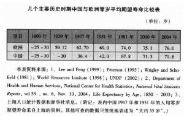
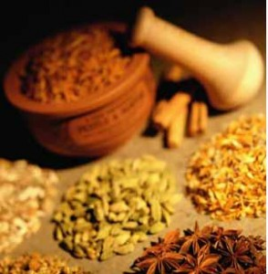

# ＜开阳＞我为什么反对中医

**中医的未来，必定是向现代医学靠近。自民国开始便有人提“废医存药”，我以为废除中医基础理论的医学应用是未来的必然，至于这套理论体系在文化学上的研究价值还是值得研究的，中医部分著作的语言也是中国传统文化的一部分，不可因理论的薄弱而彻底打死。对于传统中药，我以为以标准的研发过程是必然的，毒理研究，成为现代化药物。**

### 

### 

# 我为什么反对中医

### 

## 刘步筑（北京大学）

### 

### 

**一 中医概述** 判断一个事物，首先观察要对其的定义。全国科学技术名词审定委员会的定义是“以中医药理论与实践经验为主体，研究人类生命活动中健康与疾病转化规律及其预防、诊断、治疗、康复和保健的综合性科学”。观察这个定义可以看到首先是“中医药理论”，什么叫中医药理论呢，简而言之就是以阴阳五行作为理论基础，将人体看成是气、形、神的统一体。我们不妨同时看一看中国古典哲学的内容。先秦哲学即包含天人、气、太极、阴阳、道器、动静、有无、常变、心物、名实等范畴，两汉时期盛行的谶纬之学以阴阳五行学说和董仲舒“天人感应论”为基础，与中医之间的关系不可谓不深入。宋明理学中的“养德”、“主静”等概念也有着千丝万缕的联系。 《周易•系辞》有：“阴阳交合，物之始，阴阳分离，物之终。合则生，离则死。”而《素问》有：“阴平阳秘，精神乃治，阴阳离决，精气乃绝。”“重阳死，重阴死。”明张介宾亦有“天地之道，以阴阳二气而造化万物，人生之理，以阴阳二气而长养百骸。易者，易也，具阴阳动静之妙，医者，意也，合阴阳消长之机。”可见中医的一脉相传与中国古典哲学是不可分离的。甚至很多时候，两者描述的是一件事物，一个道理。 下面说说“实践经验”。实际上进入现代社会之前，主流中医是看不起“经验”的。此处做个说明，以中医基础理论中阴阳五行为理论指导的治疗是正统的疗法，而实践经验中产生的疗法可称为“验方”，由于某种产生过个别治疗效果的治疗方法称为“偏方”。我们经常说《本草纲目》是中医药经验的集大成，此言略欠严谨。其中一万一千有余的医方存在大量以中医基础理论为基础的“天人感应”术。如夫妻各饮一杯立春雨水后同房可治疗不孕症、暴水蛭以通血脉（水蛭会吸血，中医认为将其晒干可以活血化瘀）等。（说句题外话，李时珍这部著作的确走在了时代的前沿，至少解决了中药学“草木不分，鱼虫互混”等问题，也否认了“久食水银，长生不老”、“炼食硫磺可长肌肤益气力”等无稽之谈，究其所以，以一句中国历史教学模式来说，李时珍终究存在其固有局限性）因此无论是上古、中古或是近古的中医典籍中，仍然无法摆脱中医基础理论束缚。 **二 中医的对立面** 目前民间普遍的说法“中医”的对立面是“西医”，其实不然。中医作为一种传统医术，与任何其他国家/民族的传统医术都具有相似点。与中医阴阳五行学说对应脏象相似的是，古希腊医学有天地四元素（土、气、火、水）对应的四体液学说，这种学说同时将体液与脏器对应，肝-血液、肺-粘液、胆-黄胆汁、脾-黑胆汁。与阴阳五行的此消彼长相似的是四体液的平衡与失衡。与中药四气（寒、热、温、良）五味（辛、甘、酸、苦、咸）对应的则是西药的冷、热、干、湿。可见中医与西医只是平行关系，而不是相互对立的。 中医、西医在WHO都被划分到“另类疗法**(**alternative therapy)”范畴，由于现代医学的兴起（现代医学仅仅是西方近代医学的延伸，而后者的起点是哈维发现了血液循环。在他之前的发现肺循环的塞尔维特被活活烧死，出版了剑指盖伦诸多谬误的《人体构造》的作者维萨里亦遭教会迫害，这是西方近代医学与“西医”对立的明证），西医在西方医学界便逐渐被抛弃了，但是在西方民间仍然还有人信奉自然疗法、草药疗法、顺势疗法、脊柱按摩疗法、反射疗法、虹膜诊断术、颅骶疗法、触摸疗法等“封建”残余。20世纪六十年代兴起的反智运动给另类医术的联合提供了意识形态基础，他们组成全国性、世界性组织，对西方政界施加压力，要求政府解除对另类医术的限制甚至资助另类医术。在目前，美国有三分之一以上的人接受某种另类医术，如果把祈祷疗法（通过祈祷来治病）也算进去，这个比例则超过了60％。 **三 差异** 古典医学当道的时代与现代医学当道的时代有何差异，且看一张图： 

（笔者注：平均期望寿命是对人的生命一种有根据的预测，即预测年龄某岁的人今后尚能生存的平均寿命，而不是即时的人群死亡年龄的均值）

有人质疑这种比较当中包含战争状况、饮食与营养、生活方式、职业、心理、环境等因素，而不仅仅是医学技术水平的原因。问题是这种质疑无法被证实也无法被证伪，因为首先无法复制一个单因素模型以控制变量寻求相关性，其次这些因素之间互相关联得太过紧密，甚至有不少线性关系明显的。但是很明显的一件事是，围产技术大大降低了婴儿的死亡率，疫苗接种阻止并部分消灭了可致大规模疫情的微生物传染病，抗生素治疗防止大部分疾病的深入发展，预防医学的兴起在降低高血压、冠心病、癌症等常见疾病上也起了很大作用（事实上是因为这些常见病的兴起带动了预防医学的发展），这本就是延长人群平均寿命的依据。 **四 为什么说中医不是科学** 之所以不用“伪科学”一词主要是照顾到绝大多数中国同胞的民族情感，"Pseudoscience"一词是如何定义的呢？"A claim, belief, or practice which is presented as scientific, but which does not adhere to a valid scientific methodology, lacks supporting evidence or plausibility, cannot be reliably tested, or otherwise lacks scientific status"，什么意思呢？翻译过来大概是“任何宣称为科学，或描述方式看起来像科学，但实际上并不符合科学方法基本要求的知识、方法论、信仰或是实务经验”。用“伪科学”一词形容中医并不过分。 对医学史有所了解的人应该知道医学模式发展的四个阶段：神灵主义的医学模式、自然哲学的医学模式、生物医学模式、生物心理社会医学模式。中医、西医与西方近代医学的差异是自然哲学的医学模式、生物医学模式的分野，西方近代医学与现代医学的不同是生物心理社会医学模式的区别。这四个模式的划分有助于我们解读中医的表在特征，这部分内容将在下文谈到。 我们要弄清楚中医是不是科学一定要搞清楚以下三个问题：1.什么是科学；2.什么不是科学；3.中医符合科学的地方有哪些，不符合科学的地方有哪些（为什么要问“什么是科学”而不是“科学是什么”这是逻辑学的问题，恕不展开讨论）。 1.什么是科学？首先，科学理论必须是自恰的，即本身能做到逻辑上的一致性，至少要能自圆其说，不能前后自相矛盾。其次，符合科学理论必须是简明的，不能包含不必要的假设和条件，为以后的失败留好了退路，也就是说， 要符合 “奥卡姆剃刀”的原则 （所谓奥卡姆剃刀(Occam's Razor, Ockham's Razor)，是由14世纪逻辑学家、圣方济各会修士奥卡姆的威廉提出。他在《箴言书注》2卷15题说“切勿浪费较多东西，去做较少的东西；用较少的东西，同样可以做好的事情”奥卡姆剃刀原理可以归结为： 若无必要，勿增实体）。再次，科学理论必须是能够被证伪的，不能在任何条件下都永远正确、不能有任何的修正。最后，科学理论必须是有清楚界定的应用范畴的，只在一定的条件下、在一定的领域中能够适用，而不是无所不能，无所不包。 2.什么不是科学？科学是全人类所共有的，没有国界，没有民族、文化界限，没有什么东方科学与西方科学的差别。凡是声称某种科学只有中国人（或者熟悉中国文化的外国人）才能掌握的，肯定不是真科学。科学与信仰无关，凡是声称“信则有，信则灵”的，肯定不科学。（在这个问题上有必要和“信仰”划分开） 3.（中医符合科学的地方请反对反对中医者自行查找）这里只从阴阳五行谈中医不符合科学的地方。中医有“气始而生化，气散而有形，气布而蕃育，气终而象变，其致一也。”（《素问•五常政大论》），其中“气”的概念无论《内经》、《难经》、《伤寒杂病论》还是后世的著作都是说不清的，阴阳同样是个抽象的概念，“阴阳者，有名而无形。”任何事物都可以分成阴阳，而阴中有阳，阳中有阴，自然一直划分下去，“阴阳者，数之可十，推之可百，数之可千，推之可万，万之大，不可胜数，然其要一也。”（《素问•阴阳离合论》）但是什么是阴，什么是阳，也是模糊、抽象而无明确的标准的。并且既然万物都可以随意划分阴阳，而阴与阳之间又可以存在任何关系，这样的学说当然能够解释一切事物及其变化，然而实际上还是等于什么也没有解释。试问科学分门别类，哪一支具有定义模糊的核心关键词？哪一支以玄学的用语来做开篇？再说五行，五行的相生相克最初来源于对木、火、土、金、水五者属性的观察，然而这种观察当然是非常原始、粗陋的，根本经不起推敲 （如水银属金还是属水？金与土构成的化合物算哪一门？）由此可见，所谓的气、阴阳、五行都是非常模糊、抽象的概念，并非客观具体的事物或现象，无法界定和证明。然而，它们又是无所不在，时刻发生变化，并囊括了各种可能的关系，它无所不能，无所不包，可以根据需要对一切事物和现象做出解释，这本身就违反了科学的限定性原则。 另外，科学具有可验证性。而可验证性属于客观范畴。中医讲究的则多是“心法”、“顿悟”等主观性极强的“内证实验”。包括许多医案的记载，许多医生明明是没有什么经验积累的，然一种疗法治愈了两三人便开始著书。退一步讲，不说统计学意义，单是常识判断，这有任何道理么？ **五 不科学却为何“有效”？** 以上只是通过论述“中医重要基础理论不符合科学”证明“中医并非科学”，是为节省篇幅（如果加上诊断的谬误并剖析治疗的思维方法，仅此一段话可以写出近万字）。下面回应一个最可能最为广泛的质疑：“有用不就行么？” 举几个简单的例子。明庆龙年间有人发现通过种人痘能够预防天花（确比琴纳确提前一百多年，技术上落后于后者），这是一种经验结晶，且效果可以说是在那个时代无可比拟。但是中医却将这种经验套用基础理论解释为“天花是小儿先天就有的藏在命门中的“胎毒”，而种痘是为了把胎毒引出来。当牛痘术于19世纪初自西方传入中国后，中医家也要来个“中西医结合”，对种痘后的反应进行辨证施治，认为是“脾经毒甚，血热违和”，这显然并非以中医理论为基础而是单纯的经验疗法，是为“验方”。 再如，晋葛洪《肘后备急方》关于治疟的相关文字有：“青蒿一握，以水二升渍，绞取汁，尽服之。”，而《本草纲目》对青蒿截疟也有相关论述。现代医学证明，青蒿乙醚提取中性部分对疟原虫红细胞内期有杀灭作用，可以抑制疟原虫成熟，在当时也确有治愈的病例。到了清康熙年间，皇帝得了疟疾，而太医束手无策。传教士献上金鸡纳（主要成分是奎宁，可以抑制疟原虫繁殖）方才病愈。原因是什么呢？由于语言的流变以及文献的残缺，葛洪的验方也走偏。由于后人误解了青蒿为香蒿（并不能治疟疾），而非臭蒿（黄花蒿，含青蒿素），此验方也算作废。另外，中医认为疟疾病因为“外感疟邪、疫瘴湿毒之气或风、寒，暑、湿之气，内则正气损伤而发病”。《疟论》云：“夫痎疟，皆生于风”，内经《生气通天论》言：“夏伤于暑，秋必痎疟”。对于间日疟的描述是“感受疟邪之后，疟邪与卫气相集，邪正相争，阴阳相移，而引起疟疾症状的发作。疟邪与卫气相集，人与阴争，阴实阳虚，以致恶寒战栗；出与阳争，阳盛阴虚，内外皆热，以致壮热，头痛，口渴。疟邪与卫气相离，则遍身汗出，热退身凉，发作停止。当疟邪再次与卫气相集而邪正交争时，则再一次引起疟疾发作。”相信任何一个学习过寄生虫学的医学生都能看出其中的荒谬来。 以上两个例子主要是说明中医的有效性往往建立在实践经验而非基础理论的基础上。实际上古时无论常见病还是在某一时段广泛流行的传染病，验方的诊治都是主体。实际上，非科学中医基础理论已经不是中医实践的依托，而仅仅是治疗的说辞。甚至有些时候（如上述的青蒿治疟的误传）以非科学的态度往往导致经验的湮没。 而中医的“有效性”并不能说明仅仅是中医的治疗手段治愈疾病，疾病的治愈以下几方面的原因：1.致病因素的自限性与疾病的自然转归。即致病因素不足以长时间干扰机体，或机体的免疫力足以抵抗、消除致病因素；2.心理因素，通俗地说就是“信则灵”，关于这点司马南在《我是司马南》一书中详细地描述过九十年代末期中国信众最多的非政府组织“确实有效”，流亡美国的李教主确有“一点通”（病患久医不治，被李教主轻轻一点便可以活动）的例证。“信则灵”在当下生物心理社会医学模式阶段的名称便是“心理作用”，如新药研发对照试验中加入的安慰剂也可使患者症状减轻。那么使用中医诊疗手段造成的身体康复是否说明中医真正有效呢？最简单的例子是你低烧时使用抗生素和静养休息不用药之间，最终结果都是康复，但是时间快慢，相信发过烧的人都能体会到。 **六 中医领域还未更正的错误认识** 上文提及中医基础理论中气、阴阳、五行的模糊性与无限性，这些描述并非科学，却也无法在理论层面被证伪。这并没有关系，因为五行对应着五脏（肝、心、脾、肺、肾），而中医必须面临五脏的功能作用与相互关系。 1.中医把心当成了思维器官，“心者，五脏六腑之大主，精神之所舍也厂”（《灵枢•邪客》）“心者，君主之官也，神明出焉。”（《素问•灵兰秘典论》）西方古代医学也有这种错误的认识，但只有中医至今仍然坚持“心主神明”，而认为五脏和其他脏器都分担着人的精神活动。“五脏所藏:心藏神，肺藏魄，肝藏魂，脾藏意，肾藏志。”（《素问•宣明五气篇第二十三》）“心者，君主之官也，神明出焉。肺者，相傅之官，治节出焉。肝者，将军之官，谋虑出焉。胆者，中正之官，决断出焉。擅中者，臣使之官，喜乐出焉’’（《黄帝内经•灵兰秘典论》）这是硬把大脑的功能瓜分给与其他器官了。’’ 2.对于肾，“精神之所舍也;男子以藏精，女子以系胞”(《难经•三十九难》)。这是把肾当成了主要的生殖器官了，这显然是因为注意到精液和尿液都是从尿道排出的。中医不知道肾只是一个排泄器官，而是按照房事之后身体“虚弱”的位置的经验，把肾的作用说得无比重要和广泛，为“先天之本”、“生命之源”，其功能是藏精、主水、主纳气、主骨、生髓，其华在发，开窍于耳，司二阴。于是许许多多疾病都能被说成是“肾虚”导致，几乎涵盖了内分泌系统、生殖系统、泌尿系统、运动骨骼系统、呼吸系统的诸多相关疾病。甚至连传染病，例如“痨瘵”，也被说成与“肾虚”有关。这又是生硬地把肺部的疾患专题到膈膜之下了。 3.其他的器官：脾是重要的储藏血液的场所和最大的周围淋巴器官，具有过滤血液、破坏衰老的红细胞、调节血量、产生淋巴细胞和免疫应答等功能，并无消化功能。中医至今还声称脾主运化，是人体消化系统的主要脏器，通常“脾胃”并称；而储藏和调节血量的功能实为肝所有。中医除了认识到“肺主呼吸”外，还加上了调通水道，负责体内体液的运行和排泄，显然又是把血管的作用套了过来。 以上可见，中医对脏器功能的认识具有过多荒谬之处，与解剖学、生理学背道而驰，基本是错误的。而中医特有的“经络”又是怎么回事呢？“经脉十二者，伏行分肉之间，深而不见；其常见者，足太阴过于外踝之上，无所隐故也。诸脉之浮而常见者，皆络脉也。”（《灵枢•经脉》）“当数者为经，其不当数者为络也。”（《灵枢•脉度》）现代医学解剖学逐渐完善之后，人们发现经络和血管的位置有所偏离，中医界便号称这是两套系统。中医有“血病身有痛者治其经络”（《黄帝内经》三部九侯论篇），“心者血，肺者气。血为荣，气为卫，相随上下，谓之荣卫。通行经络，营周于外”（《难经•论脏腑》），实际上就是在说经络中走的是血，有气为护。为何如此解读，大概是跟古代粗糙的解剖学相关。人死后，尸体中的动脉血迅速排空，而静脉血依然存在，这就是“气血”之说的来源。非独中医如此，古罗马的盖伦也是这样解读的。有人说现代中医学为什么又称“经络是另一条、肉眼不可见的通行系统”呢？这个问题留给读者自行思考。 诸多错误观察的原因在于什么呢？我们无法要求古人的观察有多么细致，他们对于已知的（如肺主呼吸）记录下来，而未知的只好套在中医基础理论当中解读，这才造成了诸多如今看起来可笑的错误。如今有人将这些脏腑虚拟化，声称这些脏腑不是特指而是代指的一个概念，并非现代医学意义上的器官。那么这点也在逻辑上说不通，古人连实体尚且粗通皮毛，又如何看得到内在？也有人以“不同的逻辑语言”评价中医认识论与现代医学认识论的差异。实际上即便现代医学中，器官之间以及不同器官的细胞之间存在正负反馈可以用“五行”理论中的相生相克重合，在细节上总是会有很大的出入。而中医基础理论作为一种认识论，作为一种哲学体系的应用，不仅存在与现代医学科学已验证的事实有很大出入，甚至这种认识论的滞后性与缺陷不足以支撑中医实践（第三部分列出的人均寿命部分说明），许多问题得不到解决。 **七 中药的现状** 谈论这个问题是，首先要介绍药物研发的过程，主要分为开发过程（包括靶标的确立、模型的建立、先导化合物的发现、先导化合物的优化。这些步骤主要是现代医学药物合成的过程）和研究过程。研究过程则包括临床前实验（实验室研究与动物实验）与临床实验（临床Ⅰ-Ⅲ期实验部分可能需要做临床四期实验）。详细内容请阅读药物研发的相关文章。这一段可举的例子太多，而全文其他部分对中药也多有涉及，故从之简略。 中药在世界各国均有不同程度的使用，然而多属非正规药物，并且出过不少严重的问题。如美国麻黄被当做膳食补充品销售，长期服用导致至少12人死亡、心脏病发作和中风；在比利时，至少有70人因为服用马兜铃科草药作为，导致肾脏间质纤维化，而需要做换肾或者血液透析；日本曾使用小柴胡。中药在中国也有着层出不穷的问题。如前些年的蚁力神中查到了西弟那非（伟哥的主要成分），如广西某厂家在维C银翘片加入了对乙酰氨基酚（解热镇痛药）。更严重的则是中药毒性，如台湾卫生署和美国卫生部门发现很多中药中包含汞、砷等，牛黄解毒片每片包含50毫克雄黄，尽管不会分解为砒霜，但是在体内沉积也会伤及心、肝、肾、脾甚至神经系统；2003年发生的龙胆泻肝丸事件导致上百人罹患尿毒症。 以上毒性较重的药物多少有些人为成分，而部分药物长期使用除了具有肾毒性还具有肝毒性。除此之外，中科院院士曾毅曾研究过1600余种草药，其中52种药物具有致癌性。问题是，和现代药物相比，中药之所以有如此多的关于急性毒性的负面新闻，盖是因没有科学的实验，没有统计的根基。  

 **八 中医的现状与中医药的未来** 先说说国外。首先是世卫组织。世卫组织在1996年11月意大利米兰会议上提出了64种针灸的适应症，其中大多数提到的是镇痛效应。关于针灸疗效的问题很多国家的医学组织也进行过小规模研究，但是各种实验中均没有发现非常显著的差异（并且针灸实验必定是单盲实验）。关于针灸疗效的机理，有研究结果提出针灸刺激神经系统促进内啡肽的分泌，也有提出脑岛部分活跃的报告，但至今尚未有明确结论。同时世卫组织提醒过某些草药的滥用会导致身体损伤甚至死亡（上一段已经涉及），并提出草药的滥用会导致生物多样性构成威胁。 在美国，中药是作为膳食补充剂使用的，并没有任何中药被FDA批准上市（吐个糟，没有任何中国大陆人生产的药被FDA批准上市）。并且某中药如果声称可以对身体起作用，则必须声明“该说法未获FDA评估。该产品不用以诊断、处理、治疗或防止疾病。”如果宣称对什么病有疗效，属于虚假宣传，会受到处罚。因此执照医生不会在处方中开给病人，医疗保险公司也不会支付看中医、买中药的费用。这样，中药就进不了美国主流市场，只能被边缘化。 事实上，中医从业者在美国的地位也是被边缘化的。美国一些大学医学部设有中国传统医学课程供选修，但是，这也不是为了培养中医的。“美国针灸学校”可能附属在某个医科大学内，它本身不是中国国内意义上的“医学院”。它只是培养针灸师（授硕士），不培养“中医师”。目前美国并没有“中医师执照”，只有“中医针灸师执照”和“中药师执照”。中医师不能自称医师（Medical Doctor），不论是印名片、做广告还是挂招牌，都不能用医师的头衔，否则会被以违法论处。 在英国，药监部门认为英国市场上的某些中药产品是很不可靠的，可能含有危险成分，并且通常含有非法成分，为此多次发布针对中药的安全警告，并成功地起诉销售含马兜铃酸、汞、麻黄碱等有毒成分的中药商人。有人传闻英国已有3000家中医诊所，但是这些大多数是开在商业街或者购物中心的小诊所，10余平方米的房间，摆上一两张床就是一家诊所。而来诊所看病的，多是医院或者家庭医生看不了的或不愿看的，如：颈、肩、腰、背痛，神经官能症，皮肤病，男科疾病如阳萎早泄，不孕不育，戒烟减肥等。 日本的情况比较特殊。由于文化的相似性，日本古典医学与中国也是相似的。日本人以隋唐时代从中国学习的经验结合文化结合，以及16世纪时田代三喜、曲直濑道三等人的努力，产生了师承于中医中药的医疗体系，称为“皇汉医学”（中医在日本被称作“汉方医药”）。明治维新时颁布《医制》、《医生开业考试法》，规定中医也完全一样用现代医学考试，不及格者就不能重新开业。从此中医在日本成为非法，“皇汉医学”走向没落。 最后看看中国。举国的情况我不敢妄加评论，我们只是简单地看一看北京唯一一家中医三甲医院的自我介绍：“北京中医医院设有检验科 物理诊断科 放射科 病理科 核医学科等医技科室 拥有核磁 CT ECT 螺旋CT DSA血管机 大型全自动化分析仪 多普勒超声诊断仪等现代化医疗设备”，实际上这里很多地方和日本的发展一样，在现代诊断手段如CT，B超，X射线，内镜，核磁共振已经非常普及的时代去接受望闻问切诊断的中国人只会是越来越少。纵观北京纯正的（没有检验科、X射线等近现代检测设备的）中医医院，说得上名字的也就是同仁堂、平心堂、御源堂等。其他的莫不是让你检查一圈，最后把个脉，套上两句理论的说辞，开个药方了事。 而中国的中医学院又如何呢？只要看看这些中医医院招收人才时的中医/现代医学学生比例便一目了然。实际上中医学院开设的课程中，现代医学的科目也在逐渐上升，这是中医学院进步的一面。 而中医的未来，必定是向现代医学靠近。自民国开始便有人提“废医存药”，我以为废除中医基础理论的医学应用是未来的必然，至于这套理论体系在文化学上的研究价值还是值得研究的，中医部分著作的语言也是中国传统文化的一部分，不可因理论的薄弱而彻底打死。对于传统中药，我以为以标准的研发过程（上文已经提到过）是必然的，毒理研究，成为现代化药物。并且抛弃了中医基础理论以后的中药，剩下的无非是成分提取的工作，这项工作已经因中医界的偏执让发达国家抢先，并部分注册了专利。 中医界务必抛弃自身的优越感，勿以民族情感绑架中国人，需知人类的健康生死还需交还给全人类的科学医学负责。倘若中医界还以古人留下的个例提取的医案为傲，无视医学带有的普适性的客观规律，继续以神秘主义的玄学说辞招摇过市，必将被淘汰。 

### 

### 

（采编：管思聪 责编：管思聪）

### 
