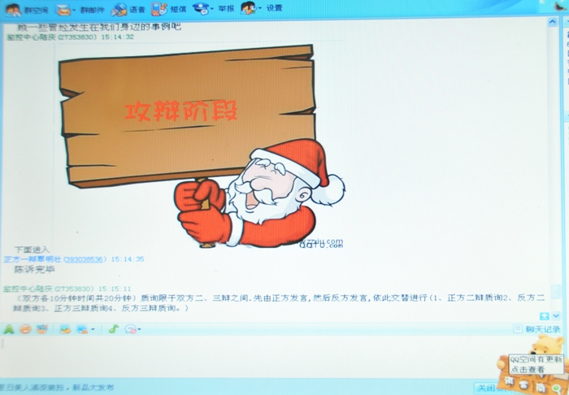

# ＜开阳＞我们为什么辩论，以及我为什么选择不辩论

**我不是为了别人的评价活着的，如果每个人都找个话头来和我辩论，我必须与之耗到有一方被彻底说服为止，那我一天有48小时也不够用。更要不说辩论中不可避免会发生：对对方话的误读、双方价值观存在根本分歧、双方掌握的信息不对称且有一方不承认对方信息的可靠性、一个观点被翻来覆去反复重复造成的低效沟通、辩论时由于肝火上升开始对人不对事…………等等。于是，我最后得出结论，打酱油才是王道。**

### 

### 

#  我们为什么辩论，以及我为什么选择不辩论

### 

## 文 /曹宁马

### 

最近几年，人人网开始变成了时政辩论的前沿阵地，往往一篇日志，一张照片，一段视频就能引来各种立场各种“派别”的人的唇枪舌战。其实不止是在人人网，任何人气旺盛的论坛、博客、SNS乃至近两年新兴起的微博，都能看到彼此冲突的观点的激烈交锋。 我早先也曾热衷于和他人辩论，然而时间久了就发现，辩论结果往往是持A立场的人更加坚信A，持B立场的人更加坚信B。辩论到最后变成互骂“F*ck”之后一拍两散的情景也是屡见不鲜。时间久了，就难以保持当初那种热情，因为有种“反正怎么说也是鸡同鸭讲还不如不说”的感觉。当然，我和很多人一样，在无法说服对方时，（对方也无法说服自己时）肯定难免产生这样的想法——怎么想要让他接受"正确"的观点就这么难呢？（这里的正确，自然是我们自己认为的正确。）仿佛自己已然真理在手，只是在居高临下的“推销”真理。这样的想法自然是可笑幼稚的。不言自明的是，真理应当是在思想的碰撞中被寻找的，而非已经被某些人发现并垄断的。自由主义思想家[约翰·斯图尔特·弥尔](http://zh.wikipedia.org/wiki/%E7%BA%A6%E7%BF%B0%C2%B7%E6%96%AF%E5%9B%BE%E5%B0%94%E7%89%B9%C2%B7%E5%AF%86%E5%B0%94)认为真理是在不同意见的竞争中逐渐“进化”，所以他不像有些人声称找到了历史发展的规律。相反，他主张的是建立一种寻求真理的过程。理想化的辩论目的也应该正在于此。理想化的辩论不应该是为了压倒另一方，甚至就是为了“打脸”或者恶心谁一下。 

### 

### 

_"弥尔认为，由于人类难免犯错，自由讨论才是最有可能发现新真理的途径，而对任何探究的封杀和排斥，都会对人类造成损失，因而都是不明智的。此外他还认为，只有通过争辩，才能让我们学会更好地表述和捍卫真理，并使真理保持旺盛的生命力。没有争辩，或者不允许争辩，只会让已经建立起来的真理变得不堪一击。” _(摘自维基百科) 然而，现实生活没有那么理想化，并不是所有的辩论都是为了探讨真理而进行的，有很多辩论就是为了说服对方而进行（人人上最常见的就是此类），还有很多辩论是因为有观众存在，为了影响特定的受众而进行（美国总统大选时的辩论、法庭辩论、正式的辩论比赛等）。 所以根据目的不同，我粗略把辩论分为4类： 1. **成败依赖于对手的 (Opponent dependent)** 2. **成败依赖于观众的（Audience dependent）** 3. **成败依赖于自身（Self dependent）** 4. **探求真理（Truth Seeking/Truth dependent）** // 好吧，我承认这个说法酸了点。 这几类都是顾名思义： 第一类辩论就是一定要等对方承认你是正确的，辩论的目的才算达到。可以是公开的，可以是私下进行的；如果曾经参与过这种目的的辩论，你很可能会有和我类似的感受——累！因为你必须说到别人点头同意，辩论才算完成。一个人对一个观点的认同，很可能牵涉到他的价值体系，他对信息掌握的程度等诸多方面，让对方改变想法这件事很可能是没结果的。举个例子：反韩的69圣战时，无数“爱国者”去百度爆吧，不少“爱国青年”贬低韩国组合SJ的长相，说他们根本不帅，现在的小孩儿不懂什么叫做帅。更有犯傻的甩出一张周恩来的肖像，义正词严的呵斥道：“看，这才叫做帅！”SJ粉丝：“………………帅个×，还不如SJ的脚毛帅。”（周：“××××的，招谁惹谁了，躺着也中枪。”） 这是此类辩论的一个典型结果，你气死也没用，人家的想法就是不会改变。当然，还有一个可能是那个“年幼无知”的SJ粉被总理的魅力“深深的征服”了，但是他就是嘴硬不承认。遇到这种情况，同样使得试图说服对方的人陷于非常被动尴尬的境地。 

### 

### 

第二类辩论比较重要。双方采用广场模式辩论，例如BBS、微博、推特，人人上的回帖等，双方说过的话都是对特定观众开放并且有迹可查的，其目的在于影响这些特定观众对事情的看法。观众可以是在辩论现场围观的（网络/真实生活），可以是不在场但是有机会接触到该辩论纪录的。**这种辩论成败最终评判标准就是你的影响力有多大，是否争取到了更多的围观者认同你的立场。**我们最经常见到的发日志探讨某个话题，例如推倒柏林墙的“[钓鱼岛显然属于日本](http://www.bullogger.com/blogs/tdtw/archives/366703.aspx)、[钓鱼岛还是属于日本](http://www.bullogger.com/blogs/tdtw/archives/367893.aspx)”，就属于此类。他的辩论对手是那些坚持钓鱼岛属于中国的人，而观众就是有机会读到这些文章的但是对这个问题并未下定论的人，当然也包括坚持钓鱼岛属中国的那些。这样的辩论目的很清晰，不是为了做真理的探求，而是为了影响特定人群，就是为了说服某些人。如果能争取到对手的认同那更是你的本事。所谓的启蒙、开启民智，其实就是这类辩论的一个延伸。不管是turf、果粉、五毛、皇汉……每个派别都有不少转发次数很高的网帖，其实这样的帖子的目的几乎都不是要探讨真相的，就是为了宣传自己这个阵营的立场，让更多人认同自己的阵营的政治主张。（当然我不反对采用这样的辩论方式，而且我反对也没用，）因此，如果这个帖子下面一片赞许之声，在人丛中有一两个人发出了微弱的反对声，但是仍然被围观或者淹没，那文章作者还是成功的。不过这个帖子被转到其他的地方，就未必还会有这个效果。所以这里的成败定义也依赖语境。（题外话：我欢迎更多的自由主义者们能够写出高质量的文章，来争取更多人认可普世价值，推动社会进步。不过仅仅有道理是不够的，既然是为了传播，幽默风趣就很重要。在这种情况下，怎么说与说什么同等重要，如果不是更加重要。）

第三类辩论可以是公开的，也可以是私密的，不同于一二类的地方在于，自己才是辩论胜负的最终评判，当自己通过与对方交流，比较了对方的观点及推理过程与自身的异同后，最后认可自己的观点正确时，辩论就可以结束了，当然很可能对方会认为你是说不过了就逃之夭夭。这样的辩论应该不太多见，因为需要辩论者有承受被对方误解且不解释的勇气；（如果做不到罗永浩所说的“彪悍的人生不需要解释”，那你就去给彪悍的人生一个解释吧。） 第四类辩论就是弥尔所说的，完全为了得到真理而进行的探讨，这样的探讨中，谁说服谁不是判断辩论成败的依据，辩论“是否在双方的良性互动中产生了有意义的结果”才是判断依据。所以这种辩论如果有输家，那么很可能大家都是输家。就是说了半天，没有得出什么建设性的结果，都更加坚持彼此原来的意见了。遗憾的是，要进行这类辩论，需要的条件很多： 1> 双方对该问题的认识具有基本共识，让有神论者和无神论者凑到一起探讨“上帝的存在与否”及必须基于这个前提的问题都恐怕只能是越说越不对路子； 2> 气氛是友好包容的，不是充满敌意的。既然是探求真理而非争个胜负，那么双方就是合作者的关系，而非对手的关系。赢的话是双赢，输的话是双输。这要求双方都能包容对方的推理错误、信息缺乏等等问题。这一点可能并不被我们重视，可恰恰这就是至关重要的。试想一个人气势汹汹的来和你“探讨真理”，并且揪住你的错误不放，用教训的口气和你说话，这样的对话结果还能是可期待的吗？（当然，有一方气度难以置信的大的话，还是有可能进行下去的，惭愧的是，我自己肯定不是。） 3> 双方都具有较好的逻辑推理能力，能够在承认基本共识的基础上进行有效推理。（这个其实要求不算高，韩寒说的不错，逻辑应该是人与生俱来的一个能力，不需要去专门培养。不过如果有过一定的训练，肯定更能提高辩论的效率，改善辩论的质量。） 看到这里你可能就明白为什么第四类辩论最少见，其需要的条件本来就是最苛刻的，气氛的友好那一条其实还可以包括双方都有足够的耐心进行探讨，这又不可避免的牵扯到打字速度、时间、时差、对一个人的熟识程度……等等乱七八糟的外部因素。而且探讨来真理用来做什么呢？马克思在其《关于费尔巴哈的提纲》有这样一句话：“The philosophers have only interpreted the world, in various ways; the point is to change it.”（哲学家只是用不同的方式解读世界，真正有意义的是改造世界）。相信很多人都是持相似的观点的。他们认为空谈“误国”。重要的是“行动”。当然，我没有权利去要求任何人改变他的想法，我只是忍不住想问，如果你对世界的理解本身就不够，你怎么能确定你要采取的行动方式是正确的呢？（尽管“正确”在不同的语境、不同的历史环境下有不一样的标准，但是这不妨碍你先得出你自己的是非判断标准后再去考虑怎么行动） 最后说说我自己吧。我渐渐改变了当初那种“推销真理的传教士”般的思维，不再以改变他人想法为目的，而是以通过辩论，让自己的想法得到检验。也就是说，参与辩论时，关注点在自身，而非对方。我如果参与辩论，应该是属于介于第三类和第四类之间的辩论。需要声明的是：**我不认为我选择的辩论目的具有什么道德优势。我的选择没有任何暗示、建议他人做和我同样选择的意思，更不要说是强制他人放弃自己的选择。** 但是我仍然很失望，因为我要么遇到的是和我价值观根本不同的，这样的情况下我不愿意说太多，因为我很清楚的是，我很难从这类对话中受益。要么是辩品差的。 例如遇到国家主义者，民族主义者时，他们判断一件事情的正确与否时，要用是否有利于国家、民族这样的宏大抽象概念作为判断标准，而我则以是否有利于维护个人自由（消极自由）为判断标准。一开始双方从出发点就有分歧，辩下去只能是越来越鸡同鸭讲。我选择不去浪费这样的口水和时间。也避免了有一方动怒开始骂娘的可能。或者举另一个例子，让一个信仰上帝者与一个无神论者就对上帝的理解进行辩论，你不觉得这是纯粹浪费时间吗。难道我们期望通过屏幕上的几行字改变对方对宗教对上帝的看法？（不要问我无神论者为什么是无神论者，有神论者为什么是有神论者，这种观念的形成不可能是一朝一夕的，绝不可能是一蹴而就的。话说回来如果我掌握了这么高级的思想钥匙，那我就可以去搞邪教忽悠人了，还和你说什么辩论的目的。） 

### 

### 

另外一类就是辩品差的，辩品差的表现不仅仅是讲脏话，讲脏话自然算不得辩品好，但是常常把以下这些话挂字在嘴边的辩品肯定算是差的（有言在先，以下症状自己我身上也有）：

**_“你读过……吗？没读过不要乱说话”_ ** // 驼鸟心态。当你对对方没有充分了解时，怎么知道别人没读过……呢？ **_“回去多看看书吧”_ ** // 不知道说这话的人自己读过多少书。另外，即便一个人读书少，见解就一定不靠谱吗？ **_“你的想法真是幼稚”_ ** // 想不出这种话除了恶化对话气氛还有什么作用。 _“**你考660了吗？你有什么发言权？”**_ // 形形色色的资格论充斥着网络，希望说这种话的人不会遇到比他“更有资格”发言的人，因为那时候他就只好闭嘴了。 **_“你居然说脏话，什么素质啊，哈哈”_ ** // 诚然说脏话不是好事，但是非要拿素质说事儿的人很无聊，也很无能。 **_把相同观点反来覆去一直说的，同时自称已经说服了你的_** // 同一个观点反复说已经够让人崩溃，能不YY吗？ 以上仅举几例，挂一漏万。总的说来就是“对人不对事”，或者“既对人也对事”。遇到这样的人，辩论的欲望很快就没了。（编辑注：有关此处可参照谢至理谈人身攻击的文章） 我又不愿意和人死磕，所以觉得没有继续说的必要时，我会想要结束对话，这时有的人就会用激将法**_“你看，没法证明我的观点是错的吧？你倒是说说我什么地方说错了啊？哑口无言了吧？” _**我耐心本来就差，遇到这样玩激将法的更是懒得与之费口舌，所以直接拉黑。毕竟，我不是来和谁分胜负的，我所关注的是自己思想的建设，没有义务为了满足谁的好战欲望去和别人争论什么。当然，被拉黑的人肯定有话说，“**_你是伪自由主义者，你没有皿煮精神！” _**（这种荒唐的想法已经有很多人批过了，我就不重复了。）另外有人说：“_**他果然说不过我。**_” 然后去暗自窃喜。我的回应是：想要抱这样的心态是你的自由，我不在乎你怎么看我。我不是为了别人的评价活着的，如果每个人都找个话头来和我辩论，我必须与之耗到有一方被彻底说服为止，那我一天有48小时也不够用。更要不说辩论中不可避免会发生：对对方话的误读、双方价值观存在根本分歧、双方掌握的信息不对称且有一方不承认对方信息的可靠性、一个观点被翻来覆去反复重复造成的低效沟通、辩论时由于肝火上升开始对人不对事…………等等。 

### 

### 

于是，我最后得出结论，打酱油才是王道。

当然，有人可能会问，既然对话环境这么糟糕，你为什么还混迹于人人政治圈呢？ 这个问题很好，一方面是为了满足表达的欲望，这个欲望是人都有，即使可交流的对象很少，即使有时候表达了但是没有回应或者回应令自己失望，毕竟聊胜于无； 自己能接触到的信息总是有限的，看看别人分享的东西，总会有收获； 还有就是自己发现一些别人不怎么关注的东西时，拿来分享，算是也给别人提供多一种视角；（当然，我没啥自以为是的优越感，这地球上没了谁都转，我没分享，只要是有价值的信息，总会有人分享，时间问题、早晚问题而已）； 最后一点就是这个圈子里待久了，有感情了。好吧，我知道你想吐。不过，这也是实话。 

### 

### 

(采编: 乔淼 责编:乔淼)

### 

### 
