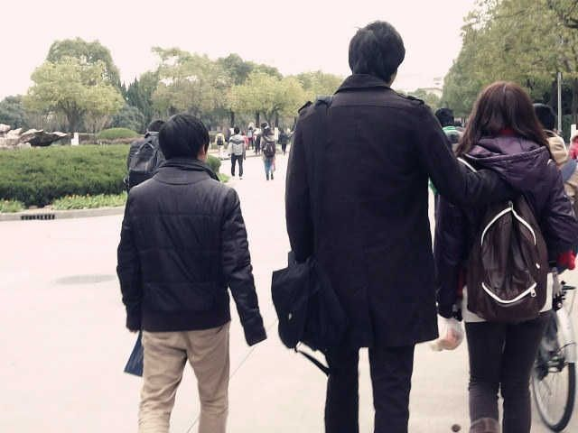

# ＜开阳＞新型批评者：谈谈屌丝眼里的“屌丝”

**毅丝（屌丝）本质上是一个新型的批评者群体。他们将批评视作生活的常态，将娱乐与批评融会，对事物抱幽默和嘲弄的态度，反叛权威和立足自我，渴望在信息受他人主导的时代找到反制的空间和发言的渠道。固然，毅丝身上有某种反制成功学或者犬儒主义的影子，但这并非主要。毅丝并非某种盛行观念的反面，也非某种思想或主义的代言。毅丝这一群体，本身糅合了多元的文化，其组成来自于社会各个层面，其表达其批评也同样面向社会各个层面。作为一个在处于舆论与信息体制转型期的国家出现的社会现象，它应当有更广泛更深刻的意义。**  

# 新型批评者：谈谈屌丝眼里的“屌丝”

## 文/魏皮囊（暨南大学）

 

当看到“屌丝”一词出现在凤凰网的专题评论里时，我的情绪就仿佛“屌爆了”一般矛盾纠结。

网络是新词汇的发祥地。由于信息交通的便捷化带来的共识圈扩大，一大批源义不明且概念模糊的新兴词汇通过旧字词杂交，胡拼乱凑地出现，并在特定人群或特定条件的作用下获得超越本身的表现力，以致在追求直接化和感官化的互联网环境里受到热捧，并逐渐辐射向传统媒体乃至整个现实社会，达到人人交口相诵有如跟风吃屎的红极一时的效果。类似的例子不甚枚举而不作累述。而更值得注意的，是这些词汇的流行周期盖不会超过半载至一年，它们有如某种快餐食品经受不了时间咀嚼，更有如某种糙制的色情片让人迅速失去性致。它们的命运似乎正印证了一条萃自中国漫长政治史的铁律：“兴也忽焉，亡也忽焉”，有如阳萎男人持续不了三十秒。它们的结局无非在信息高速更迭与人类的集体健忘症下慢性死亡直至归于湮没。网络在有如中国式工厂大量制造廉价产品的同时，同样承担了回收填埋垃圾的职能。网络无疑也是新词汇的乱葬岗。

而如今，“屌丝”也已经踏上通往乱葬岗的旅途。

在屌丝文化的推波助澜下，一大批分析文章跃现网络，但究其内容无非将已有的枯竭的社会分析定式嵌套到“屌丝”这一新的肉身当中，以求表达某种老旧的社会忧思，反制成功学或者控诉犬儒，等等。而在类似的分析机器下，“屌丝”一词并未得到真正的解读。诚然，以第三方旁观者的视角来观察与议论，本身存在一个文化隔膜的问题，正如我们不能把英文语境下的“法克”等同于中文“草”。达到对屌丝文化的正确把握，自然也需要站到帝吧的语境之内。

我的帝吧履历始于08年，近四年的时间见证了一个足球贴吧到小众圈子再到大众平台的转变。帝吧的成长历程在中国互联网交流平台里具有相当的代表性：一个特定主题的讨论圈，因某一偶然的具体事件影响而成名，扩大主题与用户群并逐渐形成某种特征，带有特征的文化向全网络散播，主题与用户群继续扩大，特征愈加明显也愈加大众化，在知名度达到顶峰的同时，因无限制接收用户而走向泛滥，冲淡原有的特征而沦为一般性平台，最终在惯性支撑下勉力维持直至完全没落。当然最后几点仅作预测存在。重点在于，帝吧在遵循一般发展模式时同样衍生出了自己的文化特质，作为贯穿始终的精神脉络与价值纽带，其中最为突出的，即帝吧的批评文化。

#### 

#### 一、“黑”：网络时代的泛批评

帝吧以恶搞起家，之后逐渐形成一种“黑”的文化，“黑”一词无法以另外的词汇准确阐述，但明显包含有贬损、讽刺和嘲弄的意味。“黑”的行为在帝吧相当盛行，最初帝吧以黑春哥而闻名，一句“春哥纯爷们，铁血真汉子”至今闻之仍令人胆颤。之后，帝吧黑的对象日趋广泛，人物、事件、地域无有而不可，以致于在敏感时期管理组不得不命令禁止黑某些对象。一段时间帝吧曾流行一种贴的形式，标题类似“蒋公英明神武抗日有功，总该不能黑了吧？”或者“帝吧十大不能黑的人物”等，似乎要在帝吧一片漆黑之中觅得一片空白，也是一件颇费力气的事。

恐怕会有不少人不赞同把“黑”等同于批评。那么，什么才是批评？人民日报社论“向雷锋同志学习向卡车电线杆致敬”？或者苹果日报头条“蛤蟆精续命内幕全揭露”？显然，批评不尽是传统媒体装腔作势的严肃文章，亦非大报小报纯粹娱乐的八卦报道。大到公诸媒体的声音，小到街头巷尾的谤议，只要是建构在某一对象上的质疑与谈论，皆可视为一种批评，尤其如今蔓延于网络的各式关注时闻的博客微博客论坛，或者以讨论乃至讽刺形式发表的种种文章、漫画、视频，所汇聚所表现的也是一种批评，一种跳脱精英框架的社会化批评。以此意义出发，“黑”无异于一种恶搞色彩浓郁的批评。

“黑”的文化并非帝吧独有。中国的互联网一直都有黑的风气，根据时代背景与具体舆论导向的不同，黑的主要对象也有变化，但大概脱离不了几大类：人物、事件、地域。人物黑主要指向围绕在某一新闻事件里的中心人物，例如干爹的好女儿周蕊以及她的齐B小短裙，但热度消退快，人物替换周期通常不超过一个月。但也有经久不衰的被黑典型，譬如说太孙毛少将，这类人物皆因居于某一遭到敌视特殊群体中的弱势地位，而不幸沦为人们宣泄情绪的对象。事件黑占据“黑文化”的主体，与新闻事件联系紧密，代表短时间内舆论焦点，譬如中国自主动车事件、中国英勇投下对干涉利比亚内政的联合国提案的反对票等，但时效性强有甚于新闻人物，淡出舆论热点有时只在朝夕。相较于前两者，地域黑则带有相当强的延续性，乃至传统性，例如黑河南，黑河南的穷，黑河南的乱，黑河南的骗，黑河南的器官交易产业，在河南的问题上全国各省份取得了惊人的一致性，枪口一致对准河南，只差发起一场全国性“倒豫运动”了。而同样受黑的主要还有切糕省新疆、砍省东北、吃省广东等。地域黑作为中国长期地域互斥与地域歧视的直观反映，也成为了“黑”文化的主流之一。

但，上述的“黑”，哪怕再有文化也好，并不值得称耀，毕竟它带有明显的盲目性、主观性与不公正性。首先在信息泛滥的时代，信息的迷惑性与诱导性增强，在繁冗、密集的信息潮涌下，会有大量网络用户被动、无意识地接受信息暗示或灌输的观念，不问真假不加检验，甚至自觉参与到“黑”的集体行为里以博取某种集体狂热与主流认可的快感，成为我们谓之“跟风狗”的信息动物。其次，“黑”往往诱发于主观认识，而又因强烈的主观情感愈演愈烈，以至演变成情绪支配下的谩骂、诋毁和侮辱，在一些情况下，“黑”往往只是两种群体间的互相攻讦的非理性手段，譬如遍布于网络的各类明星的脑残粉们，乃至以理性与思想自诩的某些知识分子，例如韩寒与方舟子，其拥护者或粉丝间的言斗也往往陷于混乱与狂热而显得滑稽可笑。可见，“黑”的行为，在某些情况下可能只是一场占据舆论主流的群体对于某一对象开展的“批斗大会”，其本身已经变质为娱乐性和发泄性的舆论表演。

而更重要的，“黑”这一行为本身缺乏某种道义上的“合法性”。倘若传统意义上的评论文章，针对某一社会现象理性分析并提出批评，在道义上全然无可指责。但“黑”作为一种亚批评文化，其表现形式更强调娱乐与搞笑，而其批评主体又更侧重于草根，批评内容只注重观点而缺乏分析，有些时候甚至缺乏令人信服的依据，如果不借助于群体性支持根本难以在舆论中立足。同时，黑的主体带有明显倾向性，该黑什么该捍卫什么立场分明，譬如在黑河南时各省份人争相上前指责，而一旦谈及自己省份的缺点则立刻缄口不言甚至于公然袒护。因而其“合法性”，或者说批评的“资格”，委实值得怀疑。然而另一方面，“黑”这种批评方式，揭露的现象实质与内在缺陷，往往比主流媒体上顾左右而言他的评论更凶猛更犀利更切中要害，例如将河南命名“骗省”，将广东命名“吃省”；而且因其草根性与全民性，更能直接而裸露的满足大众群体的批评需求。换句话说，“黑”是一种带有不可控性且“不合法”的批评行为，但也正是这种“不合法”的批评行为，弥补了在中国言论环境下常规批评的不足。对于舆论同样处在转型期的中国，这种批评文化有着无可替代的价值，而如何赋予其合法性成为问题所在。

而这一问题，恰巧在李毅吧里得到了解决。

#### 

#### 二、批评的尺度：无所不黑而无所不可黑

最初，李毅吧与网络其他平台的“黑”文化并无不同。黑大帝，黑春哥乃至黑五毛，黑土共，倾向性与立场相当明显。但在主题与用户扩大之后，帝吧的文化及精神逐渐发生某种微妙的转变。在漫无边际的讨论、直播、转发和撸图里，“黑”似乎已经突破了某种禁忌，而达到一种无尺度、无底线的纯粹状态，换句话说，无所不黑而无所不可黑。

其一，帝吧放开了某些不成文的忌讳，宽容一切的声音。以历史为例。帝吧一直敬奉蒋公推崇民国，尊台湾为祖国，憾恨蒋公当年剿匪不力；但国粉蒋粉的对面，自由派与左派同样可以对穿林北腿日记救国蒋中正大加贬斥，而不受禁锢、限制。这种宽容在任何带有政治倾向或情感偏向的平台上都很难看到，正如你无法想像在凯迪论坛宣扬唱红，在乌有之乡爆炒腊肉。帝吧的宽容，甚至泽被了极端分子譬如轮子和极左等，极端主义宣传在帝吧并无太大市场，真正的帝吧分子往往报之以冷漠与戏谑，用幽默来解毒盲目与疯狂。在一种发源于恶搞精神的“灰色幽默”汤剂里，各类针锋相对不共戴天的思想得以融汇得以共处。

其二，在无所不可黑的语境里，帝吧分子们愈来愈将黑的矛头指向自己。在追去绝对的、纯粹的批评的道路上，“求黑”、“自黑”成为了最具有跨越性的符号。在对自我及与自我利益相关的外部事务如家乡、学校、单位以及喜好的名星、电影、书籍等方面的批评显得更加激烈更加深刻，对内反省与对外批评日益显得平行。另一方面，在一些主题贴的回复里愈来愈频繁的出现“求黑”一类的字眼，大有借助他人视角来实现自我认知和批判的倾向，更有甚者直接发出主题贴引诱他人来“黑”。再以歌星为例。自春哥以来，帝吧在黑歌星方面可谓不遗余力，诸如许山高许三睾的许嵩、草原野狗式药药切克闹的凤凰传奇再到死后封神摇滚乐队BEYOND，从网络歌手到流行乐坛再到流行经典均难逃网罗。而最奇异的，在于帝吧成员可以边听着周杰伦边喊着周结巴，同时接纳“黑”与“喜欢”两种常见于对立面的态度。

实际上，对于任何批评文化，都存在一个尺度上的问题：什么可以批评什么不能批评。在有限的批评里，由于自身立场与外围环境的左右，可与不可的界线非常明显。而一旦批评者设定了某条不可逾越的底线，批评就难以保持绝对的客观公正。诚然，有不少人相信纯粹的批评并不存在，批评的合法性只能借助理性分析和逻辑推演来支撑。但在完全的宽容与自我批评风潮影响下的帝吧，实际上已经向纯粹的批评迈出了一大步。批评长久无法摆脱的立场性和目的性，消解在了整体层面上的帝吧里。帝吧的“黑”既不抱有明确的主观倾向，亦不设定坚守与捍卫的基本立场，旨在表达与娱乐的“黑”上升成为生活常态，换句话说，一切只是为黑而黑。

曾经在一个帝吧分子口中听到这样一种说法：明星本身怎样怎样都行，但我们就是想黑他，这有关系吗？在我看来，确实毫无关系。批评文化不应当只作为舆论工具，而应当作为社会常态来看待，批评并不一定是为了什么而批评。而这样的批评，因其高度的客观性与纯粹性，并作为大众自我发声与对抗公众人物信息主导权的武器，自然具备了道义上的“合法性”。正如同样来自帝吧的又一种说法：我们连自己都可以黑了，凭什么不能黑别人？的确，能否自我批评实际上可以作为对批评者的一种资格验证，既然我们可以毫不保留的批评自己，又凭什么不允许我们批评他人？

纯粹的“黑”文化在帝吧的形成，自有其特殊的条件与原因。一方面，帝吧自身文化里极其强调创新性，强烈蔑视跟风附和行为。例如新词汇，流行周期通常超不过一个月，一个月之后无论管理组和民间都将自动自觉的加以扼制，把继续延用的人斥为跟风狗，乃至采取封删的形式杜绝类似行为。对于“黑”的行为同样如此，黑的热点对象在帝吧频频更换，刺激了帝吧成员不断寻找挖掘新的“黑”点，因而黑的范围日趋广泛、普遍。

另外，帝吧延续了初期的恶搞文化，将幽默色彩在“黑”文化里演绎至极。对于批评言论，幽默有天然的调和与润色作用。在幽默承载下的批评，钝化了其尖刻性与裸露性，让人不至太难接受。而同时，幽默的精神也在促使人的观念的转变，幽默解构了一切权威和神圣对人脑的统驭，幽默让人宽容更让人清醒，幽默使得批评更加“有趣”。总之，在幽默的浸润下，帝吧成员在不同程度上抛却了保留与成见，将“黑”推向了更纯粹的水平。

当然原因并不只上述两点，帝吧的“小国寡民”、精英分子流入、足球爱好者的存在等皆有其影响。多种原因聚合并促成了帝吧纯粹的“黑”的文化，同样也促成了一个承载并主导这一文化的人群——毅丝（屌丝）。

#### 

#### 三、毅丝：转型期的新型批评者

毅丝（屌丝）本质上是一个新型的批评者群体。他们将批评视作生活的常态，将娱乐与批评融会，对事物抱幽默和嘲弄的态度，反叛权威和立足自我，渴望在信息受他人主导的时代找到反制的空间和发言的渠道。固然，毅丝身上有某种反制成功学或者犬儒主义的影子，但这并非主要。毅丝并非某种盛行观念的反面，也非某种思想或主义的代言。毅丝这一群体，本身糅合了多元的文化，其组成来自于社会各个层面，其表达其批评也同样面向社会各个层面。作为一个在处于舆论与信息体制转型期的国家出现的社会现象，它应当有更广泛更深刻的意义。

中国的改革，蕴含了一场国退民进政府向社会让位的渐进运动，易位的领域括政治经济，也包括归属于文化领域的信息与舆论领域。中国的信息与舆论改革一直相当谨慎，不仅步伐缓慢，而且易位过程相当间接。即使在不得不放宽管制的地方，政府也有意地将信息与舆论主导权转交到介于政府与民间的精英阶层。虽然民间也享有了一定的言论自由，但要真正造成社会影响与公众效应，也得通过精英阶层。中国网络现在特别热衷于左派右派极左极右美分五毛的分界，但真正谙于这类概念并运用自如的，依旧只有精英阶层。在精英主导的舆论大背景下，大众的选择、取舍乃至发声，都无一不显得卑微、渺小。

当然在一些地方，舆论主体又走向了另一个极端——群氓。在政府或明或暗的诱导和支持下，群氓将精英推下讲坛，用感情代替逻辑，用爱国与民族主义代替理性与言论自由，通过运动式的宣传与响应乃至实际行动，将某些观点与主张推向舆论峰点。这一情形在民族与国际问题上尤其突出，特别在极易点燃的对日仇恨上，在民族情绪鼓躁下采取语言暴力甚至行为暴力的情况屡见不鲜。而群氓的主导并不代表民间的主导，群氓是集体性的、盲目的、无意识的，群氓的特征是狂热与消灭个体，在群氓的语境里作为个体的人们同样掌握不了信息主权，而且更有可能陷于舆论压制，甚至遭受人身侵害。

转型期的中国社会，在舆论与信息领域里，一直处于政府、精英、群氓三者的夹缝。言论自由受管制，个人声音被漠视，独立人格遭贱踏。这一问题不仅存在于广大的民众，也存在于偏离政治中心而不属于的部分知识分子中间。这类知识分子尤其苦恼于顺从官方话语与保持独立言论的矛盾，因为在利用传统的拥有较大影响的媒体工具时，知识分子不得不作出妥协，依附于这种或那种的主流思想，以致于形成非左即右的畸形局面。须知在享有真正言论自由的社会里，思想主张应当是多元的全面的，绝不仅仅限于左右两极。

对于这一困境，毅丝们实际上提供了一种解决模式：完全的解构，纯粹的批评，将个人置于主流声音以外，采取一种幽默而讽刺的姿态来观察思考并批判这个世界。毅丝们在否定一种思想时并不一定代表赞同相反的思想，而在批判某一事件也不一定试图表达某种东西。纯粹的批评抵抗了信息的压制更消解了舆论的支配力，在摒弃主流意识形态的同时充分放大了个人的声音。这样的声音或许缺乏系统性与思想性，但却最反映真实与人性。

#### 

#### 四、帝吧的没落与不存在的“屌丝”

帝吧的解决模式，事实上也有无可回避的缺陷。缺乏理论支撑与系统表述的批评或许可以活跃舆论环境，满足个人表达的诉求，但长远来看对社会进步体制改革并无太大助益，更不可能作为实际的决策参考影响社会走向，批评显得流于零碎流于形式。帝吧本身处在极其不稳的状态下，主题扩大队伍扩充是其必然趋势，人员的流动和主题的变换对文化延续的影响不容小估，曾经数次发动治“水”行动，但收效甚微。而且相对于其他平台如天涯等，帝吧的规模小容量小，用户群的扩大挤占了单个信息的空间，信息效应与影响自然下降，纵使高质量信息也不能幸免。加上帝吧旧成员的流失，帝吧很难维持批评的纯粹性和信息水准。与帝吧的发展带来的并非强盛，而是没落。

帝吧的没落，原因来自多个方面。除帝吧自身的局限外，整体信息环镜影响同样巨大。目前，中国的信息环境存在着信息管制严格、信息交通不畅、信息质量低劣等主要问题。理论上，网络的信息交流与现实的交流，在实质上并无太大区别。通过信息交流，拥有共同利益或共同意识的人群在一定信息平台上缔结，形成一个相对独立的信息圈子，通常表现形式为门户、论坛、博客圈微博圈等。但中国的信息管制阻隔了正常的信息交流，也禁锢了人们缔结信息圈子的自由，尤其在敏感话题上，拥有共识的人群无法用正常方式组建圈子，而既有的相关信息平台又太少，逼迫人们不得不采取折衷方式“借用”其他平台，与其他圈子共组“大杂烩”式的交流圈。帝吧正是这样一个交流圈。帝吧的成员来自各行各业各阶层，讨论的主题也涉及方方面面。在大杂烩的掩盖下，一些敏感信息得到一定限度的传播，一部分异见人士找到表达或宣泄的途径，信息环境的缺失得到某种程度上的弥补。但终究不是长远之计，一旦帝吧流量超过一定限度，信息失去原有的自由与空间，低劣信息进一步占有帝吧，一部分的人就又不得不退出帝吧另寻其他去处。这也是帝吧现在面临的危机之一。

然而，作为一种过渡形态或者折衷模式的帝吧文化，其存在和兴盛注定只能是暂时性的。寄希望于帝吧传统的保有与延续是不实际的，唯有对信息与舆论制度的全面革新，放宽信息管制，疏通信息交渠，保障言论自由，实现信息环境的改造与转型，才是治本之策。

近一年来，李毅吧尤其屌丝文化在网络上的扩散臻于极盛。援引纸媒的介绍，“屌丝”一词来源于雷霆三巨头吧对李毅吧毅丝的调侃，又被毅丝们延用以自嘲，注意“自嘲”二字。百度百科里对“屌丝”一词的诠释里，有极其醒目的一句：‘不以为耻，反以为荣。”或许，作为流行词汇的“屌丝”在运用时真能给人带来某种附和时流的荣耀感。但在逻辑上，对一个用来自嘲性质的词汇“引以为荣”，显然荒谬至极。

网络一直热衷于对屌丝作反成功学案例分析。在网络定义里的“屌丝”，属于不渴望“成功”的群体，他们穷矬丑矮，未来无望，面对高富帅的绝对优势，百倍的殷勤也只能换来女神的“呵呵”。这是一个完全被压制被剥夺的群体，政治无权，经济困窘，甚至在情感上也得不到宽谅。最终他们安于现状，不作反抗，玩世不恭，呈现出一种犬儒主义的作态，因而他们被冠为而且自谓“屌丝”。但实际情形远非如此。且勿论他们是否真以“屌丝”为容，单“安于现状，不作反抗”一条就值得怀疑。首先，安于现状者何以自嘲，一个真正默许命运欺凌的人，如何可能谍谍不休对世界抱怨不断，如何可能时刻保持对国家对社会的关注，如何可能对周围对环境采取批评的姿态？上过帝吧的人大概都能看出，帝吧内容与现实的密切联系，以及用户对现实的密切参与。显然帝吧“犬儒”论不过局外人与分析师的一厢情愿罢了。

而且更显著的，帝吧成员成分复杂，但真正符合“屌丝”定义的其实少之又少，只符合其中一到两条的占大多数，而就实际条件而论，帝吧成员有一部分应该归为与屌丝对立的高富帅群体。而无论哪一群体，无论与屌丝相差几远，他们都习惯以“屌丝”自称自嘲。“屌丝”的真正含义对其并不重要，重要的在于他们要借助“屌丝”一词，来实现某种表达，或者干脆说，批评。

应当说，网络定义上的“屌丝”群体是不存在的。“屌丝”一词衍生自帝吧的批评文化，它可能包含了一种对成功学的批评，或者对劣势人群的社会现状的一种讽刺，但就本身而言它更接近于一种行为，一种批评词语。将屌丝人群化，是对“屌丝”一词乃至帝吧文化严重的误解。但无奈于，如今脱离帝吧而弥漫网络的“屌丝”，已经掩盖了帝吧内在的批评文化，更脱离其本真的含义而沦为饱蘸大众唾沫的娱乐产品。

屌丝的泛滥毁灭了“屌丝”一词，而带来的大用户流也正在把帝吧推向毁灭。趋势无可逆转而我们也无能为力。唯一能做的只有在心里真诚而虔敬的默念一遍：

“求求你们滚出帝吧吧。”

撰稿人微博：[http://weibo.com/u/1779055295](http://weibo.com/u/1779055295)

撰稿人博客地址：[http://blog.sina.com.cn/u/1779055295](http://blog.sina.com.cn/u/1779055295)

 

(采编责编：黄理罡)

 
