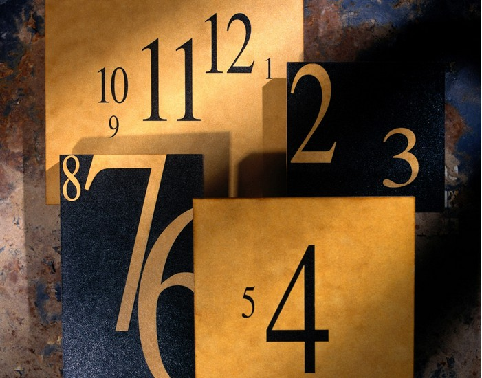

# ＜开阳＞时间偏好之于人的行为

**当某物没有满足一个主体的即时效用时，他便有时间去思考该物的其他发挥作用的方法。这里有个时间的缝隙存在，即时和稍后。其次，当萌生了替代的效用之后，心理上便会赋予其重要性，与未能产生即时效用的方式相比较，不断权衡。再次，不断权衡和比较的过程需要主体消耗时间，这时间的长短便强化了第二种方式的重要性，经过思虑，便后来者居上，打败了第一种方式。最后，当选择和权衡的过程完成了，第二种方式付诸实践了，无需再纳入考虑范围中，未能付诸实践的第一种方式便占据了主体的脑子，他的精力便在回忆中使其产生了惋惜和悔恨之意。**  

# 时间偏好之于人的行为

## 文/凌云（对外经济贸易大学）

说到时间，它可以是时钟指针的跳跃，可以是太阳东升西落、天空明暗交替的变换，可以是生命成熟的四季体验，可以是霜染鬓发、泪眼渐浊的岁月痕迹。当然它也可以是案头书牍的堆积，可以是走过看过心灵渐宽的毫无起落，可以是美艳的惊鸿一瞥再不起涟漪的沧桑。然而，时间这种外在于人，又内化于心的存在却可以因其深不可测的作用力，先验地改变了我们的行为方式。

最先让我产生时间之于人的思考，是有一位朋友问我：为什么他本想把出差带回来的海参自己吃掉，最后却送给了领导，然而送了之后又沉浸在后悔当中。我不知道该怎么安慰他的后悔，就捋了捋后悔之所以产生的原因，聊以缓解他的情绪。

首先，当某物没有满足一个主体的即时效用时，他便有时间去思考该物的其他发挥作用的方法。这里有个时间的缝隙存在，即时和稍后。其次，当萌生了替代的效用之后，心理上便会赋予其重要性，与未能产生即时效用的方式相比较，不断权衡。再次，不断权衡和比较的过程需要主体消耗时间，这时间的长短便强化了第二种方式的重要性，经过思虑，便后来者居上，打败了第一种方式。最后，当选择和权衡的过程完成了，第二种方式付诸实践了，无需再纳入考虑范围中，未能付诸实践的第一种方式便占据了主体的脑子，他的精力便在回忆中使其产生了惋惜和悔恨之意。

套用到他的例子中，就是他本来想自己将海参烹而食之，但是未能立即成行，便有时间间隙去想这个海参的其他作用，比如送与领导，这个念头因为是后来者，便占据了较多思考和权衡的时间，最终，这个时间的作用使得烹而食之的想法败下阵去，送与领导就被付诸实践了。海参没有了，不需考虑其用途的时候，时间精力便转而投入到未能实施的“烹而食之”上，悔恨之情便因这个时间的投入而来，投入时间与悔恨程度成正比。

照此分析，我们的类似情绪来源于对某方案思考的时机和投入时间的长短，可见，时间确实影响人们的心理倾向。当然，这个无所谓的分析并不能改变我们的行为方式，或许我们还是难以违逆心理的倾向，但是事后如果做此分析，想必可以减少我们投入在不良情绪中的时间成本，便可聊以自慰。

现在比较流行的是一种叫做“拖延症”的病，无论是哲学家、心理学家、还是经济学家都对其产生了浓厚的兴趣，并且这个奇怪的病症确实是存在于相当广泛的领域内，影响着形形色色的人。不只是我们这些常感叹于自己摇摆在荒度时间与时间紧迫之间的学生，就连各个领域的大家们都受此困扰。

研究拖延症的中心人物，经济学家乔治.爱因斯利曾写道：拖延的习惯“就像时间的形态一样根本，并且不妨可以被称作基本冲动”，想必这“基本的冲动”来源于人的时间观，而这观念必定是有时间先后的偏好，导致了我们将眼前的事情拖延至以后。但是这与经济学上的“利息”的产生机理并不能类比。利息通常被定义为推迟消费获得的报酬，可见这个报酬是我们可预见的可以带来补偿的，一定程度上可以算是“好”的事物。

然而拖延症中被拖延的事情往往是一些不能轻易带来幸福感的琐事，当我们选择先置之不理，而去实践即刻就令人愉悦的方案，并不能因此感到幸福，反而会常常伴有焦虑感的产生。在一个研究中，65%的被调查学生在他们开始着手准备学期论文之前，表示希望避免拖延：他们既知道自己不会准时地完成功课，也清楚这种延迟会让他们不快乐。萨缪尔·约翰逊（Samuel Johnson）将它描述为“每个人多多少少都具有的重大弱点之一”，并且为之感到痛苦： “我无法克制责备自己一直忽视那些最终不得不做的事情，并且每一刻的闲散都增加了我的痛苦。”【引】可以说，我们在时间的偏好上，短期的考虑压倒了长期目标。随着时间的流逝，这个偏好本身也会发生变化。从另一个角度看，人事实上进行了一种能够揭示人类自我辨识的不稳定性和人类必须处理的复杂关系的行为，尤其在加入时间这个不可控因素以后。

以上是关于时机和时间长短的生活分析，那么，既然人是一个连续的时间过程，就如《精神病人的世界》中一个坚信人是一条时间流逝一样的虫子的精神病人所说的一样，我们把自己的想法置身于历史中考察，可以看到关于人对时间长短快慢的心理偏好是会影响对待事物的态度，进而影响历史进程的。

一种政见、观念会因其出现的时机和大众对阵痛忍受的时间长短而夭折。胡适就是这么一个生不逢时，却经历了名噪一时和接下来的长达后半生的低谷的人。有人评价他是时代的“非典型性”人物。在一个不断两极化和激进化的社会中，胡适没有选择制度设计，而是致力于推动人的独立，不遗余力的倡导个体自由、独立、宽容的价值体系。但是在危如累卵的局势下，普天大众怎堪忍受这个慢郎中的药方，即便这个药方如中医一样重在由内调理根本，但是不能立竿见影的救亡，在时间长度上就败给了“暴力革命”这个方案。

他的由个体及整体、由学术自由及科学救国的改革与暴力革命相比，便显得与时代匹配错位，也是慢与快的差别。然而对“彻底性”的要求是二者都追求的共同目标之一。私以为，“彻底性”和“速度”并不是并行不悖的，除去刚性脆弱和不可逆的情境，大多数时候，一个有柔性的历史链条，若想进行彻底改革，必定是各个因素和零件同时或者第次变动的，这样才能实现稳中求变，变化过后的新体系也才会愈加坚固。否则，凡是用“暴力”推翻的，其结果仍然是“暴力”，其后因为内部失调而出现的问题必定会一一显现。一定意义上可以说，这是欲速则不达。可见，时机和时间的偏好让我们选择了“暴力革命”，不可谓不是影响了社会进程。当然，历史这个不可逆的过程是不可证伪的，那个年代我们再也回不去，也无法再重新选择，我们只能面对当前，进行修补。

说些题外话，我们常常能认同学术自由、思想独立，而在面对国家有疾时便认为这些自由、独立统统都不是药方，只是一帮愤青的不理智诉求而已，忽略了这是个药方的可能性。正如胡适所认为的，争个人的自由，就是争国家的自由；没有个人的觉醒与解放，就没有民族的觉醒和解放。我们现在并不说自由与解放，而是面对有滑入官僚封建主义的风险的国家的一声警戒。当然，制度建设和改革也必须同步进行。

美国学者杰罗姆·格里德所说的：“自由主义在中国的失败并不是因为自由主义者本身没有抓住为他们提供的机会，而是因为他们不能创造他们所需要的机会。自由主义之所以失败，是因为中国那时正处在混乱之中，而自由主义所需要的是秩序。自由主义的失败是因为，自由主义所假定应当存在的共同价值标准在中国却不存在，而自由主义又不能提供任何可以产生这类价值标准的手段。它的失败是因为中国人的生活是由武力来塑造的，而自由主义的要求是，人应靠理性来生活。”今日之中国已不是当时之中国，远没有当初那样的混乱，倡导在有序政治中可以被尊重的舆论监督和自由的作用是有其用武之地的。我们切不可犯急于求成的错误。

另外，在经济学上，行为使人具有了时间概念，由于时序的独特性和不可逆转性，时间的经济是经济行为必须考虑的维度。

忍受阵痛的时间长短则影响了理论的假设前提，比如新凯恩斯主义，从不完全竞争的市场出发，试图解释经济中的名义价格粘性，比较广为人知的是菜单成本。正是这个粘性的假设，阻碍了价格的调整，从而影响了名义需求的扰动项，使得量价不能同比例变化，市场的非出清也就成了必然。与之对应的政策就和古典主义的自由市场产生了截然不同的效果，即市场总需求受到冲击后，从一个非充分就业的均衡恢复到充分就业的均衡状态时一个缓慢的过程，因此用政策来刺激总需求是必要的，不能等待工资和价格向下的压力带来经济恢复，因为这是一个长期且痛苦的过程。

相反，奥地利学派的米塞斯则对凯恩斯主义进行了批评，指出其理论体系的脆弱性。他的理论基于人的行为分析，并不蕴含凯恩斯主义这样的经验统计规律前提，其理论只能在先验的基础上证实或证伪。尤其是在人的行为中引入时间这个因素后，他的理论更倾向于长期分析，这是与凯恩斯主义的短期分析不同的，在凯恩斯眼里“在长期中，我们都会死去”。正是因为大多数人都不愿意承受眼前的痛苦，过于夸大眼前的危机程度，希望政府采取有力措施来缓解迫在眉睫的困难，而政府本身就有信用扩张的内在动力，因此正好抓住民众的这一短视心理，来推行短期见效的政策措施，缓解当期政府的社会压力，而长期经济问题属于下一届政府。这种倾向，就使得我们更加注重危机的短期解决，忽略了分析危机造成的深层原因——在米塞斯看来——信用错配投资。它根源于信用扩张，而现代市场经济的货币发行权在政府手里，因此，政府就是商业周期的制造者，我们却喜欢找另一个替罪羊——次级按揭住房抵押信贷。如果我们可以忍痛分析危机根源，并择长期调整优化的方案，那么我们的治理蓝图将呈现另一种画面。

由此看来，人对时间的偏好在历史进程和理论取向上都发挥了潜在的主观影响。当然，这个说法并不新颖，哲学、心理学上对于时间这个存在和人的行为上都进行过深入的分析，法国哲学家柏格森还专门提过时间观。他认为时间是“纯粹的绵延”或“内在的绵延”，是纯粹意识的东西，也是一种精神现象，并不存在于客观事物之中，也不是某种物性的存在，甚至就是最基本的自我，是生命冲动或生命的流动和延续。与空间化的时间——钟表不同，“绵延”反映的是真时间，因为在自我意识中不断推展着的一定是息息变化的、不可分割的、未加区别反复连续的生命之“流”。对于人来说，时间并非永恒不变，现在总是包含了过去并携带着它走近未来。所以绵延又可以称为“成长”。

在柏格森生活的时代是实证主义流行的时代，如法国本土的孔德实证主义（柏格森所谓的“一只眼的理性”），在认知方式上，他便提出两种不同的观点，一个是科学的、经验的、实验的、数学的、逻辑的、抽象的、机械的认知路线，另一个便是他主张的主体的、直观的、直接的、具体的、动态的、连贯的、神圣的认知路线——直觉的方法，即理智的交融。我们不难看出，正是他的时间观，使他的思维更倾向于看到所谓理性的局限，而更多提供给我们一种感性直觉的方法。这种直觉不是无序的共感，而是哲学上的“精确性”，是一种质的精确性，即方法与问题性质的真正契合。

我想演化经济学的“演化”一词也正是在一定程度上采纳了动态连续性、异质性和因果效应的时间观，才得以从经济流派中独树一帜吧，尤其是时间和学习和无知的联系（主体的学习函数）使其广为大众认同。

我常想，事物发生时间的先后长短之于我们的心理变化有何关联，而这种变化接踵而至的行动、甚至行动过后的心理又有怎样神秘的链条。若是将时间之于人写成人对时间的感受未免有些主观唯心主义，但凡分析事物的关系，除了从双方的特性阐述以外，必不可少的就是将两者的联系用连续的眼光看待，比如分析历史旧事，加以后验的论证。此时，成文便是有论点论据的议论文。而若是形散而不提论点，只将所想所感所见都与话题联系，那便是类似综述的东西了。窃以为，现在后者居多，天马行空却不丢失所谈话题，信息量大而不拘泥形式，只要所谈有内在逻辑联系，都可以写成文章，我想现在的专栏评论、笔记随想大多是这种吧。而像海德格尔《存在与时间》这等著作，非凡人所能把握。反而倒不如《偶像的黄昏》之类的哲学沉思录更有受众了。我没法将人与时间的联系用精短的语句表述出来，只能只言片语断断续续地说明自己跳跃的胡诌乱侃了。

（采编：何凌昊；责编：黄理罡）

 
