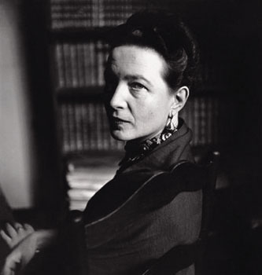
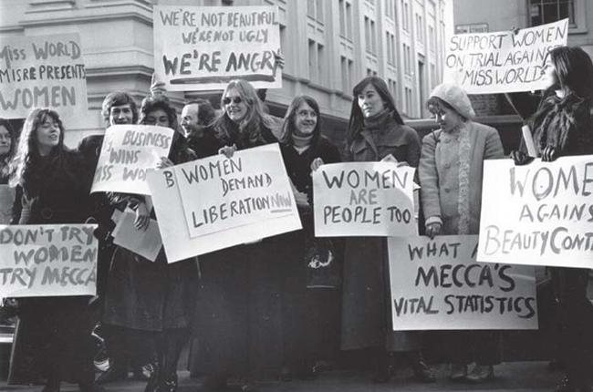
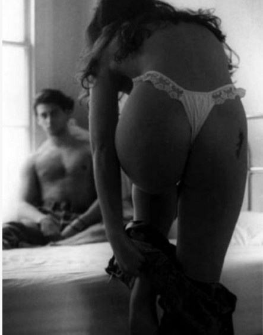
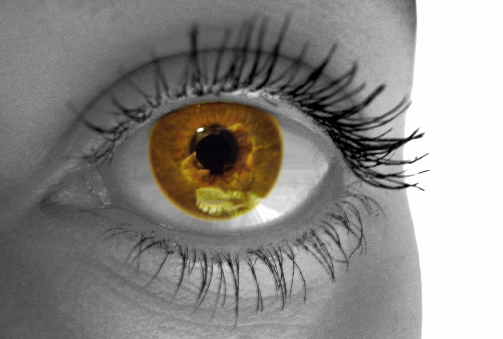

# ＜开阳＞每个波伏娃都站在沃斯通克拉夫特的肩上

**出于我自身对假设的后怕，我总是希望波伏娃们能俯一俯身，做些沃斯通克拉夫特做过的事，而非一味地长吁短叹满腔绝望抑或是站在高处说些风凉话。并且我乐观地认为，到那时，扛旗者将不再孤独，扛枪者亦不再没有方向。毕竟，波伏娃是站在沃斯通克拉夫特肩上的人。**  

# 每个波伏娃都站在沃斯通克拉夫特的肩上

## 文 / 毛笑笑 （北斗撰稿人）

  论女性主义，波伏娃是当之无愧的教母，这个绝不也从未屈从于他人意志之下的女人至今仍是不可逾越的传奇。我有个身体力行支持性解放的姐姐便称波伏娃是她永远的明灯。波伏娃这一生获赞誉无数，总之，她是女性主义运动史上毫无争议的英雄。 

 我本人是波伏娃的信徒，但从个人喜好上来说，沃斯通克拉夫特更让我觉得亲近。 沃斯通克拉夫特的父亲酗酒成性，常常在醉酒之后对妻子实施家暴，而她的母亲懦弱无能，在当时大环境的束缚之下不懂反抗，她自少女时期开始便肩负起保护母亲的职责。在这种环境下成长起来的沃斯通克拉夫特一方面必须坚强独立，在接受了一些初等教育之后便开始自谋生路，而另一方面她又无法逃避时代的影响，接受并且发自内心地认可自己被社会塑造的女性角色。在这种矛盾的经历之下，她写出了女性主义的第一本理论著作，为女性争取教育权这一奠定运动基础的权利。当她以“我以不安和关切的心情研究历史记载和观察世界现状以后，一种最忧郁的悲愤感使我十分沮丧”这样温情脉脉充满道德情怀的句式作为全书的开头，便奠定了她所代表的女性主义出于“后天形成的女性观”所具有的局限性。并且在完成《女权辩护》一书之后不久，她便推翻了自己的观点，陷入了对伊姆利近乎崇拜的爱恋之中。 先驱与教母之间，隔了150年。 诚然，发迹于20世纪60年代的第二次浪潮为女性争取到了更多的权益，波伏娃那句“女性是后天形成的”的口号撼动了西方世界看似坚不可摧的父权社会，《第二性》的诞生是在对父权思想文化体系进行大批判的基础上强调以消除两性差别从而从本质上改善女性的地位，历史将那一刻的快照定义为真正的女性主义萌发，以此区分以沃斯通克拉夫特为代表的第一次女性主义浪潮的“旧”女性主义。但不论女性主义思潮的研究者们对这场运动的发展史做出怎样的评价和论断，我们都无法否认，倘若没有19世纪末的女性主义思想启蒙，没有沃斯通克拉夫特和穆勒为女性争取教育权和政治权的呼喊，就很难会有1914年“妇女社会政治协会”冲击白金汉宫以暴力争取参政权的上演，而假定这一切都没有发生，也就不会有1971年为争取合法堕胎权的“343女性宣言”的发表。波伏娃的高度是站在无数先行者垫起的基石之上，这一点，在中国似乎遭到了忽视。激进如李银河一再的呼吁卖淫合法化，不过出于自身的经济地位和话语权的立场，波伏娃的追随者们始终不肯把目光放在这片土地之上。 

 在真实的生活里，中国有绝大多数女性仍俯伏在野蛮封建的男性权威的压迫之下，她们还没有获得公平的公民权，其经济地位和社会地位都牢牢受制于男性。逼迫一个遭受贞操观迫害的女性接受性自由，对她而言，这或许就意味着一场强奸。甚至于仍有大批女性知识分子认为“在一个宴会上，一个女性大谈自己的身体隐私、房事，其他满座的女性都会有被扒光的不安感”，这种不安源自于“男性不好怀好意的窃笑”。在此种基础上推行激进主义女性主义流派的思想，无异于企图建立一幢没有地基的房子，建得越高，便倾颓得越快。 我有数名男性朋友声援李银河老师，大力支持卖淫合法化。他们的出发点是好的，意即以支持性自由的方式解放长期受贞操观迫害的女性，但我忍不住反问，在教育权对她们而言都还遥不可及的情况下，卖淫合法化的得益者究竟会是谁？我小时候经常跟爸爸在一起看新闻，有一次社会民生栏目报道了生活在小镇上的女性被迫卖淫挣钱养活男人，我当时非常的难过，以至于当着客人的面怒骂了一句，爸爸试图安慰我，他说当今女性的社会地位已经很高了，但这句话却使我更加愤怒，我不无嘲讽地反问他，你忘了我们见过那么多那些屈服于暴力不懂自保还自以为是为了爱情被迫卖淫的女人了吗？他答不上来，良久的沉默之后他低声说那倒也是。 

 有很多人，可能就像我爸爸一样，乐观地从自身出发，认为女性的地位已经到达了某个高度。而事实上，我们目之所及的范围，相比之这片国土上落后的地方，竟然是那样的狭小。这个社会面临的最大困境是，精英看向精英的领空，民众活在民众的土地，精英们所不齿、要攻击的东西，有时候甚至是民众求而不能得的。思想启蒙者们与民众之间隔着一道无法对话的沟渠，一方得不到支持，一方得不到引领，而最为危险的情况是，他们有时甚至站在了对立面成为敌人。所以我们焦躁，我们愤怒，我们欲前行而不能，我们失序，我们绝望，我们几近崩溃。 我第一次反抗父母之时，所用的辩护词便是“我已经完全不能够容忍这种落后野蛮的教育迫害”，我亲爱的妈妈，她当即落泪，问我为什么别人能够忍受，看到的世界更广阔一点难道就一定会幸福吗。这个问题横亘在我心中长达几年之久，我找不到正确的答案。我只知道当我认同的价值观超出了成规惯例所能给予的满足之后，我唯一可做的就是誓死捍卫自己，我没有办法做到对自己视而不见，在这种解释之下再回答妈妈问出的第一个问题就容易得多了。但随之而来的恐惧是，在整体教育制度如此糟糕的国土上，我成长的环节倘若有任何一环被变动，很有可能我便会成长为今天的自己不喜欢的样子而不自知。我所拥有的今天，竟得益于先天条件的机缘巧合。 人类的一切行为都是为了满足自身的欲求，有些人欲献身于一种事业，有些人只愿能够生存下来，至于活得好不好，那是生命得到保障以后才要去想的事。我不认可精英们出于革除封建习俗的目的就有权去责问买火车票都尚且艰难的他们“何不坐神七”，亦非常真诚地恳求站在绳索之外的人不要轻松地指责舆论对他们的伤害源自他们自身脆弱懦弱怨不得人，既怨不得人，倒不如由他们自己来活。强行将尚且不会独立思考的民众拉入“别人的民主自由”之中，谁才是既得利益者？ 我对我们身处的国家抱有一种非常悲观的情绪，认为移民国外者不过仰仗父母的财力，思想先进者不过出于先天智力及一切偶然。一切所谓怒其不争的论调，都会使我忍不住反问，你们争了什么？先天优势必然会使某些人站在高一点的地方，依靠这种冥冥之中的命运上位者有什么资格去嘲讽那些把希望悬挂在侥幸之中的人？都是话语霸权之下的受害者罢了。我尊崇那些试图使这些偶然在这片土地上变为必然的人，但是，在这个过程里，我们明明面对着同一个敌人，却为何要将矛头指向制度之下的牺牲品？如果这就是精英们所谓的思想启蒙，民众如何敢跟着这漠视个体透着凉薄的启蒙者走？ 

 出于我自身对假设的后怕，我总是希望波伏娃们能俯一俯身，做些沃斯通克拉夫特做过的事，而非一味地长吁短叹满腔绝望抑或是站在高处说些风凉话。并且我乐观地认为，到那时，扛旗者将不再孤独，扛枪者亦不再没有方向。 毕竟，波伏娃是站在沃斯通克拉夫特肩上的人。  

（采编：安镜轩 责编：项栋梁）

 
