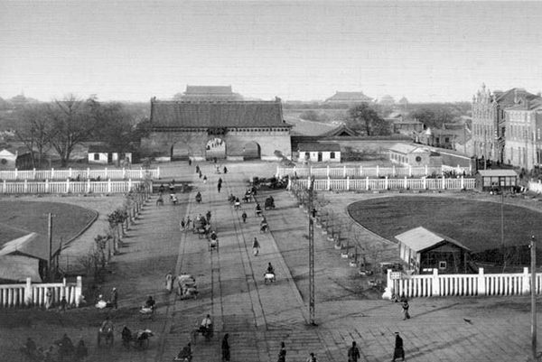

# ＜开阳＞民初北京公共空间的开辟与沈从文笔下的都市漫游（上）

**对于沈从文的“游荡者”而言，观看不是一个单向的姿态，“游荡者”与“陌生人”之间存在相互观看的互动关系，当“游荡者”窥视人群的时候，人群也在打量着“游荡者”。沈从文十分关注自身在他人视角中的呈现，其自叙传性质的作品常有意识地透过萍水相逢的陌生人之眼，塑造一个自我的镜像。**  

# 民初北京公共空间的开辟

# 与沈从文笔下的都市漫游（上）：

# 人群中的孤独者

## 文/林峥（北京大学）

 

1924年春，初到北京的沈从文在表弟黄村生的帮助下，从前门外杨梅竹斜街的酉西会馆迁至西城的庆华公寓，后又搬到北河沿附近的汉园公寓。在“窄而霉小斋”的公寓生活中，湘西青年沈从文开始了他最初的文学创作。

不同于《边城》一类成熟期的代表作，1920年代沈从文的早期作品，存在鲜明的自叙传色彩。在《公寓中》、《绝食以后》、《到北海去》、《一天是这样度过的》、《棉鞋》、《老实人》、《怯汉》等一系列小说中，清晰地浮现出一个在都市中游走的“漫游者”形象。都市漫游者滥觞于本雅明笔下的波德莱尔。然而，1920年代漂流于北京街头的沈从文显然与本雅明笔下的都市漫游者存在相当的差异，若说波德莱尔尚能“把一种必须做的事装扮得像是出于一种优雅的习性”，[1]沈从文却早已为生活所迫而无瑕顾及。波德莱尔时代的游荡者“要求活动空间、不愿放弃雅士们悠闲之乐”，因此在1840年前后，带乌龟散步、为自己定步调成为时尚[2]；而沈从文笔下的自叙传主人公则迫于经济的困窘与生存空间的逼仄——天冷生不起炉子，“窄而霉斋”潮湿狭小——而不得不到马路上或公园里散步，或去图书馆以取暖。

都市漫游看似理所当然，实则在1920年代的北京语境中却是一种全新的体验。老北京虽素有站街看人的旧习——俗称“卖呆儿”，但向无逛街的传统。梁实秋曾在《北平的街道》一文中谈到：“北平没有逛街之一说。一般说来，街上没有什么可逛的。一般的铺子没有橱窗，因为殷实的商家都讲究‘良贾深藏若虚’，好东西不能摆在外面，而且买东西都讲究到一定的地方去，用不着在街上浪荡。要散步么，到公园北海太庙景山去。如果在路上闲逛，当心车撞，当心泥塘，当心踩一脚屎！要消磨时间么，上下三六九等，各有去处，在街上溜馊腿最不是办法。当然，北平也有北平的市景，闲来无事偶然到街头看看，热闹之中带着悠闲也满有趣。”[3] “闲来无事偶然到街头看看”，即老北京的“站街”看热闹，而在街上“浪荡”、“闲逛”则“最不是办法”。在这一层面上，沈从文的自叙传主人公为“都市漫游”赋予了有别于传统的新意。

现代都市的本质特征之一是人群[4]，因此在某种意义上可将人群视为城市的换喻表现，对此理查德﹒利罕在其代表著《文学中的城市》中多有精辟的分析：“城市经常以换喻的方式现身，比如体现为人群。我们通过人群看见城市，不论是艾略特和波德莱尔笔下的僵尸般的行路人，还是狄更斯、左拉、德莱塞、韦斯特和艾里森笔下充满暴力的乌合之众。无论群体的性质有多大的差别，那些人群都占据着19世纪和20 世纪都市小说的中心位置。”[5]沈从文对于都市中陌生的人群抱有特殊的兴味和敏感。人群中的游荡者是一个观察者，他置身其中，怀着爱恨交织的暧昧情愫审视往来的行人，不论是作家自身，还是其笔下的自叙传主人公。

如《老实人》中自宽君到北海公园主要是为了去“看人”：“天气已转秋以后，自宽君，无所事，像一只无家可归的狗一样，每日到北海去溜，原是一些公子小姐的事！自宽君是去看这些公子小姐，也就忘了到那地方的勤。”对于自宽君观察游人的乐趣，作者的描述深得个中三昧：“有时他却一个人坐到众人来去的大土路旁木凳上，就看着这来去的男女为乐。每一个男女全能给他以一种幻想，从装饰同年龄貌上，感出这人回到家中时节的情形，且胡乱猜测日常命运所给这人的工作是一些什么。到这地方来的每一个游人，有一种不同的心情，不怕一对情侣也如此。一个大兵到北海来玩，具的是怎样一种兴趣？这从自宽君细细观察所得，就有一种极有趣味的报告。在这类情形下头，自宽君，来此的意义，简直是在这里作一统计分类工作了！”[6]又如《怯汉》中，沈从文生动地描绘身处闹市人潮的经验——“黄昏了，我独在街头徘徊。看一切街市的热闹，同时使我眼，耳，鼻，都在一种适如其分的随意接触中受着不断的刺激。”“擦着肩膀过去的，全是陌生人。”[7]“陌生人”以及由此引发的“孤独”体验，是现代主义都市理论的关键概念。雷蒙德·威廉斯曾提出大都市最基本的主题之二，即陌生人群与个体在人群中的孤独寂寞。[8]理查德﹒利罕亦指出：“城市成为敏感的艺术家——甚至当他混迹于群众之中时也不例外——体验与普通人群相隔膜的强烈孤独感的场所。当他成为人群中的孤独者时，城市的现实就被其对城市的印象所取代。”[9]沈从文的早期作品对于都市人群极其敏感，在“乡下人”出身的作者/自叙传主人公眼中，陌生的人群通常作为城市的具体象征、一种异化于自身的认知对象呈现。其背后有城市与乡村二元文化资源的潜在对抗。如《绝食以后》中，作者在以生动细腻的笔触描写了西单牌楼一带的各式人物后，代主人公发出感叹：“魔鬼的人群啊！地狱的事物啊！我要离开你，于是，他便又返到他那小鸽笼般的湿霉房子中了。”[10]

而对于包括作家自身在内的“游荡者”而言，都市人群之中最能给予其不可抗拒之吸引和诱惑的，毫无疑问是女人。沈从文早期作品中对于性之压抑与诉求的大胆表达，丝毫不亚于郁达夫的自叙传小说。在现实社会中郁郁不得志的主人公饱受性欲的煎熬，只能在性幻想中得到短暂而又凄凉的满足，而在公园里、马路上擦肩而过的每一位妙龄少女，都可以成为欲望投射的对象。在《公寓中》，作者直截了当地告白：“路上去做什么事？马路上去看女人！”[11]《到北海去》的主人公坐在洋车上，“开始去注意马路上擦身而过的一切”——“女人，女人，女人，一出来就遇到这些敌人，一举目就见到这些鬼物，花绸的遮阳把他的眼睛牵引到这边那边而且似乎每一个少年女人切身过去时，都能同时把他心带去一小片儿。”[12]在《怯汉》中，“我”更是如痴如狂地追随两位女学生从西单牌楼一路步行到女师大。这很容易令人联想起波德莱尔的十四行诗《致一位交臂而过的妇女》，诗人于大街上邂逅一位戴孝的美妇人时惊鸿一瞥的震惊体验，这种现代都市带来的“侵袭缠绕一个孤独者的性的震惊” [13]，同样煎熬着沈从文自叙传主人公的身心。

对于沈从文的“游荡者”而言，观看不是一个单向的姿态，“游荡者”与“陌生人”之间存在相互观看的互动关系，当“游荡者”窥视人群的时候，人群也在打量着“游荡者”。沈从文十分关注自身在他人视角中的呈现，其自叙传性质的作品常有意识地透过萍水相逢的陌生人之眼，塑造一个自我的镜像。

如《老实人》中的自宽君，是一个“长身瘦个儿”的写小说的青年人，文字有“一种朴素的忧郁，同到一种文字组织的美丽”——这是作者借女读者之口对“自宽君”/沈从文自我的评价。主人公在北海公园邂逅两位美丽的女读者，发了痴念尾随二人，女子也察觉到，双方相互打量，他于是自觉地通过对方的眼睛来审视自己：“设若自宽君，身上穿得华丽不相称，是白脸，是顶光致的头发，又是极时髦的态度，则女人怯于这新时代青年，怕麻烦走去，也是意中事。如今在女人眼中的他，就像从模样上也看得出不是那些专以追逐女子为乐的浪子——说‘不像’还不切实，简直还可说不配。自宽君又何尝不是了然自己是在体态上有着不配追女人的样子才敢坐下来的？”[14]又如《新梦》中，站在晒台上的主人公与对窗的女子打了个照面，心中苦恼着自己留给女子的形象：“假如女人真如他所幻想的情形，那女人当不会忘记望到他的脸是怎样寒伧的一个黄色尖脸，是这样，自己的讨厌样子将把女人的轻蔑增加起来，他以后只有绝望了。”同时却又希冀女子读过自己的小说——“又想到，或者是正在读自己的文章吧，因为他在晒台时还见到这房里一个椅子上有一分依稀像现代评论的杂志，若果这杂志是这几期现代评论，则女人当不会不见到了。……那么，知不知道这作压寨夫人一小说的便是站在晒台上发痴望着的尖脸汉子？”[15]《押寨夫人》正是1927年商务印书馆出版的沈从文的中篇小说，此前于1926年4月24日起以《在别一个国度里——关于八蛮山落草的大王娶讨太太与宋家来往的一束信件》为题在《现代评论》第3卷第72-75期连载，有意识的自我指涉耐人寻味。[16]这种藉由他人视角达成的自我审视，在其余如《棉鞋》、《怯汉》、《看爱人去》、《一个晚会》、《用A字记录记录下来的事》等作品中都有体现。

在1928年8月30日的日记中，业已声名鹊起的沈从文记述自己去住处附近的艺术学校门口“看早景”——“我到那艺术学校大门外站了一阵，看进出的男女学生；这些人，也望我。”随即敏感地自觉对方眼中的自我形象：“我没有好的衣服，也没有好的相貌，精神却不放在外面，无怪乎得到这些人的趣味了。站到那类地方，作成乡下人模样，让她们看着笑着，我也随意看她们，这情形是不坏的。”“我稳定的又看看这方面女人，女人是七个。其中两个就长得非常美。她们虽见我望她们，却仗了人多，且断定了我无害于人，也对我望。这样一来我不免有点羞惭了，我是这样无用这样不足损害于人，为我的土气，真想跑了。”[17]对于自我的认识与构建是在这样“看”与“被看”的相互凝视中完成的。正是由于身处大都市汹涌的人流中，来自湘西一隅的青年才会自觉到、并进一步去发现“乡下人”的自我。

沈从文的自叙传主人公将“都市漫游”的传统引进1920年代的北京。一方面，对于“乡下人”出身的沈从文及其自叙传主人公而言，陌生人群以都市的换喻面目呈现，既具有难以抗拒的吸引和诱惑，又作为乡村的对立面裹挟着威慑和压力。而另一方面，自我意识正是在这种对比中萌生并强化的，沈从文“乡下人”的身份认同其实是在北京——上海的大都市生活经验中构建起来的，通过与他者——都市/陌生人的接触、对抗与参照，沈从文逐渐确立了那个富有湘西特色的“乡下人”的自我。

 

### 【注】

[1]本雅明著，张旭东译：《发达资本主义时代的抒情诗人》，北京：三联书店，2007年，89页

[2]《发达资本主义时代的抒情诗人》，72页

[3]姜德明编：《北京乎——现代作家笔下的北京》下册，北京：三联书店，1992年，575页

[4] 路易﹒沃斯(L.Wirth)在《作为一种生活方式的都市主义》一文中指出：“现代人生活模式的鲜明特征是：人集中形成巨大的社会，周围围绕着次要的中心。”转引自汪安民、陈永国、张云鹏主编：《现代性基本读本》下册，开封：河南大学出版社，2005年，700页

[5] 理查德﹒利罕著，吴子枫译：《文学中的城市》，上海：上海人民出版社，2009年，10页。他还在另一章中细致地解读了爱伦﹒坡的《人群中的人》，详见《文学中的城市》，104页。

[6] 《沈从文全集》第二卷，74-75页

[7] 《沈从文全集》第二卷，197页

[8] “现代城市作为一群陌生人的效果，被华兹华斯以一种要持续下去的方式验证了……在这里很明显的是，从拥挤街道上不相识的人们这一世间真相向观察者的迅速过渡——虽然我们现在忘记了在任何情况下对人们来说都习以为常的小居民区的一种小说体验——像现在对‘谜’一样的陌生富有特征的解释的迅速过渡。”“与这种陌生人群最初的主题密切相关的，是一个次要的主题，即个体在人群中的孤独寂寞。”参见雷蒙﹒威廉斯：《现代主义的政治——反对新国教派》，第二章《大都市概念与现代主义的出现》，北京：商务印书馆，2002年，57-60页

[9] 《文学中的城市》，97页

[10] 《沈从文全集》第一卷，363页

[11] 《沈从文全集》第一卷，353页

[12] 《沈从文全集》第一卷，125页

[13] “使他的身体在颤抖中缩紧的——crispe comme un extravagant（像一个精神病人一样缩紧）——并不是那种每一根神经都涨满了爱的神魂颠倒；相反，它像那种能侵袭缠绕一个孤独者的性的震惊。如蒂博代(Thibaudet)指出，‘这些东西只能在大城市里写出来。’”《发达资本主义时代的抒情诗人》，145页

[14] 《沈从文全集》第二卷，83页

[15] 《沈从文全集》第二卷，172页

[16] 在沈从文1928年8月的日记《善钟里的生活》中，描述他常在自家的晒台窥视对窗的女子，且看到睡梦中的女子，想到：“若说梦境的构成，与日间生活相联，则这时的她，不正是便梦着为一个男子追迫，而这男子的脸便与对面小方窗中的男子瘦脸一样吧。”可与《新梦》作一有趣的对读。《沈从文全集》第三卷，443页

[17]《沈从文全集》第三卷，446-447页

 

### 【编者注】

本文原载于《励耘学刊(文学卷)》（北师大文学院主办） 2011年01期。

  （未完待续）  

(采编：楼杭丹；责编：马特）

 
