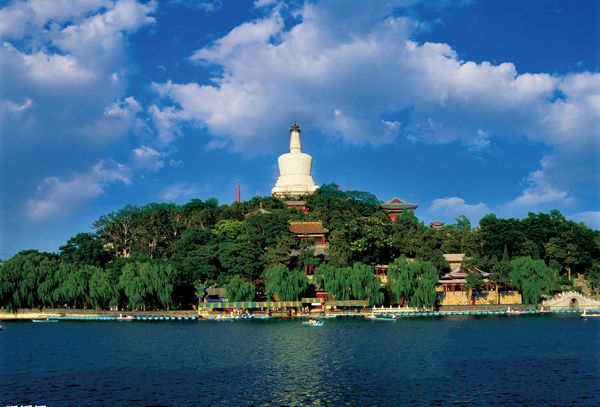

# ＜开阳＞民初北京公共空间的开辟与沈从文笔下的都市漫游（下）

**通过对于1910-1920年代北京“公共工程运动”史的梳理，可以看出，伴随民初北京城市近代化的过程，一系列新兴公共空间崛起，如沈从文作品中频繁出现的马路、电车、公园、图书馆等等，都是1920年代（尤其是中期）开始普及推广的。作为一位敏锐而称职的都市漫游者，沈从文准确无误地感应到都市面貌的转变，并同步反映于其创作中。**  

# 民初北京公共空间的开辟

# 与沈从文笔下的都市漫游（下）

## 文/林峥（北京大学）

 

公园作为西方近代文明的象征被引进中国，在民国时期文化人的精神生活中占据了十分重要的位置。谢兴尧曾作《中山公园的茶座》一文，指出同属中山公园的茶座，不同的人有不同的偏好：“简单的说：‘春明馆’是比较旧式的，‘长美轩’是新旧参半的，‘柏斯馨’则纯粹摩登化的。”其实不惟中山公园的茶座，同样是新兴的公园，在新旧文人心中亦亲疏有别。哪些人喜欢中央公园，哪些人喜欢北海、中南海，哪些人喜欢什刹海，追问下去，背后有文化背景与知识结构的潜在差异。如中央公园名流云集，既有傅增湘、郭则沄、夏仁虎、吴廷燮、张伯驹等遗老；也有蒙文通、钱穆、汤用彤、谭其骧等学者，既有黄节、林损等传统文人，也有鲁迅、钱玄同、傅斯年、李大钊等新文化人。鲁迅与齐寿山合译的荷兰童话《小约翰》即在中央公园完成；张恨水的《啼笑因缘》也系此处写就。

相较之下，年轻的知识分子、艺术家们则偏爱游人较少、相对清静的北海公园，以标榜自己不俗的品味。如青年作家高长虹在一篇题为《北海漫写》的散文中延续其一贯的激进语调：“平庸的游人们当然是最好到那平庸的中山公园去写意了！因为一切都是对的，所以三海留给诗人和艺术家以不少的清净。我在北海停了两点钟，没有看见五十个人，所以她做了我的最好的工作室了！”而在另一篇《南海的艺术化》中，他将北京的四个著名公园分类：“先农是下流人物传舍，中山装满了中流人物，北海略近于是绅士的花园，那末，南海！让我赠你以艺术之都的嘉名吧！”与沈从文相熟的青年诗人刘梦苇、朱湘等亦对北海青眼有加：“九日下午，去北海，想在那里作完我的《洛神》，呈给一位不认识的女郎；路上遇到刘兄梦苇，我就变更计划，邀他一同去逛一天北海。”女学生谢冰莹、陈学昭也钟爱北海，谢冰莹在《北平之恋》中浓墨重彩地描画了北海公园的优美景致；陈学昭则在《北海浴日》中激情洋溢地记载了清晨独自一人到北海看日出的经历。沈从文的自叙传主人公也最为青睐北海公园，《老实人》借自叙传主人公之口道出缘由：“在自宽君意思中，北海是越美，就因为人少！”然而，即使在新式知识分子中，也并未见得都欣赏公园的美，朱光潜即偏好平民化的后门大街远过于北海：

这并非北海对于我没有意味，我相信北海比我所见过的一切园子都好，但是北海对于我终于是一种奢侈，好比乡下姑娘的唯一一件的漂亮衣，不轻易从箱底翻出来穿一穿的。有时我本预备去北海，但是一走到后门，就变了心眼，一直朝北去走大街，不向西转那一个弯。到北海要买门票，花二十枚铜子是小事，免不着那一层手续，究竟是一种麻烦；走后门大街可以长驱直入，没有站岗的向你伸手索票，打断你的幻想。这是第一个分别。在北海逛的是时髦人物，个个是衣裳楚楚，油头滑面的。你头发没有梳，胡子没有光，鞋子也没有换一双干净的，“囚首垢面而谈诗书”，已经是大不韪，何况逛公园？后门大街上走的尽是贩夫走卒，没有人嫌你怪相，你可以彻底地“随便”。这是第二个分别。逛北海，走到“仿膳”或是“漪澜堂”的门前，你不免想抬头看看那些喝茶的中间有你的熟人没有，但是你又怕打招呼，怕那里有你的熟人，故意地低着头匆匆地走过去，像做了什么坏事似的。在后门大街上你准碰不见一个熟人……这是第三个分别……

  

师陀则推崇什刹海：“倘若拉住一位北京市民，问北平地方哪里顶好玩，他的回答一定是什刹海而绝非中央公园……”对于公园的取位，体现了各人审美趣味和文化理念的差异——文人趣味与平民趣味的对抗，主流文化精英抑或边缘知识分子的选择。

公园是一个多功能的公共空间，它除了提供娱乐设施外，还兼有教育、商业、文化、社会、政治等多种作用；其中，对于教育功能的特别强调成为民国时期北京公园的特色，利用公园向民众灌输现代观念与意识，使其兼具社会政治教育空间的功能。民国时期的北京公园大多附设有纪念碑、历史博物馆、国货陈列所，以及图书馆、阅报亭，甚至民众学校等。民国北京大部分主要的公共图书馆都与公园共存。如中央公园将社稷坛的大殿改造为教育部中央图书阅览所，于1916年开放，是中国最早的公立图书馆之一。又如沈从文最为流连忘返的北海图书馆，系1926年由“中华教育基金董事会”利用美国退还的庚子赔款建立，当时名为“北京图书馆”，梁启超、李四光分任正副馆长；1928年改名为“北海图书馆”，1929年与前身为“京师图书馆”的国立北平图书馆合并，成为新的国立北平图书馆，由蔡元培担任馆长。从沙滩附近的汉园公寓，步行至文津街的北海公园赏玩美景，再到毗邻的北海图书馆饱览群书，自然是一条愉悦又便捷的上选路线。此外还有北平香山教育图书馆（1921年），北平故宫博物院图书馆（1925年）及其景山分馆（1926年）与太庙分馆（1935年），以及颐和园图书馆（1930年）等等。

哈贝马斯提出的“文学公共领域”概念，在西方现代城市中体现为咖啡馆、沙龙及宴会等机制，这确实适用于中国的另一大都市上海，然而，其在文化氛围迥异的北京则有自身独特的表现方式。北京新兴的公园、公共图书馆等，就某种意义而言，类似于上海的咖啡馆，具备一种文学公共领域的功能。新旧文人、知识分子可在此交游、聚会、探讨思想或者联络感情。它甚至作为一种新式的文化符号，沈从文及其自叙传主人公一类的“边缘知识分子”，可以借此获得一种象征意义的文化资源——不能正式进入高等学府，便转而到公共图书馆自修；或去风雅的公园茶座跻身文化名流之中，从而为自己贴上一个新型知识分子的标签。

通过对于1910-1920年代北京“公共工程运动”史的梳理，可以看出，伴随民初北京城市近代化的过程，一系列新兴公共空间崛起，如沈从文作品中频繁出现的马路、电车、公园、图书馆等等，都是1920年代（尤其是中期）开始普及推广的。作为一位敏锐而称职的都市漫游者，沈从文准确无误地感应到都市面貌的转变，并同步反映于其创作中。其1920年代的一系列作品，见证了等级严明的封建帝国空间向现代市民社会的转型。有赖于民初北京公共工程的建设与公共空间的开辟，沈从文自叙传主人公的都市漫游才得以实现。在这个意义上说，沈从文的早期小说蕴含了丰富的现代性因素。

 

（责编：楼杭丹、马特）

 
