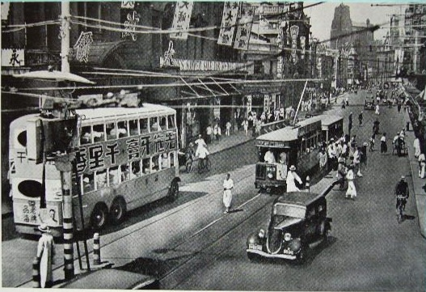
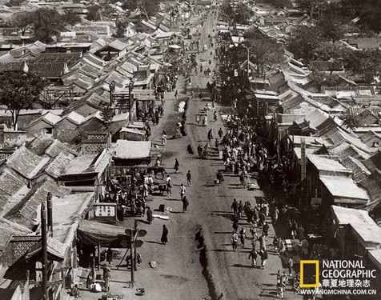
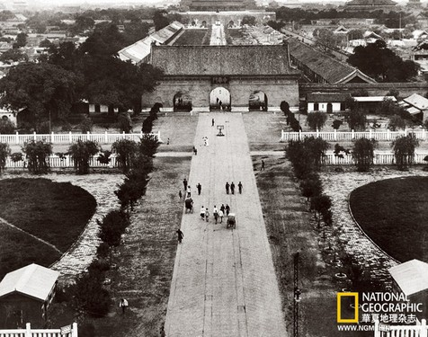

# ＜开阳＞民初北京公共空间的开辟与沈从文笔下的都市漫游（中）

**1920年代京都市政公所推行的一系列公共工程运动，包括城市道路的规划、公共交通的引入、公共空间如公园、图书馆、博物院的开辟等，重构民初北京的都市面貌，开创现代市民的公共空间，也为沈从文自叙传主人公的都市漫游提供了富有现代意味的背景地图。值得注意的是，沈从文自身对于北京市政建设的问题始终保持敏感和兴趣，直至1947-1948年间，沈从文以巴鲁爵士的署名发表一组北平通信，宣扬以美育代宗教，重建故都，对于北平市政建设进行整体规划，其中《苏格拉底谈北平所需》一文最具代表性。**  

# 民初北京公共空间的开辟

# 与沈从文笔下的都市漫游（中）

## 文/林峥（北京大学）

 

漫游在何种条件下得以成为可能？本雅明的游荡者得益于资本主义工业时代“拱门街”的发明——“在奥斯曼之前，宽阔的街面很少。而狭窄的街道安全没有保障。假如没有拱门街，游荡就不可能显得那么重要了。”20世纪20年代的中国，不存在拱门街，也尚未兴起百货商店，然而，对于沈从文的自叙传主人公而言，都市漫游同样并非表面看来那么顺理成章。

经由沈从文的一系列早期作品，可以勾勒出其自叙传主人公的一幅都市漫游地图。对于沈从文的游荡者而言，消遣时间的去处之一是逛马路，如《公寓中》：“这时外面总不至于不能走，我顶好是跑到马路上去逛一趟。马路上自然比室中要冷一点，但因为走动，我两只冻紫的脚，多少总可以暖和一点！”他比较钟爱的路线是西单牌楼一带，《公寓中》即提到“单牌楼以西”，《绝食以后》亦有对于“热闹着——像是大街本身的确也热闹着的西单牌楼”的生动表现，而《怯汉》中更是通过主人公尾随女学生的行踪，细致准确地绘出一条自西单牌楼——菜市口——手帕胡同——教育街——石驸马大街——女子师范大学的路线。这属于内城西南片一带，沈从文之所以对这片区域特别熟悉可能源于他在西城区公寓的居住经验。西单是民国时期新兴的商业中心，西单牌楼周遭的繁华街景在沈从文的作品中有鲜活的呈现：“一到黄昏西单牌楼就像格外热闹点。这时小姐少爷全都出了学校到外面来玩，各以其方便的找快乐，或是邀同情人上馆子吃新上市的鲜对虾，或是往公园，或是就在街上玩。车子来来去去像水流。糖果铺初燃好的煤气灯在沸沸作声放浅绿色光。远处电灯完全是黄色。”

都市漫游的延伸是乘坐电车、汽车、人力车、马车等形形色色的交通工具，看街景以打发时光：“这个时候是下午三点时候，大街上，一些用电催着轮子转动的，用汽催着轮子转动的，用人的力量催着轮子转动的，用马的力量催着轮子转动的，车上载着的男男女女，有一半是因为无所事事很无聊的消磨这个下午而坐车的。坐在车上实际上也就是消磨时间的一种法子。”

除了马路和街市，公园亦是沈从文自叙传主人公经常光顾之所。首选是北海公园，《老实人》主人公自宽君的爱好是“每日到北海去溜”，而沈从文一篇小说的题目就叫《到北海去》。沈从文于1924年5月底6月初迁至靠近沙滩红楼的北河沿汉园公寓，距离北海公园相当近，步行可及，因此风光幽静的北海公园自然成为其排遣寂寞消磨光阴的妙处。此外，作品对香山公园与中央公园亦有涉及。《棉鞋》中第一人称叙事者“我”游山，虽没有点明公园的名字，但提及的“见心斋”、“阆风亭”显然是香山的景致，《棉鞋》作于1925年9月5日西山静宜园，正是作者在香山慈幼院任职图书馆管理员的时期。《或人的太太》中的少年夫妇则通过到中央公园去倾心畅谈，才解开了彼此长久以来的心结。

与公园紧密相关的是图书馆。“老实人”自宽君去北海公园，除了看人以外，“还有一件事，自宽君，看人还不是理由，他是去看书。”——“北海的图书馆阅览室中，每天照例有一个坐位上有近乎‘革命家式’的平常人物，便是自宽君。”此应为北海西墙外的北京图书馆。《棉鞋》中“我”对于香山的良辰美景兴味索然，倒是对香山慈幼院图书馆情有独钟——“这是一个拿来遂人参观的大图书馆。一座白色德国式的房子，放了上千本的老版本古书，单看外面，就令人高兴！房子建筑出众，外面又有油漆染红的木栏干。”

自叙传主人公的都市漫游看来自然而然，实则深意存焉。马路、电车、公园、图书馆、包括电影院、剧院等等，这些我们今日习以为常的事物，实际在中国1920年代的语境下饱含了丰富的现代性因素，属于新兴的公共空间范畴。在1920年以前，沈从文主人公的都市漫游根本不成其为可能。

北京现代都市公共空间的出现，与20世纪10--20年代发起的“公共工程运动”密不可分。推动民国初期北京城市近代化的关键人物是朱启钤，其对于北京城市建设发生影响主要集中于1912-1916年，在此期间他先后出任北洋政府交通总长、内务总长，于1914年创立了“京都市政公所”——中国首个城市规划与市政建设部门，北京也由此成为全国最早办理市政的城市。市政公所对北京城市空间形态的重大改变之一是开展一系列“公共工程运动”，包括对皇城、正阳门的改造，道路的铺设和牌楼的改造，环城铁路修建，将大量皇家园林作为公园开放及故宫博物院的创立等等。本文只讨论与沈从文作品所涉公共空间相关的部分。

首先，是道路建设与城市规划。在20世纪以前，北京城内有几条大道是以石板和条砖铺设的，但绝大多数道路是未加铺设的土路。旧日的北京街道以坎坷泥泞闻名，俗话称“无风三尺土，有雨一街泥”，如夏仁虎《旧京琐记》记载：“北京街市在未修马路以前，其通衢中央皆有甬道，宽不及二丈，高三四尺，阴雨泥滑，往往翻车，其势甚险。询之故老，云：此本辇道，其初驾过，必铺以黄土。原与地平，日久则居民炉灰亦均积焉。日久愈甚，至成高垅云。”1914年成立的“京都市政公所”于同年12月10日颁发的第3期《市政通告》中提出：“除去国内国外治安上的关系不算，顶急的是要整洁道路，便利交通，所以工程一方面，在京都市政中，算是顶急的了。然试问道路如何能够整洁，交通如何能够便利？……只要各处街道，无论晴天下雨，均可步行，不愁泥泞，不遭坑坎的痛苦，不受臭味的熏蒸，这便算个整洁。无论住在东城西城，前门后门，要出去便出去，不怕道儿远。”京都市政公所对于北京街道的整修与开辟进行了整体规划，《市政通告》公布有每一期翻修、补修街道的详尽记录。北京的第一批碎石路出现于1904年，主要位于东四、西四、长安街和前门大街等商业区；第一条柏油路于1915年在使馆区修葺毕；1920年紧挨中南海（中华民国政府驻地）南门的西长安街的一段路铺设了柏油；1928年内城王府井商业区的街道也换上了柏油路面。至1929年为止，北京城的全部重要街道皆已改造为碎石路和柏油路，许多街道得到了加宽和拓展，使北京的城市环境面目一新。史明正在《走向近代化的北京城——城市建设与社会变革》一书中指出：

街道铺设和城门、城墙的改造不仅改变了北京城的风貌，而且有着更深刻的社会意义。将从前禁止人们出入的地区改造成公共使用的通衢大道，便是对封建帝国时期以严格的社会等级秩序为基础的空间概念作了新的诠释。……总而言之，道路的铺设和社会服务的扩展影响应该说是‘市民城市’的诞生。

从沈从文作品的描述来看，1920年代中期北京的主要街道已经建设得非常完好，不复曾经的尘土飞扬寸步难行——西单牌楼一带的街道“车子来来去去像水流”，“街沿是那么宽”；且电气照明已十分普及：“糖果铺初燃好的煤气灯在沸沸作声放浅绿色光。远处电灯完全是黄色。”“在单牌楼以西，电灯似乎稍微稀疏了一点。”前引梁实秋《北平的街道》提及“北平没有逛街之一说”，其中一个最根本的客观限制就是北京的旧有街道不宜于步行：“如果在路上闲逛，当心车撞，当心泥塘，当心踩一脚屎！”而伴随北京街道的建设与市容的改良，同时也基于内城新兴的学生公寓室内环境的逼仄，到大街上游荡成为相当一部分青年学生、边缘知识分子选择的消遣方式，“都市漫游者”不仅限于沈从文及其自叙传主人公，而是在1920-1930年代的民国北平具有一定普遍性。如女大学生陈学昭就因不适应“北京的矮矮的屋子，闷闷的不通空气的窗户，即不能高眺，又不能远望，这样的拘拘，我终不能自释”，而“常在猪市大街摆步”。又如与沈从文交谊匪浅的青年作家陈炜谟同样不安于公寓“象鸟笼一般大的屋子”，他钟爱的去处是宣武门一带：“因此宣武门一带成为我常临的地方，也是最爱的；常常对人说：‘真的北京在这里。’——在这里你能找出高尖的西式的建筑，又能找出褪色的古旧的牌楼；汽车风驰电掣地从街心跑，两旁便道是笨重的骡车，垢面的本地人……各色各样的。”而学者朱光潜则偏爱后门大街：“我无论是阴晴冷热，无日不出门闲逛，一出门就很机械地走到后门大街。它对于我好比一个朋友，虽是平凡无奇，因为天天见面，很熟习，也就变成很亲切了。”

与道路建设直接相关的是城市的公共交通问题。《市政通告》关于铺设街道的公告即标明“先修马路为将来电车路线之经过处”，又如《再说电车》中指出：“即如京都改良市政，当从交通入手，交通事业，第一应当兴办电车。”然而，由于北京的传统格局如胡同、牌楼的限制，及其作为政治文化中心而非工业中心的定位、还有资金来源等诸种复杂因素，虽然市政公所一开始就将电车计划列为首要任务之一，实施起来却非易事。北京的电车系统相对落后，天津、上海和中国一些其他大城市都先于北京启动运行，1902年天津出现了中国第一辆电车，1905-1912年间上海铺设了三条电车运输系统，直至1924年，电车才作为一种现代的公共交通方式被正式引进北京。然而1925年10月21日发表的小说《一天是这样度过的》中，沈从文的自叙传主人公已对北京新兴的电车线路了如指掌——“我若能进城去，到马路旁不怕汽车恐吓的路段上去闲踱，把西单牌楼踱完，再搭电车到东单；两处都有灯可看。亮亮煌煌的灯光下，必还可见到许多生长得好看的年青女人们，花花绿绿，出进于稻香村丰祥益一类铺号中。……实在西单东单都到了无可挤时，我再搭乘二等电车到前门，跑向大栅栏一带去发汗，大栅栏不到深夜是万不会无人可挤的。”作于1927年12月的《或人的太太》，则提供了另外一条前往中央公园的电车线路：“当从西四牌楼到东四牌楼的电车停顿在中央公园前面，穿黑衣的大个儿卖票人喝着‘公园’时，有两个人下了车子”。民国时期，电车在促进北京城市居民娱乐旅游方面功不可没，下文将论及的新辟之中央公园、北海公园、天坛公园等附近皆有电车站，为人们前往公园游玩提供了便利，因此，每逢节假日与周末，电车乘坐率骤增。然而，相较于上海、天津等其他大都市而言，北京的电车普及率仍相当低——中国城市的电车平均乘坐率为36，天津是52，上海是38，北京只有17，因此，对于1920年代的北京市民阶层而言，电车还是一个遥远而陌生的事物，而沈从文早已十分敏感地得风气之先。至1927年底沈从文迁居上海之后，电车更是成为作家/自叙传主人公日常生活的一部分：“日子是这样消磨，与在一个电车上消磨究也无多大分别。不在此呆就跳上电车，让一个车匣子把自己从静安寺搬到靶子公园，一趟至少将近花一点钟，来去既当加倍，则应在两点钟左右了。花两点三点，到电车上坐着，去看一切人，与一切货物房子……”

其三，是公共空间的开拓。清末北京市民传统的公共娱乐空间主要是庙会、茶馆、天桥、戏园子、什刹海等，对于文人士大夫而言，还有陶然亭、西山等去处，“偌大的一个京城，虽然有甚么什刹海、陶然亭等等，但不是局面太小，就是人力不到，况且又都是地处一偏，交通不便” ；而封建贵族的皇家园林则与平民的活动空间严格区隔、泾渭分明。公园这一概念于20世纪初引入中国，它是一个源于西方的现代性的概念，公园是18-19世纪资本主义工业化与资产阶级共和政体的产物，具有娱乐、教育或保持自然风光等功能，由各级政府负责创建和管理。1868年8月在上海出现了西人的“公家花园”，即英美租界工部局修建的外滩公园；1905年7月21日《大公报》刊发《中国京城宜创造公园说》；1906年10月13日，出使欧洲考察归来的端方、戴鸿慈上奏修建公共设施：“各国导民善法，拟请次第举办，曰图书馆，曰博物馆，曰公园。”除公共交通外，京都市政公所致力推行的另一项工程即北京公园开放运动。与典型的西方公园（包括上海）不同的是，京都市政公所不是另起炉灶建设纯粹西洋式的公园，而是着手改造与开放封建王朝遗留的皇家园林和庙宇。首当其冲的是社稷坛，朱启钤亲自主持它的创建筹备工作，命名为“中央公园”的社稷坛于1914年10月10日首度向公众开放，成为北京有史以来第一个近代公园。有了中央公园的先例，市政公所先后又开辟了几处皇家园林作为北京市民的公共娱乐空间：1915年开放城南的先农坛公园；1924年开放太庙，更名为“和平公园”；1925年又开辟了故宫、北海公园以及以地坛为基础的京兆公园；至1928年，颐和园、景山、中南海也正式辟为公园对外开放。

1920年代京都市政公所推行的一系列公共工程运动，包括城市道路的规划、公共交通的引入、公共空间如公园、图书馆、博物院的开辟等，重构民初北京的都市面貌，开创现代市民的公共空间，也为沈从文自叙传主人公的都市漫游提供了富有现代意味的背景地图。值得注意的是，沈从文自身对于北京市政建设的问题始终保持敏感和兴趣，直至1947-1948年间，沈从文以巴鲁爵士的署名发表一组北平通信，宣扬以美育代宗教，重建故都，对于北平市政建设进行整体规划，其中《苏格拉底谈北平所需》一文最具代表性。沈从文在文中提议“将市政机构全部重造”，由梁思成任副市长，主持都城保护工作，就整顿北平市政管理、改造美术专科学校、北平图书馆、故宫博物院以及高等院校等公共机构，提出一系列具体构想。沈从文对于北平的整体想象基于一种以美育为中心的“公园”意象：“西人游故都者，多以北平实如一大花园。……故余意此大城市市政管理技术亦宜从管理有条理之小花园借镜。如西郊外之颐和园管理方式，即大足取法。”将北平视为一座大公园，实为时人的共识，如谢冰莹《北平之恋》亦指出：“整个的北平市，就像一所大公园，遍地有树，处处有花……”但以公园管理方式为市政管理取法，确属沈从文首创——警察数目和待遇与花匠相等，以社会服务、公共卫生与园艺学为主业；警察局长首选戏剧导演或音乐指挥，其次为第一流园艺专家，工务局长由美术设计家出任，而教育局长则由工艺美术家就职……沈从文对于北平高校的构想也是以公园为范例，其中北京大学最符合他理想的模式：“至此学校时，吾人必适如由一大花园转入一较小而精之花圃。所有建筑四周均有广阔整齐之草地与花木，一片草地接连一片草地，课室宿舍，办公室，均分别位置于花草间。草地上有无数适合身体舒适之新靠椅，学生多于温暖阳光下读书谈诗。……”沈从文对于公园这一新兴都市公共空间的特别关注与认知，由此可见一斑。

 

（责编：楼杭丹、马特）

 
