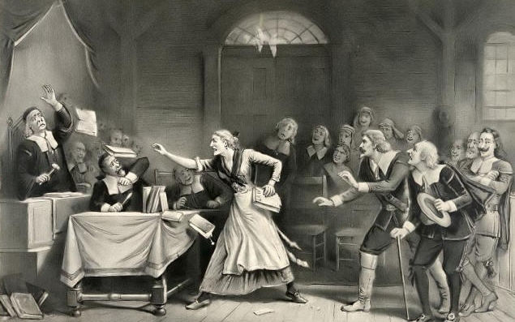
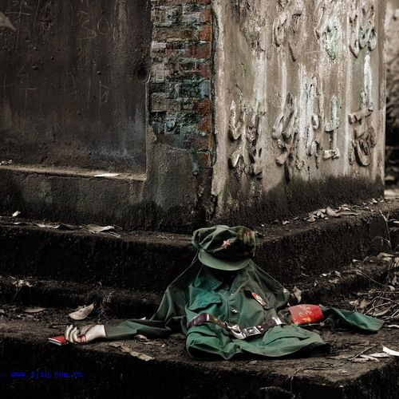

# ＜开阳＞洗不掉的血迹与遗忘的历史

**当共产主义的执着在宏大的历史叙述下变成了宗教般的狂热，在对外封闭的国内环境中，通往共产主义的道路在偏执和狭隘的意识形态胁迫下万劫不复地沦丧为哈耶克笔下的“通往奴役之路”。这条路上见不得异端，见不得反驳，见不得辩护，在历史正确的光环下，掌权者幻化成天神并夺取了人生而所具有的所有权力。这种要纯洁自己心灵，纯洁世界的理想主义的执着，一瞬间就会变成残酷迫害异端的可怕动力。**

 

# 洗不掉的血迹与遗忘的历史

# ——从塞勒姆审巫案想到20世纪中国的政治浩劫

## 文/徐定之（中南财经政法大学）

 

清秋萧索，苍茫辽阔。早上无课，在自习室随意地翻着书，读到林达《一路走来一路读》中关于塞勒姆审巫案的介绍，拍案而起，“这不就是美国版的反右与文革！”细细读下，其案件的发展和最终结果，与中国20世纪的政治浩劫何其相似又何其不同！相似之处同样葬送了无辜者的性命与魂灵，而不同之处却可以让所有的国人唏嘘不已。

塞勒姆是马萨诸塞州海湾边的一个老镇，她的历史几乎和英属北美殖民开发的历史一样长。1620年，“五月花号”载着第一批清教徒在附近的普利茅茨上岸，才过了5年就有人在此定居。 而她的名字几乎每个美国人都知道。那是来自于300年前这儿发生的一系列法庭审判案，来自于这些案件在美国人心中投下的阴影，虽然案件发生的时候，还没有美国这个国家。

1691年，在塞勒姆西北的一个村庄，一位牧师的女儿突然得了一种怪病，她行走跌跌撞撞，浑身疼痛，还会突然发作痉挛，表情非常恐怖。随后，平时和她形影不离一起玩的一共7个十几岁少女相继出现了同样的症状。这种病直到20世纪70年代才被证实可能是源于一种寄生于黑麦的真菌：麦角菌，这种真菌会使抵抗力较低的人产生幻觉。可在当时，医生对这种怪病是完全束手无策的，于是他们便把这种病归结于超自然的力量。而那位牧师家中恰巧有一位巴巴多斯的黑人女奴蒂图巴。而热带的巴巴多斯一直被传说盛行各种巫术。于是有着黑人外貌与女奴卑贱地位的蒂图巴自然成为最大嫌疑，少女们也顺理成章地揭发蒂图巴是女巫。在听证会上，少女们活灵活现地讲述蒂图巴头带一个光圈，她们看到光圈就会“中了邪”。当蒂图巴被带上听证会时，少女们非常配合地发出惊恐的尖叫，然后摆出歪斜僵硬的姿态，凝固不动了。

然后其他村民开始提供女巫作祟的其他线索：谁家牛奶无缘无故的坏了呀，谁家的牲口生下怪胎呀，不一而足。一向平静的小镇顿时成为灵异事件多发地。

在会上，主持会议的官员一遍一遍地讯问蒂图巴：“你是巫婆吗？你见过恶魔吗？如果你不是巫婆，为什么那些少女见到你就中了邪？”本来蒂图巴还拼命辩解这本是子虚乌有的指责，可当群情越发愤慨，指责愈发无理又无法辩驳时，她明白自己已经难逃此劫，于是决定承担这些指控，并答应“弃恶从善，揭发恶魔”，供出其他同僚。她也开始绘声绘色的讲述一个波士顿来的恶魔和她接头，那个恶魔是一个高高的男子，有时候变成猪，有时候扮成狗。恶魔要她签下字来，在村子里作祟行邪。然后，她当场还揭发了另外四个巫婆，她说，她们能够像传说中的魔鬼和巫婆一样，在没有月亮的黑夜，或者冬天潮湿的浓雾里，骑着扫帚飞来飞去。

这个离奇到近似童话的故事让众人恍然大悟：原来她真的是女巫！所有的疑惑都被打散，人们开始担心：原来身边有这么多的巫婆巫汉在危害他们的生活！

听闻塞勒姆出现巫婆后，马萨诸塞的总督费普斯马上从英国回来，并下令组成正式的审判法庭（Court of Oyer and Terminer）。“塞勒姆审巫案”正式开始了。

被蒂图巴揭发的四个巫婆发现自己也陷入蒂图巴的困境，于是她们也采取和蒂图巴一样的措施自保：去揭发其他人。事件演变到了一个越发糟糕的地步。人们突然发现周围老实巴结的邻居居然是居心叵测的恶魔，整个小镇陷入惶惶不可终日中。当恐惧的枪眼顶着脑门子的时候，最荒诞不经的指控也变成顺理成章的事实，揭发连着揭发，妄语随着妄语，整座小镇瞬间成为了一座无间地狱。众人为了自保，纷纷与家庭里被指控的亲人划清界限，赞同惩罚他们以证明自己的清白。

1692年的夏天，塞勒姆审判法庭的一系列审巫案，一共把19个被告送上了绞刑台，还有4个人死于监狱中。总共有200多人被逮捕和监禁。还有一个叫吉尔斯·柯莱（Giles Corey）80多岁的老人，他和他的老伴都受到指控，而他拒绝接受这样的审判，以藐视法庭的罪名在塞勒姆监狱里关押了5个月。他仍然拒绝走上法庭接受审判。根据中世纪传下来的英国法律，对待这样的藐视法庭者，要施以peine et fort 的惩罚，即用巨石压在犯人身上，直到气绝身亡。柯莱在石头下压了2天后才死去。3天后，他的妻子和其他7个犯人被吊死。

行文至此，如果诸位略有了解中国20世纪的政治浩劫，所有人恐怕都会惊呼：“这就是美国版的反右与文革呀！”

一样是莫须有的指责，一样的群情愤慨的群众。一样为了自保而出卖他人，一样是司法真空使任何谣言变成呈堂证供。理性沦丧，妄想变成最大的真实。在自欺欺人的狂潮下是一颗颗但求自保的心。值得玩味的是，塞勒姆的居民都是在欧洲受到残酷迫害的清教徒，他们怀着坚毅的宗教信仰，逃离欧洲，来到千里迢迢的新英格兰建立殖民地。而在他们有了自己的生存空间以后，他们也会像当年迫害他们的人一样，不能容忍和他们不一样的人。而中国人呢？经历了漫长而黑暗的近代，在以一种艰苦卓绝的精神与姿态终于击退了所有的外敌之后，又陷入了集体性的狂想，走上相互迫害的歧途。一方面是乱世下但求自保的卑微，另一方面是不容异己的狂躁，两者相结合下的迫害在政权的鼓动甚至是每个单位设立反革命指标的威逼下，岁月便疯狂了。人们在毛泽东的画像上画上几撇胡子便是反社会主义反人民的反革命分子，人们在大会上念错领袖的名字便是居心不良的大坏蛋，便要拷打，便要批斗，便要劳教，便要剥夺公民权甚至生命权。当历史已经演进到这样荒唐的地步时，所有正义的辩解与言说都已显得苍白，而所有的愤懑的不屈与浓重的冤情都在铺遍中国的红色狂潮中被轻而易举地抹去。

然而把美国的塞勒姆审巫案与中国20世纪的政治浩劫相比，到底还是小瞧了中国。在中国，揭发别人罪行不仅是“罪犯”自己的意愿，还是审判者的炽热鼓动。那些狂热的积极分子要“罪犯”揭发一切同党，而这种揭发是无视伦理道德和私人感情的。于是本来便昧着良心的无端指责更被汹涌的外力所挟持，变成剑指一切的污蔑。这种污蔑在政权的庇护下肆虐整片国土，使仁义礼智信荡然无存。儒家传统中所深恶痛绝的“恶讦以为直者”也变成对革命的无上忠诚，大义灭亲从人所不齿的贬义词摇身一变成为一颗红心向着党的最佳凭证。于是礼仪之邦的中国所安息千年的道德信条在数十年间瓦解殆尽，于是堂堂尚礼敬德之国脱下所有底线，赤条条地欢呼着奔入丛林社会。

让我们再把视线移回到塞勒姆。到1692年秋后，审巫风潮像它的突然兴起一样，突然消退了。人们好像不约而同地从梦魇中醒来。塞勒姆镇受过教育的精英首先起来质疑审巫案。波士顿著名的牧师，曾经当过第一任哈佛学院校长的英克里斯·玛泰（Increase Mather），原来也赞成审巫，后来发现审巫案的株连越演越烈，连他的妻子也可能被别人揭发为巫婆了，终于大彻大悟。他发表了《良心案》（Cases of Conscience），被后世称为“北美的第一部证据系统”。他指出，“错放过十个巫婆也比冤枉一个无辜的人要好。”

这些质疑促使总督费普斯下令，审判法庭不能接受所谓看到巫婆的光圈的证词，定罪必须要有清楚的令人信服的证据。在排斥了“坦白揭发”的证据以后，最后一批33个被告，有28个被法庭认定无罪，其他的人后来也得到了赦免。1693年5月，在最初的审巫案发生差不多一年以后，总督费普斯下令释放所有被指控的人。塞勒姆审巫案结束了。

事后的三百年间，美国人不停地检讨当时的社会状态，指出清教徒的宗教执着在相对封闭的社区环境下，会变成一种意识形态的偏执和狭隘，只承认自己认可的东西，只信任自己相信的东西，不见容于任何不同于自己的异端，并且把一切异端都视作邪恶。

而我们20世纪的政治劫难，不也是因此而生的吗？当共产主义的执着在宏大的历史叙述下变成了宗教般的狂热，在对外封闭的国内环境中，通往共产主义的道路在偏执和狭隘的意识形态胁迫下万劫不复地沦丧为哈耶克笔下的“通往奴役之路”。这条路上见不得异端，见不得反驳，见不得辩护，在历史正确的光环下，掌权者幻化成天神并夺取了人生而所具有的所有权力。这种要纯洁自己心灵，纯洁世界的理想主义的执着，一瞬间就会变成残酷迫害异端的可怕动力。对神的追求，会变成同魔的舞蹈。从三十年代的苏联大清洗，到六七十年代的中国文革，再到七十年代的红色高棉，20世纪用三个社会主义国家血腥至极的屠戮告诉世人偏执狂的恐怖，沉重地告诫世人多元与宽容的必要。

一场集体狂热的无间地狱仅仅一年便落下帷幕，这是美国人的幸运。而中国的政治劫难呢？从1957年的“反右”开始到1977年“文革”结束，至少有20年的漫漫长夜。而就算时至今日，“文革”式的政权思维方式仍未被清算，中国20世纪政治劫难的遗毒仍会不时在今日发作。

在塞勒姆与中国的对比中，一组数据是发人深省的。塞勒姆审巫案中，一共被冤死的有23个人。而中国的政治灾难，光“反右”中被定为右派的便有55万冤屈，而他们中仅有10万人活到沉冤昭雪之时。余下的45万人，都以极其不人道的方式远离了这个世界，杨显惠的《夹边沟记事》便以白描的笔法将甘肃一个劳改农场对右派近乎虐杀的历史事实还原，在不忍细读的历史细节面前，夹边沟便是一个岁月的孔眼，让我们得以了解那个并不遥远的时代究竟有多少恐怖。而“文革”，R•J•Rummel教授的著作《一百年血淋淋的中国》说，“文革”中丧生者的数目大约为七百七十三万人。这个数字可能偏高，但至少在二百万以上。而官方的统计数据是，“总的估计，因大量冤假错案受到诬陷、迫害和株连的达到一亿人以上。”

没有看错，这是一亿人的株连迫害！这还不包括冯克（Frank Dikotter）在《毛的大饥荒》（[Mao's Great Famine](http://ishare.iask.sina.com.cn/f/17408668.html)）中所统计的1958年至1962年中国因为错误政策和狂热运动所饿死的4500万人！要知道，澳大利亚和加拿大今天的人口总和才5500万，而澳大利亚和加拿大的领土占世界地表面积的11.7%。你不能不惊叹这是一片神奇到超过你理解能力的土地。****

但就是如此，中国上千万上亿的冤魂都换不来今日的一场全面的社会性反思，都摇不醒睡着的国人。

而美国呢？在这个有3亿人口的国度，他们对这23位冤魂给出了截然相反的答复。在三百年间，人们不停地讨论塞勒姆审巫案，沉重地思索为什么在一个公认有法治的地方，设立了正式的法庭，经过正式的司法程序而处死了几十个绝对无辜的人？甚至到1992年，塞勒姆审巫案300周年纪念的时候，马萨诸塞州议会通过决议，庄严地宣布为300年前塞勒姆审巫风潮中的所有受害者恢复名誉，尽管当初的受害者和迫害者都早已不在人世。因为历史要牢牢地记住了这一迫害无辜的事件。在当年审巫的法官中，有一个人叫约翰·霍桑。霍桑家的后代里，出了一个大作家，那就是写了《红字》的那塔尼尔·霍桑（Nathaniel Hawthorn）。在说到他这位先祖的时候，他说，在约翰·霍桑的身上，那些受害者的血迹，是再也洗不掉的了。也正是因为这起案件，美国建立起了对法庭证据的严格认定原则，不让妄想和污蔑在法庭上放肆咬人，不让法庭沦为群情泄愤的工具，从而死死捍守住理性社会的最后一条底线。

是的，无论人数多少，受害者的血迹都会鲜红鲜红地泼洒在历史苍黄的书页上，无论年华过去多少，那些冤屈的声音都会循着历史的声带悲愤地传来。如果不正视这些在历史上确切发生过的冤屈与疾苦，如果不把造成冤屈的机制清算干净，那么下一个受害者，就会是今天无知又沉默的健忘者们。

血迹洗不掉，历史不应忘记，也不能忘记！

因为马丁•尼莫拉神父在波士顿犹太人屠杀纪念碑上刻着的忏悔诗一直在盯着我们看：

当初他们（纳粹）杀工会成员，我没有作声，因为我不是工会成员；

然后他们杀犹太人，我没有作声，因为我不是犹太人；

再接下来他们杀天主教徒，我仍然保持沉默，因为我不是天主教徒；

最后，当他们开始对付我时，已经没有人为我讲话了。

附注：本文中对于塞勒姆审巫案的描述转引自《一路走来一路读》一书。

 

（采编自投稿邮箱；责编：麦静）

 
