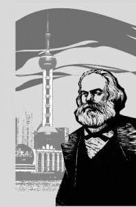

# ＜开阳＞浅谈“价值”和“价格”

**本期导读：从初中的政治课开始，我们就被灌输了马克思的劳动价值理论：商品的价格取决于其价值，价值的唯一来源是人类劳动。资本和土地并不创造价值，因而资本家和地主的收入基本上是剥削工人所得，因而资本主义和封建主义都是不道德的。可以说，劳动价值论，是马克思主义经济学的基石和起点。然而，这一理论是否无懈可击，又是否能够正确地解释经济运行中的种种事实呢？除马克思之外的其他经济学家，对于价值和价格的关系又持怎样的观点呢？本期七星论道，将为您带来同龄人对此问题的解读和思考。 **

### 

### 

# 浅谈“价值”和“价格”

### 

## 文/王也（复旦大学）

### 

### 

“商品的价值量由生产商品的社会必要劳动时间决定，商品交换以价值量为基础，按照等价交换的原则进行，形成价值规律。” 

——《马克思主义基本原理概论》146页

伟大的思想，其力量就在于，一旦你接触过它的逻辑（有时你甚至意识不到这点！），它就会于潜移默化之中，改变了你对世界的看法。正如凯恩斯所说的那样：“实干家自以为他们不受理论的羁绊，可他们却常常是某位已故经济学家的奴隶”。三十余年来，我们被市场经济的大潮裹挟着前行，报刊上谈论着弗里德曼和哈耶克，彷佛每个人都成了古典自由主义经济学的信徒。然而每当蓦然回首，我们都会骇然发现，马克思主义的幽灵仍在背后，嘴角挂着诡谲的微笑。

寒假里一次家庭聚餐的时候，电视上播了一条新闻，大意是某艺人出场费飙升至多少之类。于是我那身为大学教授的舅妈，开始大发牢骚，说当教授这么辛苦，贡献这么大，收入却还不及那些艺人的一个零头，实在不公平。一家子人纷纷附和。

生活中，这样想的人并不在少数，不是么？潜意识里，我们总认为，任何东西都该有一个“公平”的价格[1]。比如说盐，就应当是五毛钱一包，若是卖到两块一包，那就是商人在挣黑心钱，该被谴责乃至处罚。然而，这个所谓的“公平价格”又是如何确定的呢？这背后的逻辑往往是马克思式的，即任何商品都有一个固定的“价值”，只有以此为基准制定的价格，才能称之为公平合理。

马克思认为，商品的“价值”就是凝结在其中无差别的人类劳动，商品的价格在供求影响下，围绕价值上下波动，这就是所谓的劳动价值论。这一理论率先被亚当斯密在《国富论》中系统阐述，之后经过李嘉图和马尔萨斯的发展，在马克思那里发扬光大。然而随着时间推移，经济学家们逐渐发现，承认商品的价格是由某个与主观意愿无关的、短期内不会变化的内在属性决定，会在逻辑上造成一系列的问题。一个著名的悖论是钻石的价格：不管是花费在钻石开采和加工上的人类劳动，还是其本身的使用价值（别忘了钻石被用于工业是近现代的事情），似乎都难以和一台先进的个人计算机相提并论，但钻石的价格却要比最高档的计算机还高上几倍甚至几十倍。另一个例子是香槟酒，众所周知，年头愈久的香槟价格愈高，但其中包含的“劳动”似乎却始终没有变化。

有些劳动价值论者认为，上述的反例只是无关紧要的特殊情况；而另一些人则试图对传统的理论进行修补。不可否认，在增补了一系列的假设和说明之后，劳动价值论者或许能够在某种程度上对这些反例作出解释。然而如同熊彼特在《资本主义、社会主义和民主》中所说的那样：“经济学是一门实证科学，无论如何它必须叙述或解释实际过程，更重要的是查问一下作为分析工具的劳动价值理论工作得怎么样，而使用它的真正困难就在于它工作得非常之坏。”[2]熊彼特指出，劳动价值理论只有在市场是完全竞争的，且劳动是唯一的、同质的生产要素这一前提下才能发挥作用，并不容易适用于垄断等不完全竞争的情形，在存在其他生产要素时也少有用武之地。布鲁诺之所以在望远镜发明之前，就放弃了托勒密的天文理论而跟从哥白尼，一方面是日心说能够解决一些困扰了地心说多时的问题，更符合实际情况；另一方面，也是因为日心说相比之下更简洁、更明了。基于同样的理由，当19世纪末，门格尔和奥地利学派发动了主观主义革命之后[3]，劳动价值论就迅速地被大多数经济学家抛在了脑后。

奥地利学派认为，商品的价值并不是客观的内在属性，而是由人们的主观评价决定的。同样一件商品，对于不同的人有着不同的价值。稍晚于门格尔的经济大师马歇尔综合了古典的成本理论和奥地利学派的主观效用理论，提出了堪称当代西方经济学[4]基石的供求模型。该模型由数量-价格坐标系和两条曲线构成，其中供给曲线反映了市场价格和厂商所选择产量之间的对应关系；而需求曲线则反映了在任一价格下消费者将会购买的商品数量，两条曲线的交点即为市场出清[5]时该商品的价格和成交量。从某种角度来说，供给曲线表征了商品生产面临的客观限制，而需求曲线表征了人们对该商品的主观评定[6]，主客观因素共同决定了商品的价值[7]，这一价值完全由商品的价格的体现出来。

与马克思主义明显不同，供求模型，或者说西方经济学认为，商品的价值完全依赖于其稀缺性。这种稀缺性一方面取决于可得到的商品数量，另一方面取决于消费者的渴求程度，并被价格忠实地传递给每一个市场的参与者。利用供求模型作为武器，钻石价格的悖论可以迎刃而解：钻石之所以珍贵，只不过是因为它受到广泛的喜爱，而本身的存量又十分稀少。可以预见，如果哪一天人们的观念突然转变，把钻石看得一钱不值，其价格必然会直线下跌。香槟的例子也可做类似的解释。

如果承认供求模型的正确性，则随之而来的一个推论就是，不受干预的自由市场对于买卖双方都是最有利的选择。假如我们出于追寻某个社会目标的目的（大多时候是出于善心！），人为设定一个低于市场出清价格的“公平价格”，那必然会导致需求超过供给，从而有一部分愿意付出更多的消费者得不到所需的商品，同时有一部分厂商的生产受到了抑制。对于这些消费者和生产者，很难说“公平价格”真的带来了公平[8]。如果允许他们自由交易，则双方都能够得偿所愿，整体的境况会变得更好，而市场也会回到原先的出清状态。这就是亚当斯密所谓“看不见的手”：每个个体追求私利的过程中，社会的总福利会得到增长。

现在让我们回到一开始的例子上来。歌星比教授收入高出几倍乃至几十倍，是否真是不合理的现象呢？按照西方经济学的看法，显然并非如此。价格如实地反映了各市场主体对于某一商品的评价，相当于人们拿手中的货币进行了投票。因此，歌星的高收入（亦即其演出的高价格）只不过说明人们愿意为欣赏他（她）精湛的技艺买单，这是他（她）先天禀赋和后天练习应得的报酬。

但是，随之而来就有一个问题：并不是所有人都拥有像歌星那样的天分，这种与生俱来的不公平，又是否是“合理”的呢？事实上，这是左派和右派分歧最大的地方之一。右派重自由，认为政府应当尽可能少地干涉自由竞争，以免影响经济运行的效率；左派重平等，觉得政府应该积极参与财富再分配，拉平这种先天差异造成的收入鸿沟。学界对这个问题的讨论，可以说是连篇累牍，这里不能详述，有兴趣的读者可以自行研读相关著作。

### 

### 注释：

[1] 注意我们通常理解的价格是由货币表示的，而货币单位只是一种符号，真正有意义的是该商品相对于其他商品的价格。

[2] 熊彼特 《资本主义、社会主义和民主》P70 商务印书馆 [3] 需要指出的是，奥地利的门格尔、英国的杰文斯和法国的瓦尔拉斯几乎在同一时间提出了价值由效用决定的思想，但后两者的影响甚微。 [4] 即相对于马克思主义经济学的古典自由主义经济学。 [5] 所谓市场出清即指不再有自愿交易发生的状态。 [6] 熟悉中级微观经济学的读者会明白，如果市场是完全竞争的，则供给曲线反映了在现有技术条件下厂商的产量和边际成本之间的关系，而需求曲线反映了对于任一价格，具有固定收入的消费者将基于自身偏好选择的消费量。 [7]马歇尔喜欢用剪刀作类比来说明这点：正如不能说是剪刀的哪一半剪开了东西一样，价格也不是单由供给或需求中的某一方决定的。 [8] 事实上，社会主义经济中常见的短缺情形在某种程度上正源于此。 

### 

### 参考书目：

《马克思主义基本原理概论》 《就业、利息和货币通论》 梅纳德·凯恩斯 《自由选择》 M·弗里德曼 《资本主义、社会主义和民主》 熊彼特 《现代经济学的历程》 马克·斯考林 《致命的自负》 F·A·哈耶克 

### 

作者： [王也](http://www.renren.com/profile.do?id=239664813&from=opensearch)，复旦大学07届毕业生，中国经济研究中心2011级新生 

### 

### 

（责编：刘一舟）

### 

### 
