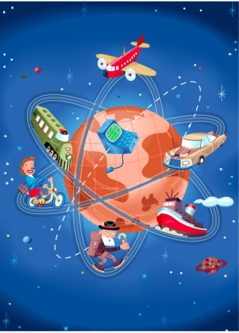
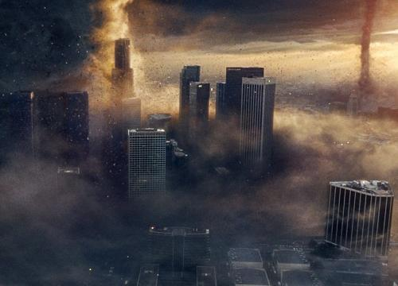
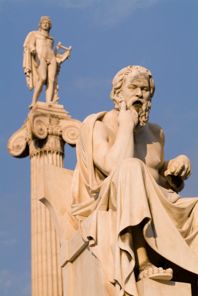

# ＜开阳＞灵性的栖居——对肯·威尔伯《万物简史》相关灵性问题的思考（上）

**面对当下纷繁复杂的众生万象，人们前所未有的面临着历史性的多元化抉择，各种信息扑面而来，“平地”也好，“单向度”也罢，都是对“技术的栖居”的反思与批判。我们的世界真的如此混乱吗？我们将从科学的困境，哲学的追索与宗教间整合三个方面试图寻求缓解之径，最终通向人类不得不面对的“绝境”——“灵性的栖居”。**  

# 灵性的栖居

# ——对肯•威尔伯《万物简史》相关灵性问题的思考

# （上）

## 文/黄帅、代云（合写）（山东师范大学）

 

寻求真理，务必在默想中，而不是在发霉的故纸堆中；寻找月亮，就必须仰望天空，而不是在池塘中。——波斯箴言

机械，理性，单调，空虚，一个个无情的字眼深深地刺痛着我们的神经。20世纪下半叶，尤其90年代以来，人们开始意识到我们正进入一个新的时代，有人称之为“全球时代”、“对话时代”、“生态时代”、“第二轴心时代”。当我在思想上存在困惑之时，偶然邂逅了美国后人本主义大师肯威尔伯的《万物简史》，加之前后阅读过一些相关书籍，再次对灵性等系列问题产生兴趣，心中不禁思绪涌动，汇聚起来，些许思考的结果便欲显现为纸上的墨字。在《万物简史》中，作者用“全子”结构了世界本身，又通过“四象限理论”（行为，心理，社会，文化）来区分世间万物，强化了思想的“上行说”“下行说”“平地说”。但最令我深思的还当属作者在“意识的层级结构论”的基础上弘扬的灵性论。面对当下纷繁复杂的众生万象，人们前所未有的面临着历史性的多元化抉择，各种信息扑面而来，“平地”也好，“单向度”也罢，都是对“技术的栖居”的反思与批判。我们的世界真的如此混乱吗？我们将从科学的困境，哲学的追索与宗教间整合三个方面试图寻求缓解之径，最终通向人类不得不面对的“绝境”——“灵性的栖居”。这一切，就从思考对现代科学危机与批判问题开始吧。

#### 一、科学的危机

最近发现身旁同学都对星座颇感兴趣，心中纳闷：都信那些不科学的东西干什么；然而，当这个念头在我的脑间闪现的一瞬间，我突然间震惊：科学究竟离我们多远？

星座的流行是不是暗示了这样一个事实：科学的萎缩？

自从科学在西方的复兴——启蒙运动以来科学便开始占据了主导地位。确实，在人们的殷殷期盼中科学也结出了累累硕果：哥白尼的日心说、牛顿的经典力学，乃至于爱因斯坦的相对论以及如今正开展的如火如荼的量子理论研究。然而，正所谓物极而必反，矫枉必过正，由正而反易，自反归正难，现代科学，尤其是量子力学的发展使科学本身面临了一个史无前例的大危机。科学似乎要不堪重负了，或者，更确切的说，是人，人的智力不堪重负了。回想科学历史上那一次次的革命，新陈代谢，推陈出新，譬如，相对论本身就是对经典力学的一次局部否定。而条件是有限的，能力是既定的，当我们克服了众多的艰难险阻后，我们发现，我们累了，我们实在是走不下去了。由“跃迁”开始的量子论神秘莫测的百年历程，也将人类认知的方式从已知、确定的宏观世界转向了未知、不确定的微观世界。在“第五次索尔维会议”上，爱因斯坦无奈地抛出了这样一句话：“上帝是不掷骰子的！”然而，信念的力量终究抵不过实验的证实，因而，玻尔的反击显得尤为有力：“你没法告诉上帝该做什么！”

至此，基于“不确定性”这个量子世界的基本法则，科学家们展开了一场旷日持久的大讨论，而“薛定谔的猫”出现之后，物理和哲学界就客观世界和人的意识的决定因素开始认识到：如果人的观测能决定猫的生死，那是否人的意识也会决定客观世界的走向呢？甚至因此引出的“量子纠缠”现象对相对论提出了挑战，惹得爱因斯坦不满地将“量子纠缠”称为“遥远的鬼魅行为”。 而“平行宇宙理论”乃至于霍金的进行“时空旅行”的“虫洞”假想更是深入到了哲学、甚至是宗教的禁区。怪不得有人慨叹：当科学苦苦爬到山顶时，竟沮丧的发现，宗教已经在那儿等候多时了。

想如今，网络上有种所谓的“2012灭世论”调甚嚣尘上，“2012年12月21日黑暗降临后，12月22日的黎明永远不会到来。”但是，根据玛雅预言历法推测，人类的历史将在公元2012年进入新的阶段；2012年仅仅是玛雅历法新纪年的开始，到这时人类在精神与意识方面会发生觉醒及转变，从而进入新的文明，即最近颇为流行的“第二轴心时代”。

对于“第二轴心时代”我不想过多论证，因为关于文明形态的转换问题，前人已经有过不少的论述。神圣几何学认为，从此时此刻起，历史将被重新创造，对善良的人来讲，届时，一个新的男性和女性的种族将开始，同时，对于这种进化地球的磁场也会作相应的调整来应付这种变化，开启宝瓶座的时代。在巴勒特-伯顿的《灵花灵火》中提到，宝瓶座时代（The Aquarian Age)在西方神秘学中被看作是一个重要的转型期。宝瓶座象征人道主义，人类由注重对物质的，科技的层面的进步，逐步将转化为对心灵与灵性层面的探索，找到超越人种，肤色，民族，国籍以及宗教派别的人类心灵的共同点，认识人类的同源性和平等性，从而达到四海一家及大同和平的愿景。所以，我们现在面临的不是毁灭，而是更高程度上的转变。

与其沉浸在浑浑噩噩的怨天尤人中不能自拔，倒不如为我们的进化历程推波助澜。人的进化已然在社会的突飞猛进中趋于饱和，接下来的路程将会举步维艰。三维空间已经不能满足我们的思维远航，于是人类意识的漩涡不断掀起滔天浪潮，从十三维的梅塔特隆立方体到十五维的梅尔卡巴（场），几何学支持下的麦田怪圈如火如荼地越燃越旺……

对于这许多神秘的覃思妙想，我们大可以略作观赏后一笑了之，抽出其中对我们心灵的启示，然后朝着不同的方向扬帆启航。毕竟，这都只是一些“覃思妙想”而已，并不能掩盖其下的科学深层次的动荡。

弗里乔夫•卡普拉在1976年的著作《物理学之道：对现代物理学与东方神秘主义的平行研究》中写道：“物理学与灵性乃同一硬币的两面。”“近代科学不断证明着那些更灵性和更神秘的宇宙观。”因之，科学的危机便不得不引起我们深深的反思，或许，所谓科学，真的只是我们认识世界的一种手段，最后的真实并不一定就是科学，这些，就让我们到哲学中讨论吧。

#### 二、哲学的追索

“哲学就是哲学史。”在思考新时代问题之前，应当对灵性论的来龙去脉进行“谱系学”意义上的考察。既然不能让古来圣哲们还魂后亲口说出无限哲思的玄奥，就不如在恢弘浩淼的思想之洋中躬行泛舟。面对被云烟笼罩的哲学史，我的思绪似乎也润入太虚之中……我仿佛看到了赫尔墨斯神气地眨着两涡水晶般的眼珠，煞有介事地对我如是说——

“自从源自上帝之手的‘宇宙大爆炸’把宇宙从混沌中拎出来，这个世界就开始了它注定的进化历程了。人类的出现是一个奇迹。他们的觉醒则是一种纯粹的偶然。他们从原子到细胞竟然一步步由猿到人，并在杳冥的神话与传说中窥见上帝的启示，在图腾与巫术的演绎中觅得‘万物有灵’的果实，并吃的津津有味。也许是天启，也许是地灵，终于人类开始从纯粹的工具中走了出来，原始的自然哲学久经蛰伏破土而出了。泰勒斯成立了艾奥尼亚学派，神奇的将上帝之思分流成功。循着他的足迹，古希腊的古典哲学，中世纪的教父哲学、经院哲学，继而人文主义复兴，理性思想占据人类价值观的主流。而在东方，中国的百家争鸣奠定了以后的脉络，此后汉代形成的气性论宇宙观推动着中国在实用的道路上渐行渐远；印度佛教的源流一脉相承，从未大悖初衷；肇始于犹太教的基督教在西方的权威也不曾使犹太教逊色多少——各地在‘第一轴心时代’的基础上一路走来，倒也踏踏实实。”

赫尔墨斯忽然神情凝重，继而又说道：“不料，科学的异军突起，打破了这个本来就不该如此平静的平静，哥白尼‘日心说’'的横空出世刺穿了黑暗覆盖下的苍穹。叔本华用唯意志论触及人性无意识的深穴，尼采在超人哲学之权力意志的“铁锤思考”中在心灵领域宣告了上帝的死亡，柏格森在“绵延的生命之流”中将直觉主义推上思想的巅峰，于是，非理性与反传统的思想大潮席卷了整个西方社会。在斑斓多姿的当代思潮中，混乱而嘈杂的后现代主义在纷纷攘攘光怪陆离的当代社会中奇诡地存在着。整部20世纪的历史，被各种思想流相互交织并存。“恶之花”般的象征主义淫荡地散放尸臭与花香，抽象变形的表现主义与自动书写的超现实主义粉墨登场，荒诞怪异的马利涅蒂大呼未来主义的疯狂口号，更甚于有结构主义颠覆了一切经典价值观，人们不再注重对立与融合，而是彻底平面化，狂欢化，存在本身也就失去了一切意义！工业时代与技术主义的泛滥，把大自然的原生态变成了灰暗的生灵地域。消费主义与享乐主义的猖獗，将人性本我的欲望突破了原罪的调解，终于莽莽撞撞地涌上超级城市的浮华街头，力比多冲动恶狠狠地向超我的升华反讽与嘲弄。正如萨特在他的哲学日记中痛心地写道，“我们所有这些人都在这里又吃又喝来保存我们宝贵的生命，实际上我们没有，丝毫没有存在的理由。一旦你认识到这一点，就会使你反胃，晕头转向，这就是恶心……”面对一个令人恶心的现状，人类并没有克服内心的心魔，而是在荒谬的存在中愈发荒谬！在社会领域，马尔库塞无奈地而痛苦地控诉着现今“额外压抑”与“操作原则”对人的单面化，两极严重分化后的社会统治者使人民的爱欲受到压抑，劳动本身被异化。技术的进步使得劳动分工专门化，机器操作单调枯燥，人最终成为既得利益者的奴仆和大机器的工具！在基本压抑与额外压抑的双重压迫下，传统文明模式使得人的正常爱欲得不到积极释放，转而沦丧为原欲本能的发泄！近半个世纪过去了，他呼唤的“整体革命”最终没有实现，转而成为现实世界意义的进一步消解……”

说完这些，赫尔墨斯便掉头就走了。

我开始略有所悟。自从奥古斯丁集教父哲学之大成，西方传统便开始了纯粹超越性的、追求彼岸世界的清教徒似的“上行之路”，保持了一段相对宁静的信仰阶段；而哥白尼之后理性的极端发展使这一思潮成了自己的殉道者，悄无声息地死去，连向隅而泣的机会也没有。于是，相信实际社会和这个存在的世界，逻辑从一指向多，在精神“平地”下衍生出支离破碎的“多元化”、“多样性”。俄狄浦斯、西西弗斯的悲剧被解构为荒谬，希腊诸神、佛陀、真主的脸上无可奈何的涂上了一层厚厚的雪花膏。“下行优势”展露无遗。

波西格在《万里任禅游》中提到：“以纯理性的方式把握生活只会导致疯狂。安宁要求我们寻求表象背后那不可见的品质或真理。”是的，从没有哪个时候比现在的我们面临更严峻的生存困境，自从非理性的存在主义挟裹了上帝的尸体席卷而来，我们便有意无意地坠入一个更大更黑的深渊。存在主义最著名的论断出自萨特：存在先于本质。萨特反对任何人生中“阻逆”的因素，因为它们缩小人的自由选择的余地。假如没有这些阻力的话，那么一个人的唯一的要解决的问题是他选择哪一条路走。随着科学技术的进步与发展，遗憾的是，人们的选择并没有像想象的那样更加容易，反而愈发艰难，在抉择的路上竟至于举步维艰。“技术的栖居”俨然成为了一种常态，人们越来越多的成为了“单向度的人”，异化在劫难逃。海德格尔在《存在与时间》中，对死进行了深刻的分析，他认为，“我将要死”并不是世界中的一个外在的和公开的事实，而是我自己存在的一种内在可能性。按照他的理路，是不是说灵魂的死亡比肉体的灭亡更可怕，心的“不觉”才是真正的死亡呢？“诗意的栖居”在一群群行尸走肉的追捧与意淫下定格为一种莫大的讽刺，海氏的临终遗稿照样被束之高阁。更令人丧气的是，后现代主义的横空出世，开始对前辈们进行幼稚然而粗暴的反叛，一切价值与意义在他们手中被消解、被解构的面目全非。极端的怀疑主义蔓延成虚无主义，集体恍惚下生命颤栗的苇草在狂飙突进中瑟缩，摇摇欲坠。

然而，当初的哲学是这样子的么？我们有必要来了解一下“第一轴心时代”，那时，在古希腊有赫拉克利特、巴门尼德、苏格拉底、柏拉图、亚里士多德等人，在巴勒斯坦有以利亚、以赛亚、耶利米亚等先知，在伊朗有袄教的开创者琐罗亚斯德，在中国则诞生了孔子、老子、庄子等诸子百家，在印度，佛陀释迦牟尼降生……他们几乎同时而相互隔绝地在世界各地涌现。借用雅思贝尔思的话说：“这个时代产生了直至今天仍是我们思考范围的基本范畴，创立了人类仍赖以存活的世界宗教之源端。”这个时代的特征是人通过反思“意识到整体的存在、自我和自我的限度”。

呼应于雅思贝尔斯的理论，一批专家便提出了“第二轴心时代”的理论。二零零五年，又有一批学者齐聚美国开了一个专题会议，把对“第二轴心时代”的讨论更加透明化。我国的王志成教授曾概括第二轴心时代的特征：第一，全球意识；第二，生态意识（M/Other意识）；第三，女性意识；第四，对话意识（他/她者意识）；第五，跨文化意识；第六，非实在论意识（后现代意识）；第七，亲证意识。无疑，这种概括是比较全面因而泛化的，但毕竟给了我们某种指导。其实，近代社会的文明架构（格局）不是“第一轴心时代”的产物，而是公元3—9世纪形成的。公元前800——前200年是诞生时期，而这时各种思想才得以在广阔的层面上传播开来，各种文明大体形成了一个完整的地域格局。

（未完待续）

 

（采编自投稿邮箱；责编：麦静）

 
