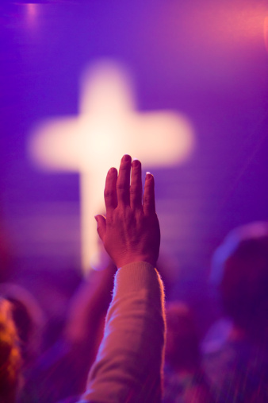

# ＜开阳＞灵性的栖居——对肯·威尔伯《万物简史》相关灵性问题的思考（下）

**也许这便是一次轮回吧。我们终究要重返混沌，重归愚昧，在绽放了极致的智慧之后。科学的困境，在革新的大旗摇动不起时，便只能求诸神的启示——哲学，甚至于宗教了。这样，我们完成了一次小规模轮回——重归信仰。“生住异灭”并不是只适用于佛教的教义，它完全可以引申为一种宇宙间的流转。**  

# 灵性的栖居

# ——对肯•威尔伯《万物简史》相关灵性问题的思考

# （下）

## 文/黄帅、代云（合写）（山东师范大学）

 

#### 二、哲学的追索

从杳冥朦胧的远古时期，人们处在“不觉”的童年时代，正如维科所说，“人们在本质上是一群天生的诗人”，及至宗教化时期，信仰，盲目的服从成了人们的全部，“后觉”过后，人性觉醒，文艺复兴开启的闸门一发而不可收，加之科技引领下的社会发展，人们终于步入“在觉”状态，似乎在这时人们才真正享受到了做人的权利。历史的发展在于否定，在不断的否定中人权越来越多，以至于令我们措手不及，殊不知泛自由就意味着无自由，取消自由，于是，“先觉”者开始蠢蠢欲动。

历史总是在不断地批判与否定中一步步前进的，而另一个我们众所周知的方面就是历史的局限性，总有一天我们会批无可批，否无可否，因此哲学在其历史上才出现了各种转向：从本体论到认识论，从认识论转向语言分析研究，解构中重建，重建中消解，长此以往，艺术消失了，审美疲顿了，为黑格尔作了最忠诚的诠释：“在法律和政治关系发达的现代，时代的平淡无奇使艺术创造狭窄平庸，艺术因而失去了发展的沃土和良好的前景。艺术的地位将走向衰落，艺术的灵魂将走向分裂，其精神最终将被哲学所代替。艺术让位于宗教和哲学，成为理念自身发展的必然。”所以看到尼采重返酒神精神失败的惨烈我们不惊奇，看到马尔库塞“整体革命”的夭折的决绝我们不惊奇，前途横亘着的不是可感的实体，而是虚无的碎片，能够将之收服的必将是一种与众不同的新哲学、新宗教。

到这里，我们便有了一个疑问：像后现代主义这样的发展难道还有延续的必要或可能性？我们需要的是对话与交流。

对上行与下行的结合，对超越和内在固有、对一和多、对空和色、对涅槃和轮回、对天堂和尘世进行平衡成了摆在我们面前的课题；这种对不二论的求索是理所当然的。其实，早在柏拉图，这就已经得到了统一和整合，怀特海有一个著名的观点——从根本上说西方传统是为柏拉图哲学做的一系列注脚——也许他是对的。这种整合在普罗提诺那里也融合的很好，可是之后便遗憾的被割裂了。而我们要做的，便是在继承的基础上再次进行超越性的整合。 

整合从哲学开始。面临毁灭了自己生命的幽灵——机器——福柯提出尖锐的批评。他说，男人和女人，成了“信息的客体而不是交流中的主体”。十八世纪，在唯科学主义期间或之后，“人的科学”兴起，福柯毫不客气的用他特有的俏皮话说人以前从来没有存在过，是被发明出来的，他将这称为“人的时代”，并盼望着人的终结，“我们当然可以打赌，人类就像画在海边沙滩上的一张脸，可以轻轻就被抹掉。”现代性的尴尬，在哲学家里成了家常便饭。讽刺的存在如此广泛——现代性又如此具有讽刺性——克尔凯廓尔的论文做的就是这个题目（“反讽的概念”）。不满于此在的先哲们开始了积极的探索之路。

“长青哲学”认为“实在是由存在和意识（虽然我认为存在是由实在和意识组成的，在此暂且保留）组成的一个巨大的层次系统”。在这个系统中，深度越大，广度就越小。这就对笛卡尔表征范式的二元论提出来挑战。在此又要回到肯•威尔伯的那些观点了。他认为，大宇宙有四隅，左手象限的心理性个体存在与文化性群体存在、右手象限的行为性个体存在和社会性群体外在，它们分别顺应了“三大区域”：真、善、美。不仅如此，灵性阶段也可以如是表示，至高的善便是孜孜追求着灵性的僧众、穆斯林，至高的真即所谓的“法”、“道”、“真如”，至高的美就是佛陀，就是上帝，“不是我，而是基督活在我心中”。

还是太宽泛，让我们转入个体自身去一探究竟吧。在莱布尼茨看来，一切事物的普遍和谐这个事实提供了“关于上帝存在的一个新的证据”。拨开芜杂的纷扰，解决办法只能是是承认有某种原因是存在于这个因果序列之外的。就是说，它必须存在于宇宙本身的复杂组织之外。也就是存在于我们的意识之中，高层次的意识，灵性的意识。我们都是一个个“三位一体”：本我、自我、超我集于一身，“潜意识”（“无意识”的社会性积淀）、“（自我）意识”、“超意识”交相接替。在某个突然的瞬间，偶尔的阙如会不期然间凸现眼前，眼花缭乱间令我们萌生莫名其妙的惊悸，这便是神的战栗、幸福的闪电啊！

怀特海有一句名言：“宇宙沉闷，失去声响，没有色彩，缺乏芳香；只有无穷无尽的没有意义的物质来来往往。”最后，他补充说：“因此，现代哲学垮掉了。”多么振聋发聩的呐喊，“有人半夜喊着说”。面临“后现代”，我们在陶醉其中的同时一定不要忘了回过头来返观内照，“时时勤拂拭，勿使惹尘埃”，抛弃所有的荒谬、空虚、无聊、悲观，因为我们要做的是这样一件悲壮而充满潜力的强大事业：走黑格尔、哈贝马斯、福柯、泰勒他们没有走完的旅程，在平衡这一“夸父逐日”式的劳奔中流浪，流浪到神所在的地方。

#### 三、宗教的整合

信仰的缺失导致哲学的失衡，佛教，基督教，伊斯兰教，印度教，犹太教，甚至于儒教、道教等各宗教的对话便势在必行，存在主义的盲区能够在何种维度上修正，全球宗教哲学必将面临新一轮整合，对远古灵性实在的复归俨然成为了赫尔墨斯的神谕——在我们之后，人们将以什么为生？但我们呢？相信吧，一切都将来临！

关于宗教的起源与演进，早在十九世纪的孔德就提出了线性的宗教进化模型。我们可以这样理解，天之生民，起初是与动物无异的，一切都是自然。然而，天有不测风云，极低的生产力根本抵挡不住各种自然现象的狂轰滥炸，于是先民们由蒙昧转入恐惧，进而敬畏，于是，为了缓和自己内心的敬怖，原始巫术与魔法就出现了。继而出现了“万物有灵说”与图腾崇拜出现了。而随着社会发展，氏族分化，阶级出现，越来越明显的社会化衍生出凌驾于自然之上的神明，我们今天把它称作“人格神”。随着人类的不断觉醒，最早的哲学出现，在哲学与信仰的交感中，原始宗教便应运而生了，在最初的斗争中，无疑，信仰占据了优势，于是，宗教的模型初步固定，并在一代代人的“集体无意识”中延绵至今。

宗教的最大特点就是它规定了一种信仰，无论是一信仰还是多信仰。“神”则是宗教生活的灵魂，它“可以被粗略地理解为这样一种存在，它对于信仰它的人们具有终极性，而且这种终极性会直接影响乃至塑成这些人的生存方式”（张祥龙语）。宗教学的创始人麦克斯•缪勒说过这样一句话：“只了解一种宗教的人，其实什么宗教也不了解”。这就暗示我们只有经由宗教间的对话并从中开拓出相应的思想与精神，才是宗教未来发展的正途。

早期宗教在世界各地陆续形成，具有无可争辩的普遍性。哲学家休谟本身是个积极的怀疑论者，但对于宗教的普遍性，也未说能找到一种毫无宗教的人，“你去找一种与宗教完全脱节的民族吧，如果你能找到的话，他们和野兽总还差几分。”

早期的基督教吸收了希腊哲学的概念（尤其是新柏拉图主义和亚里士多德主义）来论证教义中的“三位一体”，对于基督教的正宗而言，神或上帝有三个狭义的位格：圣父、圣子（基督）、圣灵；但它们却只是一个实体的不同表现。因而就广义的位格而言，上帝只有一“位”。在这里，基督教的“神”是一种有实体性的人格神。从某种意义上来说，神的实体与神的人格代表了基督教教义中的希腊哲学成分与那出自原始基督教体验的成分；两者既相互冲突又相互需要。当两者强烈冲突到相悖或分离时，“异端”便出现了。对此，上帝也不是毫无察觉，上帝就曾经对摩西说：“除了我以外，你不可以有别的神。”而旧约与新约则进一步对此加以规制，“约”正表明这人格实体神与人的关联的外在性，即这关联需要契约和证据来保证。

印度从地理上位于西方（欧洲-地中海）与中国之间，在思想和宗教形态上也是这样。他们信奉的神，所理解的神性，特别是表达这种理解的方式具有某种实体性，但其根底处却是非人格实体性的玄冥领会。麦克斯•缪勒称这种信仰形态为“择一神教”，在此当中，“吠陀诗人总是充满了生存的主动势态和终极敏感地去体验那给予了万物以光明和生命者”（张祥龙语）。吠陀文化繁衍出宇宙神人共荣共存的原则，把形式上的“三位一体”实质化为物质（时空）、理智（意识）与神秘（永恒），为了达到永恒，献祭成为他们独特的发展方式。他们这种不愿受制于实体神性观和观念（名相）思维方式，深刻而广泛的体现于《梨俱吠陀》中的“创生歌”（“无有歌”）以及后来出现的《奥义书》中“梵我为一”的洞察。

而在有着悠久历史的华夏土地上，从万物的源头“太一”开始便蒙上了一层神秘的色彩。在中国文化中，世界从混沌走向杂多，进而阴阳，进而无形，一步步去神秘化，一步步走向有序。在中国，“天"的地位（而非其本性）就相当于西方文化中的上帝（耶和华、真主），也被视为塑造人的生存形态的终极力量。当然，本性上中华文化中的“天”越来越倾向于伦理与政治。因此，关于宗教的因子，还是要从先秦，尤其是上古初期去找。

然而，现实的问题是，各宗教在现代性话语中的相同命运是：独尊地位的丧失。在宗教领域，世俗化和神圣化之间一直存在张力和斗争，但人类的世俗化进程不可阻挡，到了20世纪，世俗神学得到了很大的发展，而到了后现代，原初的局面更是被无情的扭转，世俗神圣化，神圣世俗化。在“力比多”横行的当下，形式远远大于实质，而那些本来属于根本的实质性内容却仅仅零星地散见于少数知识人的高头讲章中。在现代社会中，知识人的信仰形式和实质与大众信仰日趋分离。因之，我们需要从文化社会学重审各宗教的意义。传统的信仰形式转换为现代性的信仰形式的标志之一是：信仰方式由集体性转换为个体性，即信仰的私人化。正如刘小枫所说，在中国，“一旦作为意识形态全权话语的历史理性主义的权力话语式微，信仰言述的个体性就会加倍增强，以致现代性的信仰语境——多元主义的出场不可推拒，已然可见的是：汉语知识分子的信仰定位的语境在相当程度上已与欧洲知识分子的语境相一致——信仰的私人化和信仰语境的多元化。”在现代性的多元信仰语境中，信仰的语境伦理至为重要，其伦理原则是：宽容和交互理解。而我们要做的，就是再从私人化回转回去，在宗教宽容中达成宗教间的和解，进而融合。

其实各宗教相同的本质先天上就决定了它们的和谐共融并非天方夜谭，“爱”是它们共同的主题；而哲学共同的主题是情与理，把这一切整合到宇宙视野，纳入灵性实在的包容体系，或许是我们唯一的出路；杞人忧天未必是一件理应指摘的荒谬，关键时刻，夜半虚前席的鬼神问甚至是一件关乎生死存亡的道途，一座诺亚方舟。

在这里，我们再次要强调一个名词，“灵性”，其实在之前的探讨中，我们已经无数次的触碰到它了。最后，就让我们一起遨游于灵性的海洋。

#### 四、泛舟于灵性

灵性是一个很古老的词语，然而，它的“意向性显现”却是最近的事情。“灵性的”（spirtual）缘于拉丁词“呼吸”，这是每个人最普通也是最自然的功能。因之，“灵性经验绝非稀奇古怪的东西，而是真正是我们真正成为人的东西。”（巴勒特-伯顿语）我们可以回溯一下灵知主义，灵知主义（Gnosticism）即诺斯替主义，是对人类处境的一种独特类型的回应，它的思想原则和精神态度普遍地存在于历史的各个阶段。把gnosis意译为“灵知”，相应地把Gnosticism译为“灵知主义”，这是刘小枫提出的一种意译。诺斯替宗教在晚期希腊活跃，是一种神秘、属灵的救思思想，它的救世论是灵知救赎神学的目标，而终末轮则指出，它们关注的不仅仅是包含其所有危险层面的“灵魂超升”的个体终末论，不仅仅是最终进入“安宁”与“光明”的希望国度的必要保证，而且还关注宇宙范围内的一个终极时间（所谓普世的终末论）。灵知主义，在某种意义上，确实可以成为我们建构灵性存在的一种有效凭依。1945年一个埃及农民的偶然发现让近两千年前的《纳克•哈玛狄经书》重见天日，我们希望的便是更多的人能够认识到这种思想进而循着沃格林与布鲁门伯格的步伐继续走下去，一直到某种中意义上的终极阶段。

还是要回到肯威尔伯这里。他把这种终极阶段称为“不二神秘体验阶段”，将灵性思想最终升华到“欧米伽阶段”，而超个人心理学认识到人的精神之路是多样的，每个人都不是绝对独立的个体，而是属于“大我”，并植根于“大我”的，因此，人的使命不只是人本心理学所强调的自我实现而已，人还需要自我超越，实现灵性的完成。

其实，从上面的叙述我们也可以感觉出来，所谓的灵性存在，在形式上便是人类各种思想的交流与整合，有关科学，有关哲学，有关宗教，更本质意义上说，是有关人类。同时，它在超越了它们的前提下又深深的扎根于它们，在这样一个共同体之间形成了一个良性循环。我想，经历了这么长时间的“正”“反”之辩，应该到“合题”的时候了吧。当然，这种“合题”要远远超脱于黑格尔的辩证哲学。

也许这便是一次轮回吧。我们终究要重返混沌，重归愚昧，在绽放了极致的智慧之后。科学的困境，在革新的大旗摇动不起时，便只能求诸神的启示——哲学，甚至于宗教了。这样，我们完成了一次小规模轮回——重归信仰。“生住异灭”并不是只适用于佛教的教义，它完全可以引申为一种宇宙间的流转。

灵性，是神启的智慧，是流落民间的传说，是鸿蒙之初就已经规定了的“潘多拉魔盒”（灵性之后便是另一个轮回，但至少我们可以享受无比欢愉的“濒死体验”）。存在之为存在，就在于一切都是惊险曲折的，一切都是向死而生的，一切都是偶然规定下的超然发挥，这之下的所有值得我们去游赏，去体味，去创造出接近于神的力量，宇宙的奇迹。

 （全文完）  

（采编自投稿邮箱；责编：麦静）

 
