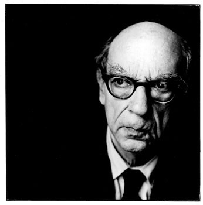
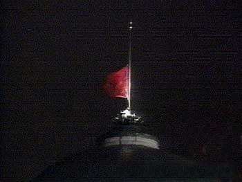
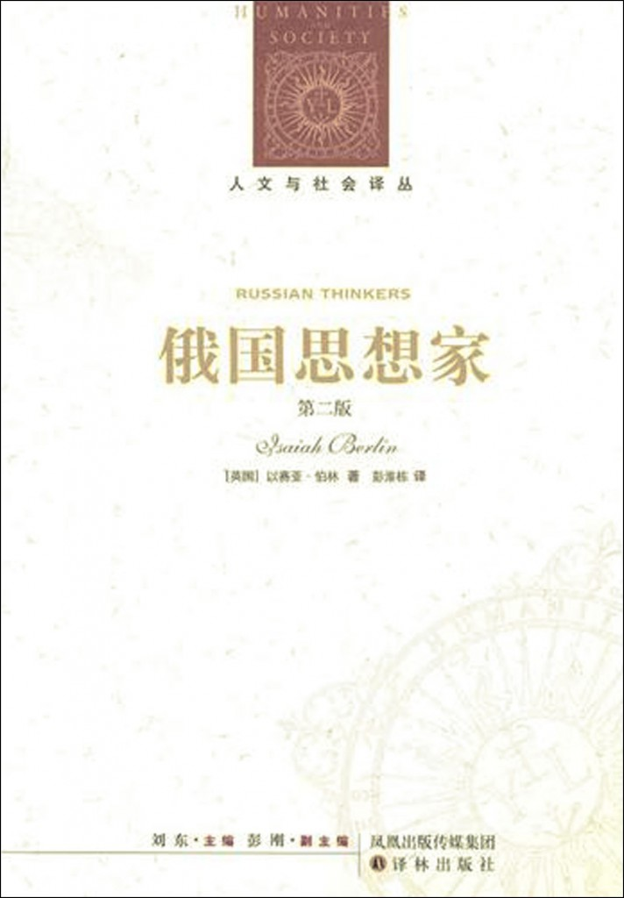
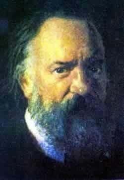
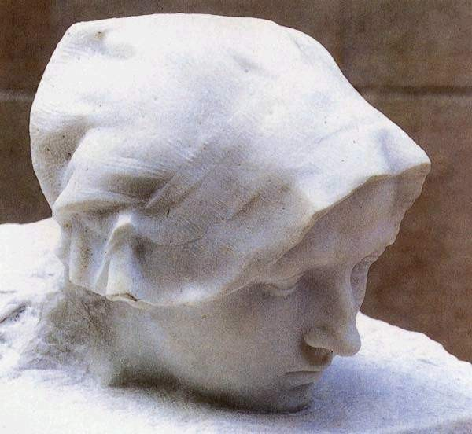

# ＜开阳＞狐狸的尖刺——伯林与俄国思想家

**如果从《俄国思想家》所表现的这种巨大的冲突，反观伯林自身受到的赞誉和攻击，我们就能更深刻地了解到，这个问题绝非停留在19世纪的俄国，甚至绝非停留在孕育巨大变革，思想冲撞剧烈的时代或国家。对于知识分子来说，勇气和明智的二难选择时刻回响，未曾消歇。不仅当年屠格涅夫被保守自由派和激进民主派都视为叛徒。伯林身故之日，20世纪将尽之英美，左右两方对他俱有攻讦。**

# 狐狸的尖刺——伯林与俄国思想家

## 文/ 刘温克（清华大学）

 二十世纪汹汹去也，留在世人记忆中的并不淡红的血色与实非微漠的悲哀难以道尽。据说，这个世纪实际上只发生了两件大事，其一，全球化，其二，共产主义试验了，失败了 [1]。又据说，两个因素塑造了二十世纪的历史：科技的发展，以及意识形态的风暴 [2]。无论如何，至少从表面看来，二十世纪是各种“理论”大行其道，并以莫之能御的力量影响现实的时代。似乎人们脑中的东西左右了历史进程，所谓“思想英雄的战场”，从精神层面形而下之，成就了真正血流成河的战场。这方面，或许17世纪以自己的呐喊催生了法国大革命的启蒙哲学家们都要自叹弗如。于是，继承和掌握理论的人，宣扬和反驳思想的人，就其最宽泛的定义而言，思想者、知识分子或“先知”，似乎成了真正的大人物。如今那个时代赫赫有名的人物已大多鞠躬谢幕，留下一片混乱的版图，有待后人验收。 大概也正因为如此，二十世纪最让人印象深刻的洞见之一来自思想的自我反思，或者说，“关于观念的观念”。而论到在此领域的影响，或许无人能与以赛亚•伯林爵士相颉颃。一方面，是伯林以其精微的洞察点破了时代的隐痛，赢得鹊起声名；另一方面，不可否认，燃起对思想史的空前兴趣（尤其在英美学界），伯林的独具只眼、汪洋恣肆功莫大焉。作为学者和知识分子，伯林具有令人钦羡的独到优势。他几乎亲历了他时代的所有巨变，且与大批叱咤风云的人物亲接，可谓阅尽世事。与此同时，他又具备财富、闲暇、友谊和亲人的庇护，虽有时困于赢得同行尊重，终其一生仍安稳平静，从容优游文字。他是牛津名教授、英国情报官员、犹太复国主义的推动者、卓有成效的学术机构领导者。他的血统、教养和自身见解熔铸多种视野，个人经历引导他穿越历史与学科界限，得出独到结论。虽然其研治领域在英美思想界的主流之外，然而他也曾致力于日常语言运动、熟悉逻辑实证主义，而英美系的著名哲学家罗尔斯、泰勒等都自承受惠于他的思想。如果套用他自己的著名论断，从涉猎的广度、议论的范围和听凭兴之所至，不受范畴和形式拘牵的风格来看，伯林无疑是一只出色而讨人喜欢的狐狸，然而，从他始终回应时代的理智吁求，寻找对现代诸多灾难的反思来看，他在某种程度上，又可算得上是一只咬定要害问题刺猬。 

 似乎与他身兼俄国、犹太、和英国三种传统相对应，伯林的学术也有三个最富影响力的方面：对一批（以俄国思想家赫尔岑为首的）思想家的再发现，对价值多元论的强调，以及对“消极自由”和“积极自由”概念的澄清。此三者中，关于俄国思想家的研究或许锋芒不显，没有余下两项那样“商标”式的效果，然而若将伯林的思想和生平合观，却堪枢纽所在。与学院派学者不同，伯林的所有著作中，风格和视角是主导的方面，对象和论题则提供发挥的舞台以及对其本身思想的激励。是以他与某个题目的相遇，禀赋倾向的驱动至少与理论逻辑的引导并驾齐驱。他真正的著述生涯始自1939年的《马克思传》（Karl Marx: His life and environment），正是循此线索，伯林从浩如烟海的俄语文献中发现了普列汉诺夫和赫尔岑，并从前者追踪到了启蒙思想家 [3]。从启蒙主义再次出发，又迂回到浪漫主义，而他关于自由和多元的许多著名论述，与他对赫尔岑、托尔斯泰、屠格涅夫等人的体悟息息相关。伯林在时代和国别的二维平面上纵横捭阖，而俄国思想家为他提供了出发点和最凝炼的样本，任由他操练自己精微的分析和明澈的意见。不宁唯是，他身为俄国革命的流亡者，活跃于冷战时代，理解俄国的现状和历史，种种可能与不可能，也是他自我观念的重要部分。在此，他的思想与生平交织最密，其论述自然有一番韵味，非他人可比。 柏林最早的编辑之一艾琳•凯利（她与亨利•哈代共同编辑了《俄国思想家》，这是后来使伯林摆脱“沙龙学者”之讥的系列文集中的第一部）将伯林的方法概括为“注意其人如何‘体行’（live through）观念以解决道德要求” [4]。伯林深刻理解且同情俄国知识阶层所面临的精神困境，故能明了他们面对那些问题提交的答案，无论是他所激赏者，还是他所不取者。俄国观念史充满了戏剧化的冲突，而这种冲突与其说是俄国民族特性使然，不如说是由于时代的拨弄，西方思想及其危机在相对较短的时间内相互碰撞。俄国的故事并无太多独特之处，而只是西方那个故事的精华缩编版。于是，伯林治俄国思想的方法和结果，也可推而广之，甚至反躬自问。事实也的确如此。一俟伯林归于道山，他的形象也就进入了思想家的万神殿，供后人参悟揣摩。伊格纳季耶夫在他身后即出版了《伯林传》（Isaiah Berlin: a life）,为满足这方面的兴趣提供了材料。伯林自己无疑属于俄国思想家中诸人那样，有问题意识，并回应时代的知识阶层。那么，或许应该问的是，在他对与自己声气相通的这个群体作了持平公允而慧眼独具的分析之后，我们对“俄国思想家”的问题还能够再说些什么呢？对伯林本人的评价，后人又能在他惊人的自知之明外增益什么呢？ 

 《俄国思想家》并非专著，而是一组长短不一的专题论文，其中有特写，亦有群像。而若仔细区分，能入伯林法眼的是两类人物，一类以其能眩众目的口才、热情、行动和道德追求影响广大人群，而自身的思想或浅白，或矛盾，或庞杂，或纯然袭自他人，一句话，并非以思想的独创或精微，而以对思想的精彩阐述、不懈追寻留名青史。另一类则独擅深思，看穿要害，而可能并不曾大声疾呼，也没能赢得广泛的支持。他们可能在其他的领域影响甚大，但其思想成就不是为人误解，就是遭受贬斥。然而，这后一类人的价值更加持久，更加深远。在混乱而激动人心的时代，第一类人光芒耀目，第二类人可能不免孤独。如果以别处的例子参照，第一类人可能如启蒙运动中的伏尔泰，第二类人可能如卢梭。对于能够影响现实的知识分子或思想家来说，除此二者，其余盖皆不足取。 俄国思想家中，巴枯宁、别林斯基、车尔尼雪夫斯基和其他不同派别的民粹主义者，无疑是煽动家、道德偶像、行动者，但他们的思想并不值得反复玩味。他们的事业在纯粹的思想之外。伯林论述这些人，与其说是分析其思想，不如说是展现其时代和渊源：这些人回应了怎样的困境，迎合了什么潮流，或者开创何等风气，又有怎样的后来者，等等。然而对于他们的思想实质，伯林并不非常看重。如《赫尔岑与巴枯宁论个人自由》在两相比较中，判出赫尔岑的深邃和巴枯宁的浅薄不啻霄壤。又如《辉煌的十年》论别林斯基，重在拈出别氏的道德姿态和对后世激进分子的榜样作用；再如《俄国民粹主义》历数“新一代人”如何在1848年反动势力大胜后的压抑与背叛中成长起来，而对其主将车尔尼雪夫斯基，却直指其“简单”、“天真”。而另一些人，托尔斯泰、赫尔岑和屠格涅夫，虽然大多数时候被看成文士、怪人、流亡革命家，在他们体裁多样的著作中却隐藏着最深刻的洞见。伯林首先发现，托尔斯泰是一个思想悲剧的受害者：他的“现实感”让他明眼看穿世事多样，所有自诩包罗万象的理论都是骗局，而他却同时毕力追求一个单一的终极真理。赫尔岑在思想领域虽不为人所识，却具有“独一无二”的政治观念，“敏锐且具备先知之见”，他推崇个人自由，厌恶普遍道德原则和宏大概念，却能为反对专制献身奋斗。屠格涅夫常常只被当作纯粹的艺术家，却对社会现实和自由主义的思想困境有最敏锐的洞察和最精当的描绘。伯林倾注在后三个人身上的同情和敬意，要远胜于他对巴枯宁、车尔尼雪夫斯基等人的含着贬抑的敬仰。 在这三位之中，伯林的倾向去取，是可借之探寻他本身思想的金针，而他的思想和际遇在这个问题上交响共鸣。他的倾向不难观察。艾琳•凯利在《俄国思想家》的导论中言之凿凿： “……他与谁最相共鸣，实无可疑。他彰明，托尔斯泰道德壮阔，然当其委弃他艺术上的人性慧见而取专制凌人的独断教条，其盲目无明，亦令人可厌；屠格涅夫慧眼清明、睿智颖悟、善感于现实，却正缺乏他所景慕的激进知识分子的勇气与道德献身……他最感亲切相得者，殆为赫尔岑。……赫尔岑有屠格涅夫的精微慧见，其为真理而自我牺牲之奉献，则堪与托尔斯泰相仿……他既勇敢且文明。”[4] 

 伯林对赫尔岑和赫尔岑式人物的敬仰喜爱自然是溢于言表的。他把赫尔岑视为知识阶层的英雄，而他在当代的传人则是苏联科学家安德烈•萨哈洛夫。他说，“萨哈洛夫是知识阶层的典型代表……他的声音就是赫尔岑及其伙伴们的声音，经历了那些可怕的年月而奇迹般地保留了下来。” [5]伯林崇拜萨哈洛夫，并因结识他而自豪，但他自己无疑从未能成为萨哈洛夫那样的人。景仰则已，他继承的并非赫尔岑的衣钵。据他的传记作者伊格纳季耶夫观察，“随着六十年代的过去和七十年代的到来，伯林越来越对屠格涅夫感到认同” [3]。《俄国思想家》中的压卷长文《父与子》，既是为屠格涅夫辩护，也是为他自己洗脱懦夫的骂名。 但是说到底，伯林像他自己笔下的谁，有什么重要性可言呢？或许这个问题可以换一个问法，伯林可以不像屠格涅夫，而如他自己所愿，仿效赫尔岑么？是不是伯林如果更有勇气，更坚强，加上时机和环境，他就能具有萨哈洛夫的品质？如果他可以，他会不会损失他作为我们所见的伯林所拥有的智慧、公正和锐利目光呢？ 伯林论述托尔斯泰、赫尔岑和屠格涅夫，无意中（或有意而未点明）给出了一个思想的谱系的三个耀眼坐标，在这个谱系的一端，是渴望专一、体系化和热烈的信念和与之相伴的思想上的确定无疑，另一端则是追寻经验主义、个人体悟、对消极自由的尊重和与之相伴的犹豫不决，无所适从。无疑就气质而言，前者刚烈而崇高，后者优柔而精细。然而伯林未曾指出，或许也是不愿点破，前者的增加必然伴随着后者的减少，反之亦然。伯林笔下的屠格涅夫批驳赫尔岑对俄国农民淳朴本性的迷信，然而本已深具怀疑主义，拒绝一切宏大概念召唤的赫尔岑，所以能乐观、坚定、百折不挠，其凭借者无非这一丝毫无道理的信念。如果善感现实的屠格涅夫所说的是对的（从语调上看，伯林似乎赞同这一观点），那么赫尔岑只是由于不够明智才得以勇敢，他与孜孜于一个无所不包的答案，而近乎走火入魔的托尔斯泰，其偏见障目，只有程度的差别而已。这已不仅仅是价值多元，美好的目标难以共存。价值的冲突可在某种保证（伯林提出这种保证就是自由主义）下得到折衷解决，而不至于消灭彼此，而此处两种各擅胜场的气质或说类型，则你死我活，无法调和。价值之间不相容是不可逃避的悲剧，而勇敢与明智、热烈与审慎如果不仅不相容，而且互斥且此消彼长，难道不令人绝望？这个结论，伯林本人是不能认同，还是不忍说出呢？ 如果通过阅读《俄国思想家》得出的这种猜测是有道理的，那么，伯林就只可能像屠格涅夫，并且由于他的时代、他的性格、他更加清明的视野、他对谱系另一端那些心智诱惑更强的抵抗能力，他是比屠格涅夫更加屠格涅夫。如果他能比我们所见的勇敢一些，那么必然因为他具有一些坚定信念，而此般信念在那软弱些，却可能更明智些的的伯林看来，或许就近于妄诞。伯林为人称道的持平、审慎和自知之明，或许就不仅伴生了软弱胆怯，而是直接导源于这种软弱和胆怯。如果是这样的话，要求伯林在他的时代做一个萨哈洛夫，甚或伯林自己敬仰赫尔岑，以为自己的人格榜样，是合理么？道德是否优先于认知，具有道德勇气的行为，即使不甚合理乃至盲目，也应当比洞穿世事的畏葸不前更值得尊重？ 

 如果从《俄国思想家》所表现的这种巨大的冲突，反观伯林自身受到的赞誉和攻击，我们就能更深刻地了解到，这个问题绝非停留在19世纪的俄国，甚至绝非停留在孕育巨大变革，思想冲撞剧烈的时代或国家。对于知识分子来说，勇气和明智的二难选择时刻回响，未曾消歇。不仅当年屠格涅夫被保守自由派和激进民主派都视为叛徒。伯林身故之日，20世纪将尽之英美，左右两方对他俱有攻讦。而镜头拉近我们自己的语境， 朱学勤先生不是在感叹“伯林去矣”之后，诘问“思想家为什么生活在表层” [6]？而二难之间的出处行藏，能得到什么外来价值的判断，或是外在建构的保障么？如若有的话，会是什么？如若没有，那么如此众多的责备、赞扬，那些思想的力量和纤细间的差异、启蒙大众或执守学院的相互轻视，那种可能演变成傲慢和冷漠的明智和那种显出狂躁和非理性的勇敢间的选择，难道也是一场“诸神之战”？在这里，调和的态度本身也落到了争论的谱系之内，又有什么来保证“多元”是对的，或者“多元”应该让位于“一元”？ 伯林在《俄国思想家》中，可谓知人而能论世，而由此揭发的问题中，他又可谓言传而兼身教。伯林善于提出问题，远强过他解决问题。或许正因为他看到的问题太根本、太险要，太关乎自身，他才拒绝回答。伯林没有体系，或许不是因为他没有建立体系的能力，而是他的教导、意见和评论，根本不可能成为形式体系。他服膺赫尔岑那种现实的态度和怀疑的精神，“不信任谁能自称在任何人类行为领域的事实或原则问题上拥有颠扑不破之知”。或许我们不该向伯林寻求一以贯之的解答。不过伯林这只狐狸，终究还是有一根尖刺。即如本篇管见，伯林对俄国思想家所做的带有自我辩护意味的分析，连同他的生平所展示的现实图景，分明指向了他一生反复申说的“选择悲剧”。至于此现实的选择情境中，伯林的选择应如何评价，其他人又当如何行事，则言人人殊，亦非仅读伯林著述便能够解答得了。 

### 【注】

[1] 龙应台语。 [2] 伯林，《理想的追求》。Isaiah Berlin, The pursuit of ideal, the crooked timber of humanity. [3] 伊格纳季耶夫著，罗妍莉译，《伯林传》，译林出版社，2001年。90页。 [4] 伯林著，《俄国思想家》，译林出版社，2001年。导论：2页。 [5] 《伯林谈话录》，译林出版社，2002年。168页。 [6] 朱学勤《伯林去矣》（收于《书斋中的革命》）和《为什么生活在表层》。关于伯林的地位和其未能建立体系的讨论，亦见钱永祥《我总是活在表层上》，《读书》，1999年第4期。 

（采编：陈锴；责编：陈锴）

**喜欢本文就把它推荐到：** 分享到人人 {var d=document,e=encodeURIComponent,s1=window.getSelection,s2=d.getSelection,s3=d.selection,s=s1?s1():s2?s2():s3?s3.createRange().text:'',r='http://www.douban.com/recommend/?url='+e(d.location.href)+'&title='+e(d.title)+'&sel='+e(s)+'&v=1',x=function(){if(!window.open(r,'douban','toolbar=0,resizable=1,scrollbars=yes,status=1,width=450,height=330'))location.href=r+'&r=1'};if(/Firefox/.test(navigator.userAgent)){setTimeout(x,0)}else{x()}})())

推荐到抽屉
