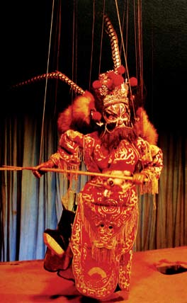

# ＜开阳＞独立思考与强迫症

**如果上古时期有一位大圣人，把天下所有的道理都讲透了，所有的知识都研究了，那我们今天活着还有什么意思？反而发明了儒家的孔孟倒都是懂得独立思考的能人，却不知道这些个老夫子为什么没学了去。正是因为有孔子、孟子、荀子、董仲舒等人独立思考的坚持，儒学才有了继续发展的动力，才能始终顺应时代的潮流，从这个角度而言，独立思考的精神，恰恰是思想进步的动力。 **

** **

# **独立思考与强迫症**

    

## 文/李路（东北师范大学）

 

# 

### **一**** **

 秦汉时有这么两个人，一个叫嬴政，他搞了一场思想大整风，烧了一些书，杀了一些人，顿时思想文化界一片肃清，全国上下只响着一个声音，也就是始皇帝的声音。后来证明这套做法行不通，于是汉武帝出现了，他采纳了董仲舒的经学体系，罢黜百家，独尊儒术，全国上下只流行一种思想。秦始皇要灭绝思想，汉武帝则只准许一种思想，于是秦始皇失败了，汉武帝成功了。但在我看来，尽管这两个人成败有别，但本质一模一样，他们的行为逻辑出奇一致的蛮横，就是：只准你听我的，不准有自己的想法。在他们看来，人人都应该是一头骟掉的驴——我们都知道要是驴没别骟掉，春天就会到处找母驴谈恋爱，找不到母驴的时候它们的叫声很难听，而驴除了干活，就不应该会别的什么了。除此之外，他们还要给驴套上辔头，戴上嚼子，屁股后面还要按一个粪兜，这样控制起驴来就显得很方便，你让它往东，它绝不往西。如此一来，天下就变成了驴国——人还斗不过一头笨驴么？ 

妄图控制他人的思想，是我们传承已久的恶习，有时达不到目的，还要去强迫别人，甚至剥夺他人的生命与自由。比如《左传》里说：“非我族类，其心必异”，我们的祖宗总怀有一种莫名其妙的危机感，认为他国总是心怀叵测，总想着要去讨伐别人。这句话还有一层意思，就是总认为我们的文化高人一等，因此要拯救蛮夷于水深火热。可是问题在于，既然非我族类，你又怎么知道别人想的是什么？不了解就先入为主，这种动机就很让人怀疑。不惟中国，西方也有一些这样的例子，比如欧洲的十字军东征，因为耶路撒冷不信基督了，所以罗马教廷要去讨伐伊斯兰，而且还要迫害犹太人。如果说为了收复宗教失地这个理由还算勉强，那教皇的一句话就显得很没格调，他说：“耶路撒冷是世界的中心，它的物产丰富无比，就像另一座天堂。在上帝的引导下，勇敢地踏上征途吧！”原来就是要去抢别人的东西！在我看来，无论是《左传》还是罗马教皇，这些话语中的潜在逻辑都是一样地无礼：那些别国的驴没被骟，我们要赶紧去骟了它们。 我要是汉武帝或者罗马教皇，也许我也会想要去骟掉驴——毕竟如果所有的驴都听话，那就好管理得多，儒家思想和基督教就是骟驴刀。基督教道德的第一要义是必须爱至高无上的耶稣，这就是说，如果信仰上帝，这就是最高的道德，反之则是没有道德。而儒家则是拼命的要别人接受那一套道德铁律和伦理金条，你要是不接受，就要千人所唾，万夫所指。但问题在于，我们从来没有想过要问一问驴到底愿不愿意被骟，说到底我们都没有权利代替驴行使自己的意志。如果驴会说话，我敢和你打赌，它们多半会说不愿意。如果我们要强行去骟掉它，还告诉它被骟好，那就跟虚伪的强盗别无二致。 我们总想着要把自己的意志强加给别人，对他人思考的自由豪无尊重。比方说，古时候的小孩子都要背四书五经，可是教书先生们除了告诉他们这是子曰的，却从来不告诉他们为什么要接受这些理论，当然你让小孩子去理解也很有些困难。但对于我来说，如果你仅仅告诉我这个东西是某人说过的而因此要接受，即使说这话的人非常了不起，我也会充满怀疑。对于一种信仰、一套理念、一个道理，我非得要明白它是什么意思，知道他好不好，我才会选择去接受还是不接受。如果我不想接受它，而你却强迫我接受，那我就会认为你是在把我当成驴，想要骟掉我，因而我就难以对你产生尊重。在我看来，你可以说服我，但不能强迫我，如果我心悦诚服，那我们就是一条道上的人，如果我不同意你的观点，而我也无法说服你，那就大路朝天。今天我们都知道自由爱情的可贵，可是古代我们往往歌颂的是贞洁烈女，鼓吹的是三从四德，好像寡妇如果再嫁，天就会塌下来。我读野史的时候，常常会看到一些老夫子痛骂一些女子不守妇道，竟然敢去自由恋爱。后来又看了《列女传》里的一个故事，说是有一个妇女，丈夫死掉后就发誓不嫁了，后来觉得这样还不够，就把头发都剪掉了，然后觉得还是不行，就割掉了鼻子，再然后觉得还是不够表达心情，就又把眼睛挖掉了一只，才终于觉得差不多了。周围的人见了都拍手称赞她，作者也说此为真贞之烈女也！我读过之后只觉毛骨悚然，如果一种文化反自由到了这种地步，甚至要人不加思考的伤害自己，不仅仅是反智慧，更是反人性。这当然是一个极端的例子，毕竟即使在古代，女子为了守妇道就要自残体肤的也实属罕见，但基于我恶意的推测，我基本可以想象出这位妇女接受这种道德观的过程究竟是怎样的——因为天下只有一种道理。我知道太多这样的人，他们往往不愿意接受其他思想，还特别看不得别人的自由意志，而且不愿意讲道理——如果只有一种道理，就是不讲道理。一些西方的传教士，总是不厌其烦的要我参加教会，你要是拒绝他，他立刻摆出一副神棍嘴脸，说些什么主不保佑不爱主的人的屁话，回头还要找你。在我看来，这样的人，才最应该被骟掉 

### **二**

中国知识分子往往有一种以天下为己任的理想情怀，总想着要兼济天下。宋代的张载就说他的人生理想是：“为天地立心，为生民立命，为往圣继绝学，为万世开太平。”这种思想境界很高，有一种囊括寰宇的气势，像我这么狭隘的人就说不出。很多时候我考虑的是怎么能把自己活明白，还没有闲心去关心别人怎么活，因此这种使命感我还不具备。我想，人生而在世，有一种使命感是好的，比方说这句话里说的要继承往圣绝学。但如果这种使命感是要去拯救别人，就很值得怀疑。我们实际上都不知道别人过的到底好不好，倘若人家其实过的不错，你又要去拯救别人什么？有人会对这种拯救感激涕零，但要是拯救到我头上，他一定自讨没趣。我要是生民，我保准会跟张载说，老子又不是你生的，你凭什么给我立命！这句话里还有一种野心，就是要为天地立心。在我看来，这句话最蛮横无礼的地方和秦始皇、汉武帝是一个得性，就是想这个世界上只有自己的声音，当然这样一定太平。出于这种思想，我们往往愿意去灌输别人，强加自己的价值观，自己觉得好，就要别人也觉得好，这种逻辑很缺乏对他人的尊重，犯了强迫自己也强迫别人的病，也叫强迫强迫症。 有人说，如果一种思想确实是好的，那么强行灌输给别人也没什么不好，如果他当时不能明白，等以后懂的时候，他会感激你。可问题在于，在我们灌输他的同时，也就断送了这个人其他的可能性。在我看来，每个人都应该有选择自己人生的自由，每种价值观都各有千秋，我们实在没有权利这么做。如果说对方是一个有自己思想的人，那么这种强迫尚算公平，而如果对方是一个是非不分的孩童，那么这种强迫就好像趁人之危。有人说，正因为孩童是非不分，所以我们才要帮他树立正确的价值观。这句话很有道理，但问题在于，我们到底要把自己的价值观强加给他，还是要教给他独立思考的本事。在我看来，后者要重要的多。 其实我很能理解他们的担忧，但这种担忧未免有些杞人忧天。为了说明我的观点，我要讲下面一件事。 英国有个怪老头叫洛夫洛克，有一次，他在电脑上模拟了一个全新的地球，这个地球上只有两种生物，一种是白色雏菊，一种是黑色雏菊，所以这个地球又叫雏菊世界。这个世界是这样运行的：我们都知道一件物体是白色是因为它反射了所有光线，反之要是吸收了所有光线，它就是黑色，白色会反射热量，而黑色会吸收热量。这个电脑中的地球就是在白雏菊和黑雏菊对热量的反射与吸收中达到了一种奇妙的平衡——黑雏菊多的时候，气温上升，于是黑雏菊被热死了一大批，这时白雏菊开始大量反射热，气温下降，黑雏菊再度活跃，气温又上升，黑雏菊又热死了一大批，白雏菊又出现了……如此循环往复下，气温就始终在一个恒定范围内徘徊，而星球上的物种也是在如此的此消彼长下达到了生物和谐。这个怪老头后来又往这个地球里加了兔子、狐狸、狼等其他生物，结果发现除了在一开始产生了一些混乱之外，生物种群系统最后无一例外都达到和谐了。 

在我看来，人和这个雏菊世界没什么两样。我们都有自己的黑白雏菊——对自己好的就是善，对自己不好的就是恶，这种最质朴的善恶观我们与生俱来，谁也剥夺不了。后来这个黑白世界里多了很多东西，比如兔子，狐狸，狼，我愿意称之为生活经验，和谐统一地生活在一起。以我自己为例，最开始的我只知道吃奶，追逐一切让我感到快乐的玩具，这时的我就是黑白雏菊的世界。而现在的我，是一个不太坚定的马克思主义者，半个儒家分子，接受了一些道家思想，信奉不完全的马基雅维利主义，相信有条件的自由主义，还是一个无神论者。马克思主义、儒道思想、自由主义、无神论、马基雅维利，就是出现在我雏菊世界中的兔子、狐狸、狼，最后它们和谐在一起了。有人会产生怀疑，这些东西大杂烩一般怎么会统一在一起？我可以给你举一个例子，比方说我相信儒家说的“没有规矩，不成方圆”，可是又相信自由主义主张的个人自由，不受束缚，在两者的缝隙之间，马克思主义出现了，马克思主义认为人具有社会属性，因此一杂交，这个思想就变成了：人应当遵守社会公理，但应当允许人的相对自由。我个人认为这个想法比较靠谱。我举这个例子想说的是：只要一个人智力正常，能够独立思考，自身在思想领域的调和能力就很强大，完全不像我们担忧的那样会找不到人生方向。 但是如果我们还是要强迫别人接受你的价值观，那结果就会不太妙。这个故事的后续是这样的，这个怪老头洛夫洛克不再往雏菊世界里添加动物了，而是增强了太阳的力量——他把太阳的照射强度增加了好几倍。于是很快，雏菊世界里的所有生物都热死了，只剩荒漠一片。 

### **三**

最后我想谈谈独立思考的价值所在，在此之前，我想说说不能独立思考的害处。 宋代有一位老夫子，一心只读圣贤书，膝下无子，老无所依之时终于想起不孝有三无后为大的道理，于是聘娶了一位小娘子。洞房花烛夜，这位老夫子向新娘深施一礼，说道：“吾年近古稀，竟无子嗣，自觉愧对天地父母，如今只好唐突佳人，万望姑娘赎罪！”对我这种粗鄙之人来说，最初看到这个故事只想到了老来俏，后来发现这位老夫子其实就是一头十足的老骟驴——满脑子伦理道德仁义纲常，人生的乐趣连十分之一都没尝着。我要是这位娘子，看着自己的相公是个老夫子也就罢了，要是他还敢在上床前满口的天地君亲师，我保准一点情趣都产生不起来，没准还要一脚把他踹下床去。既让自己不快乐，又让别人不快乐，不能独立思考的人就有这种能耐。 中国的儒家士子专门出这种不懂得独立思考的老怪物，比如宋明理学时代就常出如那老夫子一般的无趣之人，只会说孔子的话，只懂语孟子的言，孔孟在他们而言似乎就是不证自明的天然真理，一举一动都在孔孟的监视之下，不敢有一点的越矩。在我看来，这样的生活简直味同嚼蜡，如果上古时期有一位大圣人，把天下所有的道理都讲透了，所有的知识都研究了，那我们今天活着还有什么意思？反而发明了儒家的孔孟倒都是懂得独立思考的能人，却不知道这些个老夫子为什么没学了去。正是因为有孔子、孟子、荀子、董仲舒等人独立思考的坚持，儒学才有了继续发展的动力，才能始终顺应时代的潮流，从这个角度而言，独立思考的精神，恰恰是思想进步的动力。如果天下人人都重复别人的话，做别人做过的事，那简直就不是人，而是鹦鹉，我们都生活在鹦鹉国里，每天扑棱扑棱翅膀，重复两句你好，一天就过去了。在我想来，也许没有人愿意做鹦鹉，因此独立思考不惟是人类进步的动力，更是个人免于变成鹦鹉的不二法宝。 

在我看来，在我这个说大不大，说小不小的年纪，人应该具备一些起码的独立思考能力，也不应该去阻碍别人进行独立思考。我见过很多人，他和你说的每一句话都是在尝试让你接受他的价值观，不允许有不同意见，同时他的每一种想法都是在重复已有之论。这种人我愿意称呼为鹦鹉驴——既鹦鹉学舌，又被思想阉割——我真的很难去尊重他们。 我上大学的时候有一位室友，我就很愿意和他说话，因为他懂的东西比较多，而且他说话的潜在逻辑永远是“我认为”，而不是“你应该这样认为”。不知羞耻的说，在我们的对话之间，我总能感受到独立思维碰撞的火花在频频闪现，这种对话，即使有时毫无营养，也让人愉快。而我喜欢的女孩子身上也有这种美好的品质，尽管她拒绝了我的追求，但她的决定是她认真思考的结果，而并非经过别人的怂恿。如果她是在别人的鼓动下做出什么决定，那我反而会觉得不安，唯其没有如此，而是展示给我一份如此可贵的独立的精神，独立的人格，所以我仍然格外敬重她。 我永远尊重能够独立思考的人，并且真诚的热爱这种品性。 

（采编/编辑：管思聪）
