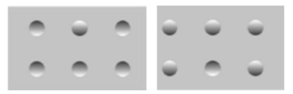

# ＜开阳＞理论之美

**高呼文科无用的人们，往往是受不良文科教育影响最深的人们。理论之美正如数学之美，它以透彻简洁的表达，概括了生活中大量最朴素的事物，使人们感受到远超越于个人理解的力量，破除陈见，获取突破旧有生活方式的动力。这种美甚至是自杀式的，布鲁尔等人最后陷入了一种“虚无主义的相对主义”，这是他们的宿命。迈克尔·桑德尔在宣讲“正义”时曾受到批评：“你总让人感觉思想决定行为，其实人们的行为决定了思想”，然而这句话本身就散射着思想的光辉。帕斯卡说：“理智的最后一步就是意识到有无数事情是它力所不及的”，理论探讨何尝不是这样？**  

# 理论之美

## 文/吴肃然

 

数学有“数学之美”，它以极其简洁优美的方式勾画了自然界，是上帝的艺术。许多人文学者深受感染，尝试将数学方法引入社会科学乃至哲学研究，将模糊的、形而上的理论讨论转化为数学讨论。到目前为止，这些尝试尚未带来太显著的效果，当然人们常常说，这只是因为做得不够好，假以时日，我们同样能在人文社科的领域中看到“数学之美”。我们无从判断这种说法的对错，但是，那些被不少人弃之若敝屣的理论，是否也蕴涵着一种“美”呢？这种“美”是什么性质上的呢？

以社会科学界最受人诟病的，“反科学主义”研究者们的理论为例。英国人类学家普理查德讲过一个真实见闻：非洲的阿赞德人认为灾难都是巫师引起的，并且巫师魔力可以遗传。他们每次在判断一个人是不是巫师时，都用一种神谕办法。这在外人看来比较荒唐且费事，因为既然魔力可以遗传，那么只要一个男的不是巫师，他的所有男性亲属都不是巫师，反过来只要一个男的是巫师，那么他的所有男性亲属都是巫师。为什么要一个一个的来判断呢？

科学社会学家布鲁尔和拉图尔等人援引了这个例子，用以论证自己的相对主义立场。假设阿赞德人里有一位人类学家来到了英国，看到英国法律严禁故意杀人，同时又看到打仗时英国飞行员到处扔炸弹。这位阿赞德人类学家必然会产生困惑，英国的杀人文化为何那么矛盾？英国人当然有自己的解释：战争状态不受常规法律约束。在布鲁尔等人看来，这种解释只是深谙英国文化的人自己给的解释，而且这种解释只有在受到质疑时才发生。英国人从来不会在日常生活中把这种解释作为预设来消除自身文化中的逻辑困难，而这也正是阿赞德人在判定巫师时所持的态度。当一个来自英国的人类学家质疑他们时，他们亦会给出补充的解释。从上述立场出发，布鲁尔等人进一步论证了阿赞德人巫术的合理性。阿赞德人在判断一个人是不是巫师时，乃是给小鸡喂一种烈性不强的毒药，看看小鸡是否死掉。在西方人看来，问同一个问题时，小鸡有时死有时活，充分证明了这就是巫术。可是阿赞德人依旧有他们自己的解释，总之最后可以捍卫这种神谕的合理性。这和西方人对法律或文化观念的认识并无二致，由此可见，阿赞德人的巫术与现代西方的社会制度在本质上没有什么区别。

这种极端相对主义的观点势必引来很多人的不满。然而我们不妨联想一下。纽伦堡审判时，人们给纳粹定罪的依据是什么？人们都说要守法，现代社会要遵守形式正义，可是纳粹行为恰恰遵守了希特勒时代的法律，于是在纽伦堡审判时不得不把“恶法非法”的古老法理祭出，用以给纳粹定罪，这是一种什么性质的解释？柏林墙倒塌后，那些射杀翻越柏林墙之人的东德士兵受到审判，最后给他们定罪的道理是：“虽然你们必须按上级命令射击，但你们完全可以把枪口抬高一点”，这种理由是否比阿赞德人的解释还要滑稽呢？尼采早就看到了这里的荒唐：“法律只是精致的谎言”。

布鲁尔等人继承了维特根斯坦的观点：对于社会研究乃至自然科学研究来说，合理性并非只来自于逻辑的完备性，而在于“生活形式”。只有在体会不到合理性时，人们往往才发现其中的逻辑问题，而不是“逻辑决定合理性”这样的倒置关系。那么什么叫“生活形式”呢？美国哲学家唐·伊德画过一些图，其中一幅如下：

  

粗略看去，左边一个凸点，右边五个凸点，两幅图不一样。实际上，右图只是左图转了180度而已。之所以出现这个错觉，乃是因为人类自出现以来，都生活在一个只有上方光源的地方，也就是太阳的照射。这便是形塑了人们认知基础的“生活形式”。

人们在任何日常活动或研究活动中所追求的“合理性”都无法脱离生活形式。许多经验社会科学研究者追求命题的真伪，他们服从的是塔尔斯基的真理论，从语形学与语义学的分析中得到“真假判断”。然而，语形学研究的是句法，语义学研究概念与对象，只有语用学才涉及到意义。也就是说，许多研究者所讨论的“真”，只是对象语言与元语言之间的关系，它没有涉及到命题意义的本源。他们只是先定义一个词如“正义”，然后去检验某人是否“正义”，检验此人行为与概念定义之间的逻辑关系，根据逻辑关系来推出此人行为是否具有合理性。在追求数学之美的过程中，在用逻辑裁量合理性的过程中，许多社会科学的研究对象都成为了玩弄巫术的阿赞德人。在这个过程中，阿赞德人是败者，然而胜利的并不是数学，也不是科学，胜者只有尼采口中的四个字：“权力意志”。

高呼文科无用的人们，往往是受不良文科教育影响最深的人们。理论之美正如数学之美，它以透彻简洁的表达，概括了生活中大量最朴素的事物，使人们感受到远超越于个人理解的力量，破除陈见，获取突破旧有生活方式的动力。这种美甚至是自杀式的，布鲁尔等人最后陷入了一种“虚无主义的相对主义”，这是他们的宿命。迈克尔·桑德尔在宣讲“正义”时曾受到批评：“你总让人感觉思想决定行为，其实人们的行为决定了思想”，然而这句话本身就散射着思想的光辉。帕斯卡说：“理智的最后一步就是意识到有无数事情是它力所不及的”，理论探讨何尝不是这样？

 

（采编：佛冉；责编：佛冉）

 
