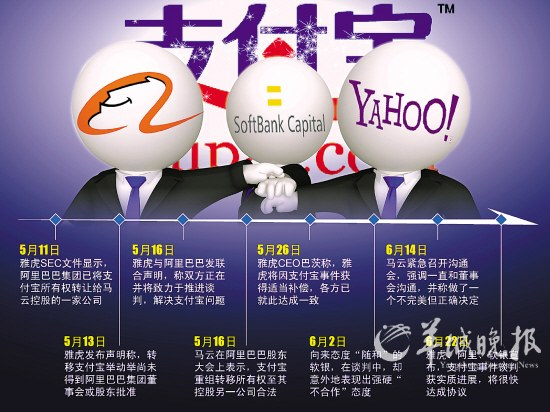
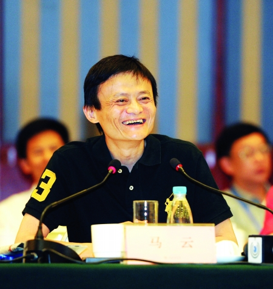

# ＜开阳＞用真正的契约代替道德的铡刀

**因此，在支付宝事件中，即使马云有错，也并非是错在违背“契约精神”上，因为双方之间的VIE模式本身就很难算作一个合格的“契约”，尤其是在更具有法律效力的国家政策面前。马云不对之处更多在于这种先斩后奏的做法违反了和雅虎、软银之间的诚信原则，而这其实属于商业伦理范畴，因此实际上胡舒立的指责有些泛道德化的倾向。** 

#  用真正的契约代替道德的铡刀

### 

## 文/ 陈识（暨南大学）

** **

 **按：本文写作及其背景事件发生均于一个月前，而目前最新进展为“马云复盘支付宝事件：单飞未获雅虎软银批准”，事件尚未尘埃落定，而与其相关的议题更非短期可能解决，如契约信用、民族品牌，商业潜规则等等，如近日的达芬奇家具事件，发出旧评倒也未过时效，不知中国时评人该喜该悲。感谢陈律师、彭总、小芳童鞋的交流启发。**  四年前的杭州，宗庆后为娃哈哈和达能的商标之争忙得不可开交，有外国记者质疑宗在事件中煽动危险的爱国主义情绪，后者反驳道：“这不是煽动爱国主义，而是法国人来中国欺负中国人，引发我们的公愤。”吴晓波在《激荡三十年》中引用很多财经人士的观点，认为“饮料行业已经是一个完全开放的竞争性领域，国家保护已无必要，宗庆后试图悔约，缺乏必要的契约精神，而他企图挟持民族主义狂热达到自己的商业目的，则更不应该支持。” 四年后的杭州，这次是马云召开媒体沟通会，就支付宝股权转移事件做出回应。他表示，这是一个商业利益谈判的问题，与契约精神无关。支付宝的赔偿谈判一定可以达成，除非可以改央行政策。吴晓波评论道：“马云可以说是代表民间资本，左边是一批国有的商业银行，对支付宝已经不止一次上‘万言书’，而另一边就是雅虎、软银等国际资本，是一种很典型的夹缝里面的博弈。而从目前的情况来看，他在国有资本面前几乎是没有任何话语权的。” 两个看来相似的事件，同一个观察家的态度却明显不同。而另一边，胡舒立发表评论《马云为什么错了》，从马云违背“契约精神”角度对其提出质疑。而我们也要质疑，在这起事件中，究竟哪些契约的精神被违背了？ 

 这要先从雅虎和软银与阿里巴巴之间的VIE模式说起。这个模式又叫“协议控制”，指离岸公司通过外商独资企业，与内资公司签订一系列协议来成为内资公司业务的实际收益人和资产控制人，本来就是为规避《外商投资产业指导目录》对于限制类和禁止类行业限制外资进入的规定而生的权宜之计。虽然VIE模式在互联网业内早已是公开的秘密，但从法律上来说，仍是一块灰色地带，中国政府虽未明令禁止，却绝没有承认其合法的倾向。所以，说双方这种VIE模式是“契约”，本身就是存疑的。退一步讲，即使这是契约，当时的情况是，考虑到国家金融安全，按照央行在2010年6月发布的《非金融机构支付服务的管理办法》的规定，支付宝若想获得牌照，必须是纯内资企业。国家为保护金融安全而施行的合理政策，和一个法律上暧昧不明的协议发生龃龉，应该遵守哪个？从法学角度看，上位法必须服从下位法是常识，如果刑法某条款有违宪法，必须依照后者修正，而在支付宝事件中，国家政策的契约序列显然要比“协议控制”优先。而即使从最粗浅的“成本-收益”角度来讲，“支付宝只是雅虎与软银的一块肉，却是阿里巴巴的神经中枢”，作为理性人的马云，当然不愿冒失去支付宝的风险，而是选择遵守政策宣布取消协议控制，拿到牌照，同时趁机将支付宝收入自己囊中，一举两得。 胡舒立指责马云此举违背了“契约精神”，笔者认为，这有些偷换概念之嫌，值得商榷。作为民商法学概念，契约是一种受到法律调整的社会关系。在商业领域，契约精神的核心在于契约自由，也就是当事人的意思自治，在合同领域尊重当事人的选择，只要双方同意就没有问题，而不是用道德去替代法律契约。英国法学家梅因在其著作《古代法》中指出，人类社会的进步运动经历了一个从摆脱以家族父权为中心的“身份“控制，到以个人意愿为中心的“契约”控制的“从身份到契约”的过程，他写道：“契约关系使我们个人在不断地向一种新的社会秩序状态移动，在这种新的社会秩序中，所有这些关系都是因‘个人’的自由合意而产生的。”因此，在支付宝事件中，即使马云有错，也并非是错在违背“契约精神”上，因为双方之间的VIE模式本身就很难算作一个合格的“契约”，尤其是在更具有法律效力的国家政策面前。马云不对之处更多在于这种先斩后奏的做法违反了和雅虎、软银之间的诚信原则，而这其实属于商业伦理范畴，因此实际上胡舒立的指责有些泛道德化的倾向。这就好比李雷与韩梅梅未婚同居多年，正如很多悲情小说里的桥段一样，李雷突然有一天变身陈世美弃韩梅梅而去，后者大可以泪眼婆娑地向世人谴责前者不道德的负心，却无法在法律上寻求到帮助，因为法律只保护合法婚姻。 而在那遥远的故事里，陈世美还是要死于包公的铡刀之下的，但是现代社会早已抛弃农业社会用血缘关系铸造的道德铡刀，而代之以更加文明和适应“陌生人社会”业缘关系的契约。现代社会以市场经济制度为基础，市场经济的运行机制在于，市场这只“看不见的手”是资源配置的基础，从社会分工到消费需求，都由市场规律决定。而契约的角色在于，作为社会企业法人活动的基本依据，明确这些市场主体的权利和义务。因此，契约是现代社会的基石，市场经济的运行不仅是资源配置方式的变化，更重要的是人的生存方式和生活态度的改变，也就是这种契约精神的深入人心。契约的好处在于，为人们提供一个行为规范和可遵照的合理预期，以减少不确定性。举个很简单的例子，“红灯停，绿灯行”是行人和车辆之间默认的一个契约，行人不但知道自己应该在绿灯的时候过马路，还能预期车辆也遵守这一契约，不会在他过马路的时候横穿而过。即使真发生了这种情况，肇事者也要受到更高级的契约（法律）的严惩，违约成本很大。无论在商业领域，还是在更广泛的社会领域都是如此。莎士比亚的喜剧《威尼斯商人》中，商人夏洛克借贷的条件是逾期不还将割掉借款者安东尼奥的一磅肉，而问题的解决并不因为对借款者黑心的道德指责，而是聪明的律师在契约框架内找到的：要求所割的必须正好是一磅肉，不能多也不能少，更不准流血，这样就使夏洛克无法执行而败诉。诚如黑格尔所言，“契约是一个过程”，这种以法律为核心的更重程序的正义观念，要比传统社会以伦理道德为纽带一味指向实体正义的观念更适合现代社会。 也许违背商业伦理，会对阿里巴巴乃至中国企业的信用声誉有负外部性，但是一方面，这次股权转移并未溢出法律这一最根本契约的框架，而且马云并未像宗庆后一样祭起爱国主义的大旗，双方在合意的基础上仍有协商，谈判，赔偿的回旋余地，我们可以说这是商业游戏中诡诈的暗度陈仓，马云也要为此付出赔偿的代价，但若上升到破坏“契约精神”的高度就未免有些上纲上线了，用道德的泛化挟持契约精神，无异于用民族主义绑架民族品牌；另一方面，马云此举可以说是捅破了VIE模式潜规则的窗户纸，摆脱了外资对企业或明或暗的控制管理，从长远来看，可以规避很多政策（这次事件实际上就是）、税务、外汇等方面的风险，也为其它企业做出了示范——毕竟，目前中国的投资环境早已不同以往，类似VIE的灰色地带终要被清扫；同时，国家的金融安全也得到了保障。 而很多事情也并非一句“契约精神”那么简单。就在马云和胡舒立短信交流的前一天，6月11日，蒙牛老板牛根生辞去执行董事职务，同时委任中粮集团董事长宁高宁为董事会新主席，被有些评论者指责是为了走出品牌阴影而投靠体制的下策。而笔者认为，无论是蒙牛还是阿里巴巴，正如吴晓波所言，民族资本企业在国有资本和国际资本的夹缝中博弈。在这个经济社会转型期，马云和牛根生的选择将不是第一个，也不是最后一个，如何提出一些建设性的意见而非单纯进行道德批判，依然任重而道远。  

（采编：安镜轩；责编：陈锴）

