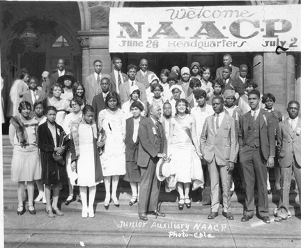
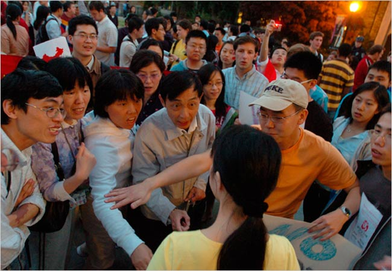

# ＜开阳＞社会规范与法律治理的错位——对黄艺博事件和杜同学踢馆的共同结论：让自由来得更猛烈些吧

**对于少数有争议性内容的讲座，如果主办方对持各种观点的同学都给予充分发言的机会，那么抢话筒者也失去了这样做的理由，即便同情抢话筒者观点的人，也未必会赞同他的行为，所以反倒是抢话筒的人会面临巨大的人际风险——失去朋友、被视为异类等等。所以即便在中国这种公民精神不很成熟的地方，大多数人也不会赞成滥用踢馆手段的行为，人际规范对“另类”的排挤在绝大多数情况下可以起到自然维护秩序的作用，故完全没有必要因为害怕踢馆会被滥用而采取法律规章等强硬手段。** ** **

# 社会规范与法律治理的错位

# ——对黄艺博事件和杜同学踢馆的共同结论：

# 让自由来得更猛烈些吧

## 文/黄陀（Yale University）

 中国人对于法制，向来有着令人费解的、自相矛盾的态度。国人一方面相信中国是人情社会，依赖法律者必然要在这个社会碰一鼻子灰，故对于法律常常不置可否，遇到了黄艺博父子被嘲讽这样的事件，也会忽视他们的基本权利仍然受到法律保护这一基本事实；但另一方面又时不时会高度迷信法律的威权，甚至有人认为不见义勇 为等行为应当入罪；同样，在酒后驾车已经有一套完善的刑事和民事法律制度对其进行惩罚的情况下，还要支持加以“重典”。 与此互为补集的，是对于社会规范（Social Norms，一时找不到合适的翻译）一副同样自相矛盾的态度。我们从小到大被教育“世事洞明皆学问，人情练达即文章”，可见中国人把人情事故的准则奉为为人处事之圭臬；可是遇到了杜MM的举动有违规矩之类的事件，各种“如此无法无天下去怎样了得”之类杞人忧天的论调又冒了出来，全然无视社会规范的自我调节作用。 而实际上，法律从来不是不讲人情的，而人情也不是完全不可替代法律的。关键在于，二者的目的各自是什么？二者的边界又在哪里？ 

先讲一点理论。社会学描述个体和群体之间的行为，常常提到两种社会资本，一种称为凝聚性社会资本（bonding social capital，现行翻译为“整合型社会资本”，我觉得翻译得很不对，意思完全被表述错了），另一种称为跨越性社会资本（bridging social capital）。 前一种社会资本，主要是人与同类人（背景相似、在同一地区等）之间的亲近感，这种亲近感造成了小圈子的形成。这种小圈子，可以小到寝室里的几个哥们姐们，大可以大到某个行业组织的公会。人们从与背景相似的人那里得到支持与帮助，而不必担心有什么根本的冲突，这是小圈子存在的正面意义。（插一句，从这个角度讲，美国宪法第一修正案把言论自由和结社自由放在一起，是相当合理的，因为人们团结成一个小群体，有时就是为了捍卫自己的利益、表达自己的主张，比如如果黑人当年没有成立NAACP这样的民权组织而是继续一盘散沙的话，种族隔离制度的废除将是遥遥无期的一件事情。）

而 一个社会光有凝聚性社会资本的话，那么将会产生严重的社会隔阂，是很不和谐的事情。比如中国的贫富对立、比如南非和美国之前的种族隔离制度，虽然群体内部可以团结，但社会群体之间缺乏交流，导致敌意甚至暴力的发生。所以一个社会同样需要跨越性社会资本去整合不同的群体，达到共存共荣的目的。 在这个理论基础上，我们来看一看所谓的“网络暴力”和“踢馆”事件的实质。  **一、为什么一部分人将接受官方意识形态的人“打为另类”与自由主义的精神不相违背？——这是凝聚性社会资本的需要** 首先我们要明白，“打入另类”这个概念从来都是相对的，如果一个共和党人跑到一群民主党大学生那里大谈对恐怖份子用酷刑是多么正确的举动，被“打为另类”是 很正常的；反之，如果一个民主党人跑到一群保守派那里演讲，也同样会被打为另类。任何一个群体都有约定俗成的内部规范去维系，也有对违反这些规范进行的惩 罚。如果有人在中国街上裸奔，会被人指指点点；如果有人跑到乌有之乡去骂毛泽东，也会被批被骂甚至被人肉；当年王千源在爱国留学生群体里支持西藏人，遭到死亡威胁、家里被泼粪（这个已经过了自由的底线，等一会会讲到）；而黄家父子在当今网络用户对官方意识形态普遍嗤之以鼻的情况下在网上以这种面貌出现，遭到恶搞和嘲讽也是必然的（唯一值得争议的，是具体嘲讽到什么地步是可以接受的）。社会群体有决定自己内部规范的自由，也有选择不接受某个人成为这个群体一部分的自由，否则人们就无法享受群体给自己带来的满足。 

比如一个由四名衷心热爱共产党的党员甲乙丙丁组成的小圈子的存在，就为圈子里的每一个人提供了思想上、精神上和情感上的支持，不管外面的人觉得如何，他们从自己正当的行为中获得了快乐，就是无可非议的行为（自由主义的目的不正是让每个人可以有追求幸福和快乐的自由么？）。如果有一个反党分子一定要在他们每次 聚会的时候插一脚，你能说，这四位党员没有把他赶走的自由么？而如果这四个人当中有一个人，丁，看《南方周末》看多了，思想改变了，其他三人没有批评教育 他的自由么？如果批评教育无效，丁的思想确实是改变了，甲乙丙没有把他打为另类、驱除出这个小群体的自由么？换言之，如果我们强迫甲乙丙继续接受丁，那么这个群体的凝聚性就不存在了，小圈子也就失去了意义。所以社会群体有把个体打为另类的自由，这是结社自由（freedom of association）的基本要求。而一旦这种“打为另类”变成与一群更广泛受众的论战，那么则更像是一个言论和表达自由（freedom of speech and expression）的问题，更无所谓谁把谁打为另类了。 杜同学有踢馆的表达自由，因为她踢馆的行为是代表她自己和相同意见的同学表达“我们不欢迎唐骏这种人”这个观点，抢话筒则是在当时的环境下迫不得已的行为，也没有造成任何生命财产受到威胁。而如果踢馆的手法被滥用，那么群体的规范同样会把这些滥用踢馆手段的人打为另类、对其进行人际关系上的制裁。也就是说，对另类的排挤是双向的，杜同学有宣布唐骏为另类、对其踢馆的自由，同样，那些不赞成杜同学行为的人有不和她继续做朋友、不帮助她的自由。大学校园里绝大多数的讲座，并无太多争议性内容，故不存在踢馆的可能。对于少数有争议性内容的讲座，如果主办方对持各种观点的同学都给予充分发言的机会，那么抢话筒者也失去了这样做的理由，即便同情抢话筒者观点的人，也未必会赞同他的行为，所以反倒是抢话筒的人会面临巨大的人际风险——失去朋友、被视为异类等等。所以即便在中国这种公民精神不很成熟的地方，大多数人也不会赞成滥用踢馆手段的行为，人际规范对“另类”的排挤在绝大多数情况下可以起到自然维护秩序的作用，故完全没有必要因为害怕踢馆会被滥用而采取法律规章等强硬手段。 这个逻辑对于唐老板这样的人同样是适用的。唐老板不择手段的成功学、假造学历的事实板上钉钉，但法律规章仍然应当充分保障唐老板的言论自由。唐老板仍然可以到处做讲座，但杜同学踢馆或是其他类似的排斥反应（比如观众嘘声），就会让唐老板意识到他自己已经不被相当一部分人接受，出去演讲只是自取其辱，从而以后小心行事。此时，爱唐老板爱得无可救药的死忠迷们可以成立唐骏粉丝团，唐老板可以选择只对粉丝团演讲，从粉丝团的掌声和鲜花中让他那颗饱受伤害的心得到粉 丝们温馨的抚慰，而粉丝们自然会把踢馆者拉开或是挡在门外。而从社会的角度看，最终的目的仍旧是唐老板不能再到处招摇撞骗、诱骗无知少男少女们了，但实现 方式不是通过硬性的规章，而是通过群体行为规范的调节作用，让人们各取所需。  **二、为什么宪法和法律需要保障那些被“打为另类”人的权利？——这是跨越性社会资本的需要** 但从另一方面讲，如果社会群体之间排斥得太厉害，那么整个社会就会分裂为严重对立和敌视的阵营。一个阵营一旦得势，那么就会对其他阵营进行镇压，这也是我们不愿意看到的结局。这就解释了宪法和法律权利存在的必要性。宪法和法律权利是社会不同成员、不同群体之间订立的契约，这个契约说的就是，“虽然我非常仇恨你的观点，但哪怕我得势了，我也会保障你的人身、自由、财产等基本权利；你也一样。”这就为不同群体之间的对话提供了基本前提，因为哪怕群体甲得势了、掌握了政权，群体乙由于基本权利受到保障，可以继续公开鼓吹自己的观点、继续与群体甲对话 （因为群体乙知道无论他们说什么，群体甲都不能把他们怎么样）。有朝一日时过境迁，可能群体乙的观点吸引了更多的支持者，使群体乙反败为胜、掌握政权。这 时候群体甲就会为自己当初遵守契约而感到庆幸，因为如果他们当初不遵守契约，那么群体乙得势之后就更有可能也不遵守契约、对甲实施残酷镇压。所以宪法和法律权利的存在，保障了言者无罪，为不同群体之间的对话提供了基本前提。 很遗憾的是，中国的近代史上没有人遵守这个契约，有那么一点开始遵守契约的努力，不是被苏联就是被日本打断。所以导致今天有人对自由主义误解之深，以为自由主义者也不过和孙中山、毛泽东、蒋介石一样是一股以权力欲为目的的政治势力，以致于问出“以后如果自由主义者掌权了，我看马克思的著作是不是要躲在厕所里看？是不是支持共产主义要被自由主义者敲打、被像文革一样批斗、人身和自由权受到威胁？”这种问题。自由主义的目的是搭建一个平台，在这个平台之上，人们既有凝聚成不同的小圈子享受小圈子温暖的自由，也有与不同圈子的人交往的能力。（只有极右的人才可能会支持对伊斯兰教、对共产党人进行无区别的镇压，而那是很明显的披着自由外衣、行反自由主义之实的专制主义行为。） 宪法和法律甚至可以，在必要的时候，强迫不同的群体进行交流，反歧视法就是这样一个例子。比如，本来一个少数族裔各方面资质都很好，但白人雇主由于偏见不肯雇佣。雇主当然可以认为，一个全白人的环境是一个更有效率的小圈子，从而宁可一直去花高于供求平衡（equilibrium） 价格的价钱去雇佣白人。但如果反歧视法强迫雇主雇佣少数族裔，那么经过若干年的强迫磨合，雇主会意识到，少数族裔完全可以胜任，从而雇主得到了更便宜的劳 力、少数族裔得到了工作，达到皆大欢喜的目的。同理，种族隔离制度阻碍了不同族群人之间的交流，如果没有反歧视法加以打破，那么族群之间的偏见可能会一直 持续下去（至少持续更久），这对社会显然是不利的。 除了促进不同族裔、不同观点人之间的交流之外，法律的作用还在于保证群体将一个人“打为另类”的时候，实施的惩罚也不会侵犯到人身、自由、财产等这些基本权利。所以，无论是网民恶搞黄家父子，还是乌有之乡对右派学者的抨击，或是杜同学的踢馆，只要没 有到伤害实质权利的地步，都是很正常的行使言论自由的行为；而一旦做出像对王千源同学进行恐吓、对她家进行泼粪这种侵犯人身权和安全权的行为，则超越了自由的边界，法律必须予以制裁。  **三、自由的边界怎么决定？——宪法对基本权利的保护和民主宪政程序对引申权利的斟酌** （首先声明，我不喜欢用“基本权利”、“固有人权”这些词，因为这些词意味着僵化、死板、一成不变的解读，而这个世界上没有契约是绝对不能改变的。但反过来，契约又不是完全随意可变的，否则就失去了契约存在的意义。所以基本权利是一个相对稳定的东西，但新的时代可以赋予新的解读。） 在 我们当前的文明程度下，有些权利是更为基本的，其中主要的就是生命权（包括安全权）、人身权（包括安全权）、自由权、财产权等。法律对这些基本权利的保 障，是比较完全的。比如对王千源同学的死亡恐吓是对其生命权和人身权（安全权）的侵犯、对其家进行泼粪是对其财产权的侵犯。这些权利的保障，不应受政权更 迭的影响，但可能随着社会发展而逐渐发生变化。比如，财产权是相对稳定的权利，但随着科技的进步也发生了一定的变化。很久以前，土地产权包括了土地上空和 底下无穷大距离的产权，但如果这种产权一直受到保护的话，那么飞机等航空航天工具的发展将受到巨大的阻碍（想像一下航空公司要逐一购买航线飞越的所有土地 的航行权是多么不现实的事情），所以后来在天空的航行权被直接划为公有领地。但宪法对财产权的保护仍然是非常强烈的，非法侵入、非法占有、妨害使用，一般 情况下仍然是没有任何疑议的、会受到制裁的侵权行为。宪法对基本权利的保护，是相对明确的、稳定的。 在这些基本权利之上，则是需要很大功夫去具体斟酌的权利。比如财产权引申出来的权利是获取利润的权利，如果一个人诽谤商家造成利润损失，那么可以认为是对财 产权的损害，从而要求赔偿；但如果商家发布不实广告被拆穿，那么商家牟取的利润本来就是不合理的，所以不可要求赔偿，反倒是商家应当把牟取的利润吐出来。 所以利润权是需要具体情况具体分析的。同理，如果一个人因为诽谤而丢失了升官发财的机会的话，也可以认为其利润权受到侵犯，从而得到司法救济。可是，如果这个人是一个官员或公众人物，那么对不起，由于你握有更大的权力，你必须比一般人承受更多的委屈，承受不了的话请另谋高就。因为公众为了批评政府批评社 会，必须批评你，而批评就有可能批评错，但如果用诽谤来惩罚错误批评的话，那么虽然是保护你个人的权利，但实际上造成了让公众不敢批评政府、批评社会的恶 劣后果，所以很抱歉，你得忍着。（这就是纽约时报诉萨利文案的结论。）但反过来，如果这个人不是完全自愿成为公众人物的呢，比如黄艺博父子？一方面，可以 说，因为他们主动自愿把小朋友官样照片发表出来、辅以豪情壮志的文字，那么就由不得别人怎样点评；但另一方面，法律是否应当对这些点评设置限度？还有被无 辜拖进来的林妙可小朋友呢？像把林妙可和黄艺博的照片PS合成在一起这种使用个人肖像、针对个人的恶搞行为是否应当受到法律惩罚？如果要保护小朋友，年龄上多小的小朋友才能得到保护？可见，这些引申权利之复杂，不是简单明快的规则可以决定的，需要具体问题具体斟酌。 比如，在美国，这种使用个人肖像、针对个人的恶搞很多，但未见有谁受到惩罚，像上次洛加大（UCLA）有个Alexandra Wallace小姐在网上发了一段讥讽亚裔的视频，结果遭到全国年轻人疯狂围攻恶搞，有人模仿，有人PS，还有人创作歌曲MV，甚至有人把她早年拍的三点泳装广告人肉出来，最终她面临强大的社会舆论不得不主动退学。虽然我也觉得这位小女生受到围攻有可怜之处，而中国也未必要学习美国社会的具体标准，但不管怎样，触犯了社会规范就意味着别人可以用一切“软性”手段来惩罚你，这是在任何一个社会都无可避免的事情。而在生命、人身、财产等基本权利没有受到侵犯的情况下，究竟法律限制这种社会规范的软性惩罚限制到什么程度，是宪法学的问题——也就是说，是没有明确答案的问题。 

那么没有宪法法理上的明确答案，是不是意味着就没有解决方案了呢？不是的。这时候，民主宪政程序的**合法化效应**就起作用了，有人可能赞成允许PS林 妙可和黄艺博，有人可能反对，最终法定的规则有可能允许这种恶搞也有可能加以禁止。只要走的是正当的立法、审议程序，无论立法机关和宪法审查机关得出的结 论是怎样，其实都无所谓。公众会继续争议，也有可能推翻之前的结论，但不管怎样有个规范可以作为当前的行为准则。程序正义本身就是实现实质正义的手段，而 实质正义也会被融入程序正义中得以体现。民主宪政程序的作用，就在于让不同观点的人能够有一个行为规则可以遵守，但保持继续争议的空间。民主程序体现的是 一个社会当前的共同价值，而宪法保护的是更为稳定的基本权利。如果中国人大多数认为保护小朋友更重要，那么民主程序会禁止PS林 妙可和黄艺博，而如果宪法对言论自由的考虑足够重要，宪法机关也可以推翻这个禁令，认为其侵犯言论自由。立法机关和司法机关可以继续斗法，但不管怎样争 斗，自由主义的平台决定了这种争斗必然是和平的、有底线的，这就够了。每个人都想按自己想的来，但这不可能，所以才要有民主宪政程序，这是再简单不过的道 理。  **四、为什么我个人支持更多的言论自由** 在尊重民主宪政程序的前提下，我个人认为，政府应该少管言论方面的事情，因为如果政府对当事人的保护过强，令人的神经过于脆弱的话，议政式民主(deliberative democracy)是 无法生存的。在一个议政式民主里面生存是需要有一定心理素质的，因为有的时候公众议题的讨论就意味着一些尖刻的言论会被提出来，而有时尽管这些尖刻的言论 本身不针对任何个人，在特定的语境下却仍然有可能和针对个人的攻击具有相同甚至更强的杀伤力（就像一个新纳粹组织在明知有犹太人的地方打着万字旗游行，或 是白人在车上挂着南方邦联的星杠旗在黑人面前招摇过市）。如果政府要禁止任何冒犯别人的言论和举动，显然是不现实的，也是对社会思想交流毁灭性的打击。 比 如，不管你同意不同意李银河的言论，她提出的观点对于促进中国社会在性与道德方面的讨论绝对是功不可没的，但很多思想保守的人也绝对可以被她气出心脏病 来，那么政府是不是应该为了老人们不被气出心脏病来而限制这方面的讨论？而就像我刚才说的，针对个人的言论和针对一般观点的言论，二者之间并无明确界限。 为了评论一个社会现象，有时不得不在特例冒出来的时候拿他开涮，就像如果不能拿黄家父子这样的例子说事，那么“打倒新闻联播”“还孩子以童年”等意见就成了空喊口号（当然，如前所述，法律还是可以予以一些程度上的限制）；反过来，针对一些敏感议题的一般性评论，也有可能对某些人是莫大的冒犯。既然无法准确裁量某个言论的具体性质和具体后果，对言论的管制，就必然是有巨大随意性(arbitrariness)、赋予政府过大的随意裁量权（discretion）的，也就必然是容易被政治目的所操纵和滥用的。 所以，在没有实质伤害的情况下，公权力培养公民能“咽下这口气”或是奋起为自己辩护的人格、而不是培养那种受到欺负了就哭喊着向公权力这个妈妈求救的人格，对于民主社会的养成是非常重要的。如果每个公民都有坚强的人格，那么公共议题的辩论不必拐弯抹角，从而可以更透彻、更容易接近真理。  从根本上说，言论自由是个人自主权（individual autonomy）的要求。当我把照片发到网上的时候，是不是可以说我自行承担了风险（assumption of risk） 呢？假定我是了解法律的，那么我就会知道，别人在法律允许的范围内有可能对这张照片做什么；我也可能完全不知道我会面临什么风险，那么我更需要斟酌行事。 我既可以选择承担未知的风险，也可以在知道风险之后仍然选择无视这个风险。就像我开头说的，一个共和党政客跑到一群支持民主党的大学生里大谈对恐怖份子用 酷刑是多么正确的举动，就要考虑被骂的可能。而政客们一般也不会在完全不知道听众是什么背景的情况下贸然应邀演讲，即便去了，也会小心行事。具体怎么选 择，就看他们自己是怎么考虑的了。 而如果我选择把一张照片发出去，别人无论对这张照片做什么，同样要承担风险。如果做的太过分，那么PS我照片的人自己也会受到制裁。这个制裁甚至不需要来自全社会，也不一定需要法律来执行，他身边的任何人都可以执行，他做的越过分，就越可能有更多的人用更重的手段制裁他。比如PS我照片的人的老师可能很不赞成他PS我 照片的举动，这种事情发生多了他就可能失去这个老师的信任，轻则搞不到推荐信，重则无法完成学业。同理，杜同学踢馆唐骏演讲，如果没有伤害到唐骏的人身财 产安全或是造成武装暴乱，也不是法律或是公立学校规章需要管的事情，因为如果这个行为被她的同学所不齿，她可能受到同学排挤；而她的同学确实也有不跟她继 续做朋友的自由。在踢馆的时候，杜同学已经作出了自己的选择，我们没有理由不予以尊重。所以在这方面，人际规范的软规则来填补法律的空白，既是人之常情， 也是法之所需。这就回到了本文开始所讲的社会群体对内部的规范作用。 所以，对于言论造成的、不侵犯基本权利的伤害，未必就一定要有法律救济的手段——如果我的圈子里所有人都赞同那个PS我照片的人的行为而反过来嘲笑我，那么意味着我可能应该换个圈子。多元社会（pluralist society） 存在的必要，就是让对一个圈子不满的人可以去另一个圈子，对一个地区不满的人可以去另一个地区，对一个国家不满的人可以移民到另一个国家。但如前所述，有 些更为基本的权利，比如人身安全、人身自由、财产权，侵犯了这些的话不同的圈子的人就失去了互相对话的基本前提，而法律保护这些权利，维持社会不同群体之 间人的沟通也是必须的。 从更高的层面上讲，一段流传甚广的、寒山和拾得的对话，对我们有相当的启发意义。寒山问拾得："世间有人谤我、欺我、辱我、笑我、轻我、贱我、骗我，我应如何处治乎？"拾得曰："只是忍他、让他、由他、避他、耐他、敬他、不要理他，再待几年，你再看他。"这个说起来很容易，现实中很难做到。但这种心态，显然是比要求救济、要求报复更高明的，特别是在实质权利没有受到侵犯、只是精神上受到打击的情况下。言论自由的理论基础其中有一个就是帮助实现人的自我价值——言论自由对于人自我价值实现的作用，既在于鼓励人的自由表达，也在于培养在别人的自由表达面前宠辱不惊的心态。而培养这种公民，也同时是在促进议政民主（共和主义民主）的形成。 所以，虽然由宪政程序决定对言论自由进行必要的法律限制是完全合理的，但由于言论自由对个人自我提升和社会进步的重要性，过多的法律限制恐怕不是有益的；也由于社会软性人际规范对言论自由负面效应有着巨大的缓冲调节作用，过多的法律限制恐怕也不是必须的。   **本文中心小结：** **1、言论自由的负面作用可以通过社会规范（social norms）的软规则予以制约，并不需要法律时时插手；** **2、法律只需要保障公民的基本权利不受侵犯，而保护这些权利的法律是怎么产生的，比法律的具体结果更重要；** **3、言论自由对于人和社会的发展都是必要的，故法律应当允许最大限度的言论自由（为什么法律不必作过多限制，见观点1）** 

（采编：陈锴；责编：陈锴）
