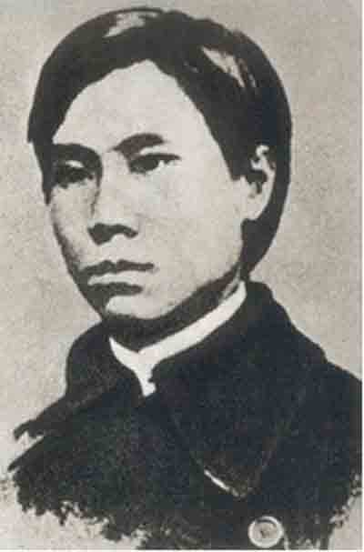
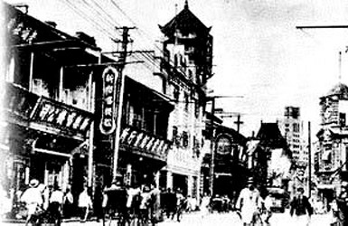

# ＜开阳＞租界里的法律故事（中）

**如今，在恪守政治正确为主旨的各类历史教科书中，苏报案仍被描绘为“中外反动势力相互勾结的结果，是帝国主义、封建势力联合镇压爱国革命运动的事件”。近年来，海内外对这一结论的质疑早已风生水起。尤其是，从法学研究的视角看，“苏报案”的发生，对中国社会司法转型起到的重要“提速”作用，已经不容置疑。**  

# 租界里的法律故事（中）

## 文/周大伟（西南政法大学）

 

说到租界里的法律故事，无论如何也绕不开发生在公元1903年的那个惊天大案——“苏报案”。 

公元1903年，距离爆发辛亥革命还有8年的时间。这一年的年景，有人称其为“晚清如一张老化的旧唱片，虽已五音不全，唱针却还在上面划拉着那最后的几圈沟纹。”此刻，在中国北方的古老皇城四周，一切都还显得平静而单调。在紫禁城的晨钟暮鼓声中，北京城里的遗老遗少们竟很少注意到，在千里之外中国的另一个城市——上海，这个曾经“东南海滨的三等县城”，已经在“现代化”的道路上遥遥领先、愈行愈远。 

当时，上海的现代化程度，超出了当时中国任何的一个城市。尤其是，在十里洋场的上海租界，自19世纪中叶起，已经有了其他城市没有的现代传媒报纸以及专科学校，甚至通过法律移植和展开立法，已经有了近现代意义上的法庭，在司法转型的道路上上海租界已经先行一步。“苏报案”就是在这样的背景下发生的。 

1903年5-6月间，上海《苏报》先后介绍和发表邹容的《〈革命军》以及章太炎的《驳康有为论革命书》。特别是，章太炎在文章中以饱满的激情、极富感染力的文采赞美革命。而且，文中直呼光绪皇帝之名，“载湉小丑，未辨菽麦”，这分明是在指名道姓地破口大骂当朝皇帝。此文一出，朝野轰动，举世哗然。一时间，“上海市上，人人争购”。 

苏报的上述一系列举动显然激怒了朝廷，加快了清廷查禁《苏报》的步伐。清廷上海道台为此照会各国驻上海领事，要求将当事人捉拿归案。7月初，共有六名“苏报案”涉案人员归案。除去流亡日本的陈范，“苏报案”中真正关键的两位人物便是《驳康有为论革命书》的作者章太炎，以及《革命军》的作者邹容。 

对于“苏报案”，清廷目标非常明确：其一，彻底地、永久性地查封报馆；其二，将这些“谤及列祖列宗”的“逆乱”判处凌迟极刑，置于死地。 

然而，令清政府羞于承认但又不得不承认的事实是，《苏报》馆设在租界之内，章太炎、邹容等人被捕、在押均在租界工部局掌控之下。这是个“国中之国”，为清政府力所不能及之势力范围。在所谓的“国中之国”中，“外国领事建立了他们自己的西方式的新机构，而不是建立由各种造反政权或内地士绅领袖建立的那种中国式的统治机构……租界拥有征收地方赋税、维修道路、维持市政警察的权利”。 

清廷虽然早已下定严惩《苏报》案犯的决心，却只能被迫与各国公使、工部局等商讨、交涉，以图借此杀一儆百，在国内重新树立起日渐滑落的声威。经过多方努力，苏报馆终于在7月7日被封。但租界工部局拒绝引渡嫌犯的态度始终十分强硬。 

当时的美国《纽约时报》与英国《泰晤士报》发表的文章基本上反应了西方国家的立场，即认为苏报案是政府镇压改革者的行为，一旦将嫌犯引渡给中国政府，将得不到基本人权保证和公正审判，况且，当时的西方国家已经形成了“对政治犯不予引渡”的共识。租界当局不仅出面、出资为章、邹聘请律师，还严密布控以防其被清政府劫持。一场中外之间争夺案犯、争夺审判权的拉锯战就此开始。 

此时，在法庭上对抗的两造，一方是以帝国自居的煌煌天朝，一方是手无寸铁的文弱书生。这是个如此奇特的法庭，双方都请洋律师助阵，官司背后的政治因素，足以使人心惊肉跳。为了胜诉，清廷也专门聘请了几个洋人律师。以往尽管租界公堂上早有外籍律师的出现，但朝廷和庶民双方都延请律师辩护，还是开天辟地第一回。 

如果在清政府自己的衙门里，这样的审判恐怕至多是个过场。不出意外的话，章、邹等人便会毫无悬念地被绑赴菜市口被凌迟或斩首。但在会审公廨中，因为公开审理的“阳光”，面对着旁听席上诸多的中外市民，章、邹在法庭上的慷慨陈词，让朝廷顿失威仪。可事到如今，官人们也只好硬着头皮前来出庭。更为有趣的是，当时的朝廷法律人才匮乏，偌大的帝国不得不聘用两位外籍律师作为代理人。如果是在租界以外的“衙门”里，按照《大清律例》的规定，是严格禁止讼师出现在公堂之上的。中国历代统治者都严禁讼师活动，认为他们“以是为非，以非为是，是非无度”，是“挑词架讼、搬弄是非”之徒。不仅对讼师控制司法诉讼的状况感到不安，更在法律上设专条予以打击，如《唐律》将“教唆词讼”明文定为犯罪，使百姓不知讼、不会讼，以达到息讼目的。《大清律例》规定了“教唆词讼”罪，且对于撰造刻印传授诉讼的书，“照淫词小说例，杖一百、流三千里”。 

据传，为了加快引渡嫌犯，慈禧太后甚至不惜开展“夫人外交”，试图通过各国公使夫人的力量，间接说服公使。按中国人的心理，吃人嘴短，但一群公使夫人在酒足饭饱后听到慈禧的来意，便对此次赴宴暗生悔意，她们连忙用劝导的口吻说出：“太后地位品极尊崇，但无权干涉国政，尤其是司法独立，碰都不要碰”。 

有趣的是，“法律援助”的概念在“苏报案”审理中首次君临中国大地。章太炎的辩护律师最初是朋友吴君遂筹钱聘雇的，后来出庭的艾里斯律师却是租界工部局出面所聘请的，依据是为因贫困等原因请不起律师的人提供“法律援助”。租界当局的这种举动，特别是法律援助的概念，让清朝官员们百思不得其解：“诸逆律师系工部局代请，该局自谓泰西律法，从不冤人，凡有穷迫不能雇律师者，国家代雇等语。”“闻各犯律师系工部局代请，不知何心？” 

在此期间，北京发生的一起政治事件也起到了推波助澜的作用。1903年7月31日，记者沈荩因对中俄秘约进行报道而惨遭酷刑，被活活杖毙狱中。慈禧太后亲自决定将沈荩尽快处死，逐下令采用杖刑。杖刑本来是用棍杖抽打犯人的背、腿、臀部，并不属于一种死刑。对沈荩所执行的杖毙之刑，其实是一种十分野蛮和残忍的人间非刑。沈荩眼睁睁地看着八个刽子手们将自己一棍棍、一鞭鞭地痛打致死，行刑持续了两个小时后，血肉横飞，惨不忍睹，仍未气绝的沈荩痛苦难忍，愿求予以绞毙，最后侩子手用绳索将他勒死。沈荩事件中充斥的野蛮与暴力严重刺激了西方社会，世界各国都对清朝的司法系统、文明程度等产生了深深的怀疑。 

在苏报案中，清朝政府不能采取惯用的刑讯逼供方法，如果不是在会审公廨中，而是在清朝的衙门里，审判官根本不可能让章太炎当庭辩解‘载湉小丑’中的‘小丑’二字本作‘类’字或‘小孩子’之解。未等章太炎开口辩解，就会动用大刑，逼其招供同谋‘逆党’。另外，外籍陪审团也不偏重口供证据，当时的会审公廨较注重人证、物证，注重将这些客观证据作为判决的依据。 

苏报案中对刑事诉讼程序制度的遵循体现在多方面。比如辩护与控诉双方形式上的平等性；现代律师制度的引入；对证人的询问；有预审程序和审判程序；有相对完整的开庭、法庭调查、法庭辩论、合议等程序。并且，整个审判过程是公开透明的，这从同时期的新闻报道就可看出，符合审判的公开原则。 

1904年5月21日，“苏报案”作出最终判决：彼二人者同恶相继，罪不容恕，议定邹容监禁二年，章炳麟监禁三年，罚作苦工，以示炯戒。限满释放，驱逐出境。其他人，除陈范之子陈仲彝交保寻父外，其他三人均行开释。 

入狱后，章太炎频频活跃在人们的视线之中，常在报纸上发表诗文，还曾绝食七天以示抗议。邹容于1905年4月3日在狱中病逝，离刑期期满不足三月，终年20岁。章太炎则在出狱的当天就被租界当局送上了前往日本的轮船。伫立在船头的章太炎回望渐渐远去的黄浦江畔的上海外滩，心潮汹涌，难以平复。 

如今，在恪守政治正确为主旨的各类历史教科书中，苏报案仍被描绘为“中外反动势力相互勾结的结果，是帝国主义、封建势力联合镇压爱国革命运动的事件”。近年来，海内外对这一结论的质疑早已风生水起。尤其是，从法学研究的视角看，“苏报案”的发生，对中国社会司法转型起到的重要“提速”作用，已经不容置疑。有人说，中国近现代的法治是从上海租界里产生的，难道不是吗？  

（荐稿：陈蓉，采编：许鹤立，责编：应鹏华）

 
