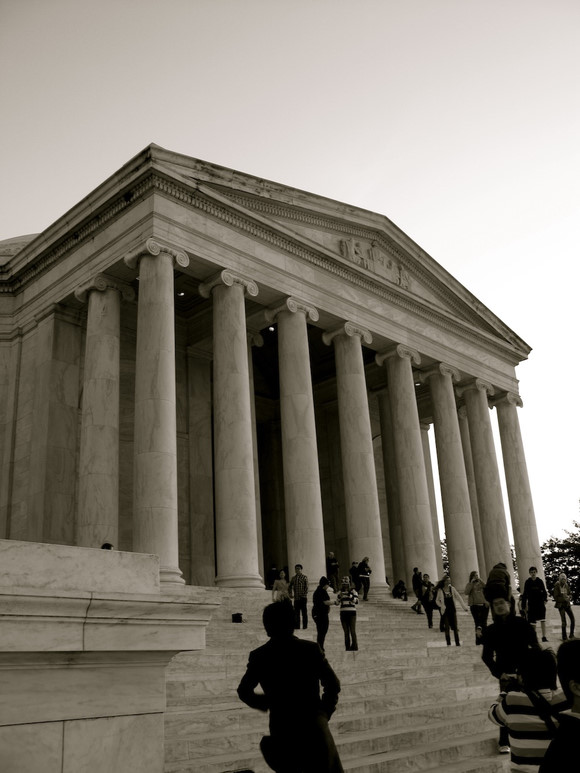

# ＜开阳＞美国的缺陷

**我希望强调美国刚性制度的弱点，是希望提供读者新的思维。我绝对希望中国能够重新站起来，用中药来唤起世界东西方文化与制度的天平，在实力上与美国抗衡。然而我们现在的方向是错误的，经济的崛起，却导致我们对于现行制度的自信膨胀。恰不知我们是离开我们的理想国更遥远了。不过总有一天中国会重新站起来，承担他应有的责任。覆盖在巨人肩膀上的那些砖瓦和尼绳会如落叶那样轻飘，巨人会迎风站起。**

# 美国的缺陷

## 文/平仰中（Boston University）

自由和民主往往是美国政府或者作为一个整体利益对外战争和对内合法性的重要依据。然而，我在美国数年来的一个收获就是发现，美国人往往就这两点和自身国家利益不符合时，就会放弃这些声称，而选择逃避原来申明的责任。无论是国共内战时期的对华援助，韩战、越战、甚至到后来的第二次海湾战争，一开始全都由一个听起来非常漂亮的正义理由开展，罗斯福号召过捍卫自由，肯尼迪，强僧，卡特，尼克松，布什都号召过，可开战时间一长，国家利益一旦明显折损，美国政治家就在民意的呼吁下草草收场。不是下台，就是让战争这个议题成为他换届选举时的最脆弱的防御点。于是我们看到了多少虎头蛇尾的战争。从1949年开始美国坚决表示支持中华民国政府为中国唯一合法政府，到1970年代为利用中国对抗苏联，而宣布与中华民国断交，放弃昔日并肩作战的盟友。我们可以看见，最终主导美国决策的是国家利益，而人权、自由、民主在某种程度上，只是一种说辞。他固然坚持这些，但如果某人给他塞了大把钞票之后，他的理性和理想就开始模糊。这个世界警察，不是不能被收买，奉承，被挖墙脚的。  在另一方面，美国的人种因为过宽泛的移民政策，以及早年的黑人人口贩卖、及墨西哥边境及加州边境的偷渡情况无法得到遏制，从而使得这个国家的人种变得非常稀拉。大批因为社会结构性关系而永远无法收到良好教育的国民充斥美国社会，若不是因为政府在媒体及社会主流方面树立正义的风潮以及主流教育的优秀，这个不限制强制，对毒品使用管制松散的国家一定会变得非常混乱。如果移民继续攀升，美国的未来是非常不可预测的。我在华盛顿能够看到锦衣玉食，有仆人随后的重量级政治人物和富豪，我也能在纽约随处看到身无分文的黑人乞丐还有更多的是傲慢的、随意追随自己意愿去行为和说话的“自由”人。每次发生重大战事或者需要国家凝结起来去共同应对的时候，我们总是发现美国是那么的散漫。孤岛主义横行。非常容易产生反战呼声，反对美国干预除美国本土以外的利益。这在冷战时期让美国失去大量中立国家，让埃及走向苏联，失去盟友中国，让越南成为多米诺骨牌的起始，中南半岛从此一片红。 也许从来没有一个国家叫做美国，只是有一种共同的利益存在在美利坚，因此他成为美国。如果有一天，这个利益消失了。人民会突然起来说，美国人？有这民族么？我只是意大利移民。我只是爱尔兰移民。我祖先是英国人。我是华裔。如果一切都往最坏的方向发展，美国的四分五裂是一种极致。是地域的分裂，是族裔的互相否认，是从民族到国土的彻底瓦解。特别如果大西洋和太平洋变得不在那么不可逾越的时候，地缘优势还会存在多少呢？ 从政治制度上，民主的合法性和三权分立的神圣性是由众多人造神话组成的。在华盛顿，整个城市沿河而建，组成一个正规的菱形结构。交通由Circle组成，每一个Circle环岛，都由一尊巨大的国父铜像和圣白的大理石奠基。首都的中心，林肯纪念堂和国会山由国会大厦横向链接，由白宫、纪念碑纵向构筑，全白色，全希腊式古典风格，构建成恢宏的十字架布局。不可不说，第一个让我联想到的事务，是一个巨阵。这个巨阵牢牢的锁住美国的政治结构，让三权分立，两院民主制变得如此神圣，继承历史的道统，让政权永固。 一位台湾来的朋友拒绝与纪念碑拍照，他说都是宣传。通过恢宏的建筑和大型的集会来确立一种信念在国民心中的形象。其实目的不同，方法却都相同。不论是纳粹、苏共、还是美国，这些霸权其实都使用的相似的方式来确立自己的地位。教育、建筑、媒体，个中方式。神似至极。 民主有他的制约性。他建立在假定人性本恶的卑微基座上建立起一套完整的束缚枷锁，尽一切可能用物理措施框住人类作恶的行为。这种措施非常的西式，就好像西药，他不从内中条理，非要用一种特定设计好的药丸来让人痊愈。中国人认为西药好，但他们的这种假设是建立在没有看到西药对人脏腑的伤害性和不灵活性，根本没有从本质上治愈。反而纵容细菌尽可能的抓住漏洞去突破，然后产生了更多疾病，更多强化病菌。而中药其实从内部调理，借用德育来劝人为善。我们看到往往在过去的中国，我们的结构性管制非常弱，但国家却正常运转，很难说贪污腐败有今日这样盛行的。 故中药其实不是不好，是推销西药的人把西药说的太好了，导致人民对于中药失去了自信。可西药到底好不好呢？且看吧。就拿冷战初期来说，埃及总统内瑟曾向美国扶植的世界银行借款修造水利，但恰巧美国国内参议院那时充斥大量南部议员。因为新修水利后，埃及会产出更多棉花与美国南部产商竞争，于是南部参议院集体反对。美国原本的政策又被改变为放弃支持。结果内瑟为了报复，宣布关闭国有化苏伊士运河。英国法国以色列出兵去打，美国另一方又为国家利益从中调停。经济上，政治上，折腾了半天。英法以联军停功，可埃及却倒向苏联。结果美国白忙活一场，到头来还花了不少银两。 越战也是。国会授予总统强森全权裁决对越事宜。结果美国对越战事不利，立刻国内舆论倒戈。两院骂声像海啸一样扑过来，强森宣布不参加换届选举。于是下届总统上台，继续被骂，在骂声中撤军。这种像摆钟一样的政策变化，运气好八年持续一个方向，运气不好四年甚至持续不到两年，政策就随党派轮替而变化。实际上损害了美国的长远的国家利益。这样的国家能够依靠吗？不能，所以第三世界小国和拉丁美洲国家竟然更加偏向中国了。虽然他对自己国民很差，常常有家庭暴力产生。 再说到美国的民主第二弊端。就是我一个朋友一直提到，我也觉得有道理的：在选举中的，个人道德代替国家道德。克林顿是美国的医疗政策和经济增长是美国总统中做的非常出色的一个，他在外交上也开了很好的局面。但是一个莱温斯基能让他差点下台。一个女人值得让他下台么？国民在媒体和他的政敌面前变得和随风稻草一样，主见上极度脆弱。 如果让我去做政治选举，我一定会在广播台花钱买一小时间断性播放我对手挖鼻孔的丑态。让选民看到他就联想到鼻屎。台湾民主也有更严重的问题，民进党在TVBS有一个时间段专门是有绿营评论家去骂国民党某某缺德。比如抢险救灾的时候，他晚到一小时。就循环一小时重复播放和回味国民党市长的话，”我那时在睡觉，哈哈！“ 然后主播重复的说。就这样他能把国民党五年连任的立法委员给选掉。 美国把自由民主发挥到了极致，但中国有句老话说，凡是要中庸。极度自由的言论可以让共和党去骂奥巴马总统是纳粹，共产党，社会主义分子，是卖国的。这很可笑，因为大家都还记得他那风度翩翩的演讲和大义凛然的说辞。怎么一下子就变成纳粹共党了？不能相信吧！但中期选举，民主党惨白至此，让我们不能不相信，这种哪怕最夸张的最难以置信的言论，在重复一千遍之后，都能让民众在判断的时候变得失去清晰的视野。我们到底是根据共和党的言论去裁决，因为他是个共党还是因为他的政策不好？到这一步，我们分得清吗？ 另外，美国的官僚体制也有一个很大漏洞：他固然能够保证权力的传递，但是他在人才的流失问题上始终不是个值得学习的对象。与日本及法国的培育、任命、升级、退休保障制度不同，美国的体制决定进入美国各政府部门的人员没有经过非常正规的考试。往往会产生客串现象。例如，一个大学教授，因为他对华政策的expertise，被邀请担任驻华大使或特派员。但他做完两年之后，就又会普林斯顿继续教书了。一个西点军校的军官，或者是飞行员，国家花了百万美金培育一个这样的人才，但是只要求他服役四到五年。之后他就决定不再从军。这种择优使用，但同时也造成大量人才流失，专业人才流向非政府部门的现象是非常严重的。然而，也许是一种幸运，总之有很多历史原因促成了目前美国人才流动的稳定性。但中国或者其他国家如果要效仿，还会达到同样的效果吗？历史环境已经不存在了，机缘也已经消失。并不是所有的东西都值得拷贝。 就官僚体制任用上，最让中国人疼痛的例子就是美国可以有司徒雷登，也可以有马谢尔、史迪威、赫尔立。司徒雷登从小随父母在中国传教，缔造燕京大学，是美国最好的中国专家。他没有通过如日本模式那样的官员升职流程，就被任命驻华大使。而马歇尔在前往中国调停之前，是只有听过史迪威的报告的。于是对于中国人的不了解，直接导致了他错误的报告，影响到了杜鲁门对华政策的转变。对于情势的误判，直接影响到了美国日后非常重大的利益问题。 还需要强调的一点是，我说出美国这么多弱点，并不是因为我讨厌这个国家。作为一个中国人，始终为自身国家利益考虑是我的意识存在。其实当中国与美国利益发生冲突时这些是弱点，就可以利用。但其实另外一个想法是，其实世界上任何一个国家都不应该和美国作为敌人。中国的利益也不是为了让美国完蛋而存在。我们可以发现国家联盟(League of Nations)的失败，是多国联合防御系统的失败。而之所以联合国United Nations能够成功，到苏联瓦解之后，世界日益平和，国家兼并和冲突减少，也是因为他的总部设置在纽约，而不是日内瓦（虽然日内瓦也有一个。。但那个没用），北约的总指挥官也是美国人。可以看出美国才是每次打仗出兵维护世界秩序的那个人。甚至包括美洲联盟（Organization of American States），总部设置在华盛顿。假设主导国是英国，法国，刚性秩序还能得到维持吗？德国会不会继续纳粹，日本会不会继续军国，意大利是不是又想来个罗马帝国？我们真的很难说。没有美国，也许科威特就已经不存在了。埃及就会被以色列打的稀巴烂。 然而，我希望强调美国刚性制度的弱点，是希望提供读者新的思维。我绝对希望中国能够重新站起来，用中药来唤起世界东西方文化与制度的天平，在实力上与美国抗衡。然而我们现在的方向是错误的，经济的崛起，却导致我们对于现行制度的自信膨胀。恰不知我们是离开我们的理想国更遥远了。不过总有一天中国会重新站起来，承担他应有的责任。覆盖在巨人肩膀上的那些砖瓦和尼绳会如落叶那样轻飘，巨人会迎风站起。  **原文鏈接：** [http://fancci.com/archives/2150](http://fancci.com/archives/2150) **歡迎訪問：Fancci.com，為了莊嚴華麗的中國。**  

(采编：安镜轩 责编：刘一舟)
