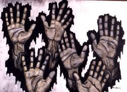
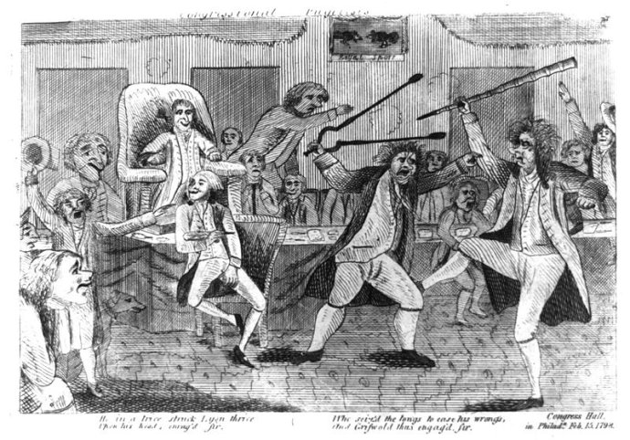

# ＜开阳＞自由主义的两难

**可惜这一理由远远不及“主权在民”“政治正确”，而在民主的时代，“政治正确”这一理想主义的想法讽刺地堕落为现实政客们的最佳选择，人民总是喜欢把政治想象得过于美好。但自由主义者必须坚持此原则，至少在内心应该用其代替“主权在民”的原则，虽不是一定要说出来。而从另一个角度来说，无限排斥民主的自由主义者也同样不是现实的自由主义者，缺乏适度的民主历练，缺乏各种公民团体的自治历练，这样的公民究竟能否保证自己的自由，似乎也是一个未知之数。**  

# 自由主义的两难

## 文/徐宪（华中科技大学）

 

施派是神一般的的对手，民主主义者是猪一般的队友。

我也曾是一个民主主义者，直到我的膝盖中了一箭。

——题记

最近笔者忙着考研复习，忙着看英语、公共政治（也就是传说中的“公公政治”）和专业课，回头梳理了一些东西，由于马克思主义政治太具迷惑性，如果智商变低了写的东西不行，各位要包涵。

据说，那些显得有思想的文人学者都是喜欢从古希腊谈起的，未能免俗，我也嚼嚼舌头。一直以来流传的一个说法，大抵是说，现代政治文明的二分大抵可从柏拉图与亚里士多德开始。当然，这种看法从很多角度看是有其道理的，我们能看到很多二者的对立，诸如柏拉图理想，亚氏现实；柏拉图重理性设计，亚氏重传统习俗等等。但是若以为保守的自由宪政主义以亚氏为开端，而柏拉图是对立的一个反面，则恐怕是过于简单的误解。最为关键的一点在于，现代的保守自由主义，其落脚点在于的独立的个人，而无论柏拉图还是亚里士多德，对于个人主义的理念真只能说是闻所未闻，他们都赋予政治以伦理的意义。当然，混合政体的理念跟后世的宪政理论密不可分，但人们更容易看到两者之间的联系，却难以看出其中关键的差别。

宽泛的“自由主义”是一个相当模糊的概念，其中很大的一个原因在于自由主义者对于政治参与模糊的态度。一个自由主义者该如何看待政治参与——或者宽泛的说，该如何看待“民主”？保守的自由主义者（古典自由主义者）怀疑民主，警惕政治参与，但却又表现得含糊不清、摇摆不定，似乎害怕有政治不正确的风险，例如哈耶克的这段名言：“我们应当承认，只是当权力为多数控制的时候，人们才开始认为对政府权力做进一步的限制是不必要的。在这个意义上讲，民主制度和无限政府之间的确存在着某种联系。但是，我们所要反对的并不是民主制度，而是无限政府。”而偏左的现代自由主义者则试图调和民主与自由之间的张力，秦晖老师的名言“己域靠自由，群域靠民主”便是一例。再左一些的自由主义者则大力呼吁扩大政治参与，为民主自由呐喊，其态势如同在野时的中共。

可能有人会反驳说，这些形形色色的人被归为一类，只是“自由主义”这一词词义的含混罢了。我承认这与语言的含混有关，但这却和自由主义本身的特点更加密切相关。本源的自由主义本身是不赞成扩大政治参与的，其根源有二。

其一在于，自由主义的开创者们，本身便并非类似于柏拉图、亚里士多德这样的哲人或曰文人（a man of letters），其开创者乃是真正浸濡政治的现实主义者，真正擅长政治的现实主义者，对于普通民众参与政治有着本能的怀疑，正如柏克所说的“一名理发师或是一名蜡烛制造者的职业不可能成为任何人眼中的荣誉，更不用说其他一堆更为次等的职业。这些人不应该受到国家的迫害，但如果这些人被允许进行统治无论是个人的还是集体的，国家反而是受到了这些人的迫害”，现在的人一般认为，马基雅维利奠定了近代政治科学的基础，根本在于他完成了政治的非道德化，他造出一个词“virtu”来代替美德“virtue”，这个词专指君主与公民的德行——或言与政治相关的德行，在马基雅维利那里，权力而非伦理成为政治的目标，政治带上了极大的现实投机主义成分，马基雅维利奠定了近代政治的基础，在后世的自由主义者看来，将道德逐出政治的领地，无疑是一次伟大的变革，可以说离开了政治的非道德化就不可能有近代宪政的原理，这是一个必要而非充分的条件，与社会主义者们试图改造人性的行为可谓反其道而行之（相关的可以联想朱学勤关于道德理想国的一系列文章），无论是契约论的论述基点从神到人，还是政治理论从伦理取向到现实取向，都是政治从彼岸到此岸，从“统治”趋向于“管理”，然而这种现实政治或曰投机政治却存在极为严重的内在矛盾，一方面，纯粹的投机主义只不过能称作政客，如何能称作真正的政治家（statesman）？审慎、务实与坚毅固然是政治的奥义，然而，完全缺乏某种原则的政治，又如何能称为“一类”政治？另一方面，恐怕是更加现实主义的一方面，缺乏某种道义的支撑，自由主义本身如何鼓舞人心，积蓄自己的力量，如何吸引足够多的后继者？从这个角度来讲，类似于《君主论》这种现实主义的政治教科书，其实也是最不现实主义的一类书——但这种书是写给君主看的，而绝非民众。如果真要论现实主义，那么纯粹现实投机主义的做法是，将《君主论》据为己有，将《人权宣言》交给民众——虽然这种做法过于极端，以至于我都不好意思写下来，但另一种类似的情况，却正是对于宪政自由传统和政治现实主义的折衷，才造就了柏克那一类伟大的保守自由主义政治家，当他讲原则时，即便是美国为了“无代议士，不纳税”的原则要独立出去，作为英国议员也要坚决支持；当他现实地考量政治时，他又反对法国大革命，不惜为此与旧时的战友们一一决裂。施特劳斯将柏克视作历史主义、相对主义的一个源头，其实这并不客观，柏克做出的两次不同选择其实本身便是原则与现实的折衷（虽然其原则并不被施特劳斯认可，但这就已经不是纯粹的历史主义），而这种取舍则依赖于政治家个人的判断——这就是智慧，是老子、奥克肖特说的那类类似于烹饪的政治“技艺”。

然而英国的自由传统是不可复制的，柏克的个人智慧同样是不可复制的，这才是问题的关键所在。政体的奥秘、政治家个人的智慧是难以捉摸难以言传的，孟德斯鸠的三权分立学说本身便是对英国政体的误解弄拙成巧之作，一时误会，却成就了千古英名。而政治家个人的判断则更难被准确描述，自由主义缺少纲领，缺少后继之人，可能确如柏克所说，法国大革命对于法国而言，是巨大灾难，但是对于自由主义本身，则又必不可少。没有口号的主义不会成为主义，即使政治家不喜欢，但这就是现实，政治家影响政治，政治理论家则影响历史——历史最后也会变成现实。最后在表面上成功解决这个难题的是托克维尔，在托克维尔这里，民主与自由主义才真正开始融合——但这确实也只是在表面上解决。在柏克那里，“代议制”本身是对民主的不信任，柏克区分代议士（representative）与代表（delegate），这正是自由主义的精髓，而今天的自由主义者则更喜欢强调“代表”的那一层意思，今天的政治家如果在选举的时候像柏克在布里斯托市那样演讲，那么他几乎肯定不会当选，现实的政治是——必须把“人民”、“we can”挂在嘴上，而不是像曾经的现实主义者柏克那样把“精英”、“we can't”挂在嘴上——曾经理想主义的政治变成了现实的政治，而曾经现实主义的政治却成为理想，在游戏规则给定的情况下，形形色色的从马基雅维利到柏克再到托克维尔及以后的人，都只能以托克维尔的面貌出现，都或多或少沾上了自由主义的影子，而他们的区别则被极大地忽视了，老辉格变成新辉格是顺理成章的。所以当被称作“自由主义理论家”的人批评柏克，批评“反民主的自由主义”时，我们有必要着重强调身份对认知的影响——柏克从未以“自由主义理论家”一类的身份亮相，他的身份从来都是议员，是政治家——在自由主义的实践与理论建立过程中存在这两种不同的人物，他们都是重要的，然而，不理解柏克的理论家肯定是蹩脚的理论家，当然，我很怀疑，真的不理解与假装不理解这两种情况很可能同时存在。

其二在于，个人主义的观念决定了每个人统治自己的正当性，但是涉及统治问题，则必然会涉及统治他人的问题，而群域与己域的划分绝不是那么简单，一致同意原则遥不可及，而多数决又缺乏合法性，在越大越异质的政治实体中，这一问题越为严重。现代政治中，己域占极高地位，但它的历史并不悠久，古希腊的政治哲学家，即便是亚里士多德，也未曾作此想法，施特劳斯说自由权利是对古希腊自然正当的背叛，这一说法其实并无错谬——正如前文所说的，柏拉图与亚里士多德的相同之处要远远大于其不同之处，在亚里士多德那里，人还是“政治的动物”，到了近现代自由主义者们的那里，人已经悄然转型为“经济动物”，近代的自由主义，对于希腊文明而言，确实是一个叛逆的孽子，也正是从古代人自由到现代人自由，自由主义开始确立了己域，而遗憾的是自由主义却缺乏像自然正当那样内在一致的纲领——自由主义更像一个大箩筐，装满了形形色色甚至可能自相矛盾的思想——这可能是自称“自由主义的朋友”的施特劳斯的暗示。至少在现实政治中，美国的国内政治早就发生了巨大的变化，行政权不断膨胀，“制约与平衡”这一思路很可能成为19世纪的一个理想了；国际政治便更不必说，总统屡次违反宪法，篡夺国会的宣战权，用不正确的手段做自认为正义的事情，这样的做法既背弃了自由主义的原则，也并非冷静现实的政治家所希望看到的——如果自由主义永远只是理想，那么它就难以吸引更多人，正如共产主义一样。

基于对政治参与的怀疑，对私人领域的重视，自由主义政治家们对于极权主义的看法便很自然了：纳粹主义（国家社会主义）和共产主义（科学社会主义）是极其相似的，他们的本质便是政治的膨胀，挤压了私人领域，极权主义是最坏的“无限政府”的结果，是宪政的死敌，确实，中国在改革开放前三十年中也是一个极度政治化的国家，私人空间几乎为零。然而，古典主义的学者们却不这么看，阿伦特认为极权主义的起因恰恰是政治的萎缩，这一看法也有其道理，在文革中，人人讲政治，但又有谁真正思考政治？表面上政治的膨胀其实也暗藏着真实政治的萎缩，政治空间的消亡反而给予政府可趁之机，每个个体的政治思考是在关键时刻能抵御极权主义的唯一武器，此时两种看法又有了共同之处。正如哈耶克在《自由宪章》第七章中分析的，“似乎最强有力的”民主的理由便是“民主制度的存在，对于人们普遍了解公共事务具有着极大的影响力”，他同意托克维尔的说法“民主是教育多数的唯一有效的方法”。尽管在哈耶克这里，政治的教化作用并没有像柏拉图、亚里士多德那样的伦理意义，他的论述也只是一笔带过，但如果真要给民主一个理由，教育民众的理由显然要比“主权在民”的理由更类似于现实的自由主义的本意——它本来便是一种精英的现实主义理论。自由主义要给民主一个理由，最好的理由便是：人民需要教育，需要政治的历练，使政府不断接近一种自治组织——只有真正的自治组织，那才是“自己统治自己”，而民主政府不过是一种相当拙劣的模仿品。这恰恰是为了防止政治的膨胀，因为愚蠢、孤立的民众更易纵容政府的膨胀——可惜这一理由远远不及“主权在民”“政治正确”，而在民主的时代，“政治正确”这一理想主义的想法讽刺地堕落为现实政客们的最佳选择，人民总是喜欢把政治想象得过于美好。但自由主义者必须坚持此原则，至少在内心应该用其代替“主权在民”的原则，虽不是一定要说出来。而从另一个角度来说，无限排斥民主的自由主义者也同样不是现实的自由主义者，缺乏适度的民主历练，缺乏各种公民团体的自治历练，这样的公民究竟能否保证自己的自由，似乎也是一个未知之数。

施密特的“紧急状态”论被刘瑜一阵猛批，其实平心而论，刘瑜的批评没有多少水平，施密特的精髓其实不在“紧急状态”，而在于“自由主义的非政治”的论述，认为自由主义实际上灭绝了政治，我们可以不接受施密特“政治便是区分敌我”的判断，但是不能不承认，“自由主义非政治”的倾向确实存在，而且是自由主义内在的悖论，自由主义很少关注个人政治的萎缩与极权主义政治膨胀的关系，而这一问题其实是所有柏拉图主义者的质问，这一空白又是因为自由主义鲜有以古希腊的政治参与为比较起点。（顺带说一句，虽然我认为《民主的细节》一书深入浅出，对于民众应该很有帮助，但此书的问题恐怕和书的优点一样多，很多东西未必那么简单。本质上来说，刘瑜是一个了不起的“文人”，当然她能影响很多人，她的意义并不小，我也多次推荐过这本书，然而学术的问题确实很复杂。）

现实的中国问题则更加复杂，历史上的自由主义，起源于对封建传统和宗教传统的继承与反叛，而中国的自由主义，则更多起源于对现代极权主义的反叛，从柏拉图到亚里士多德，从柏克到施特劳斯都没有见过也想象不到一个后极权主义国家的改革。现实中的中国自由主义面临着更大的理论难题。现实中国的政治参与非常之少，此时的自由主义者若是警惕政治参与，不止会被视作食古不化的教条主义者，更可能被斥作“五毛”，亨廷顿公式对于政治参与危险的揭示其实是有道理的，尤其是在极权主义统治多年的地方，人们更可能激情有余，审慎不足，此时对于政治参与的怀疑其实完全正确，真正正常的国家的政治参与是相对稳定的，而后极权国家的政治参与更有可能从一个极端走向另一个极端，因为它的民众更没有经验，也更不懂得尊重他人。可是这又带来另一个问题，那便是，改革后期的问题其实并非策略问题，更多的是动力问题，执政者有何动力改革？历史上看，这种动力多半来自国际社会的竞争以及政治上的施压，或者高层的权争，民众的动力最后的结果难以预料，可好可坏，但是中国是一个大国，在经济绩效不错的情况下，能较好应对外国压力，改革动力先天不足，在此情况下，中国的政治参与更可能出现“一放就乱，一收就死”的两难处境，绝不会像某些理想主义者想的那样“民主解决所有问题”，路径设计不周的民主带来的挫败可能比专制还要糟糕。

虽然大而化之的解决方案几乎不可得，但是基于政治传统的某些原则，我们还是能思考出一些小的方面。希腊哲人重视政治公共空间，其实一个重要原因是城邦政治的较小规模，无论柏拉图还是亚氏，他们对于后世的大帝国只能说是闻所未闻（虽然亚里士多德是亚历山大的老师），套用奥尔森的说法，小的集团“搭便车”的问题可能会更轻，而“搭便车”正是与个人主义相悖的关键点，尽管很多中国学者重视联邦制的经验，但是联邦制显然不应该是中国改革（如果存在改革，当然这更可能是一厢情愿的假设，事实上笔者几乎不抱此希望，也完全不是一个“改革派”，但无论今后局势如何发展，制度的设计总是回避不了以下问题）第一步，也不可能是——分裂问题是国家主权永远需要面对的问题，而联邦制很难解决这一问题，此时将带来严重的宪政危机（倒不是说“分裂”就一定完全没有合法性，只是现实容不得这种可能发生），这一改革将灭亡改革自身——何况中国今日之混乱，更多的是在基层，民众对于省级的政治事务判断力必然十分有限，而其影响又过大，显然绝非上上之选。县级自治是一个比较可靠的路径，但是必须严格限定自治的范围，分权的好处很多，但其缺点也不容忽视，经济和司法的地方保护主义、部分改革的深入问题、全新的府际关系问题都可能因地方割据产生——走出治乱循环，绝非“民主”二字那么简单，过于简单的回答，要么是傻，要么是别有用心。

无论如何，自由主义者和形形色色的民主主义者是被迫绑在了一起，虽然可能永远没办法分开，而且还要见面嘻嘻哈哈握手打招呼——后者需要前者的脑子，而前者需要后者的捧场——但聪明的自由主义者在内心不应忘记：

施派是神一般的的对手，民主主义者是猪一般的队友。

心中不保有这份傲气，便不可能是（保守）自由主义者；而傲气若过了头，则便又堕落为“文人”（a man of letters）了。

我写下这些东西，其实本身是违反了现实主义的教诲，那只是因为我的职业并非政治家，至少在现在，我是一个推崇政治家的文人，尽管这两者在自由主义者语境中是死敌，就像柏克与潘恩一样——从这里也可以看出自由主义的两难——当它未掌权，心有不甘；而一旦掌权，却又必须口是心非——虽然不乏“诚实”的自由主义者，但此时“virtu”确实已然不同于“virtue”。

 

（采编：何凌昊 责编：尹桑）

 
