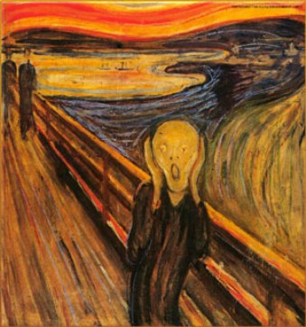

# ＜开阳＞若非足够清醒，如何认同民意汹汹

**驱使我支持香港人的理由很多，有审美上的，也有立场上的，却并不是因为某种认为自己有理由干涉香港人前途，并且会比他们自己做得更好的傲慢。而让我无法认同对香港人批评的理由，则是：在正确和错误之间，在民意与官威之间，确实没有什么妥协的余地。**  

# 若非足够清醒，如何认同民意汹汹

## 文/张舸（中国科学院大学）

 

数周以来，有关所谓“国民教育”的争论，一直没有停歇过。如同过往一切公共事件一样，标榜理性客观中立的声音，又一次甚嚣尘上。我没有兴趣一一驳斥这些可耻的言论，不过我还是很难忍住灌某些乳汁派一肚子东江水的冲动。

只是，我还是想问一句。作为知识分子的你啊，究竟是因为什么，如此厌恶民众地舍身抵抗，至于竟然能够转而向着恶政寻求妥协，试图用下流的手段扼杀民众的自觉呢？因为他们对你习以为常的东西感到厌恶——不论这种厌恶的理由是什么——就要支持高压手段，支持践踏他们的尊严？

他们是你们说的暴民吗？他们只是在说话，但他们声闻于天。他们是像你们说的那样在“利用”孩子们吗？可孩子们，并不像你们想像中那么愚蠢，为什么，他们面对关乎切身利益的事件，必须保持沉默？

生命里每一刻都同样珍贵，没有哪一段，能够容许旁人予取予夺。当然，孩子们的也是一样。

此刻正在香港发生的事情，当然是易受攻击的。如今，一切严肃的事务，都难以逃脱轻佻的讽刺。从前自由派为了反对荒谬的激情，不惜抓屎敷脸，不是去攻击事情本身的荒谬，而是去攻击所有的政治激情。如今，这样的轻佻的反对，开始反噬他们最初追求的价值观，而人们已经忘了这价值观究竟是什么了。当然价值观并不重要——尤其是在那些叫嚣着“正三观”（还有一种，叫“看看天涯正三观”）的人那里。

比起自由派在这方面作出的贡献，我们受到的教育毫无疑问表现更加出色。它们使得我们能够熟练地欺骗，但这还不是最重要的，它们更使得我们在一切的对立中寻找中立——所谓辩证。中立有什么不好呢？但是在正确和错误之间，在善良和邪恶之间，是没有什么中立的。

所以在这个意义上，香港人应该感谢大陆人。高价的东江水不值得感谢，值得感谢的，是大陆几代人作为活生生的标本，告诉香港人，如果他们今天让步，未来会发生什么。97之后，香港所失多而所得少，然而大陆媒体公然竟宣称“大陆为香港付出代价”，这些已经不必再提，而只是在今日，大陆终于作为前车之鉴，为香港作出贡献了。

然而对于那些素日标榜“理性客观中立”的人来说，这当然是不可接受的：他们嘴里有着数不清的虽然但是，有着数不清的背景阴谋，有着数不清的不过区区。为此一一辩驳，既不可能也无必要，这些说法，若不是逻辑上混乱，就是引用虚假的证据抑或全然没有证据。较之更为重要的是，面对汹汹民意，你们究竟是如何产生智识上的虚无的优越感？尤其是，这种优越感成为一种直觉，而不需要什么证据，例如，远在千里，竟可以断言抗议者没有了解过“国民教育”的意涵。

这正如过去的一两百年里发生过的事情。知识分子们自以为掌握了全部的真理——有时是全部的“不存在真理”，所以面对民众的呼声，面对最简单的常识，他们却始终不改其自负。后来，就有了苏维埃，有了集体化，有了接下来的一切。

苏联崩溃的日子里，专家们开始担心，习惯于集体农庄生活的农民，知识和创造性都没有办法适应即将到来的市场。一位来自集体农庄的妇女的反驳是：“你们以为农村人口是如何在集体化下生活了六十年的？如果他们没用自己的主动性和才智，根本就不可能生存下来”。

我是在说人民是永远正确的吗？不是。我只是想说，正是这些最切身的体验、最直接的尝试、最明晰的教训，构成了人类的智慧。有时，他们是正确的，于是人类就可以更向前一步；有时，他们错了，于是在将来的尝试中，这就不再成为选择。这种分布在民众中的知识，比起任何精心的设计都更有效。面对这样的民意，有什么理由，不去保持起码的谦卑？

进一步说，这次香港抗争的实质，正是为了阻止公权的手伸向私域，也就是为了保全这种智慧能够继续存在，抗争，保护的是抗争本身。所以此刻的自负才更加深刻，也更加荒谬。

这并不是说，知识分子就应该无保留地认同民意。但是那种将人民无差别地视为乌合之众的想法，的确是危险的。判断一种立场的是非，依据不应该是这种立场支持者的多寡，或者这些支持者的智识水准——除此之外，我们还有更多经受了无数次检验的标准。

所以少数派本身并不是值得标榜的，就像理性客观中立也不是。当然应该认同的是知识分子对自身立场的跳脱和怀疑，这是能够带来知识的验证和更新的。危险的是其伴随的对民众的鄙夷。这就成为了一种盲目和自大，从而就有了面对严肃事务的轻蔑和轻佻。这样的态度，既不理性，也非客观，却很可能就是中立的——然而却是在正确和错误之间的中立。

这也正是我题目的含义。先入为主是容易的，站在多数的反面并为之自豪也是容易的。然而对自身理性界限的审慎，对群众自发行动的审慎，却并不容易。驱使我支持香港人的理由很多，有审美上的，也有立场上的，却并不是因为某种认为自己有理由干涉香港人前途，并且会比他们自己做得更好的傲慢。而让我无法认同对香港人批评的理由，则是：在正确和错误之间，在民意与官威之间，确实没有什么妥协的余地。

清醒并不是一种自负的状态，当你傲慢的时候，你就离清醒越来越远了。

 

（采编：徐海星；责编：徐海星）

 
