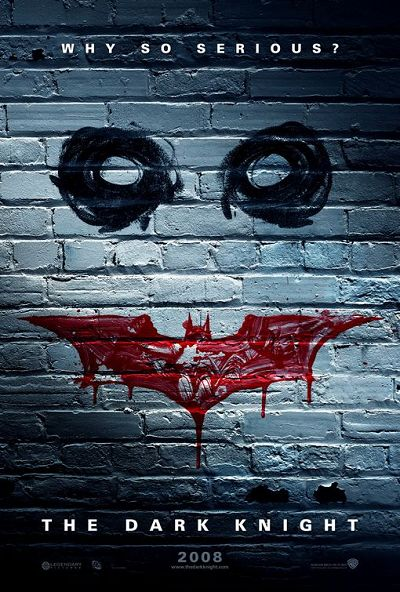

# ＜开阳＞蝙蝠侠注定毁灭世界

**人类注定让你失望，蝙蝠侠。** **因为蝙蝠侠的终极追求是崇高与正义，而并不是人性本身。蝙蝠侠已经不是人了，一个人一旦称其为伟人，尤其是这种拯救世界的伟人，他人的属性就会渐渐消退，这也是为何在造神运动兴盛的国家，往往有大规模的人道主义灾难盛行。**  

# 蝙蝠侠注定毁灭世界

## 文 / 孙宇晨（University of Pennsylvania ）

 

昨天晚上看了Batman Begins（蝙蝠侠的创生），里面非常好地说明了一个英雄的成长历程，英雄的成长过程必须是一个不断克服恐惧的过程。我非常喜欢这个提法，因为在我看来，绝大多数人之所以无法成为伟人，乃至甚至无法在平凡的世俗生活中获得哪怕一点成功，都是因为他害怕的太多。

恐惧是人类历史上情绪中最伟大的发明，对于恐惧的渴望与战胜是人类历史悲喜剧的上演的根本动力。无论是从Original Sin对终极真理与命题（上帝）的恐惧，对于极权统治Big Brother的制度性恐惧，还是最基本的对于未来与未知的恐惧，都是推动人类进步的根本性变化。当然绝大多数的庸众在恐惧面前都会被刷下来，不仅会成为恐惧的俘虏，还会成为射杀英雄的帮凶，但是人类世界总会出现类似伽利略爱因斯坦这种敢把上帝拉下马的人，总会出现萨哈洛夫，总会出现粉碎恐惧的人，此之谓伟人吧。

但是战胜恐惧之后的伟人，却会发现自己已经脱离了凡人的轨道，他成了凡人（庸众文明）的保护者，在这个层面，蝙蝠侠与他导师的面目竟变得模糊，这场让蝙蝠侠精彩的正邪大战在逻辑上出现吊诡之处，Liam Neeson要毁灭这个世界，毁灭罗马城，要毁灭索多玛，要毁灭高谭市，为了一个更好的世界。蝙蝠侠唯一阻止他的理由是，高谭市还有救，它现在还不应毁灭。言下之意是，一旦哪天高谭市没救了，毁灭高谭市，摧毁庸众便也是应有之义。

那么这部影片如果还能探讨，便是蝙蝠侠的底线在何处？

至少在本剧中，蝙蝠侠的底线并不是，人本身便是崇高不可毁灭的。尽管我感受到诺兰高举人道主义大旗，凸显的仍然是蝙蝠侠拯救人类的终极命题，蝙蝠侠的导师对他说：“不可宽恕你的敌人，因为你的敌人并不会宽恕你”，而蝙蝠侠的回答是，“宽恕恰恰是我与敌人根本区别的地方。”

宽恕并不是终极解决方案，他只不过是在人性与正义的张力之中，引入一个保持动态平衡的第三极罢了。因为连上帝都曾无法忍受人类的腐朽与可耻，发动洪水毁灭人类，你还能指望谁能宽恕人类。能宽恕这一切的恐怕也只有甘地，所以大家都说他是最接近神的人。庸众与伟人的张力，使得蝙蝠侠在伸张正义之时，不得不忍受人类的肮脏耻辱，肆无忌惮。也许终有一天，蝙蝠侠会认为人类毫无希望，走向毁灭人类的道路，也许蝙蝠侠终极导师，黑暗世界的带头人，Liam Neeson就是之前对人类满怀希望的蝙蝠侠。

人类注定让你失望，蝙蝠侠。

因为蝙蝠侠的终极追求是崇高与正义，而并不是人性本身。蝙蝠侠已经不是人了，一个人一旦称其为伟人，尤其是这种拯救世界的伟人，他人的属性就会渐渐消退，这也是为何在造神运动兴盛的国家，往往有大规模的人道主义灾难盛行。其实民主制度就是一套毁灭英雄的制度，它把总统，乃至一切精英，变成了无所事事的凡人，赋予庸众以极大的权力，因此民主制度是庸众的胜利这点并不为过，这也可以解释，为何好莱坞热衷于造神运动，塑造出蝙蝠侠、蜘蛛侠、钢铁侠等一系列救世主与神，一个社会缺什么便爱造什么，庸众面对恐惧，其劣根性总还是希冀神的拯救。

在此时，庸众与人类的面目便渐渐模糊，人类即庸众，庸众即人类，庸众企图建立的是一个享乐之国，腐朽之国，而不是救世主与神所希冀的崇高之国，正义之国，而这种反抗与张力，终究会让蝙蝠侠走向毁灭世界的道路。这也是上帝在当初造人之时，与人类的根本矛盾，上帝所希冀人类建立的是崇高与正义之国，而人类终究只是一群希冀享乐的种群，到了科学革命的时期，他甚至不知天高地厚的要驯服上帝为其服务。而我感觉，所谓魔鬼撒旦，不就是人类的化身么，他是上帝麾下最为忠实的大天使，最为宠爱的人，但最终要与上帝决一死战。

讲到这里，如果我们作为庸众的一员，就会警醒地发现，几乎所有救世主（上帝的儿子）来到人间，都是为了杀人，而不是救人——虽然他们全部是以救人的面目来到这个世界，而且绝大多数的救世主，正如蝙蝠侠，都是真心救人的。这点发现其实并不新鲜，几乎世界上所有的救世主，在这个世界上，所杀的人都要远远多于所救的人。

人类世界必定是一个充满张力的世界，他的进步希冀于伟人的诞生，因为庸众的懦弱几乎无法让这个世界得到一点进步，但每位伟人的诞生，终究会对人类带来极大的灾难。人类必须在利用伟人之后，把他们毁掉，幸好人类似乎早已参透这个道理，庸众发明了民主制度，将伟人装载到笼子里，让他们毁于无聊的选票政治，发明了大众传媒，将伟人制约在舆论里，让他们毁于傻了吧唧的绯闻与欲望，发明了享乐与欲望，让他们纵欲与沉沦，发明了好莱坞造神工厂，造出不存在、无能量的神明，满足庸众的膜拜欲望，却又简单无害。

这也是为什么我们进入真正的文明社会之后，伟人与救世主的下场总是不太好，很多人身败名裂，一蹶不振，就算谨小慎微，但也很少有人得以善终。

别以为庸众是傻子，大家都不傻。

与此说，当时那群将耶稣送上十字架的庸众，便一夜之间成了比耶稣还要聪明的智者。

 

（采编：黄理罡 责编：黄理罡）

 
