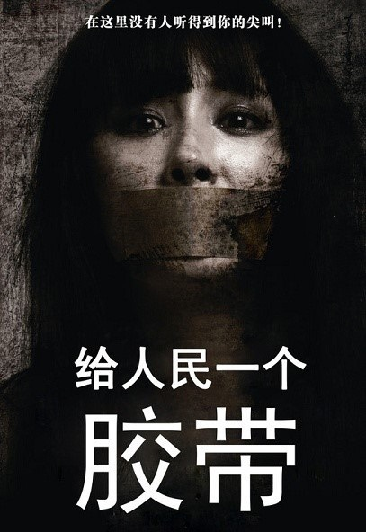

# ＜开阳＞言论自由六日谈（1）煽动性诽谤罪名的覆灭与言论自由的开端

**字面上只是惩罚对公职人员诽谤、维持贵族与官员个人名节的法律，却最终总是被用于压制一切对政府的批评和反对，并不仅仅是一个偶然。如同资本总是试图获得最大利润以自我膨胀一样，权力也会寻求一切可能的机会进行自我巩固。在有制度制约的社会尚且如此，在无制度制约的环境下，指望政府会不滥用此类法律，无异于天方夜谭。如果在一个政体中，司法不独立、政府就是一切公权力（包括司法权力）的化身，那么当言论涉及到政府本身的利益时，政府在一个案件中既是原告又是法官，这样的案子当然没有可能得到公正判决。**  

# **煽动性诽谤罪名的覆灭与言论自由的开端 **

## 文/黄陀 (YaleUniversity)

 

言论自由作为现代社会政治自由的基石，其奠定过程经历了曲折而艰难的道路——即便在拥有悠久法治和自由传统的英美国家亦是如此。早期英美法律对政府批评的压制，依赖于禁止谣言和诽谤的法律。然而这些法律如果应用范围不加严格限制，很容易成为执政者镇压异己的手段。

现代言论自由开端之一，源于“煽动性诽谤罪”(seditious libel)的覆灭。煽动性诽谤罪的主要目的是以惩治谣言为名，惩罚一切煽动对政府和统治阶级不满、有损政府威信、破坏社会和谐的言论。英国普通法中，有禁止诽谤贵族及其他统治阶级成员的大诽谤罪(Scandalum Magnatum)，在此罪名下一切伤害统治阶级名誉、导致社会不和谐的虚假或错误的新闻或表述均可受刑事惩罚，无论言者是平民还是统治阶级内部成员。私人间的民事大诽谤诉讼中，如果“谣言”被证明所言并无失实，则被告无需负责。然而在刑事公诉中，由于维持社会和谐是大诽谤罪背后的政策基调，因此对毁坏贵族和官员名誉言行的惩罚逐渐在詹姆斯一世时期成为英国大诽谤罪司法的重心，言论的真实与否反倒变得不重要了。[i]1606年，英国法的先驱之一，爱德华•科克(Edward Coke)爵士对诽谤入罪作出如下阐释：1、对于私人的诽谤会招致复仇甚至大规模复仇，破坏社会和谐，应当严惩；2、对于贵族和官员的诽谤则罪加一等，因为它不仅破坏社会和谐，而且损害政府威信；3、即便所谓的“诽谤”被证实不是虚假言论，出于维持社会稳定、维护政府威信的考虑，仍然可以予以惩罚——科克对此的解释是，有不满的人应当寻求“正当”司法途径予以解决，而不是发布有损其他贵族声誉、破坏社会和谐的言论来泄愤，哪怕这种言论所说的是事实。[ii] 如甲以损害乙名誉为目的，四处散播言论声称乙是罪犯，那么可能引起乙为保卫自己名誉而战，甚至引发两群人之间的冲突。在当时的司法视角看来，无论乙是否确实是罪犯，甲以伤害他人名誉为目的散播的言论引发了冲突就不是好事情；先前有什么恩怨，应该相信国王、相信政府、相信法院会给一个公道的说法，如果乙确实是罪犯，那么法律会制裁他，甲不应该去散播这种伤害他人名誉、挑起争斗的言论。所以，即便最后证明了乙确实犯了法、确实是罪犯，甲仍然要为其言论受罚。故在旧时英国普通法刑事诽谤罪中，“言论真实性不作为脱罪理由”被作为一个基本法律原则固定了下来。[iii]

不难看出，旧时英国普通法中诽谤入罪的基本目的不是为了惩罚虚假信息，而是为了构建在国王和贵族统治下的和谐社会。虽然科克爵士本人并未将批评政府和诽谤官员和贵族混为一谈，但在这种以镇压“谣言”为手段试图维持社会和谐为最高宗旨的司法逻辑中，批评政府和诽谤政府官员同样破坏政府威信、扰乱社会和谐，故并无实质区别，因此煽动性诽谤罪被应用到一切批评政府的言论，是必然的，也符合大诽谤罪的本意。[iv] 在此背景之下， 十七世纪的英国法官们应用这个罪名对一切对批评政府和政府官员的言论加以钳制，煽动性诽谤罪成为最有效的压制新闻和言论自由的手段。[v]

到了美洲殖民地和早期的美国，煽动性诽谤罪仍旧是打击政治异见的有力武器。虽然美洲未能完全继承英国滥用普通法煽动性诽谤罪名钳制言论的作法，各殖民地议会和政府仍然非常积极地打击任何有损它们声誉的言行。[vi]本杰明•富兰克林的哥哥曾经在报纸上刊发一则短消息，称政府要准备一艘执法船去打击海盗，“也许就在这个月什么时候吧，还得看看天公是否作美。”以此讽刺政府对打击海盗没有决心。这是对执政者的诽谤么？当时看来当然是。所以麻省议会恼羞成怒，把他关进监狱。

即便是在美国宪法第一修正案中确立了言论自由的原则之后，联邦党人(Federalists)控制的国会依旧于1798年通过了《煽动罪法案》(Sedition Act)，禁止“以损害合众国政府、国会、总统之名誉、声望和威信， 煽动良民针对政府、国会、总统的仇恨或叛乱及其他任何非法行动，教唆良民反对或抵制合众国之法律以及总统之合法行政行为为目的的，虚假、丑闻性和恶意中伤之言论。”联邦党人辩称，相较英国之煽动性诽谤罪，此法案下，不但真实之言论可以得到豁免，控方也须证明恶意之存在，并须由陪审团对事实进行认定。然而在实际执行中， 由于联邦党人对检察机关（属行政机构）及相当数目法官席位的垄断，该法案实则专门被用于打击共和党(Republican)[vii] 人士，执行之严苛程度有时甚至到了使用近乎有罪推定的地步，例如在其中一个案件中使用的标准为，除非能找到一个不是以损坏总统和政府名誉和声望为目的的动机（即，除非能找到一个非诽谤性的动机），否则必须认为其的动机是恶意的。而即便真实之言论可以免罪，任何诸如批评政府“无理、愚蠢、贪婪”之言论，或常见的讽刺性言论与艺术，仍然都可触法，因为由于言者无法证明其关于政府无理、愚蠢、贪婪的抽象论述之真实性，而其批评政府、损害政府威信之恶意昭然若揭，定罪仍旧是必然的。[viii]

联邦党人这种倒行逆施注定不能长久，也促成了联邦党人在1800年大选中的失利。共和党的杰斐逊总统上台后，大赦了所有因此受迫害的人，国会也退回了罚金，法案本身亦于1801年期满失效。煽动性诽谤罪从此暂时销声匿迹，直到在1917年的《间谍法案》和1940年的《史密斯法案》中，对反体制言论的压制才再一次以煽动颠覆国体 (seditious advocacy)之罪名的设立卷土重来。

字面上只是惩罚对公职人员诽谤、维持贵族与官员个人名节的法律，却最终总是被用于压制一切对政府的批评和反对，并不仅仅是一个偶然。如同资本总是试图获得最大利润以自我膨胀一样，权力也会寻求一切可能的机会进行自我巩固。在有制度制约的社会尚且如此，在无制度制约的环境下，指望政府会不滥用此类法律，无异于天方夜谭。如果在一个政体中，司法不独立、政府就是一切公权力（包括司法权力）的化身，那么当言论涉及到政府本身的利益时，政府在一个案件中既是原告又是法官，这样的案子当然没有可能得到公正判决。这一点在任何专制国家和近似专制的环境下（即便只是暂时的）都有所表现，无论是维护贵族利益的专制英国，还是建国初期政治尚未成熟、联邦党全面控制三权的美国。 

相比之下，在普通刑事司法中，大多数情况下哪怕是专制政府也并无需要特意偏袒或专门迫害被告人，因为在打击危害社会治安的普通刑事犯罪这个问题上，专制政府的利益与普通民众的利益是一致的：更少的偷盗、抢劫、杀人，更好的治安，少冤枉无罪之人，对专制政府的统治有百利而无一害。只有罪案跟政府利益有密切联系，或政府需要通过大张旗鼓的刑事制裁来宣示政策目标时，普通刑事司法才会产生特定的不公正的动机——反过来，在煽动性诽谤罪等由公权力惩罚对公权力本身的冒犯的语境下，刑事司法不公正几乎是必然的。这就是为什么煽动性诽谤罪是尤其危险的、天生具有滋生暴政倾向的法律罪名。

煽动性诽谤罪包含了对两种言论的压制，都被笼统地包含在“不实言论”之下：一是政府认为错误的思想意见表达或论断，二是对与政府及官员相关的事实的错误陈述。虽然时代的变迁令煽动性诽谤罪暂时退出了历史舞台，但对这两种言论究竟如何处置，则要到二十世纪才最终得到较为明确的回答。

 （未完） 下一篇：（2）煽动颠覆罪的兴衰 按：整理上学期的笔记，随手写下一些东西，不是为了提供答案，而是为了提出问题和可供思考的材料，所以引用格式也得过且过。  

### 【注】

[i] James Kent, Commentaries 2:12—22, [http://press-pubs.uchicago.edu/founders/documents/amendI_speechs32.html](http://press-pubs.uchicago.edu/founders/documents/amendI_speechs32.html)

[ii] Sir Edward Coke, John Henry Thomas, John Farquhar Fraser, Robert Philip Tyrwhitt, The reports of Sir Edward Coke, knt: in thirteen parts, Vol. III, 255 (1826)

[iii] Kent, _supra_ note 1.

[iv] Hamburger, The Development of the Law of Seditious Libel and the Control of the Press, 37 STAN. L. REV. 661, 695 (1985).

[v] 2 J. Stephen, A History of the Criminal Law of England 350 (1883); F. Siebert, Freedom of the Press in England, 1476-1776, at 269 (1952).

[vi]英国及早期美洲殖民地的政府组织，并无严格的三权分立之说；另外英美的议会是有一定司法权的，比如美国国会有对总统的审判弹劾(impeachment trial)的权利；另外，与藐视法庭罪(contempt of court)相对应，至今英美仍然保有藐视议会／国会罪(contempt of Parliament/Congress)。

[vii] 又称民主共和党(Democratic Republicans)

[viii] Trial of Matthew Lyon, in F. Wharton, State Trials 333 (1849).

 

（采编：尹桑 责编：陈轩）

 
