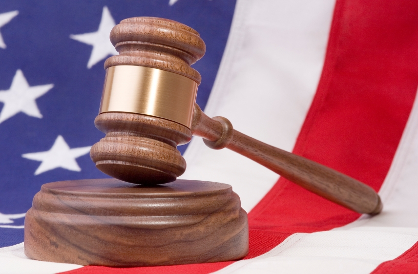

# ＜开阳＞言论自由六日谈（2）——煽动颠覆罪的兴衰

**由此可以看出，类似于《史密斯法案》煽动颠覆罪的一切煽动颠覆国家政权罪名，从根本上讲就是荒谬的。如布兰戴斯所言，自由的人民无惧政治变革，而如果不允许对现存体制的抨击与批评，任何政治上的进步与变革都是不可能的；社会也不可以仅仅因为某些言论令人反感而加以禁止。历史上有多少令人反感的言论最终被证明是真理？公共法律所能做的，只是维持社会的秩序，使讨论能够和平理性地进行。**  

# **言论自由六日谈（2）——煽动颠覆罪的兴衰**

## 文/黄陀（ Yale University）

 

－美国是怎样逐步去除煽动颠覆罪的？

－为什么自由社会必须容忍反体制言论？

－为什么“剧场里喊失火”是一个常常被误读的比喻，为什么煽动颠覆罪从根本上讲就是荒谬的罪名？

当煽动性诽谤罪由于政治意味过于明显而退出了历史舞台之后，在二十世纪初，煽动罪名又一次幽灵重现。由于美国标称民主、自由的国家价值的逐渐明晰化与格式化，在美国成为世界强国时，对内惩治反对这种主流价值的言行便成为顺理成章的事情。旧时的煽动性诽谤罪所惩罚的，仅仅是反对当权者的言行，故可以成为不同派别之间互相倾轧的工具，从而沦为纯粹的政治迫害；而新的历史环境提出了新的问题，即，如果法律所做的，是一视同仁地去惩罚反自由、反体制的言行，或是惩罚那些支持人民公敌（比如外敌）的言行，从而淡化了党争的成分，是否就是可以接受的呢？为了回答这个问题，美国走过了大约四十年的艰难历程。

#### 一、战争时期的反谍法案

1917年4月，美国对德断交，正式卷入一战。两个月后，美国国会通过了《反谍法案》(Espionage Act of 1917)，该法除惩治间谍外，同时惩罚一切故意或意图“造成军人不服指挥、不忠、反抗和拒绝执行命令”或故意“阻挠国家征兵”之人。[1] 1918年，国会又通过了《反煽动法案》(Sedition Act of 1918)，用刑事手段惩罚下列反战言行：

－阻挠战争公债之发行；

－意图造成对美国政体(form of government)、宪法与国旗之不敬，对国家表示不忠诚、低俗、侮辱性、攻击性之言语；

－以阻挠战争为目的，号召减少军需物资之生产；

－任何支持敌国之言语。[2]

在习惯了当权者视角的人看来，战争期间，惩治扰乱军心民心、反对“保家卫国”之言行，看似并无不妥。然而这种思维隐含了一个前提，即，“当权者决定参与的战争，必然是正义的保家卫国”，或，“战争正义与否，当权者说了算，民众无权质疑。”所以，在这种思路下，只要政府（无论是民选的、寡头的，还是专制独裁的）声称一场战争是保家卫国、保卫自由的正义战争，哪怕它事实上不是，民众也无权反对之，因为任何反对战争、质疑其正义性的言论，都是对国家战争行为的阻挠；批评战争的正义性、号召青壮年不要去当炮灰，则是板上钉钉的“阻挠征兵”之行为，至少在20世纪初的标准下是如此。——为什么要强调是在“20世纪初的标准下”呢？因为到这里问题出现了两个层面。第一，概括而论，民众能否发表任何反对战争和其它反体制、反自由的言论？第二，如果民众发表了此类的言论，究竟要恶劣到什么地步才可以惩治？标准是什么？围绕着这些问题的争论持续了四十年，其间虽有反复，总的趋势则是对言论的管制逐渐放宽。

20世纪初，惩治反对体制、反对战争言论的司法实践中，最初采用的往往是所谓的“有害倾向”原则(Bad Tendency Test)，即，只要言论有造成阻碍征兵、反自由、不爱国的“倾向”，即可定罪。例如，在沙佛案(Shaffer v. United States, 225F. 886 (9th Cir. 1919), cert. denied, 251 U.S. 552 (1919))中，被告邮寄散发一本书，书中宣称，没有证据表明德国意欲侵略美国、美国参与对德战争是浪费军人生命的罪行。被告被以反谍法案控罪。第九巡回区上诉法院在维持其有罪判决时写道：“本案中的问题⋯⋯在于，（被告的）言论自然的、很有可能的倾向和效应(natural and probable tendency and effect)，是否被法律条文所禁止。⋯⋯不得不承认，此种言论所造成的一个合乎常理的、自然的后果，就是对国家征兵的阻挠。”[3]

之后，在1919年的申克案(Schenck v. United States, 249U.S. 47 (1919))中，霍尔姆斯大法官首次提出了影响深远的“明确而现实之危险”(clear and present danger)标准。申克案中，被告散发号召抵制征兵的传单，传单中声称征兵违反宪法第十三修正案、是奴隶制的复辟，更声称如果民众不反抗征兵就是纵容政客侵犯人民权利。[4] 被告因为这些言论被依《反谍法案》以阻挠征兵为由判刑 。最高法院维持了原判。在判决书中，霍尔姆斯认为，战时的特殊环境、军人正在前线浴血奋战的事实，使得某些和平时期可以自由发表的言论（如该案被告之言论）具有特殊的危险性；这些言论有可能干扰前线战事、影响保家卫国的崇高目标，是“明确而现实之危险“，故不受保护。[5]

表面上看起来，申克案的“明确而现实之危险”标准和先前的“有害倾向”标准相比并无实质区别，二者关于言论和后果之间关系的推理都是建立在相当程度的揣测上。所以，在申克案判决六个月后、最高法院又一次遇到类似案件（亚伯兰斯案，Abrams v. United States, 250 U.S. 616 (1919)）时，又一次维持了对被告的判决。 亚伯兰斯案仍旧是关于一战中的反战宣传问题。一战中俄国原属协约国阵营；但1917年爆发十月革命后，新成立的苏维埃俄国与属于同盟国阵营的德国签署了布列斯特－立陶夫斯克和约，单独媾和、退出战争。协约国为了能维持在俄国的东方战线，派远征军前往俄国。此举激起了左派的反对，其中就包括亚伯兰斯案的被告。该案中，被告散发宣传材料反对美国派兵前往俄国，声称这是对布尔什维克革命的干涉，号召美国军工企业工人停工、拒绝生产被用于“谋杀俄国自由斗士”、镇压俄国革命的武器。[6] 克拉克大法官所作的判决书认为此类言行是充足的罪证 。[7]

然而先前在申克案中支持维持判决的霍尔姆斯并不同意亚伯兰斯案的判决。[8] （对最高法院判决和判决书发布机制的简介，见注[9]。) 后来的学者对如何解读霍尔姆斯在这两个看起来相似的案件中所表达的不同态度尚无定论，[10] 但有一点是肯定的，即霍尔姆斯在亚伯兰斯案的反对意见中对 “明确而现实之危险”标准作出了进一步的限制和阐述，要求言者必须有特定意图(specific intent)造成被法律禁止的后果（如阻碍战争、阻碍征兵），以及言论必须和后果之间必须有紧密的时间与因果关系。[11] 霍尔姆斯认为，即便是一个爱国者，也可以在战争期间发表意见认为在飞机这种东西上花钱是劳民伤财，或者认为某种大炮造得太多——没有人会认为这种言论是犯罪行为。与申克案中被告散发宣传材料阻挠征兵不同，在亚伯兰斯案中，霍尔姆斯认为被告的意图并非阻碍美国的军事行动，而是反对对俄国革命的干涉，故不应构成蓄意妨害战争的罪行。[12]

#### 二、从反谍到反共

随着第一次世界大战于1919年结束、苏俄政权的逐渐稳固与共产国际（第三国际）的形成，美国法律关于言论自由的争论焦点从反战言论转移到了共产主义/社会主义言论（即反体制言论）上。1925年的吉罗案 （Gitlow v. New York, 268 U.S. 652 (1925)）中，被告为著名的美国社会主义党左翼派系成员，在他的参与领导下，左翼派系发布了其行动宣言，主张以大规模罢工与工人抗争的方式推翻代议政体、建立无产阶级革命专政(“revolutionary dictatorship of the proletariat”)，而不是如该党温和派所主张的那样通过议会民主来进行社会主义运动。[13] 被告被控纽约州刑法中的“无政府主义煽动罪”(Advocacy of criminalanarchy)，该罪名为刑事重罪(felony)，惩治任何鼓吹、教唆通过暴力或其他非法手段煽动颠覆现有政府组织的言论。[14] 最高法院再一次以7比2的票数维持判决 。桑福德大法官的多数意见认为，本案与申克案和亚伯兰斯案均有不同。在战时的反谍法案下，立法机关惩治的是言论的后果，故需要“明确而现实的危险”这一标准来建立言论与后果之间的关系；而纽约州的煽动无政府主义罪惩治的是言论本身，所以不需要对言论是否确实会造成法律所意图防止的恶果这一因果联系进行审查。[15] 反对该判决的两票仍旧来自霍尔姆斯和布兰戴斯两位大法官。霍尔姆斯的反对意见则坚持应用“明确而现实的危险”，认为被告言论的星星之火完全不足以燎原，应当受言论自由保护。[16]

两年后，布兰戴斯大法官在惠尼案(Whitney v. California, 274U.S. 357 (1927))中驳斥了桑福德大法官在吉罗案中关于“明确而现实的危险”原则的论述。惠尼案与吉罗案类似，被告是共产主义劳工党创党成员，被依加州法律控以煽动颠覆政府之罪行。最高法院全数赞成维持了原判。布兰戴斯和霍尔姆斯虽然赞同该案维持原判，但在对法律的阐述上却与桑福德相左。桑福德在吉罗案中的观点其实是说，如果立法机关通过充分的调查决定惩治某种言论，一定是因为立法机关对这种言论可能造成的后果做出了判断，这个判断应当受到尊重，所以法院无须考究言论的具体后果。[17] （这个主张是典型的司法自制(judicial restraint)论调，弗兰克福特大法官为这类主张的领军人物。）

布兰戴斯则拒绝接受这个主张。在他的协同意见中，布兰戴斯指出立法机关通过的法律未必都是满足宪法要求的，如果法院可以废除那些侵犯财产权的法案，那么当言论自由权利受到威胁的时候，法院宣布立法违宪的权力丝毫不应有所减弱。[18] 布兰戴斯进一步论述了言论自由对于民智发展和民主社会的重要：

那些为我们（美国）赢得独立的人相信⋯⋯自由地去思考与发言是发现与传播政治真理的必要手段；他们相信没有言论与集会自由就无法进行有效的讨论；⋯⋯他们相信对自由最大的威胁是一群愚钝的民众；他们相信参与对公共事务的讨论是一项政治义务。

⋯⋯

“单单是对严重伤害的恐惧并不足以支持对言论和集会自由的压迫。人们曾经因为对女巫的恐惧而烧死女人。言论的作用，正是将人类从非理性的枷锁中解放。只有在言论会造成严重的恶果、并且这种恶果迫在眉睫时，才可以对言论进行压制。

⋯⋯

“那些为我们赢得独立的人绝非懦夫。他们不害怕政治变革。他们不会以牺牲自由为代价来拥护秩序。对勇敢、独立之人而言，因为他们对民主政治中自由无畏的理性思考的力量有着充分信心，所以，除非言论所造成的危险迫在眉睫到了连充分讨论的机会都没有的地步［即，只要有充分的时间讨论一种言论］，那么这种言论所造成的任何危险都不能被认为是明确而现实的。如果有足够的时间去通过讨论来揭穿错误的言论、去通过教育来防止言论造成的恶果，那么［为矫正错误言论造成的恶劣影响而开出的］药方是更多的言论，而不是强制的沉默。只有出现紧急情况时，才有理由压制言论。”[19]

随着时间的推移，布兰戴斯大法官的论述，成为惠尼案的亮点，在他的阐述下，“明确而现实的危险”标准对危险的严重程度、言论与后果之间的因果与时间关系都作出了较为明确的要求，从而成为一个明确保护言论自由的进步标准。二十世纪初对言论自由压制的暗夜终于现出一线曙光。

然而“明确而现实的危险”仍然是有着相当局限的，在这个标准下，下级法院和陪审团仍旧可以以事实认定的方式，宣告被告的言行构成“明确而现实的危险”，从而判决其有罪。在惠尼案中，布兰戴斯并未支持推翻判决，主要也是基于尊重下级法庭事实认定的司法原则。（美国上诉法院和最高法院一般只审查法律问题，而不去审查初审法院的事实认定。）所以，即便倾向于保护言论自由的“明确而现实的危险”标准（言论需要造成明确而现实的危险才能定罪）最终取代了门槛较低的“有害倾向”标准（言论只需要有有害的倾向便可定罪），对激进左派的压制并未结束，而是持续到了二战以后。

在冷战的大背景下，不但国会和行政机关草木皆兵、麦卡锡主义盛行，最高法院也难免受到反共、恐共心理的影响。1946年国会通过了《史密斯法案(Smith Act)》惩治煽动颠覆美国各级政府的行为。[20] 由于共产党的基本纲领便是通过暴力革命推翻资本主义制度、夺取政权，大量共产党员被依史密斯法案控以煽动颠覆之罪名。1951年的丹尼斯案（Dennis v. United States, 341 U.S. 494 (1951)）便是最高法院在恐共心态下维持了对美国共产党领导人判决的一个案例。虽然布兰戴斯在惠尼案中强调“明确而现实之危险”标准要求“只有出现紧急情况时才有理由压制言论”（霍尔姆斯赞同）[21]，首席大法官文森在丹尼斯案中仍然拒绝按照这一解释来应用“明确而现实之危险”标准，在其所作的判决书中认为，对民主制度的推翻是不可承受之严重后果，鉴于当时世界局势下冲突一触即发（“the inflammable nature of world conditions”），对于美共这样一个组织严密、纪律严明的阴谋团体，不可不防。[22]

#### 三、麦卡锡主义的覆灭与言论自由的胜利

然而六年后的耶茨案(Yates v. United States, 354U.S. 298 (1957))中，最高法院在反共问题上得以改弦易辙。这六年中，最高法院的人事变动逐渐开启了通往进步和自由的大门。首席大法官文森于1953年任上突发心脏病去世，取而代之的是开明自由的沃伦；而另一位二十世纪著名的自由派大法官布伦南也于1956年就职（虽然布伦南本人并未参与耶茨案的判决），接任退休的明顿大法官。沃伦在善于斡旋、谈判的布伦南的帮助下，开创了美国最高法院历史上最开明、最进步、最自由的沃伦法庭时期。沃伦与布伦南二人都对麦卡锡主义对民权的肆意侵犯深怀不满。沃伦曾经在办公室里说麦卡锡参议员是一个“易怒的、声名狼藉的骗子”。[23] 布伦南在被提名到最高法院之前也曾在演讲中影射批评麦卡锡主义的白色恐怖，而麦卡锡也因此怀恨在心，在布伦南的提名听证会上咄咄逼人地质问布伦南在反共问题上的态度，指责布伦南反共不够坚定；好在布伦南秉持了其一贯的圆滑低调态度，没有被麦卡锡所激怒，他认为跟麦卡锡这种人争论是对最高法院的羞辱。[24]

麦卡锡主义本身于1950年代中期开始受到挑战。联邦调查局从1953年开始便拒绝为麦卡锡对反共分子的调查继续提供人力支持。1954年3月9日，当时全国最著名的新闻记者之一穆罗（Edward R. Murrow）在一整节电视节目中公开抨击麦卡锡、揭露其仗势欺人的恶行。而到了1954年6月9日，在对军队内颠覆行为的调查的公开电视听证会上，军队的法律顾问威尔奇（Joseph Welch）忍无可忍，当着全国观众的面直问麦卡锡：“先生，您到底还要不要脸？”（“Have you no sense of decency,sir, at long last?”)[25]

与此同时，最高法院在沃伦的领导下，强化了对第一修正案言论、结社权利的保护，给麦卡锡主义以沉重的打击。耶茨案的判决便是在此背景下作出的。与丹尼斯一样，耶茨案的被告同样是美国共产党的党员，也是依《史密斯法案》被控煽动颠覆罪。最高法院推翻了对这些被告的判决。虽然耶茨案中法院未直接宣布《史密斯法案》违宪，但已经通过严格限制应用的方式大大削弱了其效力。在耶茨案的判决下，继续现存的共产党活动不能被认为是组织反政府力量；更重要的是，耶茨案的判决明确指出，仅仅是在“抽象的原则层面上”（“as an abstract principle”)鼓吹暴力推翻政府不能作为入罪理由。[26] 换言之，只有煽动颠覆政府的实质行为（而不仅仅是鼓吹颠覆政府的理想，如在美国宣扬马克思主义）才可入罪。[27]

耶茨案的判决极大地限制了《史密斯法案》的效力。而到1969年布兰登堡案（Brandenburg v. Ohio, 395 U.S.444 (1969)）案之后，《史密斯法案》基本成为一纸空文。布兰登堡案的被告是俄亥俄州农村地区3K党头目，在公开演讲中宣扬种族仇恨，因此被控煽动暴力。最高法院在本案中的判决明确建立了煽动性言论入罪的必须同时满足的三个标准：

1、故意(intent)——言者必须有明确意图指向煽动混乱；

2、紧迫(imminence)——这种混乱不是在不可预知的将来，而是迫在眉睫；

3、可能(likelihood)——发表的言论必须是“很有可能”导致混乱的。[28]

前面提到，“明确而现实的危险”虽然是一大进步，但由于其概念的模糊和不可操作性，在司法实践中仍然有时对言论自由保护不力。这就是为什么在霍尔姆斯和布兰戴斯反复强调对这一标准的严格应用并未能最终回答究竟何种煽动行为可以入罪，即，言论自由在煽动罪语境下的边界到底在哪里。而布兰登堡案不但明确地回答了这个问题，而且确立了对言论自由高度保护的原则，明确推翻了申克案、惠尼案等判决，实质上废除了先前煽动罪案件所应用的标准，宣告“明确而现实的危险”标准的寿终正寝。道格拉斯大法官在本案的协同意见中指出，亚伯兰斯等案的判决体现了“明确而现实的危险”这一标准是多么容易被随意蹂躏。[29] 而布兰戴斯在惠尼案中的协同意见的主要精神最终在布兰登堡案中得以完全体现——为了公民个人的自我提升与民主社会的正常运转，必须给言论以足够的空间，所以除非言论的危害极大且迫在眉睫，否则不应予以压制。

所以，布兰登堡案的判决并非无本之木，而是几十年来美国司法界对言论自由边界探索的集中体现。布兰登堡案的第一个要素是“意图”或“故意”。霍尔姆斯在亚伯兰斯案中便强调过这一点，即言者必须有特定的意图去煽动暴乱。[30]第二个要素，“紧迫”，强调的是必须有时间上的紧密联系；如上文所引用的，布兰戴斯在惠特尼案的协同意见中对此也作了详细的阐述，认为除非言论会马上造成巨大的恶果而没有时间去化解言论的危害，否则言论不应当被压制。第三个要素，“可能”，也在先前的若干判决中都有所体现，强调的是言论与后果之间因果关系上的紧密联系，比如霍尔姆斯在亚伯兰斯案中就认为几个左翼人士的煽动并不足以对政府的战争行动造成阻碍[31]，而耶茨案对“煽动行为”与“鼓吹抽象的意见”的划分，也从侧面体现了这一点——比如，鼓吹共产主义等反体制观点与在现实中造成暴乱之间还是有相当的距离的。

#### 四、国家失火了嘛？——煽动颠覆国家政权罪的根本谬误

布兰登堡案的标准，很好地解释了广为流传的“剧场中谎称失火”的比喻到底是什么意思，而这个比喻常常被不求甚解地引用。在申克案的判决书中，霍尔姆斯写道：

我们承认，在一般情况下，被告言论并未逾越其宪法权利之边界。 然行为之性质，取决于行为所处之环境与背景。即便在对言论自由保护最严格之标准下，在剧场中谎称失火而造成人群惊慌，亦不受保护。⋯⋯每个案件中，问题均在于，在特定情境下，特定性质言论会否造成一个明确而现实之危险⋯⋯ 这是因果关系紧密度(proximity，即“近因”)与言论程度的问题。[32]

霍尔姆斯提出这个比喻的目的，无非是用一个极端的例子来说明，言论的性质取决于发表言论的场合，在某些场合下某些特定的言论会造成“明确而现实的危险”。随着时代的进步，霍尔姆斯和布兰戴斯阐释了“明确而现实的危险”标准的含义，虽然这一标准并未能起到太多保护言论自由的作用、最终被布兰登堡案更为明确的标准所取代。在新的“故意、紧迫、可能”三项标准下，言论的发表与可能的恶劣后果之间的联系必须非常紧密与明确，能达到这一标准、可以与剧场中谎称失火相类比的言论显然只是所有煽动性的言论中很小的一部分。

也就是说，“剧场中谎称失火”这个极端的例子实质上是为了使对言论自由的保护更经得起推敲而划出的一个比较明确的反面底线，而这个反面底线并不能回答现实中应当保护言论到何种地步的问题——这个问题最终由布兰登堡案的标准作出了回答。

因此，以“剧场中谎称失火要受到惩罚”来佐证“惩治反政府、反社会、反体制言论有理”，是毫无道理的。第一，剧场中谎称失火要受到惩罚，并不意味着任何有可能造成严重恶劣后果的言论都应当受到惩治；换言之，并非所有的煽动性言论都可以和剧场中谎称失火类比，因为不是所有的言论都和恶劣后果之间有确定和紧密的联系。第二，即便言论和后果之间存在紧密的因果关系，也并非所有的后果都可以和剧场中听到“失火”后惊慌的人群互相踩踏的惨剧相比。在一个拥挤的公共空间谎称失火、造成踩踏固然是不可接受的，但以维护秩序为名禁止在公共空间发表任何有可能造成恶果的言论同样是不可接受的。

由此可以看出，类似于《史密斯法案》煽动颠覆罪的一切煽动颠覆国家政权罪名，从根本上讲就是荒谬的。如布兰戴斯所言，自由的人民无惧政治变革，而如果不允许对现存体制的抨击与批评，任何政治上的进步与变革都是不可能的；[33] 社会也不可以仅仅因为某些言论令人反感而加以禁止。[34] 历史上有多少令人反感的言论最终被证明是真理？公共法律所能做的，只是维持社会的秩序，使讨论能够和平理性地进行。而如果言论真的会触发打砸抢等暴力事件，那么又进入了普通刑法惩治暴力犯罪的领域。在纽约街头，激进穆斯林可以随意宣扬对美国发动更多的恐怖袭击、进行“圣战”，联邦调查局探员只能在一旁干瞪眼[35]；但一旦这些人的行为进入了实质性的组织、谋划恐怖袭击的行为，将立即受到法律的严惩。

所以，如果仅仅是为了防止暴力事件，那么在暴力迫在眉睫、极有可能发生时应当直接应用普通刑法维护社会秩序；而如果是为了钳制人民思想、防止人民发出反政府反体制的声音，那么煽动颠覆罪名的设立很明显是对言论自由最直接、最恶劣的侵犯。故包括《史密斯法案》在内的一切的煽动颠覆国家政权罪，从根本上讲都是荒谬的。

中华民国一〇〇年十月十日 美国 康州 纽黑文

 

### 【附】惠尼案中布兰戴斯大法官的协同意见节选

Those who won our independence believed that the final end of the State was to make men free to develop their faculties; and that in its government the deliberative forces should prevail over the arbitrary. They valued liberty both as an end and as a means. They believed liberty to be the secret of happiness and courage to be the secret of liberty. They believed that freedom to think as you will and to speak as you think are means indispensable to the discovery and spread of political truth; that without free speech and assembly discussion would be futile; that with them, discussion affords ordinarily adequate protection against the dissemination of noxious doctrine; that the greatest menace to freedom is an inert people; that public discussion is a political duty; and that this should be a fundamental principle of the American government. They recognized the risks to which all human institutions are subject. But they knew that order cannot be secured merely through fear of punishment for its infraction; that it is hazardous to discourage thought, hope and imagination; that fear breeds repression; that repression breeds hate; that hate menaces stable government; that the path of safety lies in the opportunity to discuss freely supposed grievances and proposed remedies; and that the fitting remedy for evil counsels is good ones. Believing in the power of reason as applied through public discussion, they eschewed silence coerced by law -- the argument of force in its worst form. Recognizing the occasional tyrannies of governing majorities, they amended the Constitution so that free speech and assembly should be guaranteed. Fear of serious injury cannot alone justify suppression of free speech and assembly. Men feared witches and burnt women. It is the function of speech to free men from the bondage of irrational fears. To justify suppression of free speech there must be reasonable ground to fear that serious evil will result if free speech is practiced. There must be reasonable ground to believe that the danger apprehended is imminent. There must be reasonable ground to believe that the evil to be prevented is a serious one. Every denunciation of existing law tends in some measure to increase the probability that there will be violation of it. 

Condonation of a breach enhances the probability. Expressions of approval add to the probability. Propagation of the criminal state of mind by teaching syndicalism increases it. Advocacy of law-breaking heightens it still further. But even advocacy of violation, however, reprehensible morally, is not a justification for denying free speech where the advocacy falls sort of incitement and there is nothing to indicate that the advocacy would be immediately acted on. The wide difference between advocacy and incitement, between preparation and attempt, between assembling and conspiracy, must be borne in mind. In order to support a finding of clear and present danger it must be shown either that immediate serious violence was to be expected or was advocated, or that the past conduct furnished reason to believe that such advocacy was then contemplated.

Those who won our independence by revolution were not cowards. They did not fear political change. They did not exalt order at the cost of liberty. To courageous, self-reliant men, with confidence in the power of free and fearless reasoning applied through the processes of popular government, no danger flowing from speech can be deemed clear and present, unless the incidence of the evil apprehended is so imminent that it may befall before there is opportunity for full discussion. If there be time to expose through discussion the falsehood and fallacies, to avert the evil by the processes of education, the remedy to be applied is more speech, not enforced silence. Only an emergency can justify repression. Such must be the rule if authority is to be reconciled with freedom. Such, in my opinion, is the command of the Constitution. It is therefore always open to Americans to challenge a law abridging free speech and assembly by showing that there was no emergency justifying it. [1] Act of June 15, 1917, ch. 30, tit. I, §3, 40 Stat. 219. [2] Act of May 16, 1918, ch. 75, §1, 40 Stat. 553. (1921年废除) [3] 255 F. at 887-888. [4] 249 U.S. at 51. [5] Id. [6] 250 U.S. at 621. [7] Id. at 624. [8]申克案中，九名大法官一致支持维持被告言论有罪的判决，判决书为霍尔姆斯所作；而在亚伯兰斯案中，最终结果仍然是被告有罪，但并非全院一致同意：七名大法官同意维持原判，霍尔姆斯和布兰戴斯反对（dissent）。 [9] 除一些特殊情况外，最高法院有9名大法官，作出一个判决只需要简单多数，即9名大法官中有5人以上赞成，这些人是该案中的多数派(majority)；一般会由多数派中选出一人来起草判决书，其他人表示附议(join)，这份判决书便是最高法院的“官方”意见(opinion of the Court)。多数派中的其他人可以单独发表协同意见(concurring opinion)。少数派也可以在多数意见后自行选择发布反对意见(dissenting opinion)；反对意见对判决本身无影响，但可以为法律界和社会大众在这个问题上的继续辩论提供素材，可以被一方观点的支持者引用；甚至有朝一日，当最高法院本身需要在同一个问题上作出新的决定时 ，可以宣布先前的反对意见所表达的观点是新的正确意见。 [10] William B. Fisch, American Law in a Time of Global Interdependence: U.S. National Reports to the XVith International Congress Of Comparative Law: Section IV Hate Speech in the Constitutional Law of the United States, 50 Am. J. Comp. L. 463, 472, n.29 (2002) [11] 250 U.S. at 627, 629. [12] Id. at 627-29. [13] 268 U.S. at 655, 657-58. [14] N.Y. Penal Law §§ 160, 161. [15] 268 U.S. at 670-71. 

[16] Id. at 673 (Holmes, J., dissenting).

[17] Supra note 15.

[18] 268 U.S. at 370.

[19] Id. at 375-77, emphasis added.

[20] 18 U.S.C. §§ 2383, 2385.

[21] Whitney v. California, 274 U.S. at 377.

[22] 341 U.S. at 511.

[23] Ted Morgan, Reds: McCarthyism in Twentieth-Century America, 543 (2004).

[24] Seth Stern & Stephen Wermiel, Justice Brennan: Liberal Champion, Chpt. 3 (2010).

[25] Id.

[26] Yates v. United States, 354 U.S. at 318.

[27] Id. at 322.

[28] Brandenburg v. Ohio, 395 U.S. at 447.

[29] Id. at 452 (Douglas, J., concurring).

[30] Abrams v. United States, 250 U.S. 616, 629 (1919) (Holmes, J., dissenting).

[31] Id. at 628.

[32] Schenck v. United States, at 52.

[33] Whitney v. California, 274 U.S. 357, 375-77 (1927) (Brandeis, J., concurring).

[34] Texas v. Johnson, 491 U.S. 397, 414 (1989).

[35] CNN Transcript, 11/6/2009. [http://transcripts.cnn.com/TRANSCRIPTS/0911/06/acd.02.html](http://transcripts.cnn.com/TRANSCRIPTS/0911/06/acd.02.html)

（采编：尹桑 责编：陈轩）

 
